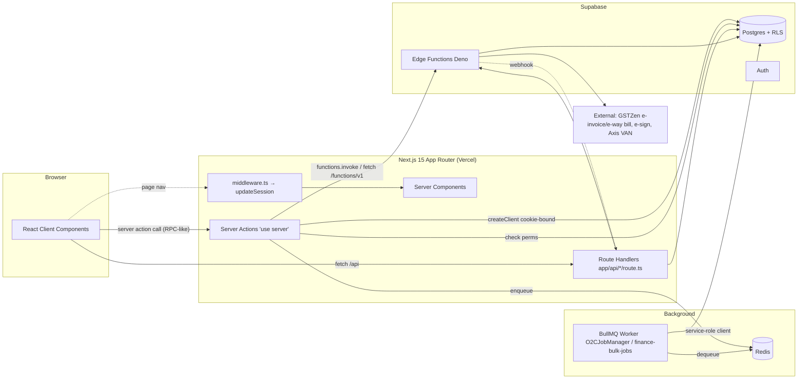
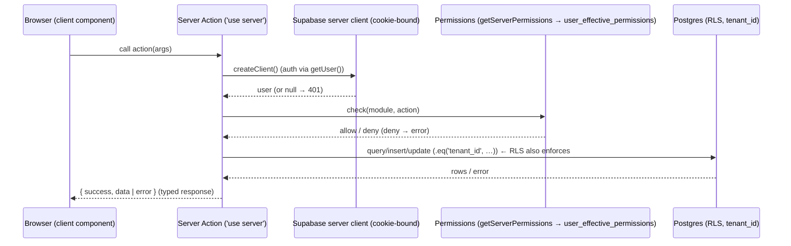
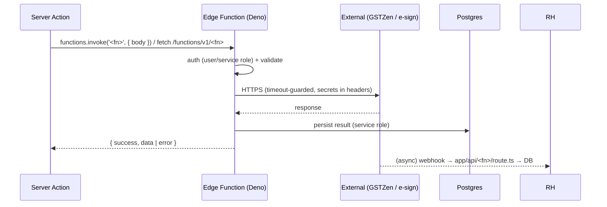
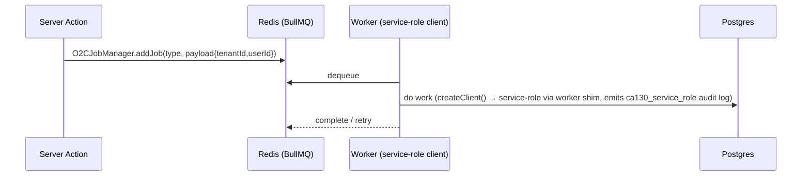

# DAEE — Developer Guides (code-flow & architecture)

**Audience:** internal developers. **Purpose:** understand how each module works end-to-end —
browser → Next.js → Supabase/edge functions → Postgres → response — so that **API endpoint
generation never misses a feature**. These guides are the **authoritative API-surface source**:
every server action, route handler, and edge function per module is inventoried here.

> Distinct from the **[user/training guides](../user-guides/README.md)** (Stripe-style, operator-facing).
> The QA-framework architecture is documented separately in the repository's knowledge base —
> this guide covers the **application** architecture.
> **Verified** against `web_app` + `daee-production` on 2026-06-17.

---

## Platform architecture (verified)

### Layers (what each does)
| Layer | Where | Responsibility |
|---|---|---|
| **Middleware** | `web_app/src/middleware.ts` → `utils/supabase/middleware.updateSession` | Refresh the Supabase auth session cookie on navigation (matcher-scoped). |
| **Server Components** | `app/**/page.tsx` | Render shell + breadcrumbs, wrap in `ProtectedPageWrapper`, load initial data. |
| **Server Actions** | `app/**/actions/*.ts` (`'use server'`) | **Primary write/read path.** Auth (`getUser()`), permission check, tenant-scoped DB ops, edge-fn calls, job enqueue. |
| **Route Handlers** | `app/api/**/route.ts` (63) | HTTP endpoints for webhooks (e.g. `esign-webhook`), file download/upload, external callers, some generic flows. |
| **Edge Functions** | `daee-production/supabase/functions/*` (Deno) | External integrations (GSTZen, e-sign, VAN) + heavy/transactional logic; called via `functions.invoke()` or `fetch /functions/v1/<fn>` (76 call sites). |
| **Postgres + RLS** | Supabase | Source of truth; **tenant isolation via RLS**; views like `user_effective_permissions`. |
| **Background worker** | `lib/jobs/o2c-job-manager.ts` (BullMQ+IORedis), `lib/finance-bulk-jobs/worker` | Async jobs (notifications, post-approval, PDFs, bulk ops) on a **service-role** client. |

### The standard request lifecycle (server-action path)

**Invariants every action follows:** `getUser()` → `profiles.tenant_id` → `check(module,action)` →
all queries `tenant_id`-scoped (RLS is the backstop) → returns `{ success, data?, error? }`.

### External-integration path (edge function)

### Background-job path

---

## API surface = the source for endpoint generation
DAEE's de-facto API is **three** surfaces. When generating REST/GraphQL endpoints, enumerate **all three** per module (each module dev guide has an *API surface* table):
1. **Server actions** (`app/<module>/actions/*.ts`) — the main verbs (create/update/submit/approve/…), each with permission + inputs + tables.
2. **Route handlers** (`app/api/**/route.ts`) — existing HTTP endpoints (webhooks, files, generic).
3. **Edge functions** (`supabase/functions/*`) — external + transactional operations.
> **Rule:** an endpoint generator that reads only one surface **will miss features**. The dev guides
> consolidate all three so coverage is complete.

## Per-module developer guides
| Module | Guide | Status |
|---|---|---|
| Dealer Applications | [Dealer Applications — Developer Guide](./dealer-applications.md) | Active |
| Order to Cash (O2C) | [O2C — Developer Guide](./o2c.md) | Active |
| Dealers | [Dealers — Developer Guide](./dealers.md) | Active |
| *(all others)* | follow the developer-guide template | pending |

Each follows: **Overview → Architecture (layers touched) → Request lifecycle diagram →
Code map → API surface table → Sequence diagrams (key flows) → Data model → Permissions →
Background jobs → Gotchas.**

## Conventions verified in code
- Server actions return `{ success: boolean, data?, error?, statusCode? }`.
- Auth: `supabase.auth.getUser()`; tenant from `profiles.tenant_id`.
- Permissions: `getServerPermissions().check(module, action)` (process-cached, `user_effective_permissions`).
- Edge calls: `supabase.functions.invoke(name, {body})` or `fetch(${NEXT_PUBLIC_SUPABASE_URL}/functions/v1/<fn>)`.
- Jobs: `O2CJobManager.getInstance().addJob(...)` (BullMQ+IORedis); worker uses service-role client (audit-logged).

## Documentation maintenance (mandatory)

**Documentation is part of "done." A feature is not complete until its docs are updated in the same
change set.** This keeps the guides trustworthy as a source of truth — the whole reason they exist.

**When you build or change a feature, you MUST:**
1. **Update the affected guide(s)** — developer guide for architecture/API/schema/permissions/compliance changes; the matching **customer hub** for anything user-visible (new screen, changed workflow, new setting).
2. **Bump that guide's per-document Change Log** — add a row (version · date · author · summary). Bump the `version` and `last_updated` in the front-matter.
3. **Append an entry to the [central Documentation Changelog](./changelog.md)** — one line: date, scope (Customer / Internal / both), modules touched, summary.
4. **Keep claims verified** — if you state behavior, ground it in code/DB; flag anything unverified rather than guessing. Re-capture screenshots if the UI changed; validate Mermaid; confirm the docs build is clean.

**Triggers that REQUIRE a doc update (not exhaustive):** new/changed route, server action, edge function, RPC, DB table/column, permission, posting/GL behavior, tax/compliance treatment, tenant setting, or any new mandatory onboarding step.

> **Reviewer gate:** a PR that changes behavior but touches no `docs/` file should be challenged in review.
> If docs genuinely don't need changing, say so explicitly in the PR.

> **Customer/Internal boundary:** never put code paths, table/edge-fn names, ticket ids, branch names,
> tenant names, or GL codes in customer-visible text — keep them inside `<!-- INTERNAL -->` blocks.
