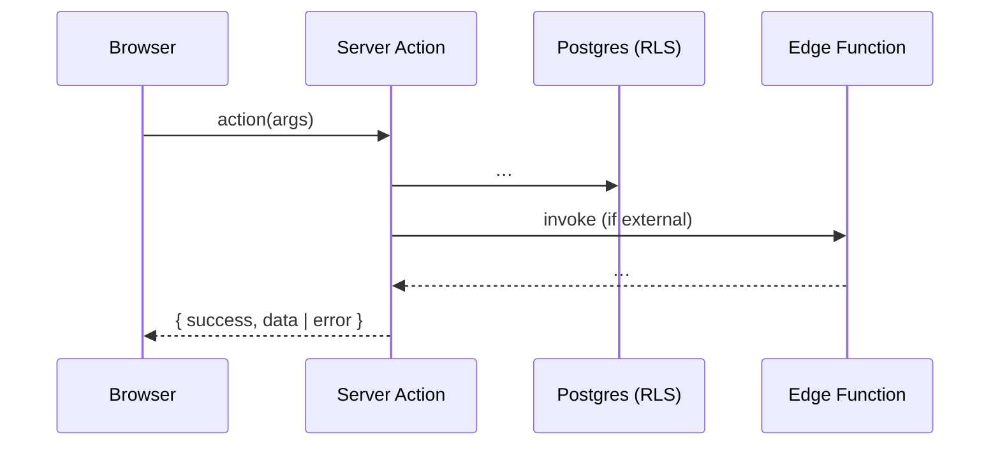

<!--
  DAEE per-module DEVELOPER guide template. Audience: engineers.
  Goal: complete code-flow + API surface so endpoint generation misses nothing.
  Verify every fact against web_app + daee-production + staging DB before filling. Cite files.
  Diagrams: Mermaid (flowchart / sequenceDiagram).
-->

# <Module> — Developer Guide

> **Verified:** <date> against `web_app/src/app/<module>`, `daee-production`, staging DB.
> **Routes:** `/…` · **App dir:** `web_app/src/app/<module>`

## 1. Overview
What the module does (1–2 lines) and the main entities/tables it owns.

## 2. Architecture (layers touched)
Which layers are involved (server actions? route handlers? edge functions? jobs?) and why.

## 3. Request lifecycle (key flow)

## 4. Code map
| Concern | File(s) |
|---|---|
| Pages | `app/<module>/**/page.tsx` |
| Components | `app/<module>/components/*` |
| Hooks | `app/<module>/hooks/*` |
| Server actions | `app/<module>/actions/*` |
| Route handlers | `app/api/<…>/route.ts` |
| Edge functions | `supabase/functions/<…>` |
| Tables | `…` |

## 5. API surface (the endpoint-generation source)
**Every** callable operation. One row per server action / route handler / edge function.

| Operation | Type | Permission | Input | Output | Tables / external | Notes |
|---|---|---|---|---|---|---|
| `createX` | server action | `mod:create` | {…} | `{success,data}` | `x` | … |
| `POST /api/…` | route handler | … | … | … | … | webhook? |
| `<edge-fn>` | edge function | … | … | … | …/GSTZen | … |

## 6. Sequence diagrams (per key flow)
One `sequenceDiagram` per important flow (create, approve, external call, job).

## 7. Data model
Tables, key columns, FKs, status enums (verified values), RLS notes.

## 8. Permissions (RBAC)
`module:action` list + how each gate maps to operations above.

## 9. Background jobs
Job types enqueued, payloads, worker, retries.

## 10. Gotchas / open items
Verified discrepancies, edge cases, non-obvious coupling. Flag, don't invent.
