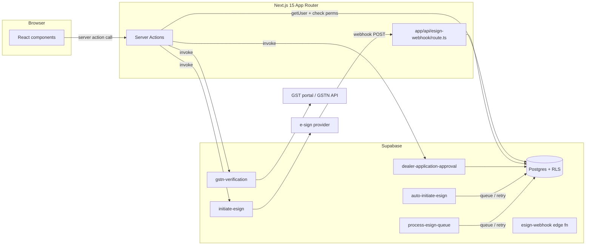
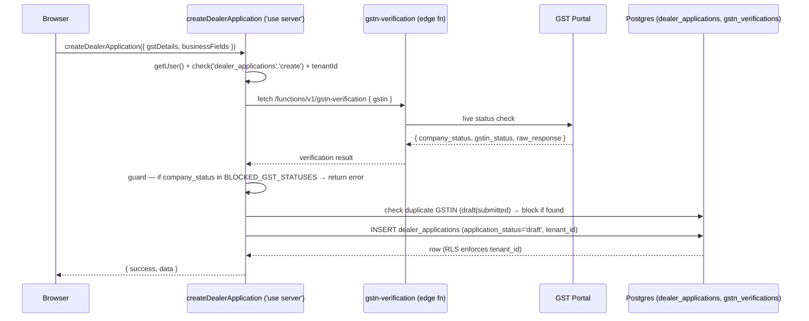
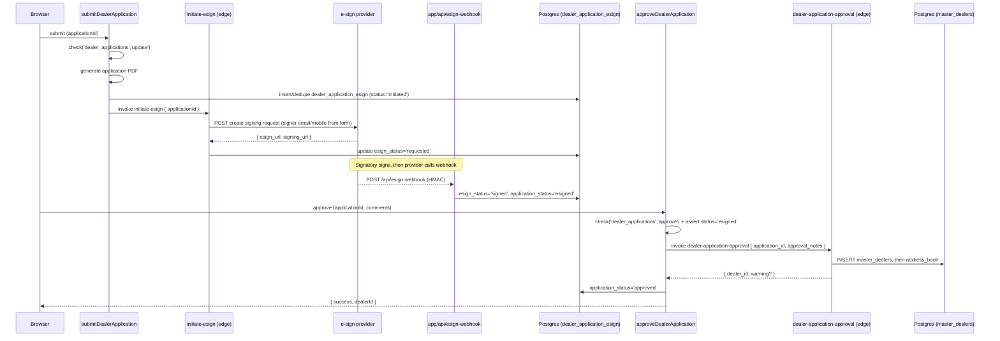
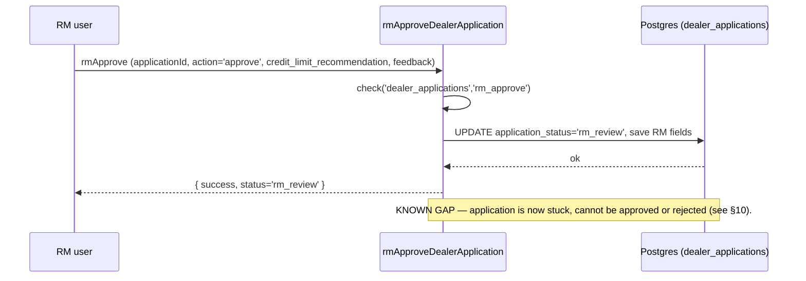

# Dealer Applications — Developer Guide

> **Verified:** 2026-06-17 against `web_app/src/app/dealer-applications`, `daee-production/supabase/functions`, staging DB.
> **Routes:** `/dealer-applications`, `/dealer-applications/[id]`, `/dashboard`, `/custom-dealer-form-builder`, `/dealer-application-terms-and-conditions`
> **Platform architecture:** [Developer Guides README](./README.md)

---

## Change Log

| Version | Date | Author | Summary |
|---|---|---|---|
| 1.0 | 2026-06-17 | Platform Eng | Initial structured guide — lifecycle, API surface, data model, gotchas |
| 1.1 | 2026-06-17 | Platform Eng | Upgrade to enterprise standard: metadata, RACI, controls, compliance, risk table, glossary |

---

## Glossary

| Term | Definition |
|---|---|
| **IRN** | Invoice Reference Number — not applicable to this module (see O2C), but referenced for completeness. |
| **GSTIN** | Goods and Services Tax Identification Number — 15-character identifier issued by the GSTN portal for registered businesses. |
| **GSTN** | Goods and Services Tax Network — the government body operating the GST portal and API. |
| **E-Sign** | Electronic signature; legally recognised under the IT Act, 2000 (§5, §10A) and the Aadhaar e-Sign framework (Second Schedule). |
| **RM** | Regional Manager — an optional recommendation role in the dealer onboarding workflow. |
| **RLS** | Row-Level Security — Postgres policy layer that enforces `tenant_id` isolation on every table. |
| **COA** | Chart of Accounts — not directly used in this module; relevant on final approval when the dealer becomes transactable. |
| **CCN** | Customer Credit Note — not issued in this module; relevant post-approval in O2C. |
| **Posting profile** | A per-module GL account mapping table that resolves ledger accounts dynamically; not used in this module. |

---

## 1. Overview

The Dealer Applications module captures, validates, e-signs, and approves dealer onboarding applications. On approval it creates a live **master dealer** record (plus an address book entry) that enables downstream O2C transactions.

**Primary tables owned:** `dealer_applications`, `dealer_application_esign`.
**Written on approval:** `master_dealers` (+ address book).

---

## 2. Architecture

Server Components (pages) → **Server Actions** (all CRUD + workflow transitions) → Postgres (RLS) + **6 edge functions** (`gstn-verification`, `initiate-esign`, `esign-webhook`, `auto-initiate-esign`, `process-esign-queue`, `dealer-application-approval`) + one route handler (`app/api/esign-webhook/route.ts`).

No BullMQ background jobs are used in this module. The e-sign async pipeline runs through dedicated edge workers and the webhook route.

---

## 3. Request Lifecycle — Create Application (with GST Verification)

**BLOCKED_GST_STATUSES (verified in `actions/createDealerApplication.ts`):**
`['suspended', 'cancelled', 'inactive', 'provisional']`

---

## 4. Code Map

| Concern | File(s) |
|---|---|
| Pages | `app/dealer-applications/{page.tsx, [id]/page.tsx, dashboard/page.tsx, custom-dealer-form-builder/page.tsx, dealer-application-terms-and-conditions/page.tsx}` |
| Application form | `components/DealerApplicationForm/DealerApplicationFormPage.tsx` (11 sections), `AddApplicationModal.tsx` |
| List / manager | `components/DealerApplicationManagerPage(.Optimized).tsx`, `DealerApplicationTableView.tsx` |
| Sub-entities | `components/{LicensesManagement,PartnerManagement,RMApprovalDialog}.tsx` |
| Hooks | `hooks/{useDealerApplicationForm, useDealerApplicationManager, useDealerApplicationEsign, useGSTVerificationQuery, autosave, useCompletionCalculator}.ts` |
| Server actions | `actions/*` (see Section 5 API surface) |
| Form builder | `custom-dealer-form-builder/actions/scalable/*` |
| Terms & Conditions | `dealer-application-terms-and-conditions/actions/termsAndConditionsActions.ts` |
| Edge functions | `supabase/functions/{gstn-verification, initiate-esign, esign-webhook, auto-initiate-esign, process-esign-queue, dealer-application-approval}` |
| Webhook route | `app/api/esign-webhook/route.ts` |
| Tables | `dealer_applications`, `dealer_application_esign`, `master_dealers`, `gstn_verifications` |

---

## 5. API Surface (Endpoint-Generation Source)

> Every callable operation. Generators must enumerate all three surfaces — server actions, route handlers, and edge functions — or features will be missed.

| Operation | Type | Permission | Input (key fields) | Output | Tables / External | Notes |
|---|---|---|---|---|---|---|
| `createDealerApplication` | server action | `dealer_applications:create` | gstDetails, businessFields | `{success,data}` | `dealer_applications` (draft); `gstn-verification` edge fn | GST Active gate + duplicate GSTIN guard |
| `updateDealerApplication` | server action | `dealer_applications:update` | applicationId, patch | `{success}` | `dealer_applications` | Autosave path |
| `submitDealerApplication` | server action | `dealer_applications:update` | applicationId | `{success}` | `dealer_applications`, `dealer_application_esign`; `initiate-esign` edge fn | Generates PDF; dedupes esign row |
| `rmApproveDealerApplication` | server action | `dealer_applications:rm_approve` | application_id, action (approve\|reject), credit_limit_recommendation, feedback (≥20 chars), rejection_reason (≥20 chars) | `{success,status}` | `dealer_applications` (`esigned→rm_review` or `rejected`) | RM review only; NOT final approval. See Known Gap §10. |
| `approveDealerApplication` | server action | `dealer_applications:approve` | applicationId, comments | `{success,data.dealerId}` | `dealer-application-approval` edge fn → `master_dealers` + address book | Gates on `esigned` status |
| `rejectDealerApplication` | server action | `dealer_applications:approve` | applicationId, reason | `{success}` | `dealer_applications → rejected` | Accepts `submitted\|esigned\|under_review` (NOT `rm_review`) |
| `updateMasterDealerDetails` | server action | `master_dealers:update` | dealerId, dealerCode | `{success}` | `master_dealers` | Sets dealer code post-approval |
| `readDealerApplications` / `getDealerApplication` | server action | `dealer_applications:read` | id / filters | `{success,data}` | `dealer_applications` | |
| `saveLicenses` / `getLicenses` / `deleteLicense` | server action | `dealer_applications:update` | applicationId, licenses[] | `{success}` | licenses store | |
| `savePartners` / `getPartners` / `deletePartner` | server action | `dealer_applications:update` | applicationId, partners[] | `{success}` | partners store | |
| `createGSTNVerification` / `initiateGSTNVerification` / `getGSTNVerificationForApplication` | server action | (read/update) | gstin, applicationId | `{success,data}` | `gstn_verifications`; `gstn-verification` edge fn | |
| `readDealerApplicationEsign` / e-sign initiate | server action / hook | `dealer_applications:update` | applicationId | `{success,data}` | `dealer_application_esign`; `initiate-esign` edge fn | |
| Custom fields CRUD | server actions | (admin) | field definitions | `{success}` | custom-field tables | Form builder admin path |
| `termsAndConditionsActions` (get/save) | server action | (admin) | T&C content + merge variables | `{success}` | T&C store | |
| `gstn-verification` | edge function | user | gstin | verification result | GST portal (GSTN API) | Called at create time |
| `initiate-esign` | edge function | user | applicationId | esign_url, signing_url | e-sign provider | Called at submit time |
| `esign-webhook` | route handler (`app/api/esign-webhook/route.ts`) | provider (HMAC-verified) | provider callback | 200 OK | `dealer_application_esign` (→ `signed`), `dealer_applications` (→ `esigned`) | Async; no user auth |
| `auto-initiate-esign`, `process-esign-queue` | edge functions | service role | queue entries | — | `dealer_application_esign` | Retry/queue orchestration |
| `dealer-application-approval` | edge function | user | application_id, approval_notes | `{success,dealer_id,warning?}` | `master_dealers`, address book | Partial failure returns `warning` if address book insert fails |

---

## 6. Sequence Diagrams

### 6.1 Submit → E-Sign → Approve → Dealer

### 6.2 RM Review Path (Implemented but Inactive)

---

## 7. Data Model

### `dealer_applications`

| Column | Type | Notes |
|---|---|---|
| `application_status` | enum | Active values: `draft`, `submitted`, `esigned`, `approved`, `rejected`. Defined but unused: `under_review`, `rm_review` (0 rows on staging). |
| `application_number` | text | Document number — generated on create. |
| `gstn` | text | 15-character GSTIN — validated live on create. |
| `pan_number` | text | PAN — stored; Aadhaar is masked in the generated PDF (PII control). |
| `tenant_id` | uuid | RLS foreign key; all queries must include this. |
| `rm_approved_by`, `rm_approved_at` | uuid, timestamptz | Set by `rmApproveDealerApplication`. |
| `rm_credit_limit_recommendation` | numeric | RM's recommended credit limit. |
| `rm_feedback`, `rm_rejection_reason` | text | RM review text (≥20 chars each). |

### `dealer_application_esign`

| Column | Type | Notes |
|---|---|---|
| `esign_status` | enum | Lifecycle: `drafted → initiated → requested → signed`. Failures: `request_failed`, `failed_at_provider`, `expired`, `webhook_failed`. |
| `esign_url`, `signing_url` | text | Provider-issued signing links. |
| `signer_name`, `signer_email`, `signer_mobile` | text | Populated from the authorised signatory fields on the application form. |

### `master_dealers`

Created by the `dealer-application-approval` edge function on approval. `dealer_code` is set afterwards via `updateMasterDealerDetails`.

### RLS

All tables are `tenant_id`-scoped. RLS is the enforcement backstop; all server actions also explicitly scope queries to `tenant_id`.

> **Unverified:** `dealer_application_status_history` and `dealer_licenses` were referenced in older SQL but could not be resolved by name on staging as of 2026-06-17. Verify against current migrations before relying on these names.

---

## 8. Permissions (RBAC)

| Permission key | Granted to | Controls |
|---|---|---|
| `dealer_applications:read` | Onboarding, Sales, RM, Approver | View applications + dashboard |
| `dealer_applications:create` | Onboarding, Sales | Create new application (GSTIN gate applies) |
| `dealer_applications:update` | Onboarding, Sales | Edit form; submit; initiate e-sign |
| `dealer_applications:rm_approve` | Regional Manager | RM review action (custom verb — must be seeded separately) |
| `dealer_applications:approve` | Approver / Sales Head | Final approve or reject |
| `master_dealers:update` | Approver, Admin | Set dealer code after approval |

`rm_approve` is a **custom verb** not in the standard CRUD set. It must be explicitly seeded in `role_permissions`.

---

## 9. Security, Tenant Isolation, and Compliance Controls

### Tenant Isolation
- All `dealer_applications` and `dealer_application_esign` rows carry `tenant_id`.
- Every server action retrieves `tenant_id` from `profiles` after `getUser()` and scopes all queries explicitly; RLS enforces the same constraint as a second layer.

### PII Handling
- **Aadhaar** is masked in the generated application PDF (control verified in business description; confirm masking logic in the PDF generation code path).
- PAN is stored in plain text in the DB — treat as sensitive.

### E-Sign Security
- The `esign-webhook` route handler is unauthenticated (external provider POST). HMAC verification must be applied before any DB mutation.
- Signing link is sent to the signer's **email and mobile** registered on the form — delivery channel is controlled at form-fill time.

### GST Compliance Control

| Control | Regulation | System Behaviour | Evidence |
|---|---|---|---|
| Only Active GSTIN can onboard | GST Act — a business must hold a valid, active registration to transact | `createDealerApplication` blocks `suspended`, `cancelled`, `inactive`, `provisional` statuses via live GSTN API call | `actions/createDealerApplication.ts` — `BLOCKED_GST_STATUSES` constant |
| Duplicate GSTIN guard | Operational integrity | Block create if same GSTIN already has a `draft` or `submitted` application | Same file |
| Electronic signature validity | IT Act, 2000 (§5, §10A); Aadhaar e-Sign (Second Schedule) | T&C document signed via a registered e-sign provider; signed PDF downloadable | `initiate-esign` edge fn + `esign-webhook` |

### Approval Gate
Final approval (`approveDealerApplication`) requires `application_status = 'esigned'`. This ensures no dealer is created without a legally-executed signed document.

---

## 10. Risk / Control Table

| Risk | Likelihood | Impact | Control | Residual / Gap |
|---|---|---|---|---|
| Application approved without e-sign | Low | High (legal, compliance) | `approveDealerApplication` gates on `esigned` status | Stable |
| Duplicate dealer created from the same GSTIN | Low | Medium (data integrity) | Duplicate-GSTIN guard on create; approval checks `already approved` | Approval edge fn is not fully idempotent — partial failure returns `warning`; handle on caller |
| Non-active GST business onboarded | Low | High (GST compliance) | Live GSTN API check on every create; blocked statuses list | GSTN API availability; if the edge fn times out, the create is blocked (fail-closed) |
| RM review leaves application stuck | Medium | Medium (operational) | Documented as a known gap (§11) | No resolution path for `rm_review` status today |
| Webhook replayed / spoofed | Low | High (fraudulent approval) | HMAC verification on `esign-webhook` route | Verify HMAC logic is enforced in the route handler — not confirmed in code |
| Signatory email/mobile changed post-submit | Low | Medium (wrong recipient) | Signing link is fixed at submit time; re-submission needed to change | No re-send to a different signatory without cancelling and re-submitting |

---

## 11. RACI

| Activity | Onboarding/Sales | Regional Manager | Approver/Sales Head | Finance | Admin | DAEE Platform |
|---|---|---|---|---|---|---|
| Create application | R/A | — | — | — | — | S |
| Complete & submit form | R/A | — | — | — | — | S |
| RM review (optional) | I | R/A | C | — | — | S |
| Final approve / reject | I | I | R/A | — | — | S |
| Set dealer code | — | — | R/A | — | C | S |
| Configure form builder & T&C | — | — | — | — | R/A | S |
| Monitor e-sign queue / failures | — | — | — | — | R/A | S |

*R = Responsible, A = Accountable, C = Consulted, I = Informed, S = System executes*

---

## 12. Background Jobs

None native to this module. The e-sign async pipeline runs through dedicated **edge functions** (`auto-initiate-esign`, `process-esign-queue`) and the `esign-webhook` route handler — not BullMQ. No `O2CJobManager` jobs are enqueued here.

---

## 13. Known Gaps and Open Items

1. **RM review status dead-end (verified — design gap):**
   `approveDealerApplication` requires `esigned`; `rmApproveDealerApplication` moves `esigned → rm_review`; `rejectDealerApplication` accepts only `submitted|esigned|under_review` (not `rm_review`). An application in `rm_review` can be **neither finally approved nor rejected** through existing actions. `rm_review` and `under_review` have **0 rows on staging** — the RM path is implemented but inactive. Confirm intended design and lifecycle with product before building any new RM endpoints.

2. **`canInitiateESign` guard inconsistency (verify with product):**
   `services/esign.service.ts → canInitiateESign` guards on `application_status === 'approved'` (a separate manual re-initiation path). This is inconsistent with the primary submit-time initiation flow where e-sign is triggered at `submitted` status. This appears to be a distinct re-initiation path (post-approval re-sign scenario) but should be confirmed to avoid confusing any new e-sign endpoint generation.

3. **Approval partial-failure handling:**
   The `dealer-application-approval` edge fn returns `{ success, dealer_id, warning? }` where `warning` indicates the address book insert failed but the `master_dealers` row was created. The application is still marked `approved`. Callers must surface this warning — a dealer without an address book entry is operational but may have downstream invoice/dispatch gaps.

4. **GST Active gate at form-fill vs. create:**
   The GSTIN is verified at `createDealerApplication` time (initial create). If the dealer's GST status changes to `suspended` between application creation and approval, the system does not re-check. Consider a re-verification step at approval time for high-risk tenants.

5. **Webhook HMAC enforcement:**
   HMAC verification on `app/api/esign-webhook/route.ts` is described as a control but was not confirmed in code during this review. Verify before relying on it as a security guarantee.

6. **`dealer_application_status_history` / `dealer_licenses` table names:**
   Referenced in older SQL; could not be confirmed on staging by name as of 2026-06-17. Verify current migration state before querying these tables in new code.
