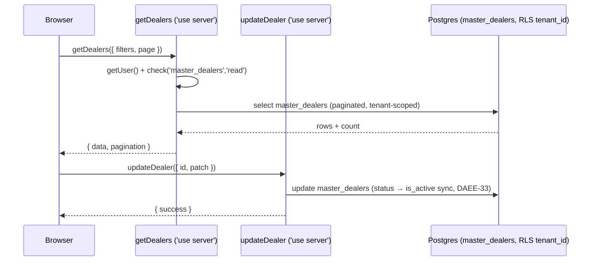

# Dealers — Developer Guide

> **Verified:** 2026-06-17 against `web_app/src/app/dealers` + staging DB.
> **Routes:** `/dealers`, `/dealers/[id]` · **App dir:** `web_app/src/app/dealers`

## 1. Overview
Manages the **`master_dealers`** record (607 rows on staging, all active) after creation. Dealers are
**created elsewhere** — by the `dealer-application-approval` edge function (on application approval) or
by CSV import. This module = read / edit / discounts / security deposits / import-export / audit.

## 2. Architecture (layers touched)
Server Components (list + detail pages) → **Server Actions** (all ops) → Postgres (RLS). **No edge
functions and no BullMQ jobs** in this module. Cross-module: dealer creation = applications module;
ledger/aging = Finance; credit limit + outstanding consumed by O2C credit/overdue checks.

## 3. Request lifecycle — list & edit

## 4. Code map
| Concern | File(s) |
|---|---|
| Pages | `app/dealers/page.tsx`, `app/dealers/[id]/page.tsx` |
| List | `components/DealerManagerPage.tsx`, `DealerTableView.tsx` |
| Edit form | `components/DealerFormSheet.tsx`, `hooks/useDealerForm.ts` |
| Detail | `[id]/components/DealerDetailContent.tsx`, `DealerDiscountsCard.tsx`, `DealerSecurityDepositsCard.tsx`, `RecordDealerDepositDialog.tsx`, `[id]/hooks/useDealerDetailManager.ts` |
| Link to applications | `components/DealerApplicationModal.tsx` |
| Server actions | `actions/*` (see API surface) |
| Tables | `master_dealers`, `discount_configurations`, `epd_discount_slabs`, `dealer_security_deposits` |

## 5. API surface (endpoint-generation source — verified)
| Operation | Type | Permission | Input (key) | Output | Tables |
|---|---|---|---|---|---|
| `getDealers` | server action | `master_dealers:read` | filters, page, sort | `{ data[], pagination }` | `master_dealers` |
| `getDealerCreators` | server action | `master_dealers:read` | — | `{ data[] }` | `master_dealers`/`profiles` |
| `getDealerAuditOperations` | server action | `master_dealers:read` | dealerId | `{ data[] }` | audit log |
| `updateDealer` | server action | `master_dealers:update`¹ | id, patch (incl. status) | `{ success }` | `master_dealers` (status→is_active) |
| `importDealersFromCSV` | server action | `master_dealers:create` | csv | `{ success, counts }` | `master_dealers` |
| `exportDealersToCSV` | server action | `master_dealers:read` | userId | `{ csv }` | `master_dealers` |
| `getDealerDiscountConfigs` | server action | (read) | dealerId | `{ data[] }` | `discount_configurations` |
| `createDealerDiscountConfig` | server action | (update) | dealerId, early_payment_discount_percentage, name | `{ success }` | `discount_configurations` |
| `updateDealerDiscountConfig` | server action | (update) | id, patch | `{ success }` | `discount_configurations` |
| `deactivateDealerDiscountConfig` | server action | (update) | id | `{ success }` | `discount_configurations` |
| `getActiveDealerEPDConfig` | server action | (read) | dealerId | `{ data }` | `discount_configurations` (+ fallback `epd_discount_slabs`) |
| Security deposit (record/list) | server action(s) via detail page | (finance) | dealerId, amount, date | `{ success }` | `dealer_security_deposits` |

¹ `updateDealer` performs the `master_dealers` update (status→is_active, DAEE-33); confirm its exact
permission gate (the action grep surfaced `master_dealers:read|create` explicitly).

> **Endpoint-generation note:** **"create dealer" is NOT in this module.** A REST `POST /dealers`
> maps to the applications-approval path (`dealer-application-approval` edge fn) or CSV import — don't
> synthesize a direct create here. Discounts + deposits are sub-resources (`/dealers/{id}/discounts`, `/deposits`).

## 6. Data model (verified)
- **`master_dealers`** (verified columns): `business_name` text, `dealer_code` varchar, `gstn` text,
  `pan_number` varchar, `credit_limit` numeric, `outstanding_amount` numeric, `status` varchar,
  `is_active` bool, `region_id` uuid, `territory_id` uuid. *(price_list/payment_terms/category are NOT
  direct columns on staging — association lives elsewhere; verify before documenting.)*
- **`discount_configurations`** — dealer-specific EPD (`discount_type='early_payment'`, `dealer_id` set, `early_payment_discount_percentage`).
- **`epd_discount_slabs`** — tenant-wide EPD fallback.
- **`dealer_security_deposits`** — deposits held against a dealer.
- RLS: tenant_id-scoped. `master_dealer_categories` does **not** exist by that name on staging.

## 7. Permissions (RBAC)
`master_dealers:read|create|update`. Discount/deposit ops ride dealer permissions (+ finance for deposits).

## 8. Background jobs
None.

## 9. Gotchas / open items
- **No create path in this module** — creation = `dealer-application-approval` edge fn or CSV import.
- **`status` ↔ `is_active`** must stay in sync (DAEE-33 handles it in `updateDealer`); any new write path must replicate.
- **EPD resolution order:** dealer-specific (`discount_configurations`) → tenant slab (`epd_discount_slabs`) → none. An endpoint exposing "dealer discount" must reflect this precedence.
- **Credit coupling:** `credit_limit` + `outstanding_amount` are read by O2C credit/overdue checks — changing them affects order approval. Cross-reference the O2C dev guide.
