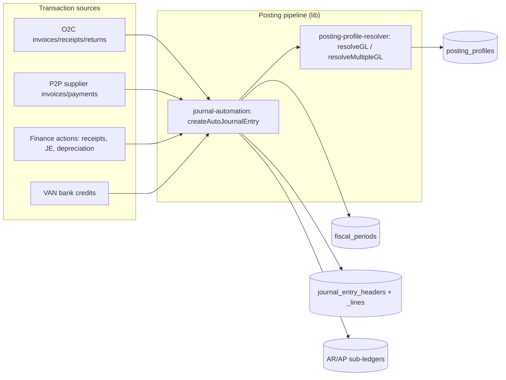
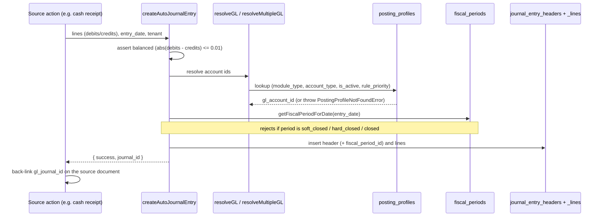
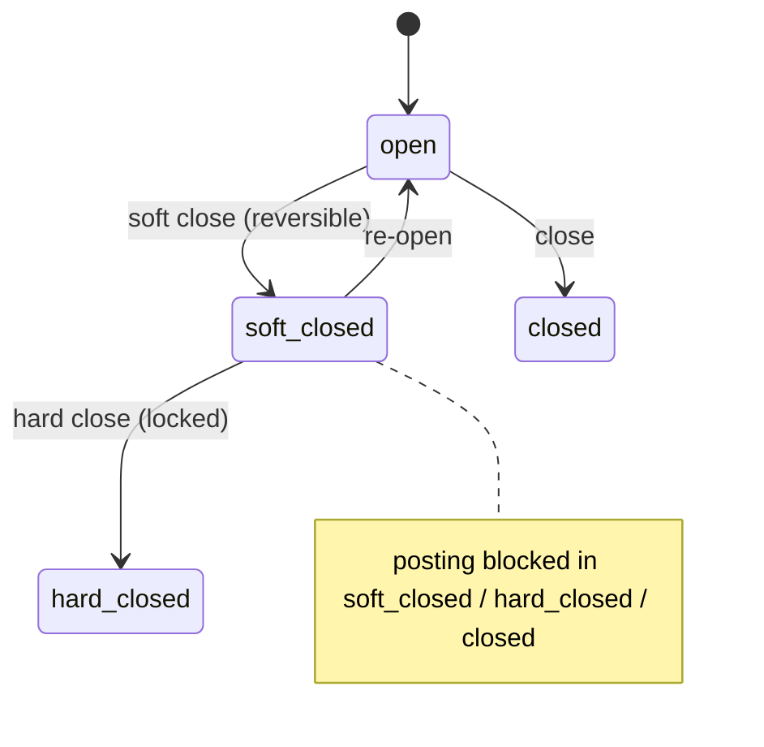
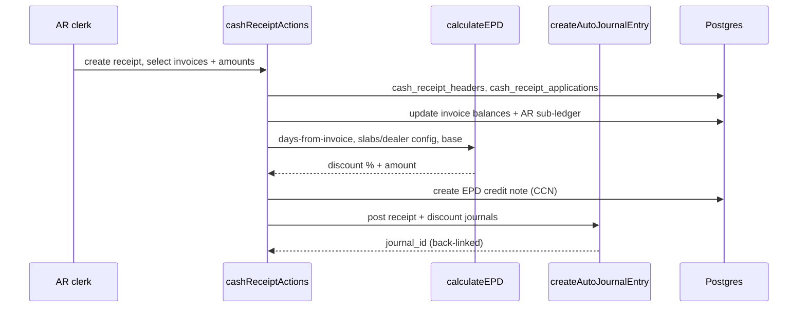
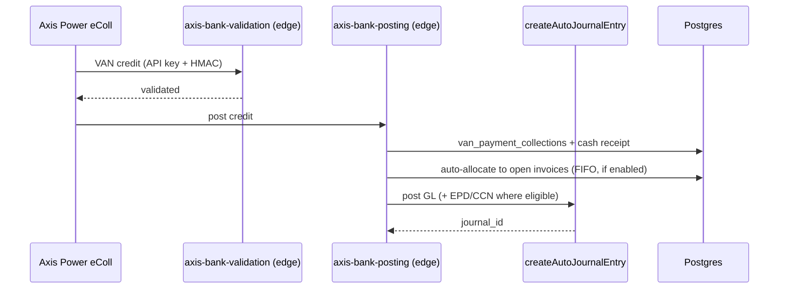

# Finance & Accounts — Developer Guide

> **Verified:** 2026-06-18 against `web_app/src/app/finance`, `web_app/src/lib/posting-profile-resolver.ts`, `web_app/src/lib/journal-automation.ts` + production tenant config.
> **Routes:** `/finance` and ~80 sub-routes across AR, AP, GL, Banking, Reports, GST Compliance, Fixed Assets, Payroll, and Setup (full list in the [Screen Index](../user-guides/finance/screens.md)).
> **Platform architecture:** [Developer Guides README](./README.md)

---

## Change Log

| Version | Date | Author | Summary |
|---|---|---|---|
| 1.0 | 2026-06-18 | Platform Eng | Initial enterprise guide — GL posting model, posting-profile resolution, period control, EPD/APD, VAN, compliance, RBAC, RACI |

---

## Glossary

| Term | Definition |
|---|---|
| GL | General Ledger — `journal_entry_headers` + `journal_entry_lines` |
| Posting profile | Tenant rule mapping (module_type, account_type) → `gl_account_id` |
| Sub-ledger | AR/AP detail (`ar_subledger`, `cash_receipt_applications`) that must tie to GL |
| EPD / APD | Early- / Advance-Payment Discount (issued as a credit note, CCN) |
| Fiscal period | Posting window; states open → soft_closed → hard_closed/closed |
| ITC / TDS | Input Tax Credit / Tax Deducted at Source |
| RLS | Row-Level Security (Postgres tenant isolation) |

---

## 1. Overview
Finance is the **system of record** every other module posts into. Operational events (invoices,
receipts, returns, GRNs, depreciation, payroll, VAN credits) generate **balanced journal entries**
through a single, tenant-configurable posting pipeline. The module also owns AR/AP sub-ledgers, the
chart of accounts, fiscal-period control, statutory reports, GST compliance, fixed assets, and payroll
accounting. **No account is ever hard-coded** — accounts are resolved from `posting_profiles`.

## 2. Architecture


Every posting flows through `createAutoJournalEntry`, which resolves accounts via `resolveGL`/`resolveMultipleGL` and validates the fiscal period before writing the GL.

## 3. GL Posting Model (the core)

### 3.1 Account resolution — `resolveGL`
`resolveGL(tenantId, moduleType, accountType)` selects from `posting_profiles` where
`module_type` + `account_type` + `is_active`, ordered by `rule_priority` (desc), returning the
`gl_account_id`. It is **process-cached**, and **throws `PostingProfileNotFoundError`** when no active
profile matches (a posting can never silently pick the wrong account). `resolveMultipleGL` batches many
specs in one query and throws if **any** is missing.

```ts
// example
const ar = await resolveGL(tenantId, 'sales', 'ar_control');
const accts = await resolveMultipleGL(tenantId, [
  { module: 'sales', account: 'ar_control' },
  { module: 'finance', account: 'bank_control' },
]);
```

**Rule priority (specificity).** `rule_priority` is auto-calculated from how specific a Matrix rule is —
**Warehouse +50 · Item posting group +30 · Customer/Vendor posting group +20 · System default 10** — so the
**most specific** matching rule wins. Rules are authored in the **Posting Profiles Matrix**
(`/finance/posting-profiles/matrix`); **posting groups** (customer/vendor/item) are master data **assigned to
rules** (automatic group matching from the dealer/customer record is **Phase 2**, not yet wired). GST is
resolved separately via the **Tax Determination Matrix** (GST code → GL by warehouse).

**Account kinds.** Profiles must resolve to **posting (leaf)** accounts. In the chart of accounts,
`is_control_account` marks a **parent** (can have children; the Parent picker lists only control accounts) and
`is_header` marks a **summary row that blocks direct postings** — so control/header rows never receive entries.

### 3.2 Posting — `createAutoJournalEntry`

**Invariants:** an entry must be **balanced** (`abs(debits − credits) ≤ 0.01`), must fall in a
**postable fiscal period**, and the resulting `journal_id` is **back-linked** onto the source document
(`gl_journal_id`) so the sub-ledger always ties to the GL.

### 3.3 Fiscal period control

Posting is allowed **only** into a period that is not `soft_closed`/`hard_closed`/`closed`. Periods are
closed **sequentially** — a later period cannot be closed while an earlier one is open.

## 4. Key Flows

### 4.1 Cash receipt → apply → EPD credit note


### 4.2 VAN bank credit → auto-post


## 5. API Surface (selected server actions)
Under `app/finance/**/actions/*`; `getUser() → check(module, action) → tenant-scoped DB`.

| Area | Actions (representative) | Permission |
|---|---|---|
| Cash receipts | create / apply / unapply (bulk) | `finance_cash_receipts`, `finance_bulk_operations` |
| Credit / debit notes | create / apply credit memo, debit note | `finance_credit_memos` |
| EPD / APD | `calculateEPD`, slab + settings config, overrides | `finance_payment_discounts` |
| Dealer advances / deposits | create / apply advance, record deposit | `dealer_ledger`, `dealer_security_deposits` |
| Journal entries | create / post / reverse | `finance_journal_entries` |
| Chart of accounts | maintain accounts | `finance_chart_of_accounts` |
| Fiscal periods | open / soft-close / hard-close | `finance_fiscal_periods` |
| AP | supplier invoices, vendor payments | `finance_accounts_payable` |
| Reports / aging | P&L, BS, Day Book, aging, assurance | `finance_reports`, `finance_aging_reports`, `ar_aging_snapshots` |
| Disclosures | Schedule III | `finance_disclosures` |
| GST compliance | GSTR-1/2/2B/3B | `finance_compliance` |
| Fixed assets | acquire / capitalize / depreciate | `fixed_assets` |
| Banking (VAN) | collections, reconciliation | `van_payment_collections` |
| Posting profiles | configure GL mapping | `posting_profiles` |

## 6. Data Model
**GL:** `journal_entry_headers`, `journal_entry_lines`, `journal_entry_audit_log`, `master_chart_of_accounts`, `fiscal_periods`.
**Posting:** `posting_profiles` (+`posting_profile_audit_log`), `customer_posting_groups`, `vendor_posting_groups`, `item_posting_groups`.
**AR:** `cash_receipt_headers`, `cash_receipt_applications`, `ar_subledger`, `ar_events`, `ar_aging_report`/`_snapshots`, `ar_write_offs`, `ar_confirmations`.
**Other:** `fixed_assets`, `depreciation_runs`/`_items`, `payroll_runs`/`_items`, `van_payment_collections`.
> **Source-of-truth note:** the AR sub-ledger and `cash_receipt_applications` must always reconcile to the GL — every posting back-links `gl_journal_id`; **GL-AR Reconciliation** is the assurance report.

## 7. Tenant Configuration
Finance behaviour is per-tenant in `tenant_settings` (`setting_category='finance'`, `setting_key`/`setting_value`/`is_active`): EPD (`epd_approach`, `epd_calculation_base`, slabs in `epd_discount_slabs`, `epd_eligibility_mode`, `epd_allowed_backdate_days`, `epd_max_override_percent`), APD (`apd_enabled`/`apd_rate`/`apd_calculation_base`/`apd_eligibility_mode`/`apd_gst_treatment`/`apd_expiry_days` + recapture/SOD/TDS/year-end), CCN (`ccn_auto_apply`, `ccn_numbering_format`), and account mappings (`ar_account_id`, `bank_account_id`, `revenue_account_id`, `cgst/sgst/igst_payable_account_id`, `epd/apd_expense_account_code`). *(Customer-facing detail: [Receipts, Credits & Discounts](../user-guides/finance/receipts-credits-discounts.md).)*

## 8. Finance, Audit & Compliance
| Control | Risk | System behaviour | Reference |
|---|---|---|---|
| Posting profiles (no hard-coded accounts) | Misposting | `resolveGL` throws if profile missing | `posting-profile-resolver.ts` |
| Balanced-entry enforcement | Unbalanced books | `abs(debits−credits) ≤ 0.01` or reject | `journal-automation.ts` |
| Fiscal-period lock | Back-dated tampering | posting blocked in soft/hard-closed periods | `fiscal_periods` |
| GL-AR reconciliation | Sub-ledger drift | assurance report ties AR to GL | `/finance/reports/gl-ar-reconciliation` |
| Schedule III | Statutory presentation | Companies Act, 2013 disclosures; statements built from posted JEs | `/finance/disclosures`, `/finance/reports/*` |
| ECL provisioning | Under-provisioning | Expected credit loss model | Ind AS 109 |
| Assurance (SA 240) | Fraud risk | Discount Variance, Reversal Frequency | `/finance/reports/*` |
| Fixed-asset depreciation | Mis-stated NBV / non-compliance | **Schedule II** rates (SLM book / WDV tax); recognition per **Ind AS 16**; CWIP → capitalize | `/finance/fixed-assets` |
| GST returns | Mis-filing / ineligible ITC | GSTR-1/2B/3B from real transactions; **ITC capped at 105% of GSTR-2B (Rule 36(4))** | §16 / Rule 36(4) / GSTR rules |
| E-Invoice / E-credit | IRN compliance | via `debit-note-einvoice`, `o2c-sales-return-management` | CGST Rule 48(4) |

## 9. Security & Tenant Isolation
All finance tables are RLS-scoped by `tenant_id`; every action independently runs `check(module, action)`.
Posting-profile resolution, journal automation, and reports are all tenant-scoped. VAN APIs add API-key +
HMAC-SHA256 (see [VAN](../user-guides/finance/van.md)).

## 9a. Edge functions (verified wiring)
**Wired** (statically referenced from web_app / sibling functions): `axis-bank-posting` (wa:6),
`axis-bank-validation` (wa:4), `finance-invoice-posting` (wa:2, ef:2 — also orchestrated by
`background-jobs-processor`), `debit-note-einvoice` (wa:1).

> **Verification note — present but not statically referenced** (invocation likely cron /
> `background-jobs-processor` / dynamic — **coverage to confirm**, do not assume live): the
> `finance-accounts-payable`, `finance-accounts-receivable`, `finance-journal-posting`,
> `finance-chart-of-accounts`, `finance-financial-reporting`, `finance-fiscal-periods` suite, plus
> `van-auto-reconciliation`, `van-payment-polling`, `generate-invoice-ar`, and `reconcile-gstzen-pending`.
> The GL-posting flows documented here run through server actions (`createAutoJournalEntry`, `resolveGL`),
> not these functions — confirm the backend orchestration before relying on them.

## 10. Integration Points
- **O2C** — invoices, receipts, returns post AR + revenue + GST.
- **P2P** — supplier invoices, payments post AP + ITC.
- **Warehouse / Plant Production** — goods movements, QC/packaging post inventory/COGS.
- **Banking (Axis VAN)** — `axis-bank-validation` / `axis-bank-posting` edge functions (wired); VAN polling/reconciliation functions present but invocation unconfirmed (see §9a).

## 11. Known Gaps & Open Items
1. **APD has no self-serve UI** — configured via `tenant_settings` (admin), unlike EPD which has Slab Configuration + Settings screens. Confirm whether an APD settings screen is planned.
2. **Two QC-adjacent assurance reports** (Discount Variance, Reversal Frequency) are SA 240 aids, not a substitute for a full fraud-analytics suite — scope with audit.
3. **Period re-open is reversible only from soft_closed** — a hard_closed period cannot be re-opened; confirm the SOP for corrections after hard close.

## 12. RACI
| Activity | AR clerk | AP clerk | Accountant | Controller | Auditor | System |
|---|---|---|---|---|---|---|
| Cash receipt + apply + EPD | R | — | — | A | — | S |
| Vendor payment | — | R | — | A | — | S |
| Manual journal entry | — | — | R | A | — | S |
| Depreciation run | — | — | R | A | — | S |
| Period soft/hard close | — | — | C | R/A | — | S |
| Statements / disclosures | — | — | R | A | C | S |
| Posting-profile config | — | — | C | R/A | — | S |
| Read-only review / assurance | — | — | — | C | R | S |

*R = Responsible, A = Accountable, C = Consulted, S = System executes*

## 13. Test Automation & Validation
Finance/EPD/VAN test assets live under `docs/` (e.g. `EPD_VAN_Complete_Test_Cases.md`) and the registry
`docs/test-cases/TEST_CASE_REGISTRY.md`. Priority coverage: balanced-entry rejection, posting into a
closed period (negative), posting-profile-missing error, EPD slab + base + precedence, APD rate/expiry,
GL-AR reconciliation after apply/unapply, and VAN auto-post → allocate → EPD. Verify against representative
scenarios and **negative paths** (finance is high-risk per the repo verification rules).
