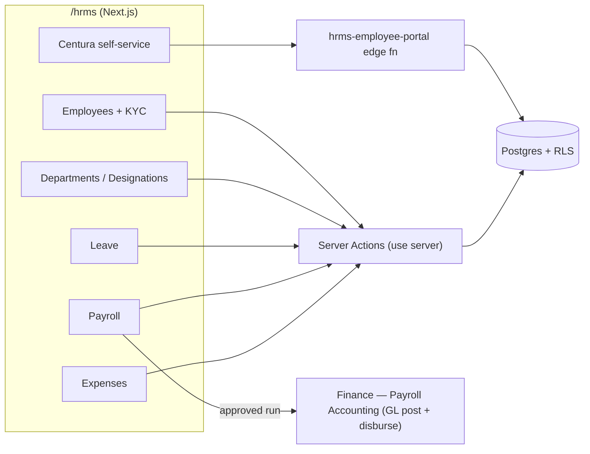
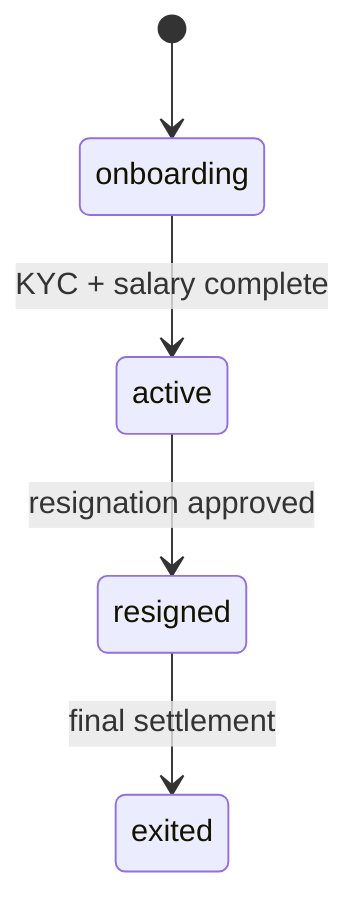
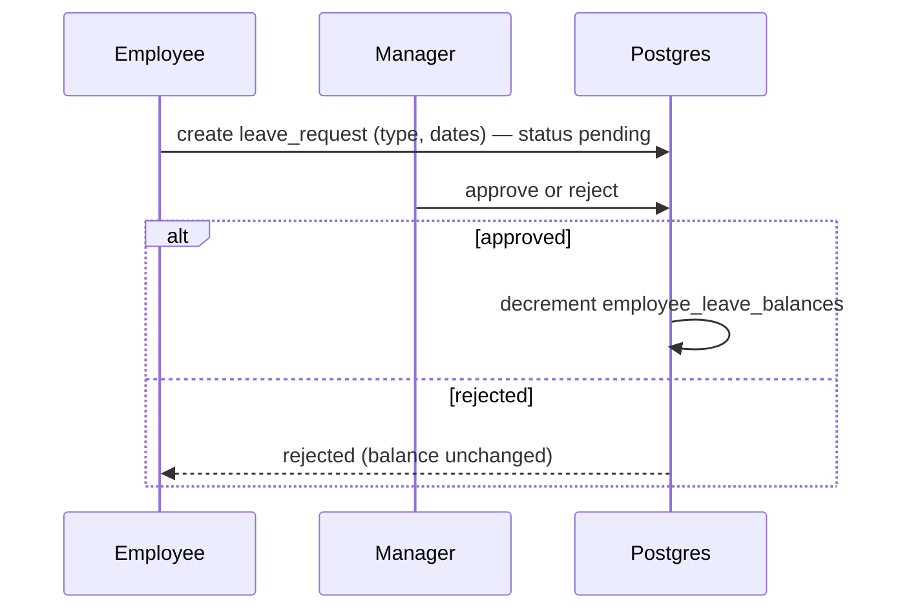
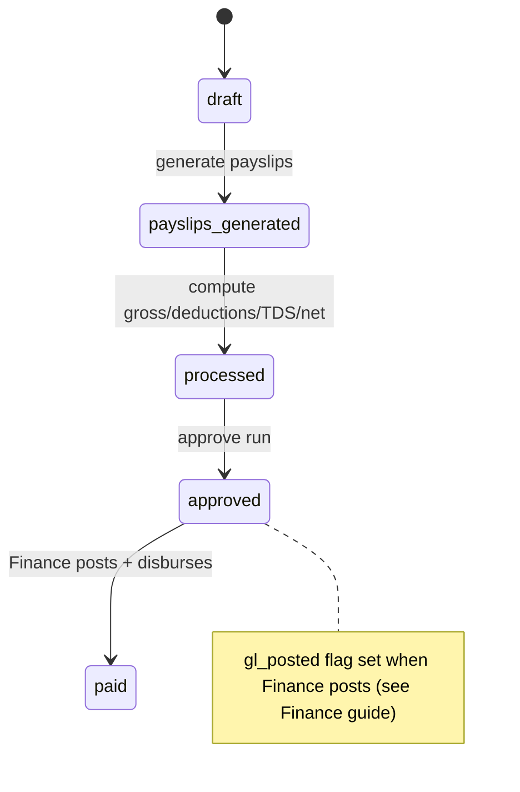

# Human Resources (HRMS) — Developer Guide

> **Verified:** 2026-06-18 against `web_app/src/app/hrms` + staging DB.
> **Routes:** `/hrms` and sub-routes — `/employees` (+`/kyc`, `/new`), `/benefits`, `/departments`, `/designations`, `/leaves` (+`/leave-types`, `/new`), `/payroll` (+`/new`), `/expenses` (+`/categories`, `/new`), `/appraisals`, `/attrition`, `/centura` (employee self-service).
> **Platform architecture:** [Developer Guides README](./README.md)

---

## Change Log

| Version | Date | Author | Summary |
|---|---|---|---|
| 1.0 | 2026-06-18 | Platform Eng | Initial enterprise guide — employee lifecycle, leave/expense/payroll flows, Centura portal, payroll→GL handover, RBAC, RACI |

---

## Glossary

| Term | Definition |
|---|---|
| KYC | Know-Your-Customer employee identity/compliance records |
| Leave balance | Accrued/available leave per employee per leave type |
| Payroll run | A pay-period batch computing gross → deductions → net |
| LOP | Loss of Pay (unpaid days) |
| TDS / PF / ESI / PT | Statutory deductions (income tax / provident fund / ESI / professional tax) |
| Centura | The employee self-service portal |
| RLS | Row-Level Security (Postgres tenant isolation) |

---

## 1. Overview
HRMS manages the full people lifecycle: **onboard → org assignment → leave → payroll → expenses →
appraisals → exit**, plus an **employee self-service portal (Centura)**. HRMS **computes** payroll
(gross, statutory deductions, TDS) and hands the approved run to **Finance** for GL posting and
disbursement (see [Payroll Accounting](../user-guides/finance/payroll.md)).

## 2. Architecture

Payroll calculation lives in HRMS; the **approved run is posted to the GL in Finance** (one handover, not duplicated).

## 3. Lifecycles & State Machines

### 3.1 Employee

### 3.2 Leave request

### 3.3 Payroll run → GL handover

- **Expense claim:** `pending → approved | rejected → paid`.
- **Resignation:** `pending → approved → resigned` (retention activity logged).

## 4. Payroll calculation (where the numbers come from)
HRMS computes per-employee pay using verified helpers: working days & proration, **LOP** from leave
balance, statutory **PF/ESI/PT** (state-slab aware), and **TDS** (monthly from annualized taxable
income, marginal slabs, rebate & cess). Totals roll up to the run: `total_gross`, `total_statutory`,
`total_deductions`, `total_net`. *Source of truth for the numbers is HRMS; the GL entries are produced
in Finance from the approved run.*

## 5. API Surface (selected server actions)
Under `app/hrms/**`; `getUser() → check(module, action) → tenant-scoped DB`.

| Area | Actions (representative) | Permission |
|---|---|---|
| Employees | `createEmployee`, `createEmployeeWithAccount`, `createEmployeeKYC`, benefits | `employees`, `employee_kyc`, `employee_benefits` |
| Org | `createDepartment`, `createDesignation` | `departments`, `designations` |
| Leave | create / approve / `cancelLeaveRequest`; leave types | `leave_requests`, `leave_types` |
| Payroll | run create/process, payslips, `approvePayrollRun` | `hrms_payroll` |
| Expenses | claim create / approve; categories | `expense_claims`, `expense_categories` |
| Appraisals | review create/manage | `performance_reviews` |
| Attrition | `approveResignation`, retention | `hrms_resignations` |
| Self-service | Centura portal | `centura` (via `hrms-employee-portal`) |

## 6. Data Model
`employees`, `employee_kyc`, `employee_bank_details`, `employee_dependents`, `employee_benefits`,
`employee_salaries`, `employee_leave_balances`, `employee_resignations`, `employee_retention_log`,
`departments`, `designations`, `leave_types`, `leave_requests`, `expense_categories`, `expense_claims`,
`payroll_runs`, `payroll_items`, `hrms_default_roles`.
> **Handover note:** `payroll_runs` (`total_gross/statutory/deductions/net`, `gl_posted`) is the
> contract between HRMS (calculation) and Finance (posting). Don't post payroll GL from HRMS.

## 7. Permissions (RBAC) & Self-Service
Per-entity verbs as above. The **Centura** self-service portal is permission-scoped so an employee sees
**only their own** payslips/leave/details — enforced via the `hrms-employee-portal` edge function and RLS.

## 8. Security, Compliance & Tenant Isolation
- All HR tables RLS-scoped by `tenant_id`; PII (KYC, bank, dependents, salary) is permission-restricted.
- Payroll statutory computation supports **TDS** (Income-tax Act, 1961), **PF/ESI**, and **Professional Tax** (state-slab aware) — confirm rates/slabs are current per the tenant's payroll configuration.
- Audit: approvals (leave/expense/payroll/resignation) are recorded against the records.

## 8a. Edge functions (verified wiring)
**Wired** (statically referenced from web_app): `hrms-employee-portal` (employee self-service).

> **Verification note — present but not statically referenced** (invocation likely cron/background or
> dynamic — **coverage to confirm**): `hrms-operations`, `hrms-retention-cleanup` (data-retention
> cleanup — almost certainly a scheduled job), `employee-kyc-processor`. The HR flows documented here run
> through server actions; confirm the backend orchestration of these functions before relying on them.

## 9. Integration Points
- **Finance** — approved payroll runs post to the GL and disburse (Payroll Accounting).
- **Centura** — employee self-service via `hrms-employee-portal` edge function.

## 10. Known Gaps & Open Items
1. **`centura` / `centura-test` routes** — `centura-test` appears to be a test/preview surface; confirm it's excluded from production navigation.
2. **Appraisals** statuses are thin on staging (mostly `active`) — confirm the intended review lifecycle with product before documenting strict states.
3. **Payroll rate/slab config** — TDS/PF/ESI/PT slabs are computed in code; confirm they're tenant-configurable (not hard-coded) for multi-tenant correctness.

## 11. RACI
| Activity | HR Admin | Manager | Payroll Officer | Employee | Finance | System |
|---|---|---|---|---|---|---|
| Onboard employee / KYC | R/A | C | — | C | — | S |
| Department / designation setup | R/A | — | — | — | — | S |
| Leave request / approval | — | A | — | R | — | S |
| Run + approve payroll | — | — | R/A | — | C | S |
| Post + disburse payroll | — | — | C | — | R/A | S |
| Expense claim / approval | — | A | — | R | C | S |
| Resignation / exit | C | A | — | R | C | S |

*R = Responsible, A = Accountable, C = Consulted, S = System executes*

## 12. Test Automation & Validation
HR test assets live under `docs/` and the registry `docs/test-cases/TEST_CASE_REGISTRY.md`. Priority
coverage: employee onboarding → payroll inclusion, leave request → balance decrement (and insufficient-
balance reject), payroll compute (gross/deductions/TDS/net) + approve, expense claim approval, and the
**Centura self-service own-records-only** boundary (negative: cannot see other employees' data).
