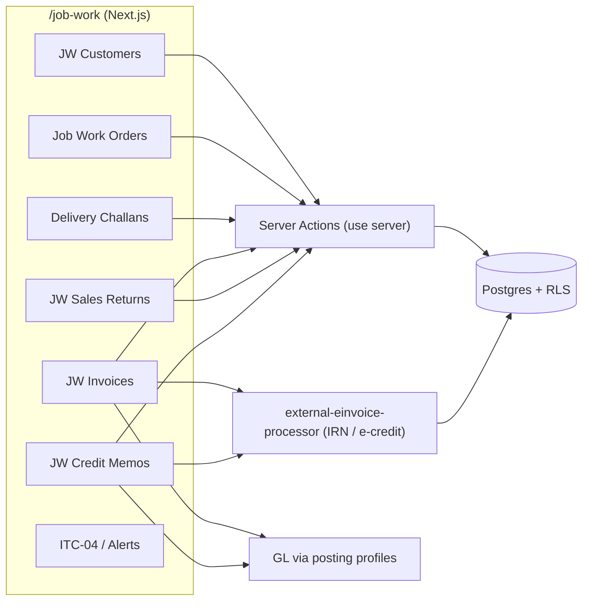
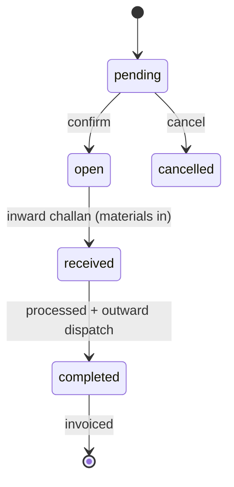
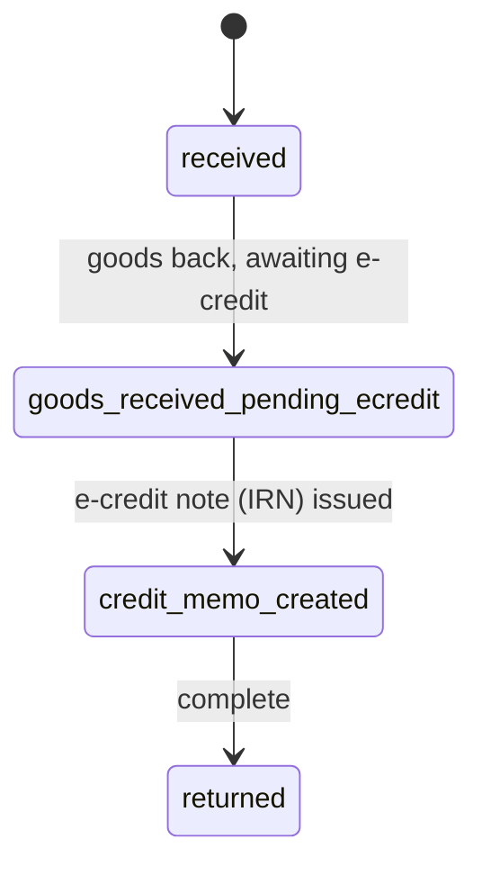

# Job Works — Developer Guide

> **Verified:** 2026-06-18 against `web_app/src/app/job-work` + staging DB.
> **Routes:** `/job-work` (orders), `/job-work/customers`, `/challans`, `/invoices`, `/credit-memos` (+`/new`), `/sales-returns`, `/compliance-alerts`, `/reports/itc-04`, `/dashboard`.
> **Platform architecture:** [Developer Guides README](./README.md)

---

## Change Log

| Version | Date | Author | Summary |
|---|---|---|---|
| 1.0 | 2026-06-18 | Platform Eng | Initial enterprise guide — job-work lifecycle, challans, e-invoice/e-credit, ITC-04, GL, RBAC, RACI |

---

## Glossary

| Term | Definition |
|---|---|
| Job worker | The party (this tenant) that processes the principal's materials for a fee |
| Principal | The job-work **customer** who owns the materials |
| Inward challan | Delivery challan for customer-supplied materials received |
| Outward challan | Delivery challan dispatching processed goods (optional E-Way Bill) |
| ITC-04 | Statutory return declaring goods sent to / received from a job worker |
| HSN 9988 | GST HSN series for manufacturing services (job work) |
| RLS | Row-Level Security (Postgres tenant isolation) |

---

## 1. Overview
Job Works models manufacturing-as-a-service: this tenant is the **job worker** processing a
**principal/customer's** materials. The cycle is **JW Customer → Job Work Order → Inward Challan
(receive materials) → process → Outward Challan (dispatch) → JW Invoice (service charge + E-Invoice)
→ JW Sales Return → JW Credit Memo (e-credit note)**, with **ITC-04** as the statutory report. Only
the **service** is billed (HSN 9988-series) — not the goods, which belong to the principal.

## 2. Architecture

E-Invoice/e-credit run through the **shared GST integration** (`external-einvoice-processor`); JW
invoices and credit notes both carry IRN. GL postings use posting profiles.

## 3. Lifecycle and State Machines

### 3.1 Job Work Order → Invoice

### 3.2 Sales Return → Credit Memo

- **Invoice:** `draft → generated → posted`.
- **Credit memo:** `generated → partial_applied → fully_applied → settled` (or `reversed`).

## 4. Compliance
- **ITC-04 (Rule 45, CGST Rules, 2017):** the principal/job-worker must declare goods sent to and received from job work. The `/job-work/reports/itc-04` report compiles this from challans. *Control:* every goods movement captured as an inward/outward challan.
- **E-Invoice (Rule 48(4)) / E-Way Bill (Rule 138):** JW service invoices report to the IRP for an IRN; outward challans support an E-Way Bill when goods move. Job-work service uses the **HSN 9988** series.
- **Interstate vs intra-state:** tax split derives from the customer's GSTIN/state on `job_work_customer_profiles` — confirm the profile is correct (a wrong state flips CGST/SGST vs IGST).
- **GL & audit:** JW invoices and credit notes post via posting profiles; `finance_credit_memos` + `journal_entries` permissions gate the credit/GL side. All actions tenant-scoped.

## 5. API Surface (selected)
Server actions under `app/job-work/**/actions/*`; `getUser() → check(module, action) → tenant-scoped DB`.

| Area | Actions (representative) | Permission |
|---|---|---|
| Orders | create / read / update job-work order | `job_work_orders` |
| Customers | maintain `job_work_customer_profiles` | `job_work_orders` |
| Challans | inward / outward challan capture | `job_work_orders` |
| Invoices | create + E-Invoice (IRN); `getJWInvoiceLinkedActivity` | `job_work_orders` |
| Sales returns | create return → goods receipt | `job_work_orders` |
| Credit memos | create e-credit note; apply/reverse | `finance_credit_memos`, `journal_entries` |
| Reports | ITC-04 | `job_work_orders` |

## 6. Data Model
`job_work_orders` (+`_items`), `job_work_materials`, `job_work_invoices` (+`_invoice_items`),
`job_work_credit_memos` (+`_lines`, `_applications`), `job_work_sales_returns` (+`_items`),
`job_work_customer_profiles`, `job_work_import_rows`.
> **Source-of-truth note:** JW has its **own** invoice/credit/return tables (separate from O2C's
> `invoices`/`credit_memos`). Don't mix JW and O2C document tables in queries or reports.

## 7. Permissions (RBAC)
Dominant `job_work_orders` (orders, customers, challans, invoices, returns, ITC-04); credit/GL side uses
`finance_credit_memos` + `journal_entries`. Tenant-isolated via RLS.

## 8. Security & Tenant Isolation
All `job_work_*` tables RLS-scoped by `tenant_id`; server actions independently `check(module, action)`.
Customer GSTIN/PII handled like other masters.

## 8a. Edge functions (verified wiring)
**Wired** (statically referenced from web_app / sibling functions): `job-work-sales-return-management`
(wa:7 — the JW-specific sales-return / credit-memo engine), plus the **shared** `external-einvoice-processor`
(wa:8) and `cancel-einvoice-gstzen` for IRN / e-credit-note generation.

> **Correction (verified 2026-06-18):** a JW-specific edge function **does** exist —
> `job-work-sales-return-management` — contrary to the older note that JW had none. The e-invoice/IRN path
> remains the *shared* `external-einvoice-processor`; the JW-local function handles sales returns.

## 9. Integration Points
- **GST integration** — `external-einvoice-processor` for IRN + e-credit notes (shared with O2C/Finance).
- **Sales returns** — `job-work-sales-return-management` (JW-specific edge function) drives JW credit memos.
- **E-Way Bill** — outward challans link to the EWB mechanics documented in [O2C](./o2c.md).
- **Finance** — JW invoices/credit notes post to the GL; collection via AR.
- **JW Outstanding** — the Job Works menu **deep-links** to the canonical dealer-outstanding report scoped to JW (`/finance/reports/dealer-outstanding?customer_scope=jw`), not a separate report (DAEE-680 Def-JW-006).
- **Plant Production** — the in-house manufacturing counterpart (this is the sub-contracted/service variant).

## 10. Known Gaps & Open Items
1. **Challans scope (DAEE-680):** Delivery Challans were moved under Job Work; an alternate manager view is preserved on a branch. Confirm the canonical challan UX with product.
2. **E-invoice path is shared, not JW-local:** JW invoices call the shared `external-einvoice-processor` for IRN (the JW-local edge function `job-work-sales-return-management` covers *sales returns*, not e-invoicing). Verify JW-specific fields (HSN 9988, service-only lines) flow correctly each release.
3. **ITC-04 completeness depends on challan discipline:** the report is only as complete as the inward/outward challans captured — there is no automatic reconciliation against physical movement.
4. **ITC-04 report is GATED (verified 2026-06-18):** `/job-work/reports/itc-04` currently renders a "Pending Compliance Review" placeholder, not a working export — the page states it auto-derives from `job_work_materials` + `job_work_challans` (operational tables, no GL), exports XLSX to the GSTN portal layout, with AATO-based cadence (half-yearly/yearly/quarterly) per **Notification 35/2021-CT**. Gated on Finance-DRI sign-off of the export column layout; the **sidebar link is intentionally removed** (URL-reachable only for stakeholder preview); expected with **DAEE-680 EPIC-4**. Customer guide documents it as *coming soon* — do not present ITC-04 as live until released.

## 11. RACI
| Activity | Coordinator | Stores | Finance (AR) | Compliance | System |
|---|---|---|---|---|---|
| Maintain JW customers | R/A | — | — | C | S |
| Create job-work order | R/A | — | — | — | S |
| Inward / outward challan | A | R | — | — | S |
| JW invoice + E-Invoice | — | — | R/A | C | S |
| Sales return + credit note | — | C | R/A | — | S |
| ITC-04 / compliance alerts | C | — | C | R/A | S |

*R = Responsible, A = Accountable, C = Consulted, S = System executes*

## 12. Test Automation & Validation
JW test assets live under `docs/modules/` and the registry `docs/test-cases/TEST_CASE_REGISTRY.md`;
feature files under `e2e/features/` where present. Priority coverage: order → inward challan → outward
challan → JW invoice (IRN) happy path, interstate vs intra-state tax split from customer GSTIN, sales
return → e-credit note state machine (`goods_received_pending_ecredit` → `credit_memo_created`), and
ITC-04 figures vs captured challans. E-invoice uses the shared GSTZen path (validate against its sandbox).
