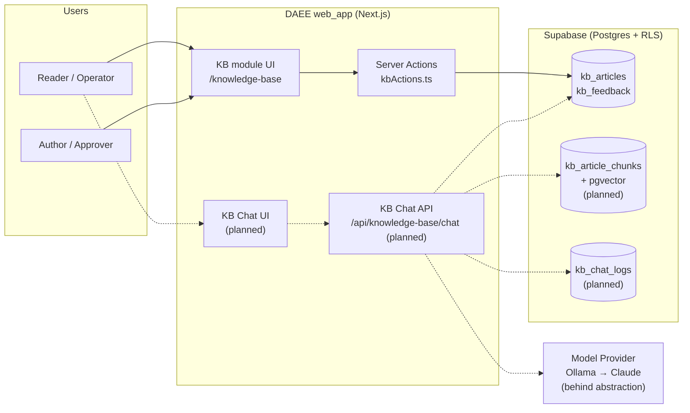
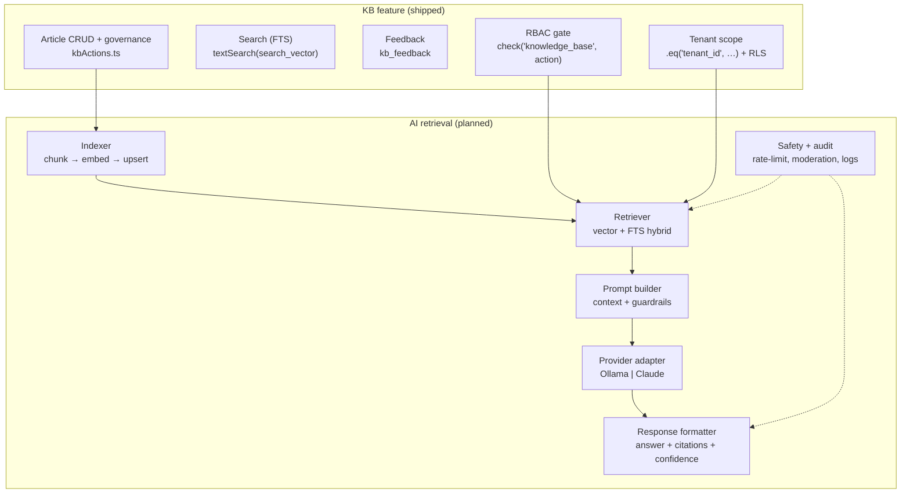
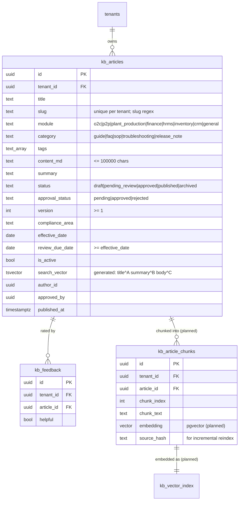
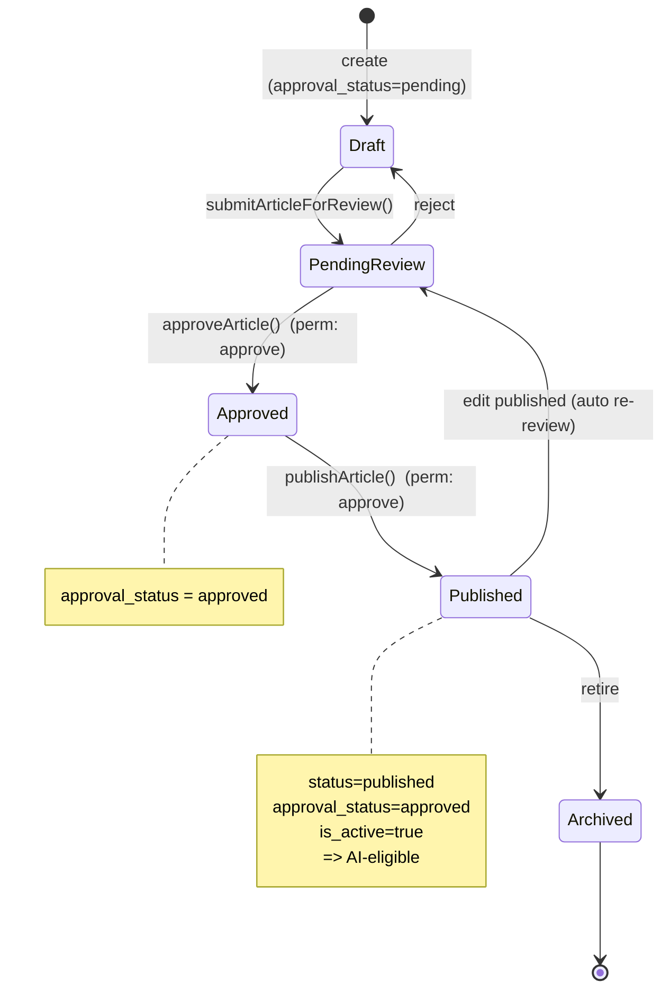
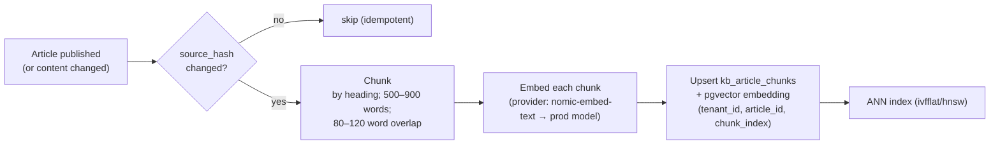
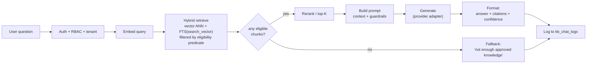
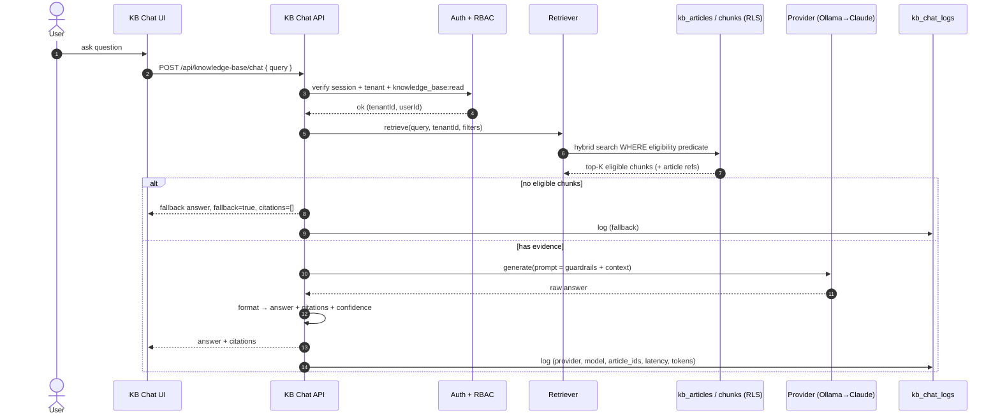
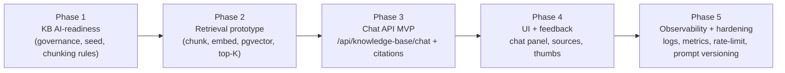

# DAEE Knowledge Base — Architecture, Governance & AI Retrieval

| | |
|---|---|
| **Document ID** | DAEE-KB-ARCH-2026-07-06 |
| **Owner** | Platform Engineering / AI |
| **Reviewers** | Backend, DevSecOps, Product, QA |
| **Status** | 🟢 Baseline (feature: live; AI retrieval: design + Phase-1 scoped) |
| **Classification** | Internal |
| **Version** | 1.0 |
| **Last updated** | 2026-07-06 |
| **Next review** | 2026-10-06 |
| **Companion** | [KB Chatbot Implementation Plan](./DAEE-KB-CHATBOT-IMPLEMENTATION-PLAN-2026-05-22.md) · [RAG & Vector DB Guide](./DAEE-RAG-AND-VECTOR-DB-GUIDE-2026-05-22.md) · [AI Integration Roadmap](./DAEE-AI-INTEGRATION-ROADMAP-2026-05-22.md) |

> **What this is.** The authoritative internal reference for the DAEE Knowledge Base (KB): its data model,
> content-governance state machine, tenant/role security, and the **read-only Retrieval-Augmented Generation
> (RAG)** design that turns approved KB content into a cited AI assistant. It reflects the **verified current
> state** (KB feature shipped; workflow + search fixed by migrations `20260706120000` / `20260706120500`) and
> the **target architecture** for AI retrieval (not yet built).

---

## 1. Architecture principles (non-negotiable)

1. **Read-first, write-never.** The assistant reads approved knowledge; it never mutates ERP data, approves documents, or takes actions.
2. **Citation-first.** Every answer is grounded in retrieved chunks and cites the source article(s); no answer without evidence.
3. **Approval-aware corpus.** Only `published + approved + active` content is retrievable. Drafts, pending, archived, and rejected content are invisible to AI.
4. **Tenant- and role-safe by construction.** Every retrieval is filtered by `tenant_id` and gated by the `knowledge_base:read` permission — enforced server-side, never in the browser.
5. **API-mediated.** The UI never talks to a model. A DAEE backend endpoint owns auth, RBAC, retrieval, prompt assembly, output safety, logging.
6. **Provider-agnostic.** The generation/embedding provider sits behind an abstraction: **Ollama for the pilot → Claude (Anthropic) for production**, swappable without touching retrieval or UI.
7. **Vector index is an accelerator, not the system of record.** `kb_articles` remains the source of truth; the vector index is derived and rebuildable.

---

## 2. System context



*Solid = shipped. Dotted = planned AI-retrieval path.*

---

## 3. Component architecture



---

## 4. Data model

Shipped tables are solid; planned tables (from the chatbot plan) are marked.



**Two-field state model (important):** `status` is the editorial lifecycle; `approval_status` is the sign-off. They are **distinct** and both DB-checked. The retrieval-eligible corpus is the intersection: `status='published' AND approval_status='approved' AND is_active`.

---

## 5. Content governance state machine



**Controls:** authoring vs approval are separate permissions (`create`/`update` vs `approve`) → segregation of duties. Editing a published article returns it to review, so a live change can never bypass approval. `review_due_date` (default +180d in the seed) forces periodic refresh of compliance content.

> **Fixed by migration `20260706120000`.** The base `chk_kb_status` allowed only `draft/published/archived`; the code drives `pending_review`/`approved`, so the whole workflow raised CHECK violations until the constraint was widened to all five states.

---

## 6. Security & tenant-isolation model

| Layer | Control |
|---|---|
| **Transport / auth** | Authenticated DAEE session required (`supabase.auth.getUser()`); anonymous → 401. |
| **RBAC** | `check('knowledge_base', <read\|create\|update\|approve>)` in every server action; retrieval requires `read`. |
| **Tenant isolation (app)** | Every query `.eq('tenant_id', <caller tenant>)`; the caller's tenant comes from their profile, never the request body. |
| **Tenant isolation (DB)** | RLS policy `tenant_id = (SELECT tenant_id FROM profiles WHERE id = auth.uid())` on `kb_articles`/`kb_feedback` (defence in depth). |
| **Corpus eligibility** | `status='published' AND approval_status='approved' AND is_active` — the AI never sees drafts/pending/archived. |
| **Prompt safety** | Context is retrieved KB chunks only; never secrets, tokens, cross-tenant rows, or ERP transactional dumps. |
| **Output safety** | Answer only from evidence; fallback ("not enough approved knowledge found") instead of guessing; no hidden chain-of-thought. |
| **Rate limiting** | Per-user + per-tenant limits, max prompt size, max retrieval count (Phase-5). |

**The retrieval eligibility predicate (single source of truth):**
```
tenant_id = :caller_tenant
AND status = 'published'
AND approval_status = 'approved'
AND is_active = true
[AND module = :module]        -- optional
[AND compliance_area = :area] -- optional
```

---

## 7. AI retrieval (RAG) pipelines

### 7a. Indexing pipeline (offline / on publish)



### 7b. Query pipeline (online)



**Hybrid retrieval** combines vector similarity (semantic) with the shipped `search_vector` FTS (lexical/exact) — FTS catches codes/HSN/acronyms that dense vectors miss; vectors catch paraphrase. Both are filtered by the **same eligibility predicate** (§6) *before* ranking.

---

## 8. Query → response sequence



---

## 9. Provider & vector-store strategy

- **Generation / embeddings** — behind `provider.ts`. **Phase 1 (pilot):** Ollama (`llama3.1:8b`/`qwen2.5:7b` + `nomic-embed-text`) for zero-cost local validation. **Production:** Anthropic **Claude** for generation + a hosted embedding model, selected via `KB_AI_PROVIDER`. No secrets in the client; keys in server env.
- **Vector store** — **pgvector in the existing Supabase Postgres** (`kb_article_chunks.embedding`), tenant-isolated with the same RLS pattern. No new infrastructure or trust boundary; rebuildable from `kb_articles`. External vector DBs are deferred until scale demands them.
- **Runtime** — the chat endpoint is a DAEE-owned server route (`/api/knowledge-base/chat`); provider calls are server-to-server.

---

## 10. Current state, migrations & deploy ordering

| Item | State |
|---|---|
| KB CRUD + governance + feedback | ✅ shipped (`kbActions.ts`) |
| Tenant isolation + RBAC + RLS | ✅ shipped |
| Governance workflow (submit→approve→publish) | ✅ **unblocked** by `20260706120000_kb_status_check_extend.sql` (P0) |
| Indexed full-text search | ✅ `20260706120500_kb_fts_search_vector.sql` (P1) + `textSearch(search_vector)` + pagination |
| AI-prerequisite content seed | ✅ SQL seed + runbook (`daee-production/…/seed-kb-ai-prerequisite-content.md`) |
| Indexer / retriever / chat API / chat UI | ❌ not built (Phases 2–4) |

> **Deploy ordering (mandatory).** `getPublishedArticles` now calls `.textSearch('search_vector', …)`. That column exists in **staging (applied 2026-07-06)**; in **PROD, apply both migrations *before* the branch's code deploys**, or search will error against the missing column.

---

## 11. Observability, rate limiting, audit
- **Audit:** every chat request logs user, tenant, prompt version, provider/model, retrieved `article_ids`, latency, token counts, and failure reason (`kb_chat_logs`).
- **Metrics:** retrieval hit-rate, fallback-rate, p50/p95 latency, tokens/req, feedback ratio.
- **Rate limiting:** per-user + per-tenant caps; max prompt size; max `top_k`.
- **Moderation:** reject prompt-injection / hidden-prompt-extraction / cross-tenant probing; never treat AI output as accounting truth.

---

## 12. Failure modes & edge cases

| Scenario | Expected behaviour |
|---|---|
| No eligible chunks | Safe fallback, `fallback=true`, no citation, logged |
| Article edited after indexing | `source_hash` change triggers re-chunk/re-embed; stale vectors replaced |
| Draft/pending/archived match | Excluded by eligibility predicate — never retrieved |
| Cross-tenant query | Blocked by app filter + RLS; retriever cannot see other tenants |
| Provider timeout/outage | Degrade to fallback; log failure; no partial/guessed answer |
| Prompt-injection in a KB article | Guardrail prompt + content review; treat context as data, not instructions |
| >1000 published articles | List paginates (exact count + `.range()`); no silent truncation |

---

## 13. Phased roadmap



## 14. Known gaps & open decisions
- **Provider cutover** — pilot on Ollama; confirm the production Claude model + hosted embedding model + budget before Phase 3 GA.
- **Reranking** — start with vector+FTS fusion; add a cross-encoder reranker only if precision needs it.
- **Chunking tuning** — 500–900 words / 80–120 overlap is the starting heuristic; validate against a labelled retrieval set (Phase 2).
- **KB audience segmentation** — admin/security/config content is excluded from the AI corpus today; a proper visibility tier would let more content in safely later.

## Change log
| Date | Version | Change |
|---|---|---|
| 2026-07-06 | 1.0 | Baseline architecture + governance + RAG design with diagrams; reflects P0/P1 migrations applied in staging. |
