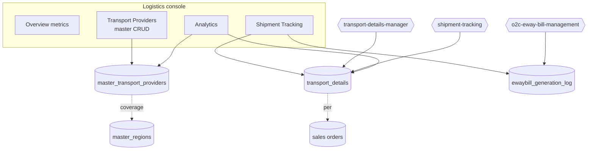
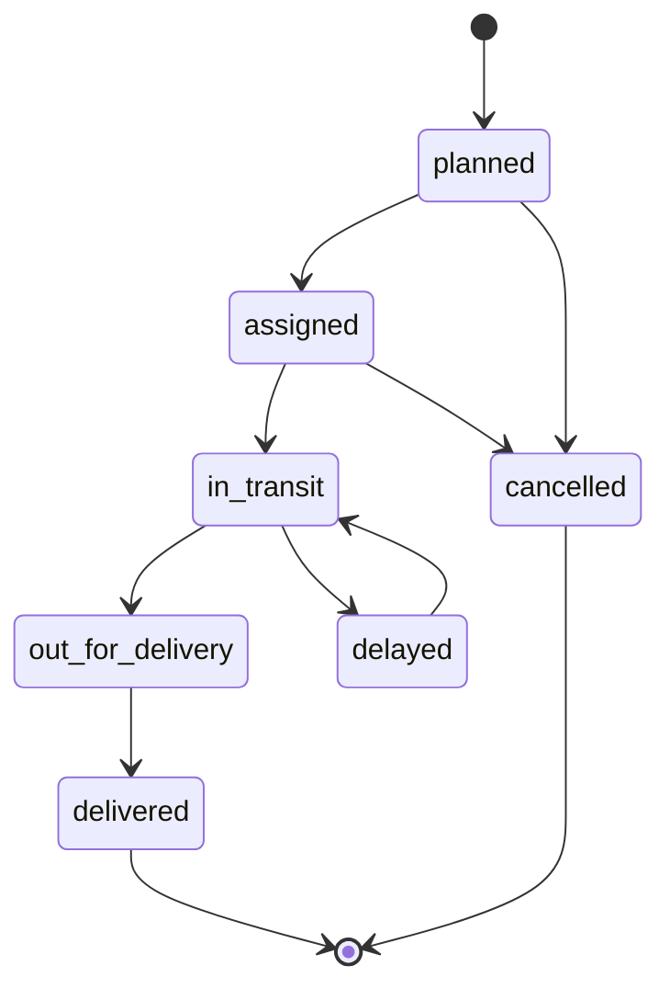
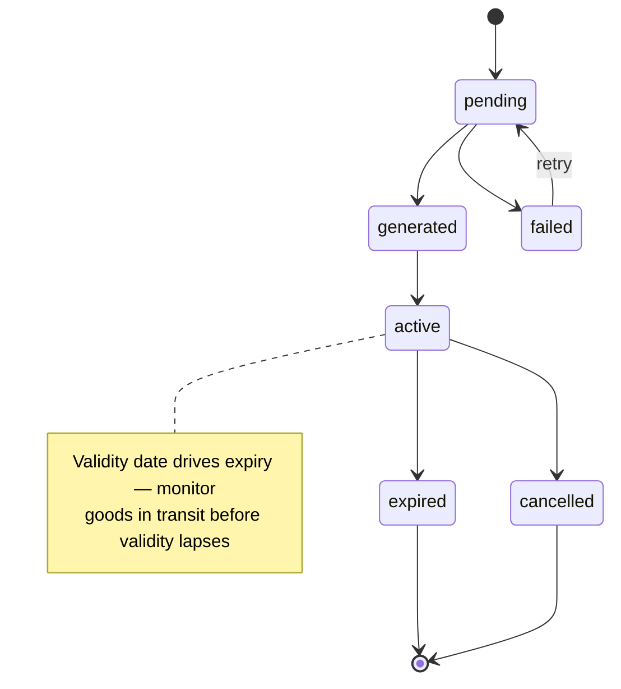

# Logistics & Transport — Developer Guide

> Engineering reference for the logistics console — the transport-provider master, shipment tracking
> against sales orders, E-Way Bill monitoring, and logistics analytics.

## Change Log
| Version | Date | Author | Notes |
|---|---|---|---|
| 1.0 | 2026-06-18 | Platform Engineering | Initial guide — provider master, shipment + EWB tracking, analytics, schema. |

## Glossary
| Term | Meaning |
|---|---|
| **Transport provider** | A carrier master record (GSTIN, GST Transporter ID, coverage). |
| **GST Transporter ID** | The transporter's GST identifier required for E-Way Bill generation. |
| **Transport details** | A shipment record tied to a sales order (vehicle, driver, route, status). |
| **E-Way Bill (EWB)** | Statutory transport document tracked in `ewaybill_generation_log`. |
| **LR number** | Lorry receipt / consignment note number. |

---

## 1. Overview

Logistics & Transport (`src/app/logistics-transport-management`) is a tabbed dashboard:
**Overview**, **Transport Providers**, **Shipment Tracking**, **Analytics**. It combines a master
(`master_transport_providers`, full CRUD) with read/track views over operational data
(`transport_details`, `ewaybill_generation_log`). Server actions live in `actions/index.ts`; provider
writes are gated by `getServerPermissions().check('master_transport_providers', <op>)` with RLS as the
backstop. Related surfaces: `src/app/transport-providers` and `src/app/o2c/transport`.

> **Scope note** E-Way Bill **generation** is owned by the O2C / e-invoice path (cancel/generate against
> the IRP), not this console. Here EWBs are **read and monitored** via `ewaybill_generation_log`. The data
> this console reads is populated by three backend edge functions (invoked from the O2C actions, not from
> here): **`transport-details-manager`** (create/validate transport details for an invoice),
> **`o2c-eway-bill-management`** (invoice-driven EWB generate/cancel against GSTZen — DAEE EWB workstream),
> and **`shipment-tracking`** (courier/provider status updates — present in the backend but **not
> statically referenced** from web_app or sibling functions; its invocation path, likely a courier
> webhook or scheduled job, is unconfirmed).

---

## 2. Architecture

The console **reads** `transport_details` and `ewaybill_generation_log`; those tables are **written** by
the O2C-side edge functions shown above (`transport-details-manager`, `o2c-eway-bill-management`,
`shipment-tracking`) — never by this module.

Analytics actions (`getLogisticsMetrics`, `getProviderPerformance`, `getMonthlyTrends`) aggregate over
`transport_details` and providers — read-only.

---

## 3. Shipment status lifecycle

## 4. E-Way Bill status

> **Verification note** EWB transitions reflect the `EWayBillStatus` enum and the generation-attempt
> tracking in `ewaybill_generation_log`; the authoritative generate/cancel transitions are executed in
> the O2C / e-invoice path — confirm there before documenting an SLA.

---

## 5. API surface (server actions)

| Action | Op | Purpose |
|---|---|---|
| `getTransportProviders` / `getTransportProviderById` | read | Provider reads |
| `createTransportProvider` / `updateTransportProvider` / `deleteTransportProvider` | c/u/d | Provider master CRUD |
| `exportTransportProvidersToCSV` | read | CSV export |
| `getTransportDetails` | read | Shipment tracking list (filters) |
| `getEWayBills` | read | E-Way Bill log (filters) |
| `getLogisticsMetrics` | read | Overview headline metrics |
| `getProviderPerformance` | read | Per-provider performance |
| `getMonthlyTrends` | read | Trend series (default 6 months) |

---

## 6. Data model (verified)

| Table | Role | Key fields |
|---|---|---|
| `master_transport_providers` | Carrier master | `provider_name`, `gstn`, `gst_transporter_id`, `point_of_contact_name`, `contact_number`, `region`, `territory`, `address`, `is_active`, tenant, audit. |
| `transport_details` | Shipment per order | `sales_order_id`, `transporter_gstin`, `transporter_name`, `transport_mode` (road/rail/air/ship), `vehicle_number`, `vehicle_type` (regular/ODC/tanker), driver fields, `distance_km`, source/destination pincode, `route_details` (JSONB), dispatch/expected/actual dates, `lr_number`, `freight_amount`, `status`, notes. |
| `ewaybill_generation_log` | EWB tracking | `sales_order_id`, `transport_details_id`, `einvoice_id`, `eway_bill_number`, `eway_bill_date`, `validity_date`, `transport_document_number`, `status`, `generation_attempt_count`, `api_response` (JSONB), `error_message`, `processing_time_ms`, tenant, audit. |
| `master_regions` | (read) | Provider coverage. |
| `profiles` | (read) | Created/updated-by resolution. |

> **Verification gap** Column-level constraints (FKs, CHECKs) not exhaustively audited; confirm against
> the migration before relying on a specific column.

---

## 7. Permissions
Provider CRUD checks `master_transport_providers`. The tracking/analytics reads draw on shipment, EWB,
region, and profile data within the tenant. Logistics Admin maintains providers; Sales/Ops and
Management read.

---

## 8. Security and tenant isolation
- **RLS** scopes all tables to the caller's tenant; provider writes add the permission gate.
- **`gst_transporter_id`** is compliance-relevant (feeds EWB) — validate format and treat changes as auditable.
- **EWB is read-only here** — never mutate `ewaybill_generation_log` from this console; generation/cancel happen in the O2C/e-invoice path so the IRP and DB stay in sync.
- **`api_response`/`error_message`** may contain government-API payloads — treat as sensitive; avoid surfacing raw payloads to non-admin roles.

---

## 9. Integration points

| Integrates with | Direction | Purpose |
|---|---|---|
| **`transport-details-manager`** (edge fn) | → console reads | Creates/validates `transport_details` for an invoice (invoked from O2C `manageTransportDetails.ts`). |
| **`o2c-eway-bill-management`** (edge fn) | → console reads | Invoice-driven EWB generate/cancel against GSTZen; writes `ewaybill_generation_log` (invoked from O2C `eWayBillEdgeFunctions.ts`). |
| **`shipment-tracking`** (edge fn) | → console reads | Courier/provider status updates onto `transport_details`. *(Backend present; not statically referenced — invocation path unconfirmed.)* |
| **Regions** | ← | Provider coverage. |
| **Sales orders** | ← | Shipment context (number, customer, date). |

---

## 10. Known gaps and follow-ups
- **EWB generate/cancel ownership** lives in `o2c-eway-bill-management` (invoked from O2C), not this module — keep the cross-reference accurate as the E-Way Bill workstream evolves.
- **Edge-function contracts** (`transport-details-manager`, `o2c-eway-bill-management`, `shipment-tracking`) are named here but their request/response payloads were not line-audited — document schemas before integrating new callers.
- **Column-level schema audit** pending (see §6).
- **Provider coverage** (`region`/`territory` as free text vs. FK to `master_regions`/`master_territories`) should be reconciled.

---

## 11. RACI

| Activity | Logistics Admin | Sales/Ops | Management | Eng |
|---|---|---|---|---|
| Maintain transport providers | **R/A** | I | I | C |
| Monitor shipments | **R/A** | C | I | — |
| E-Way Bill compliance | **R/A** | C | I | C |
| Read analytics | I | I | **R/A** | — |
| Schema / RLS / EWB read-only guard | I | — | — | **R/A** |

---

## 12. Test automation
- **Provider uniqueness/validity**: GSTIN / GST Transporter ID format validated; tenant-scoped.
- **Permissions**: provider CRUD denies callers without `master_transport_providers`.
- **Tenant isolation**: cross-tenant reads of providers/shipments/EWBs return zero / rejected (RLS).
- **EWB read-only**: the console never writes `ewaybill_generation_log`.
- **Status integrity**: shipment and EWB statuses stay within their enums.
- **Analytics**: metrics/trends aggregate only in-tenant data.

---

## Related
- Customer hub: [Logistics & Transport](../user-guides/logistics/README.md)
- [O2C (dev)](./o2c.md) · [Regions & Territories (dev)](./regions.md) · [Warehouse Management (dev)](./warehouse-management.md)
