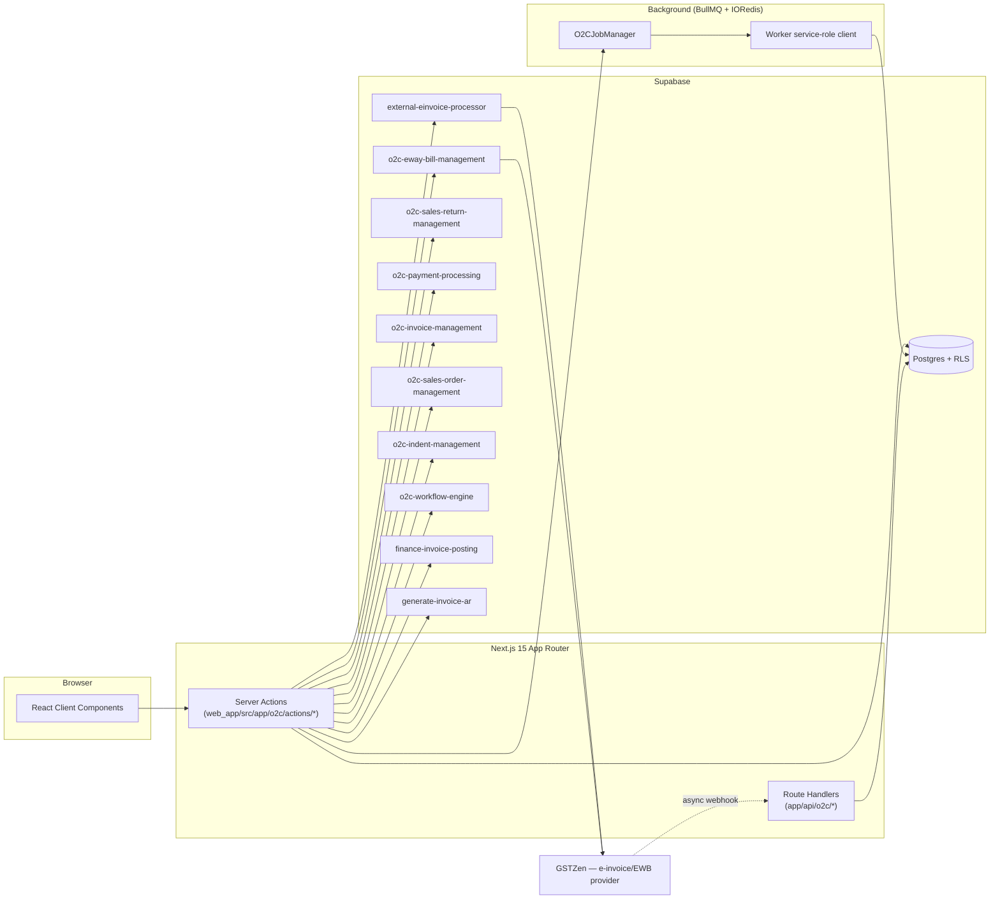
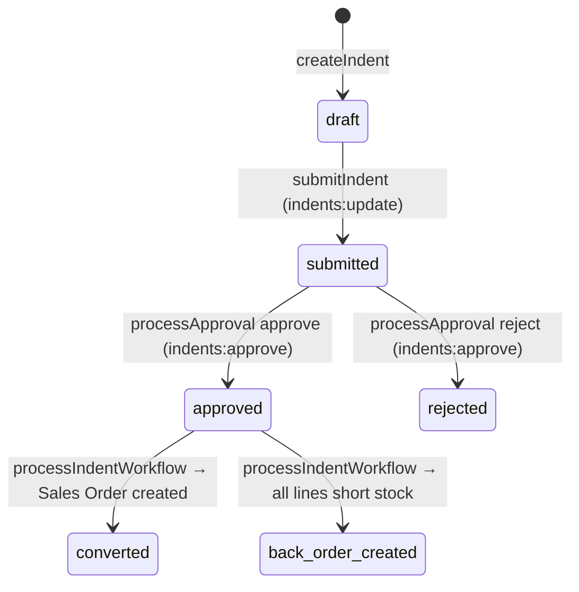
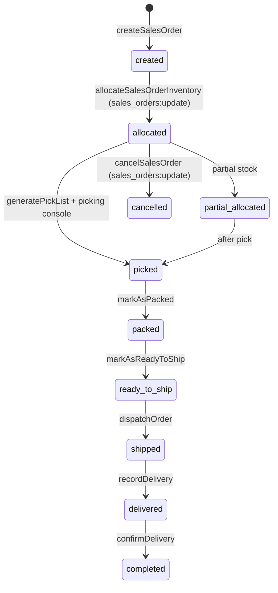
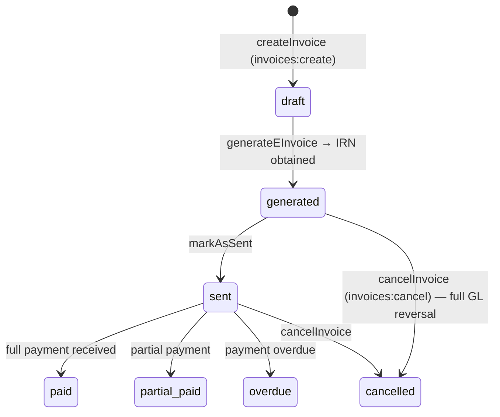
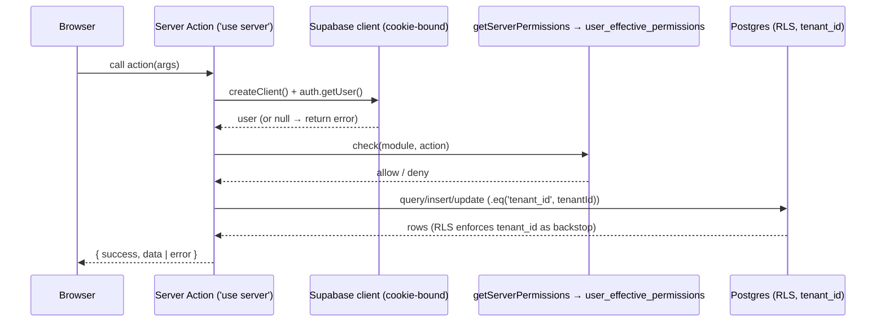
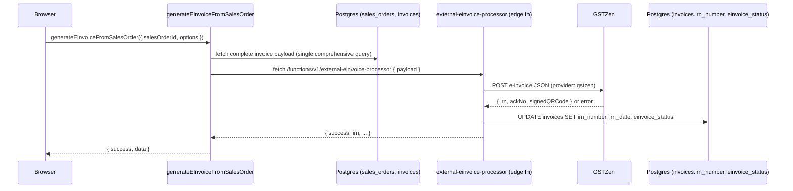
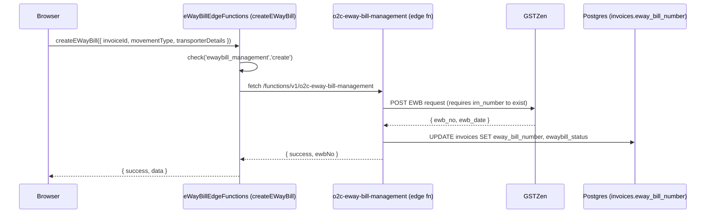
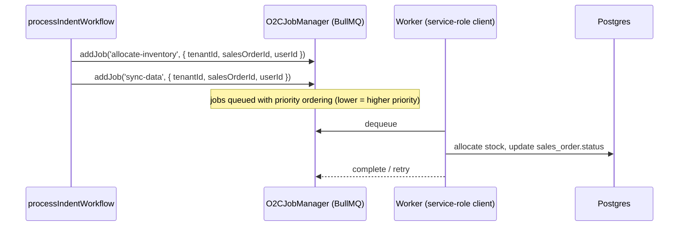

# Order to Cash (O2C) — Developer Guide

> **Verified:** 2026-06-17 against `web_app/src/app/o2c`, `daee-production/supabase/functions`, staging DB.
> **Routes:** `/o2c` and all sub-routes — `/o2c/indents`, `/o2c/sales-orders`, `/o2c/invoices`, `/o2c/eway-bills`, `/o2c/payments`, `/o2c/sales-returns`, `/o2c/inventory`, `/o2c/production`, `/o2c/reports`, `/o2c/audit`, `/o2c/jobs`, `/o2c/transport`, `/o2c/zones`, `/o2c/back-orders`
> **Platform architecture:** [Developer Guides README](./README.md)

---

## Change Log

| Version | Date | Author | Summary |
|---|---|---|---|
| 1.0 | 2026-06-17 | Platform Eng | Initial enterprise guide — lifecycle, API surface, compliance controls, risk table, RACI |
| 1.1 | 2026-06-17 | Platform Eng | Added §14 Test Automation & Validation; clarified 90-day overdue block known gap (hard block live; Sales-Head override unmerged, DAEE-769); fixed Mermaid sequence syntax (semicolons in message text) |

---

## Glossary

| Term | Definition |
|---|---|
| **Indent** | A dealer's demand document — the entry point for every O2C transaction. |
| **IRN** | Invoice Reference Number — issued by the IRP (Invoice Registration Portal) when an e-invoice is registered under Rule 48(4) CGST Rules, 2017. |
| **IRP** | Invoice Registration Portal — the government system operated by GSTN/NIC where e-invoices are registered and IRNs are issued. |
| **E-Way Bill (EWB)** | Electronic document required for movement of goods above a threshold value, governed by Rule 138, CGST Rules, 2017. |
| **GSTR-1** | Monthly/quarterly return of outward supplies under the CGST Act; all invoices and credit notes flow into this return. |
| **EPD** | Early Payment Discount — a discount offered to a dealer who pays within a defined window; triggers an automatic credit note (CCN). |
| **GRN** | Goods Receipt Note — a record of goods received from a supplier (P2P context). In O2C, the equivalent is the delivery confirmation. |
| **CCN** | Customer Credit Note — issued against a sales invoice (return or EPD). |
| **TCN** | Tenant Credit Note — internal credit note type (context-dependent). |
| **COA** | Chart of Accounts — all GL posting in O2C resolves ledger accounts dynamically via **posting profiles** (never hardcoded). |
| **Posting profile** | A per-module GL account mapping table; resolved at posting time via `resolveGL` / `resolveMultipleGL`. |
| **RLS** | Row-Level Security — Postgres policy enforcing `tenant_id` isolation on every table. |

---

## 1. Overview

The O2C module covers the full sales fulfilment cycle: **demand capture (Indents) → approval → fulfilment (Sales Orders + picking) → compliant invoicing (E-Invoice/IRN + E-Way Bill) → collection (Cash Receipts/EPD) → adjustments (Sales Returns/Credit Notes)**.

It is the largest module in the platform. It owns or writes to:
`indents`, `indent_items`, `sales_orders`, `sales_order_items`, `invoices`, `invoice_items`, `credit_memos`, `credit_memo_lines`, `payments`/`cash_receipts`, `sales_return_orders`, `sales_return_order_items`, and inventory/warehouse tables.

GL effects flow to `journal_entries` via **posting profiles**. Sales data flows to **GSTR-1** reports. E-Invoice and E-Way Bill data flows to GSTZen.

---

## 2. Architecture

The module uses all four layers of the DAEE platform:

---

## 3. Application Lifecycle and State Machines

### 3.1 Indent Lifecycle

**Key controls on `approved → converted`:**
- 90-day overdue invoice check runs at approval time (in `processApproval.ts`). If the dealer has any invoice created ≥90 days ago with an outstanding balance, approval returns a hard error. There is no Sales Head override path visible in the current `processApproval.ts` code (see Known Gaps §12).
- Stock availability check runs at approval; insufficient stock sets `requiresConfirmation: true` (soft warning, not a hard block — UI shows "Approve Anyway").

### 3.2 Sales Order Lifecycle

E-Invoice generation is gated: Sales Order status must be in `{picked, packed, ready_to_ship}` AND no existing invoice AND dealer not credit-blocked.

### 3.3 Invoice Lifecycle

### 3.4 Sales Return Lifecycle

Sales return is fully orchestrated by the `o2c-sales-return-management` edge function (server action is a thin proxy). The return order creates a Credit Note (CCN) and reverses stock + GL.

---

## 4. Request Lifecycle — Key Flows

### 4.1 Standard Server Action Path (e.g., createIndent)

### 4.2 E-Invoice Generation (Sales Order → GSTZen → IRN)

**Note:** `external-einvoice-processor` also supports `meon` and `zoop` providers; default is `gstzen`.

### 4.3 E-Way Bill Creation (Invoice → GSTZen → EWB)

**Gate:** EWB creation requires `invoice_type='full'` AND `irn_number` exists AND `ewaybill_required=true` AND no existing EWB. Hidden for IWT/job-work invoices.

### 4.4 Background Job Path (e.g., inventory allocation after process workflow)

---

## 5. Code Map

| Concern | File(s) |
|---|---|
| Module pages | `app/o2c/{page.tsx, layout.tsx}` |
| Indent pages | `app/o2c/indents/{page.tsx, [id]/page.tsx, create/}` |
| Sales order pages | `app/o2c/sales-orders/{page.tsx, [id]/page.tsx}` |
| Invoice pages | `app/o2c/invoices/{page.tsx, [id]/page.tsx, components/InvoiceDetailsContent.tsx}` |
| Sales returns pages | `app/o2c/sales-returns/{page.tsx, [id]/page.tsx, new/, components/}` |
| Payments | `app/o2c/payments/` |
| Back orders | `app/o2c/back-orders/` |
| Reports | `app/o2c/reports/` |
| Audit | `app/o2c/audit/` |
| Transport | `app/o2c/transport/` |
| **All server actions** | `app/o2c/actions/*.ts` (~100 files — see §6) |
| Invoice-specific actions | `app/o2c/invoices/actions/recordPayment.ts` |
| Sales return actions | `app/o2c/sales-returns/actions/{returnOrderActions.ts, exportSalesReturns.ts}` |
| O2C types | `app/o2c/types/types.ts` |
| Utilities | `app/o2c/utils/{gst-calculator.ts, pricingCalculations.ts}` |
| Job manager | `lib/jobs/o2c-job-manager.ts` |
| Edge functions | `supabase/functions/{external-einvoice-processor, o2c-eway-bill-management, o2c-sales-return-management, o2c-invoice-management, o2c-payment-processing, o2c-sales-order-management, o2c-indent-management, o2c-workflow-engine, finance-invoice-posting, generate-invoice-ar, cancel-einvoice-gstzen, einvoice-data-transformer, fast-invoice-worker, debit-note-einvoice, o2c-address-management, o2c-phase3-einvoice-automation}` |

---

## 6. API Surface (Endpoint-Generation Source)

> Generators must enumerate all three surfaces: server actions (`app/o2c/actions/`), route handlers (`app/api/`), and edge functions. Missing any surface will result in incomplete coverage.

### 6.1 Indent Operations

| Operation | Type | Permission | Input (key) | Output | Tables | Notes |
|---|---|---|---|---|---|---|
| `createIndent` | server action | `indents:create` | dealer_id, items[], warehouse_id | `{success,data,indent_id}` | `indents`, `indent_items` | GST auto-calculated; pricing from price list |
| `updateIndent` | server action | `indents:update` | indentId, patch | `{success}` | `indents`, `indent_items` | |
| `updateIndentItems` | server action | `indents:update` | indentId, items[] | `{success}` | `indent_items` | |
| `updateIndentDiscount` | server action | `indents:update` | indentId, discount | `{success}` | `indents` | |
| `recalculateIndentItemGST` | server action | `indents:update` | indentId | `{success}` | `indent_items` | |
| `processApproval` | server action | `indents:approve` (for approve), `indents:update` (for escalate) | indentId, action (approve\|reject\|escalate), comments, warehouseId | `{success}` or `{requiresConfirmation}` for stock warning | `indents`; `log_o2c_operation` RPC | 90-day overdue block (hard); stock warning (soft) |
| `approveIndentWithDiscount` | server action | `indents:approve` | indentId, discountData | `{success}` | `indents`, `indent_items` | Approval with price negotiation |
| `processIndentWorkflow` | server action | `indents:update` | indentId | `{success}` | `indents → converted`; enqueues `allocate-inventory`, `sync-data` jobs | Creates SO; out-of-stock lines → back orders |
| `getIndents` / `getIndentsEnhanced` | server action | `indents:read` | filters, pagination | `{success,data}` | `indents`, `indent_items` | |
| `getIndentAuditOperations` | server action | `indents:read` | indentId | `{success,data}` | audit log | |
| `exportIndents` | server action | `indents:read` | filters | CSV | `indents` | |
| `createBackOrder` / `createBackOrderWithPriceLock` | server action | `indents:update` | indentId, items[] | `{success}` | `back_orders` | |
| `updateBackOrderStatus` | server action | `indents:update` | backOrderId, status | `{success}` | `back_orders` | |

### 6.2 Sales Order Operations

| Operation | Type | Permission | Input (key) | Output | Tables | Notes |
|---|---|---|---|---|---|---|
| `createSalesOrder` | server action | `sales_orders:create` | indentId, items[] | `{success,data}` | `sales_orders`, `sales_order_items` | Created by processIndentWorkflow (also callable direct) |
| `updateSalesOrder` | server action | `sales_orders:update` | salesOrderId, patch | `{success}` | `sales_orders` | |
| `cancelSalesOrder` | server action | `sales_orders:update` | salesOrderId, reason | `{success}` | `sales_orders → cancelled` | |
| `confirmSalesOrder` | server action | `sales_orders:update` | salesOrderId, skip_credit_check?, override_reason | `{success}` | `sales_orders`; credit hold check | Credit hold override requires `override_reason` |
| `allocateSalesOrderInventory` | server action | `sales_orders:update` | salesOrderId, warehouseId | `{success}` | `sales_orders → allocated`; inventory | |
| `generatePickList` | server action | `sales_orders:read` | salesOrderId | `{success,picklist}` | picklist tables | Opens scan-first picking console |
| `markAsPicked` / `markAsPacked` / `markAsReadyToShip` | server action | `sales_orders:update` | salesOrderId | `{success}` | `sales_orders` | Status progression |
| `dispatchOrder` | server action | `sales_orders:update` | salesOrderId, shipmentDetails | `{success}` | `sales_orders → shipped` | |
| `recordDelivery` | server action | `sales_orders:update` | salesOrderId | `{success}` | `sales_orders → delivered` | |
| `getSalesOrders` / `getSalesOrdersEnhanced` | server action | `sales_orders:read` | filters | `{success,data}` | `sales_orders` | |
| `getSalesOrderAuditOperations` | server action | `sales_orders:read` | salesOrderId | audit log | audit tables | |
| `exportSalesOrders` | server action | `sales_orders:read` | filters | CSV | | |
| `assignWarehouseToSalesOrder` | server action | `sales_orders:update` | salesOrderId, warehouseId | `{success}` | `sales_orders` | |

### 6.3 E-Invoice and Invoice Operations

| Operation | Type | Permission | Input (key) | Output | Tables / External | Notes |
|---|---|---|---|---|---|---|
| `generateEInvoiceFromSalesOrder` | server action | (auth only — no explicit check verified) | salesOrderId, options{ generateEWaybill, provider } | `{success,irn,...}` | `invoices`; `external-einvoice-processor` edge fn → GSTZen | 80% query reduction vs legacy path |
| `createInvoice` | server action | `invoices:create` | salesOrderId, invoiceData | `{success,data}` | `invoices`, `invoice_items` | |
| `updateInvoice` | server action | `invoices:update` | invoiceId, patch | `{success}` | `invoices` | |
| `cancelInvoice` / `cancelInvoiceWithGST` | server action | `invoices:cancel` | invoiceId, reason | `{success}` | `invoices → cancelled`; GL reversal JEs | Full accounting reversal |
| `getInvoices` / `getInvoicesEnhanced` | server action | `invoices:read` | filters | `{success,data}` | `invoices` | |
| `getCompleteInvoiceData` | server action | `invoices:read` | invoiceId | full invoice payload | `invoices`, `invoice_items`, tax, address | Used as pre-flight for e-invoice edge fn |
| `getEInvoicePreviewData` | server action | `invoices:read` | invoiceId | preview payload | | |
| `downloadInvoicePdf` / `generateNormalInvoicePdf` / `generateCustomEInvoicePdf` | server action | `invoices:read` | invoiceId | PDF | | |
| `postInvoiceToGL` | server action | (finance) | invoiceId | `{success}` | `journal_entries` via posting profiles | Never hardcodes COA |
| `fastInvoiceGeneration` | server action | `invoices:create` | | `{success}` | `invoices`; `fast-invoice-worker` edge fn | Performance-optimised path |
| `exportInvoices` | server action | `invoices:read` | filters | CSV | | |
| `getInvoiceAuditOperations` | server action | `invoices:read` | invoiceId | audit log | | |
| `o2c-invoice-management` | edge function | user | invoiceId, action | result | `invoices` | Called from `invoiceEdgeFunctions.ts`; URL: `…/functions/v1/o2c-invoice-management` |
| `external-einvoice-processor` | edge function | user | full invoice payload | `{irn,ackNo,signedQRCode,...}` | `invoices`; GSTZen | Multi-provider (gstzen/meon/zoop); referenced in GSTR-1 Rule 48(4) |
| `cancel-einvoice-gstzen` | edge function | user | invoiceId | `{success}` | `invoices`; GSTZen | 24-hour cancellation window |

### 6.4 E-Way Bill Operations

| Operation | Type | Permission | Input (key) | Output | Tables / External | Notes |
|---|---|---|---|---|---|---|
| `createEWayBill` (in `eWayBillEdgeFunctions.ts`) | server action | `ewaybill_management:create` | invoiceId, movementType, transporterDetails | `{success,ewbNo}` | `invoices`; `o2c-eway-bill-management` edge fn → GSTZen | Requires irn_number |
| `generateEWayBill` | server action | `ewaybill_management:generate` | invoiceId | `{success}` | Same | |
| `updateEWayBill` / `updateEWayBillVehicle` | server action | `ewaybill_management:update` | ewbId, details | `{success}` | `invoices`; edge fn | Part-B / transporter update |
| `cancelEWayBill` | server action | `ewaybill_management:create` or `ewaybill_management:generate` | ewbId, reason | `{success}` | edge fn → GSTZen | 24-hour portal window applies |
| `extendEWayBill` | server action | `ewaybill_management:update` | ewbId, extension | `{success}` | edge fn | |
| `validateEWayBillData` | server action | `ewaybill_management:read` | invoiceId | validation result | | Pre-flight check |
| `getEWayBillByInvoice` / `getEWayBillsForSalesOrder` | server action | `ewaybill_management:read` | invoiceId/salesOrderId | `{success,data}` | `invoices` | |
| `o2c-eway-bill-management` | edge function | user | action, payload | EWB result | `invoices`; GSTZen | URL: `…/functions/v1/o2c-eway-bill-management` |

### 6.5 Payment and Cash Receipt Operations

| Operation | Type | Permission | Input (key) | Output | Tables | Notes |
|---|---|---|---|---|---|---|
| `createPayment` | server action | `payments:create` | invoiceId, amount, early_payment_discount? | `{success}` | `payments`; GL via posting profiles | EPD discount creates CCN automatically |
| `updatePayment` | server action | `payments:update` | paymentId, patch | `{success}` | `payments` | |
| `deletePayment` (unapply) | server action | `payments:delete` | paymentId | `{success}` | `payments` | |
| `applyToInvoices` | server action | `invoices:update` | receiptId, invoiceIds[] | `{success}` | `payments`, `invoices` | Triggers EPD CCN if within window |
| `getPayments` | server action | `payments:read` | filters | `{success,data}` | `payments` | |
| `exportPayments` | server action | `payments:read` | filters | CSV | | |
| `o2c-payment-processing` | edge function | user | action, payload | result | `payments`, `journal_entries` | Handles EPD credit note creation |

### 6.6 Sales Return Operations

| Operation | Type | Permission | Input (key) | Output | Tables / External | Notes |
|---|---|---|---|---|---|---|
| `createReturnOrder` | server action | auth only (no explicit `sales_return_orders:create` check — uses `tenantId` guard) | original_invoice_id, dealer_id, items[] | `{success,data}` | `o2c-sales-return-management` edge fn → `sales_return_orders` | Server validates dealer/invoice ownership cross-check before calling edge fn |
| `getReturnOrders` / `getReturnOrder` | server action | `sales_return_orders:read` | filters / id | `{success,data}` | `sales_return_orders` | |
| `exportSalesReturns` | server action | `sales_return_orders:read` | filters | CSV | | |
| `o2c-sales-return-management` | edge function | user | action, payload | `{success,...}` | `sales_return_orders`, `credit_memos`, inventory, GL JEs | Issues CCN + reverses stock + GL |

### 6.7 Inventory and Warehouse Operations (selected)

| Operation | Type | Permission | Input | Output | Notes |
|---|---|---|---|---|---|
| `getWarehouseStock` / `checkStockAvailability` | server action | `sales_orders:read` | warehouseId, items | stock levels | Called during approval and workflow |
| `addInventory` / `updateInventory` | server action | inventory perms | items | `{success}` | |
| `inventoryAllocations` | server action | `sales_orders:update` | salesOrderId | allocation result | |
| `warehouse-fefo-actions` | server action | warehouse perms | | | FEFO batch selection |
| `qrCodeForInventoryActions` | server action | warehouse perms | | QR code | Scan-first picking |

---

## 7. Data Model

### Key Tables and Status Enums

| Table | Active Status Values | Notes |
|---|---|---|
| `indents` | `draft, submitted, approved, converted, back_order_created, rejected` | `back_order_created` is a sub-state of `converted` when all lines go to back order |
| `sales_orders` | `created, allocated, partial_allocated, picked, packed, ready_to_ship, shipped, delivered, completed, cancelled` | |
| `invoices` | `draft, generated, sent, paid, partial_paid, overdue, cancelled` | `irn_number`, `irn_date`, `einvoice_status`, `eway_bill_number`, `ewaybill_required` are key compliance columns |
| `credit_memos` | per CCN lifecycle | `credit_memo_lines` carry per-line CGST/SGST/IGST/cess + rates + hsn_code (migration `20260408050000`) |
| `sales_return_orders` | return lifecycle | Owned by `o2c-sales-return-management` edge fn |
| `payments` / `cash_receipts` | apply/unapply | `early_payment_discount` column on `payments` |

### Key Compliance Columns on `invoices`

| Column | Purpose |
|---|---|
| `irn_number` | IRN issued by IRP via GSTZen (Rule 48(4) CGST Rules) |
| `irn_date` | Date of IRN registration |
| `einvoice_status` | Enum including `generated`, `e_invoice_generated`; tracks IRP registration state |
| `eway_bill_number` | EWB number from GSTZen (Rule 138 CGST Rules) |
| `ewaybill_required` | Boolean; controls button visibility; hidden for IWT/job-work invoices |
| `invoice_type` | `full` / `iwt` / job-work; EWB creation gated on `full` only |
| `gl_journal_id` | FK to the GL journal entry created at invoice posting |

### GL Posting

All financial posting in O2C uses **posting profiles** resolved at runtime via `resolveGL` / `resolveMultipleGL`. COA account codes are never hardcoded. Posting profiles exist for: sales invoices, credit notes, cash receipts, EPD discounts, and sales returns. The `postInvoiceToGL` action and `finance-invoice-posting` edge function are the primary posting paths.

### RLS

All O2C tables carry `tenant_id`. Server actions scope all queries explicitly; RLS is the enforcement backstop. The `O2CJobManager` worker uses a service-role client but includes `tenantId` in every job payload as a mandatory field.

---

## 8. Permissions (RBAC)

| Module key | Verbs verified | Controlled operations |
|---|---|---|
| `indents` | `read, create, update, approve, delete` | Full indent lifecycle including approval |
| `sales_orders` | `read, create, update` | SO lifecycle, picklist, allocation |
| `invoices` | `read, create, update, cancel, delete` | Invoice lifecycle; cancel triggers GL reversal |
| `ewaybill_management` | `read, create, generate, update` | EWB create, update, cancel, extend |
| `payments` | `read, create, update, delete` | Cash receipt create/apply/unapply |
| `sales_return_orders` | `read` | List/view returns (create does tenantId check only — see Known Gap §12) |

**Note:** `generatePickList` requires `sales_orders:read` (not `create`), which is intentional — picklist generation is a read-side trigger of the scan-first picking console.

---

## 9. Background Jobs (O2CJobManager / BullMQ)

| Job Type | Enqueued By | Worker Action | Notes |
|---|---|---|---|
| `allocate-inventory` | `processIndentWorkflow` | Allocate stock to new SO | High priority (lower number = higher BullMQ priority) |
| `sync-data` | `processIndentWorkflow` | Sync SO data | |
| `create-sales-order` | workflow triggers | Create SO record | |
| `generate-einvoice` | async paths | E-invoice generation | |
| `generate-custom-einvoice` | custom PDF paths | Custom e-invoice PDF | |
| `generate-iwt-shipping-pack` | IWT flow | Combined E-Invoice + EWB + Delivery Note PDF | |
| `generate-delivery-challan-pack` | IWT same-GST | Delivery Challan + EWB PDF | |
| `generate-van-receipt` | VAN payment | VAN payment receipt PDF | |
| `generate-group-summary-pdf` | Finance reports | Large report PDF (background) | |
| `process-payment` | payment flows | Payment processing | |
| `send-notification` | cross-phase | Dealer/user notifications | Non-blocking; failures are logged but do not halt the workflow |
| `generate-report` | reports | Async report generation | |
| `process-approval` | approval flows | Multi-level approval processing | |
| `generate-transport` | transport | Transport document generation | |
| `update-inventory` | inventory ops | Inventory state updates | |
| `repost-unposted-invoices` | GL recovery (DAEE-405) | Re-post invoices with IRN but missing JE | Recovery job |

**Worker invariant:** every job payload carries `tenantId` and `userId`. The worker uses a service-role Supabase client and emits a `ca130_service_role` audit log entry.

---

## 10. Finance, Audit, and Compliance

### E-Invoice (IRN) — Rule 48(4) CGST Rules, 2017

Notified taxpayers above the aggregate turnover threshold must report invoices to the IRP and obtain an IRN + digitally signed QR code before the invoice is considered valid for GST purposes. DAEE enforces this through:

1. The `generateEInvoiceFromSalesOrder` action → `external-einvoice-processor` edge fn → GSTZen → IRP.
2. The IRN and signed QR code are stored on `invoices.irn_number` and surfaced on the invoice PDF.
3. Cancellation of the e-invoice honours the **24-hour portal window** (GSTZen `cancel-einvoice-gstzen` edge fn). After 24 hours, the IRN cannot be cancelled through the portal.

### E-Way Bill — Rule 138, CGST Rules, 2017

Goods movement above the applicable threshold requires an EWB. DAEE enforces:
1. `ewaybill_required` flag on the invoice; the Create E-Way Bill button is hidden when false.
2. EWB creation requires a valid IRN to exist first (gate in `eWayBillEdgeFunctions.ts`).
3. IWT (intra-warehouse transfer) and job-work invoices are excluded from EWB via `invoice_type` check.
4. Transporter ID must be a valid 15-character GSTIN or TRANSIN.

### GSTR-1 — Outward Supply Return

All sales invoices and credit/debit notes posted through the O2C module flow to the GSTR-1 report. Key path: `invoice_items` (source of truth for tax amounts) → `credit_memo_lines` (with per-line CGST/SGST/IGST/cess columns added by migration `20260408050000`) → GSTR-1 fast-path SUMs.

### GL Integrity

Every financial event (invoice create, receipt apply, EPD CCN, return CCN, invoice cancel) must post a balanced journal entry. The `gl_journal_id` column on `invoices` and related tables is the FK linking the document to its GL record. Invoices with `irn_number` but `gl_journal_id IS NULL` are recoverable via the `repost-unposted-invoices` job.

### Audit

All workflow transitions are logged via `supabase.rpc('log_o2c_operation', {...})`. Notification failures are explicitly non-blocking (logged, never fatal). The worker emits `ca130_service_role` audit entries for all background operations.

### Compliance Control-to-Regulation Traceability

| Control | Regulation | System Behaviour | Evidence |
|---|---|---|---|
| IRN required before invoice is final | Rule 48(4) CGST Rules, 2017 | E-Invoice generation gates SO status at `{picked,packed,ready_to_ship}` | `generateEInvoiceFromSalesOrder.ts` |
| E-Invoice 24-hour cancellation window | Rule 48(4) + IRP portal rules | `cancel-einvoice-gstzen` enforces portal window; after 24h, portal rejects | `cancel-einvoice-gstzen` edge fn |
| E-Way Bill for goods movement | Rule 138 CGST Rules, 2017 | `ewaybill_required` flag + `invoice_type='full'` gate | `eWayBillEdgeFunctions.ts` |
| Transporter GSTIN validity | Rule 138 | GSTIN or TRANSIN validation in EWB creation flow | edge fn validation |
| GSTR-1 reporting | CGST Act — outward supply | Invoice/credit-note data flows to GSTR-1; HSN, UOM, rate columns on `invoice_items` and `credit_memo_lines` | GSTR-1 report queries |
| Dealer overdue block | Operational credit control | 90-day hard block in `processApproval.ts`; no override in current code (see Known Gaps) | `processApproval.ts:168–221` |

---

## 11. Security and Tenant Isolation

- All O2C tables carry `tenant_id`; every server action retrieves it from `profiles` after `getUser()`.
- RLS enforces `tenant_id` as a second layer — server-side scoping is the first.
- The `O2CJobManager` worker runs with a service-role client. Every job payload carries `tenantId` as a mandatory field (enforced in `O2CJobData` type). No job may operate without this.
- EWB and E-Invoice edge functions receive the user's Supabase JWT; GSTZen API keys are kept as edge function secrets (not exposed to the browser or server action layer).
- The sales return `createReturnOrder` server action performs an explicit cross-validation (dealer_id × invoice_id × tenant_id) before calling the edge function — prevents crafted requests from pairing a mismatched dealer/invoice.
- Credit hold override (`confirmSalesOrder`) requires an explicit `override_reason` string; stored on the SO record.
- Notification failures (`notifyTenantUsers`) are non-blocking by design — they cannot cause a financial action to silently fail.

---

## 12. Known Gaps and Open Items

1. **90-day overdue block — hard block live; Sales-Head override is unmerged (DAEE-769):**
   In the live path (verified on branch `pavan/DAEE-629`, 2026-06-17), `processApproval.ts:168–221` returns a hard error if the dealer has any invoice unpaid for 90+ days; the only override parameter is `skipStockCheck` (stock warning only — no `override_reason`/`sales_head_override` for the overdue block). The **tenant-configurable window + Sales-Head override with a mandatory, audited reason IS implemented under DAEE-769**, but it is **not merged** — it lives on branch `pavan/DAEE-769` (`lib/o2c/indent-overdue-policy.ts`, `evaluate-dealer-overdue.ts`, `app/o2c/actions/getDealerOverdueForIndent.ts`, plus override wiring in `processApproval.ts`/`workflowIntegration.ts`). **Until DAEE-769 ships, the override must not be documented as live behaviour** — the customer guide now describes the hard block as current and flags the override as planned. Follow-up: confirm the DAEE-769 merge/release status and update both guides when it lands.

2. **`sales_return_orders:create` permission not enforced (verify):**
   `createReturnOrder` in `returnOrderActions.ts` does not call `check('sales_return_orders','create')` — it uses a `tenantId` guard only. All read operations check `sales_return_orders:read`. This means any authenticated user with a valid `tenantId` can create a return order. Confirm whether this is intentional (open-to-all-tenant-users design) or a missing permission gate.

3. **`generateEInvoiceFromSalesOrder` — no explicit permission check verified:**
   The action authenticates (`getUser()` + `profiles.tenant_id`) but no `check('invoices','create')` or similar call was found in the first 80 lines of `generateEInvoiceFromSalesOrder.ts`. Verify that permission enforcement is present (possibly deeper in the function or in the edge fn itself) before exposing as a public API endpoint.

4. **E-Invoice 24-hour cancellation vs. EWB sync:**
   `cancel-einvoice-gstzen` cancels the IRN but the current code does not automatically cancel the associated EWB. If the EWB was issued before the IRN cancellation, it remains active on the GSTZen/NIC portal. This is a known compliance risk — advise operators to cancel the EWB first, then cancel the e-invoice.

5. **Back-order status tracking:**
   `back_order_created` is a distinct `indent.status` value that indicates all lines went to back order. The fulfilment path when stock replenishes is not fully documented; confirm the workflow for converting a back order back into a Sales Order.

6. **O2C report data completeness:**
   12 reports are available. Their data completeness depends on GL posting integrity — specifically, invoices with missing `gl_journal_id` will undercount financial totals. The `repost-unposted-invoices` job recovers these but must be monitored.

---

## 13. RACI

| Activity | Sales (TM) | Regional Manager | Approver/Sales Head | Finance | Warehouse Ops | Admin | DAEE Platform |
|---|---|---|---|---|---|---|---|
| Create and submit indent | R/A | C | — | — | — | — | S |
| Approve indent | I | C | R/A | — | — | — | S |
| Process workflow (create SO) | R | — | A | — | — | — | S |
| Allocate stock / generate picklist | — | — | — | — | R/A | — | S |
| Pick and pack | — | — | — | — | R/A | — | S |
| Generate E-Invoice (IRN) | R | — | A | C | — | — | S |
| Create E-Way Bill | R | — | — | C | C | — | S |
| Record payment / apply EPD | — | — | — | R/A | — | — | S |
| Process sales return / CCN | — | — | C | R/A | C | — | S |
| Cancel invoice (GL reversal) | — | — | A | R | — | — | S |
| Monitor GL integrity / repost | — | — | — | R | — | A | S |
| Manage posting profiles | — | — | — | C | — | R/A | S |

*R = Responsible, A = Accountable, C = Consulted, I = Informed, S = System executes*

---

## 14. Test Automation & Validation

O2C is the most-covered module in this repository's Playwright-BDD suite. When changing an O2C flow,
validate against — and update — the corresponding test-case doc and feature file (these are the
single source of truth for TC IDs; do not duplicate lists).

| Area | Test IDs | Source of truth |
|---|---|---|
| Indent → SO → Invoice (full path) | `O2C-INDENT-TC-001…020` | `docs/modules/o2c/test-cases.md`, `docs/modules/o2c/O2C-Indent-SO-Invoice-Test-Scenarios-For-Review.md` |
| Sales Orders | `O2C-SO-TC-*` | `docs/modules/o2c/test-cases.md` |
| Invoices / E-Invoice | `O2C-INV-TC-*` | `docs/modules/o2c/test-cases.md` |
| Cash Receipts | `O2C-CR-TC-*` | `docs/modules/o2c/test-cases.md` |
| Reports (Hierarchical Sales / Product Sales) | `O2C-HSR-TC-*`, `O2C-HPS-TC-*` | `docs/modules/o2c/reports/*/test-cases.md` |

- **Registry of record:** `docs/test-cases/TEST_CASE_REGISTRY.md`. **Feature files:** `e2e/features/o2c/*`.
- **Validation focus for changes:** the 90-day overdue **hard block** (negative path), stock-shortfall →
  back-order creation, E-Invoice/E-Way Bill happy + GSTZen-failure paths, and GL-posting assertions
  (sub-ledger ↔ GL) for invoice/receipt/return/cancel events.
- **Known coverage gap:** the DAEE-769 Sales-Head overdue override is unmerged, so there is no E2E for it
  yet — add `O2C-INDENT-TC` cases for the override + audit trail when DAEE-769 ships (§12).
