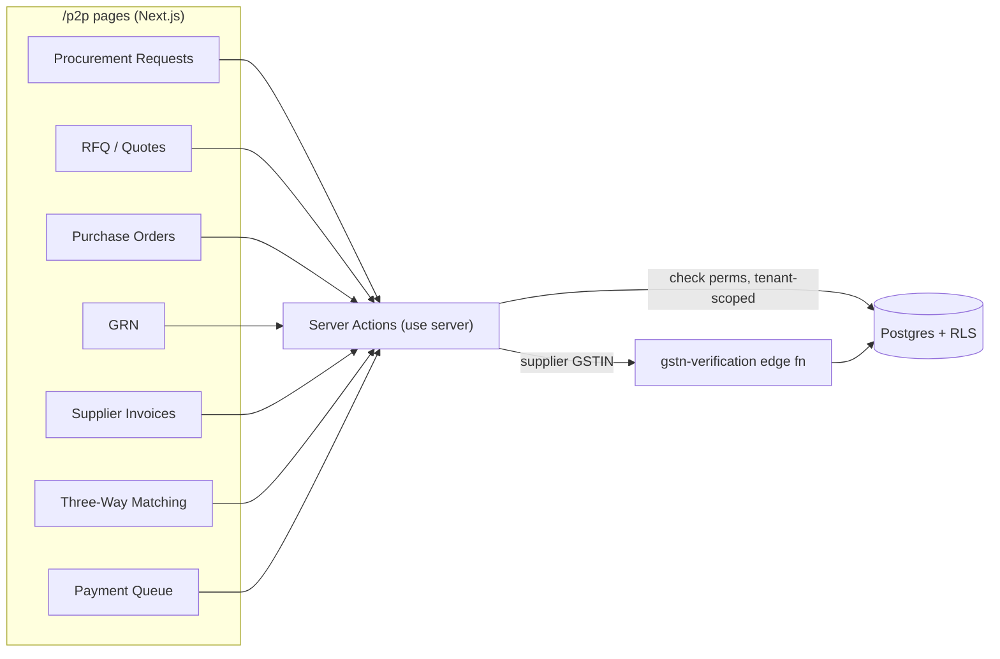
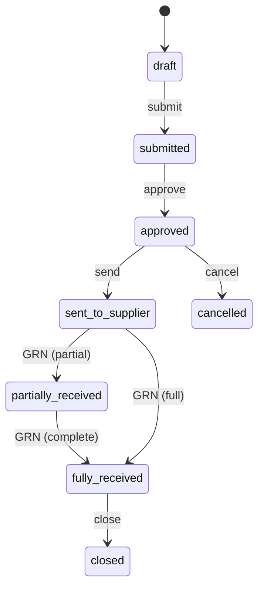
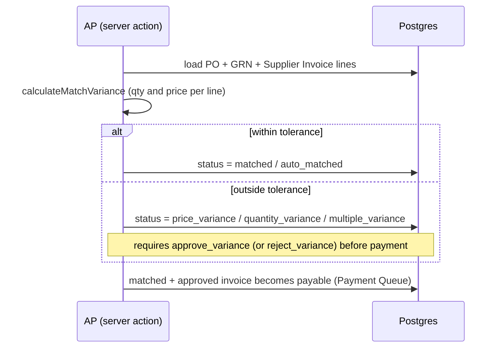

# Procure to Pay (P2P) — Developer Guide

> **Verified:** 2026-06-17 against `web_app/src/app/p2p` + staging DB.
> **Routes:** `/p2p` and sub-routes — `/p2p/procurement-requests`, `/p2p/rfq`, `/p2p/quotes`, `/p2p/purchase-orders`, `/p2p/grn`, `/p2p/supplier-invoices`, `/p2p/matching`, `/p2p/payment-queue`, `/p2p/suppliers`, `/p2p/suppliers/categories`, `/p2p/approval-workflow`, `/p2p/reports/{gstr2,gstr3b}`.
> **Platform architecture:** [Developer Guides README](./README.md)

---

## Change Log

| Version | Date | Author | Summary |
|---|---|---|---|
| 1.0 | 2026-06-17 | Platform Eng | Initial enterprise guide — lifecycle, API surface, three-way matching, compliance (ITC/RCM/TDS/MSME), RBAC, RACI, test automation |

---

## Glossary

| Term | Definition |
|---|---|
| PR | Procurement Request — internal request to buy materials/services |
| RFQ | Request for Quotation — invitation to suppliers to quote |
| PO | Purchase Order — committed order to a supplier |
| GRN | Goods Receipt Note — record of goods received against a PO (with quality check) |
| Three-way match | Reconciliation of PO ↔ GRN ↔ Invoice before payment |
| ITC | Input Tax Credit — GST paid on purchases, creditable against output GST |
| RCM | Reverse Charge Mechanism — recipient pays GST instead of supplier |
| TDS | Tax Deducted at Source (income tax) on supplier payments |
| MSME | Micro, Small & Medium Enterprise — triggers the 45-day payment rule |
| RLS | Row-Level Security (Postgres tenant isolation) |

---

## 1. Overview
P2P covers the buy-side lifecycle: **Procurement Request → (RFQ → Quotes → award) → Purchase Order →
Goods Receipt → Supplier Invoice → Three-Way Match → Payment**. It is the procurement counterpart to
[O2C](./o2c.md). Goods receipts feed inventory; approved/posted invoices create AP liabilities and
**input tax credit**; matching is the spend control before payment. Suppliers are the shared master.

## 2. Architecture

P2P uses **server actions** for all writes (no P2P-specific Next route handlers in the main flow). The
only external integration is `gstn-verification` (supplier GSTIN). GL posting uses posting profiles
(`vendor_posting_groups`).

## 3. Lifecycle and State Machines

### 3.1 Purchase Order

### 3.2 Procurement Request & RFQ
- **PR:** `draft → submitted → approved → converted_to_rfq | converted_to_po` (or `rejected`, `cancelled`).
- **RFQ:** `draft → issued → under_evaluation → selection_pending → selection_approved → converted_to_po` (or `declined`, `cancelled`).
- **Quote:** `draft → submitted → under_evaluation → shortlisted → selected | accepted` (or `rejected`, `withdrawn`).

### 3.3 GRN, Supplier Invoice, Matching
- **GRN:** `pending → received | partially_received → approved` (quality) → `completed` (or `rejected`, `cancelled`). Quality approval calls `updatePOStatusAfterReceipt`, which updates the PO's `quantity_received` and moves it to `partially_received` / `fully_received`.
- **Supplier invoice:** `draft → approved → posted → partially_paid → paid | paid_in_full` (or `cancelled`); `matched` once three-way match clears.
- **Matching:** `pending → auto_matched | matched` when within tolerance, else `price_variance | quantity_variance | multiple_variance → variance_approved | variance_rejected`.

## 4. Three-Way Match — control flow

Tolerance thresholds are evaluated in the matching logic (`calculateMatchVariance` / `autoMatchDocuments`); the exact tolerance values are configuration/code — confirm before asserting a specific percentage.

## 5. API Surface (Endpoint-Generation Source)
Server actions under `app/p2p/**/actions/*`. All follow `getUser() → check(module, action) → tenant-scoped DB`.

| Action | Permission | Notes |
|---|---|---|
| `createProcurementRequest` / `approveProcurementRequest` | `procurement_requests:create` / `:approve` | PR raise + approve |
| `convertProcurementRequestToPO` / `createRFQFromPR` | `procurement_requests:update` / `rfq:*` | branch to PO or sourcing |
| `createRFQ` / `closeRFQ` / `getApprovedPRsForRFQ` | `rfq:create|update|read` | RFQ lifecycle |
| `createSupplierQuote` / `createComparisonSheet` / `evaluateQuote` / `approveQuoteSelection` | `supplier_quotes:create|update|evaluate` | quotes + award |
| `createPurchaseOrder` / `createPOFromRFQ` / `approvePurchaseOrder` / `closePurchaseOrder` | `purchase_orders:create|approve|update` | PO lifecycle; `exportPurchaseOrderPDF` |
| `createGRNFromPO` / `approveGRNQuality` | (GRN perms) | receipt + quality; calls `updatePOStatusAfterReceipt` |
| `createSupplierInvoice` / `approveSupplierInvoice` / `cancelSupplierInvoice` | `supplier_invoices:create|approve|update|delete` | AP capture; cancel reverses GL |
| `autoMatchDocuments` / `calculateMatchVariance` / `createMatchingRecord` / `closeMatchingRecord` / `approveVariance` | `po_grn_invoice_matching:create|read|approve_variance|reject_variance` | three-way match |
| `getPaymentQueue` / `bulkMarkForPayment` / `getPaymentQueueSummary` | (payment-queue perms) | settlement queue |
| `createSupplier` / `updateSupplier` / `deleteSupplier` / `addBankAccount` / `createGSTVerification` | `suppliers:create|update|delete`, `supplier_bank_accounts:*` | supplier master + `gstn-verification` |
| `createApprovalWorkflow` / `getApplicableWorkflows` | `approval_workflow_config:*` | multi-level approvals |

## 6. Data Model
**Tables:** `procurement_requests`(+`_lines`), `rfq_headers`(+`_lines`,`_suppliers`), `quote_comparison_sheets`, `supplier_quotes`(+`_lines`), `purchase_orders`(+`_lines`), `supplier_grns`(+`_items`), `supplier_invoices`(+`_lines`,`_import_rows`,`_match_overrides`), `supplier_credit_notes`, `suppliers`, `supplier_bank_accounts`, `supplier_categories`, `supplier_performance`, `vendor_posting_groups`.
> **Source-of-truth note:** P2P GRNs use **`supplier_grns`** / **`supplier_grn_items`** (NOT the O2C `goods_receipt_notes`). Do not mix the two.

## 6a. Edge functions (verified wiring)
**Wired** (statically referenced from web_app / sibling functions): `gstn-verification` (wa:4 — supplier
GSTIN validation), `back-order-processor` (wa:3). Supplier-invoice AP posting reuses the O2C/finance
posting path (`finance-invoice-posting`).

> **Verification note — present but not statically referenced** (invocation likely cron/background or
> dynamic — **coverage to confirm**): `grn-items-processor`, `supplier-performance-analyzer`. The GRN and
> supplier-performance flows documented here run through server actions on `supplier_grns` /
> `supplier_performance`, not these functions.

## 7. Permissions (RBAC)
Per-entity verbs via `check(module, action)`: `procurement_requests`, `rfq`, `supplier_quotes` (+`evaluate`), `purchase_orders`, `po_grn_invoice_matching` (+`approve_variance`/`reject_variance`), `supplier_invoices`, `suppliers`, `supplier_bank_accounts`, `approval_workflow_config`. Tenant-isolated via RLS (`tenant_id`).

## 8. Finance, Audit & Compliance
P2P is compliance-heavy. Connect each control to its risk + system behaviour + evidence.

### Input Tax Credit (ITC) — §16, CGST Act, 2017
ITC on purchases is creditable only when conditions are met (valid tax invoice, goods/services received, supplier filed). The **GSTR-2B reconciliation** and **GSTR-3B ITC** views (`/p2p/reports/gstr2`, `gstr3b`) support availment/matching. *Risk:* over-claimed/ineligible ITC. *Control:* match purchases to GSTR-2B before claiming.

### Reverse Charge (RCM) — §9(3)/§9(4), CGST Act, 2017
For notified supplies / unregistered suppliers, the recipient pays GST. Supplier tax profile + invoice flags drive RCM treatment.

### TDS (income tax) — §194C/§194I/§194Q, Income-tax Act, 1961
TDS is deducted on supplier payments per the supplier's `tds_section`/`tds_rate` (honouring any lower-deduction certificate). *Control:* supplier tax profile drives deduction.

### MSME 45-day payment — §15, MSMED Act, 2006
Suppliers flagged `msme_registration` are subject to the statutory payment window (and §43B(h) Income-tax disallowance for delayed payment — *verify current applicability*). *Control:* MSME flag surfaces aging/payment priority.

### GL & Audit
Approved/posted supplier invoices post to AP + ITC via posting profiles (`vendor_posting_groups`); cancellations reverse. All actions are tenant-scoped and audited.

### Compliance Control-to-Regulation Traceability
| Control | Risk | System behaviour | Regulation |
|---|---|---|---|
| Supplier GSTIN verification | Fake/inactive vendor, ineligible ITC | `gstn-verification` on create | GST registration (GSTN) |
| Three-way match before pay | Overpayment / fraud | Variance must be approved | Internal financial control |
| **Segregation of duties** | Self-approval / collusion | **Quote selector ≠ approver**; **GRN creator can't mark its invoice for payment**; multi-level approval workflows | Internal financial control |
| GSTR-2B reconciliation | Ineligible ITC claim | 2B match reports | §16 CGST Act / GSTR-2B |
| TDS deduction | Non-deduction penalty | Supplier `tds_section`/`rate` | §194C/I/Q Income-tax Act |
| MSME payment window | Statutory delay | MSME flag + aging | §15 MSMED Act 2006 |

## 9. Security & Tenant Isolation
All P2P data is RLS-scoped by `tenant_id`; server actions independently `check(module, action)` and tenant-scope queries (RLS is the backstop). Supplier bank details are PII — restricted by `supplier_bank_accounts` permissions.

## 10. Known Gaps & Open Items
1. **Three-way match tolerance is code/config-driven** — the exact tolerance values are not asserted here; confirm before documenting a specific percentage.
2. **GRN→PO sync (historical bug, now fixed):** `approveGRNQuality` calls `updatePOStatusAfterReceipt` (DAEE-157), so the PO's received quantity/status updates on quality approval. Documented as resolved; watch for regressions in partial-delivery cases.
3. **RFQ/quote state set is broad** — several near-synonym statuses exist (e.g. `selected`/`accepted`, `pending`/`under_evaluation`); confirm the canonical set with product before building strict state guards.

## 11. RACI
| Activity | Procurement | Approver | Stores | AP (Finance) | Admin | System |
|---|---|---|---|---|---|---|
| Raise/approve PR | R | A | — | — | — | S |
| RFQ → quotes → award | R | A | — | — | — | S |
| Create/approve PO | R | A | — | — | — | S |
| Record GRN + quality | C | — | R/A | — | — | S |
| Capture supplier invoice | — | — | — | R/A | — | S |
| Three-way match / variance | — | A | — | R | — | S |
| Mark for payment | — | A | — | R | — | S |
| Maintain suppliers / categories / workflows | C | — | — | C | R/A | S |

*R = Responsible, A = Accountable, C = Consulted, S = System executes*

## 12. Test Automation & Validation
P2P E2E coverage and supplier-invoice/GRN test assets live under `docs/modules/` and the registry
`docs/test-cases/TEST_CASE_REGISTRY.md`; feature files under `e2e/features/p2p/*` (where present).
**When changing a P2P flow, update the corresponding test-case doc + feature file.** Priority negative
paths to cover: three-way variance (price/qty/multiple) approval+rejection, GRN partial receipt → PO
status, supplier-invoice cancel GL reversal, and supplier GSTIN verification failure.
