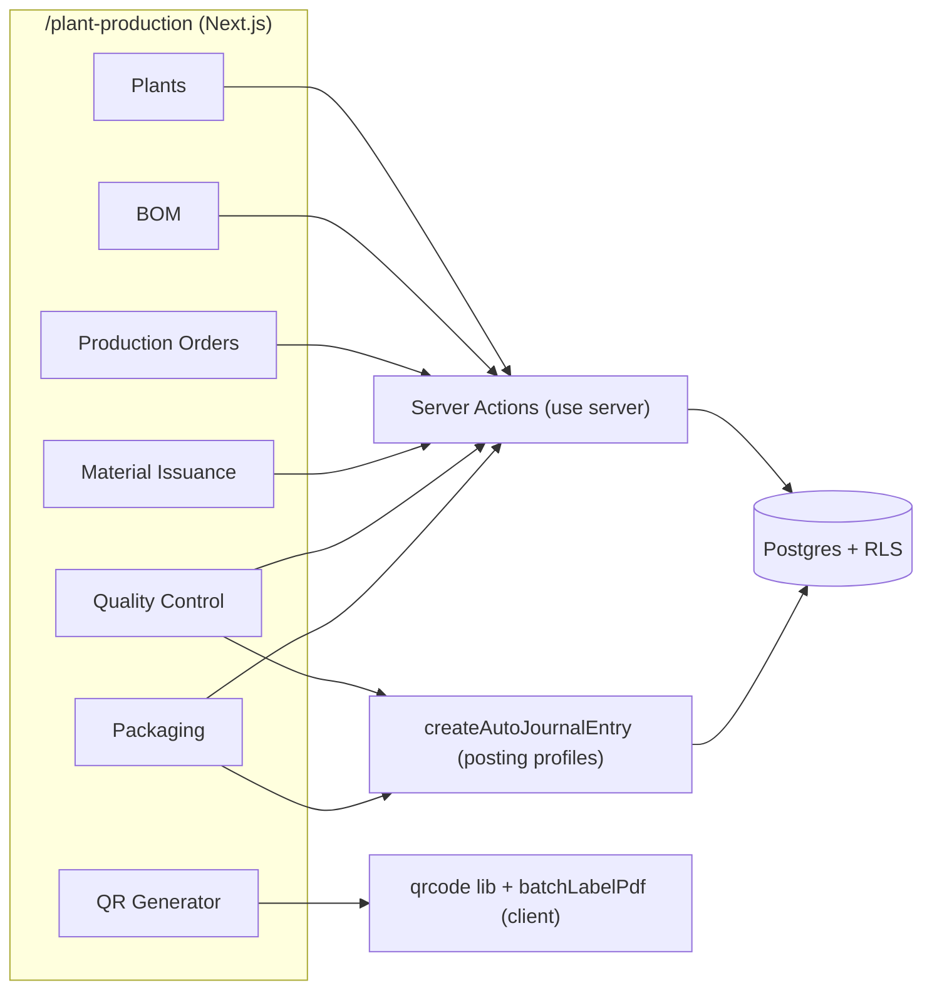
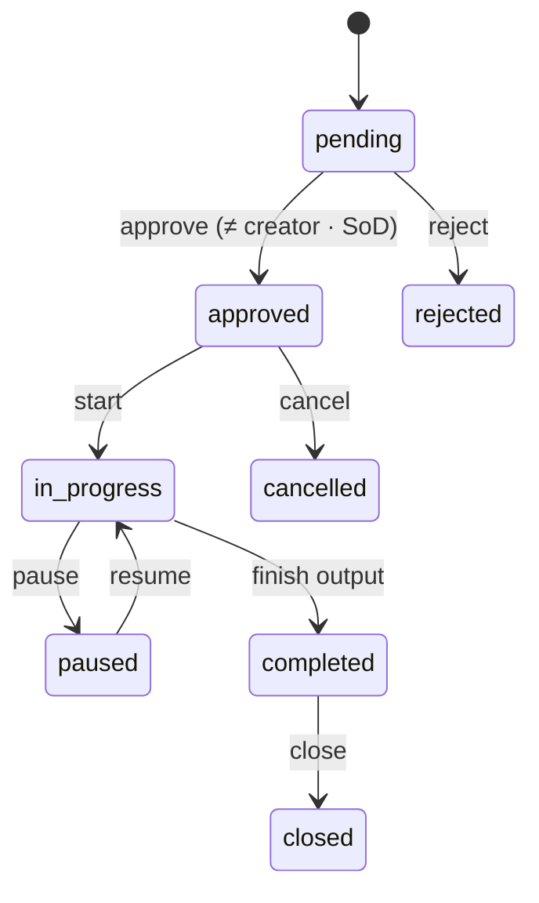
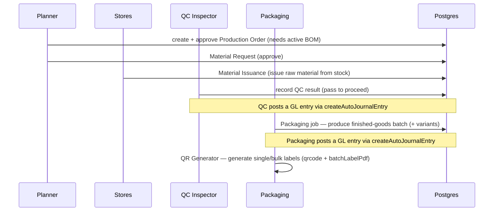

# Plant Production — Developer Guide

> **Verified:** 2026-06-18 against `web_app/src/app/plant-production` + staging DB.
> **Routes:** `/plant-production` and sub-routes — `/plants`, `/bom`, `/planning`, `/work-orders` (+`/approvals`), `/material-requests`, `/material-issuance`, `/quality` (+`/quality-control`), `/packaging`, `/qr-generator`, `/scrap`, `/expiry-alerts`, `/anomalies`, `/posting-profiles`, `/reports/{production-summary,qc-analysis,scrap-analysis}`, `/job-work` (+`/dashboard`).
> **Platform architecture:** [Developer Guides README](./README.md)

---

## Change Log

| Version | Date | Author | Summary |
|---|---|---|---|
| 1.0 | 2026-06-18 | Platform Eng | Initial enterprise guide — manufacturing lifecycle, QR generation, GL posting, RBAC, RACI, test automation |

---

## Glossary

| Term | Definition |
|---|---|
| BOM | Bill of Materials — the recipe (inputs) for a product |
| Production Order | Work order to manufacture a quantity of a product |
| Material Issuance | Raw materials issued from stock to a production order |
| QC | Quality Control check on produced output |
| Finished Goods (FG) | Manufactured output, tracked by batch and variant |
| QR label | Batch/package QR generated for downstream scanning |
| RLS | Row-Level Security (Postgres tenant isolation) |

---

## 1. Overview
Plant Production manages manufacturing: **Plants → BOM → Planning → Production Order → Material
Request/Issuance → Quality Control → Packaging → Finished Goods (+ QR labels)**, with Scrap, Expiry
Alerts, and Anomalies as exception flows. Raw materials come from inventory (P2P); finished-goods QR
labels are scanned in [Warehouse picking](./warehouse-management.md). QC and packaging post to the GL.

## 2. Architecture

QR generation is **client-side** (`qrcode` library; labels via `lib/pdf/batchLabelPdf`). The only edge
functions touched are in the **Job Work** sub-area (`external-einvoice-processor`, `cancel-einvoice-gstzen`).

## 3. Lifecycle and State Machines

### 3.1 Production Order

### 3.2 Other entities
- **BOM:** `draft → under_review → approved → active` (or `inactive`, `obsolete`); versions tracked in `bom_versions`.
- **Material Request:** `pending → approved → partial_issued` (or `rejected`); approval requires a **different user** than the requester (SoD), and material can't be issued until the work order is **approved**.
- **QC:** `pending → passed | failed | rework_required | hold | downgraded`.
- **Packaging:** `draft → material_reserved → in_progress → completed` (or `cancelled`).

## 4. Manufacture → QR Label (key flow)

## 5. API Surface (selected server actions)
Under `app/plant-production/**/actions/*`; all follow `getUser() → check(module, action) → tenant-scoped DB`.

| Area | Actions (representative) | Permission |
|---|---|---|
| BOM | create/submit/approve BOM, version | `plant_production` |
| Production Orders | create / approve / start / complete / close work order | `plant_production` |
| Material | create request / approve / issue | `plant_production` |
| Quality | `finishedGoodsQC` (record result; GL) | `plant_production`, `qc_parameters` |
| Packaging | `packagingManagement` (run job; GL) | `plant_production` |
| QR | `getFinishedGoodsForQR`, `generateQRCodeForBatch`, `generateBulkQRCodes`, `getQRHistory`, `generateManualQRCode`, `backfillQRFromInventory` | `plant_production`, `inventory_barcodes` |
| Scrap | record scrap | `production_scrap` |
| Job Work | job-work orders + e-invoice | `job_work_orders` |

## 6. Data Model
**Tables:** `manufacturing_plant` (+`_assets`, `_licenses`), `bom_header`/`bom_lines`/`bom_versions`,
`production_planning`, `production_schedules`, `production_work_order`,
`work_order_material_request`/`work_order_material_issued`/`work_order_material_approval_history`,
`work_order_finished_goods` (+`_variants`), `packaging_jobs`, `production_scrap_records`,
`production_anomalies`, `production_scans`.
> **Source-of-truth note:** finished goods are tracked by **batch + variant** (`work_order_finished_goods_variants`); QR labels and downstream picking key off the variant/package — keep variant correctness intact (see Warehouse `batchMatch`).

## 7. Permissions (RBAC)
Dominant verb namespace is `plant_production` (most actions), plus `job_work_orders`, `qc_parameters`,
`production_scrap`, `production_scans`, `inventory_barcodes`, `document_attachments`. Tenant-isolated via RLS.

## 8. Finance, Audit & Compliance
- **GL posting:** QC (`finishedGoodsQC`) and packaging (`packagingManagement`) create journal entries via `createAutoJournalEntry` using posting profiles — never hard-coded accounts. Risk: mis-stated WIP/FG cost. Control: posting-profile mapping + simulation.
- **Traceability:** batch + variant + QR + `production_scans` give farm-to-shelf traceability (agri-input compliance). Expiry alerts support shelf-life control.
- **Audit:** material approvals tracked in `work_order_material_approval_history`; all actions tenant-scoped.
- **Segregation of duties:** approving a **work order** or a **material request** requires a **different user** than its creator (no self-approval), enforced server-side. Control against fraud/collusion. Finished-goods posting is gated on **QC completion**.

## 9. Security & Tenant Isolation
All tables RLS-scoped by `tenant_id`; server actions independently `check(module, action)`. QR generation is client-side over tenant-scoped finished-goods data.

## 9a. Edge functions (verified wiring)
**Wired** (statically referenced from web_app / sibling functions): `cancel-einvoice-gstzen`,
`external-einvoice-processor` — used for the **sub-contracted / job-work e-invoice** path, not core
production.

> **Verification finding — the dedicated `plant-production-*` edge-fn suite is NOT statically referenced.**
> `plant-production-setup`, `plant-production-bom-management`, `plant-production-work-orders`,
> `plant-production-material-management`, `plant-production-finished-goods`, `plant-production-analytics`,
> plus `production-planning-engine` and `material-requirements-calculator`, exist in the backend but have
> **zero static references** from web_app or sibling functions. The shipped production flows documented
> here run through **server actions** (`/plant-production/*`), not these functions. Treat the suite as
> **unconfirmed** — it may be invoked via cron/dynamic dispatch, may be planned, or may be dormant.
> **Do not assume it is live** until the invocation path is confirmed with the backend owner.

## 10. Integration Points
- **Warehouse** — QR-labelled finished goods are scanned at picking; variant correctness shared with `batchMatch`.
- **P2P / Inventory** — raw materials issued to orders draw down inventory.
- **Job Work** — sub-contracted production; uses the e-invoice edge functions (`external-einvoice-processor`, `cancel-einvoice-gstzen`).
- **Finance** — QC/packaging postings land in the GL.

## 11. Known Gaps & Open Items
1. **Two QC routes** — `/quality` and `/quality-control` both exist; confirm the canonical one with product (documented `/quality` as primary).
2. **QR for legacy stock** — `backfillQRFromInventory` exists for packages made before QR was standard; confirm coverage so older batches are labelled.
3. **GL posting points** — confirmed at QC and packaging; verify whether material issuance also posts (WIP) before asserting a full cost flow.

## 12. RACI
| Activity | Planner | Plant Head | Stores | QC | Packaging | System |
|---|---|---|---|---|---|---|
| Approve BOM | C | R/A | — | — | — | S |
| Create/approve production order | R | A | — | — | — | S |
| Material request/issue | C | A | R | — | — | S |
| Quality control | — | — | — | R/A | — | S |
| Packaging + QR labels | — | — | — | C | R/A | S |
| Scrap decision | C | A | C | R | — | S |

*R = Responsible, A = Accountable, C = Consulted, S = System executes*

## 13. Test Automation & Validation
Production/QR test assets live under `docs/modules/` and the registry `docs/test-cases/TEST_CASE_REGISTRY.md`;
feature files under `e2e/features/` where present. Priority coverage: BOM approval gate on order creation,
material issue → stock drawdown, QC result branches (pass/fail/rework), packaging → finished-goods batch,
QR single/bulk generation + history, and GL postings for QC/packaging. QR rendering is validated against
the `qrcode` library output; camera scanning of the labels is covered in Warehouse.
