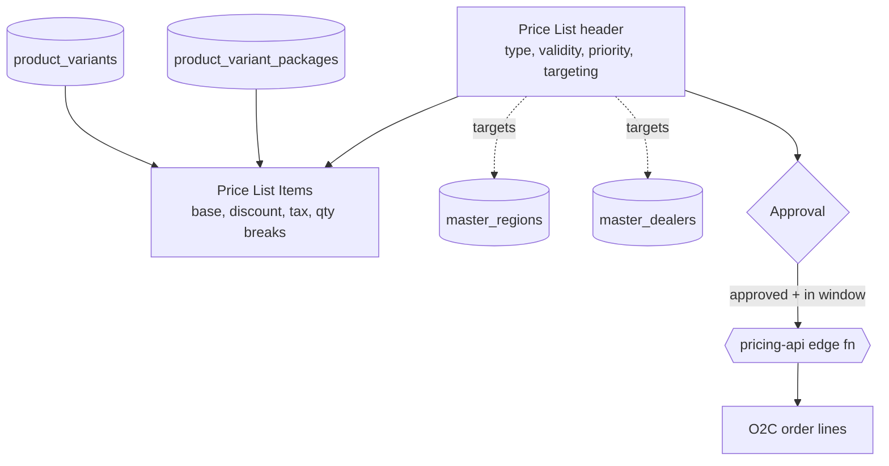
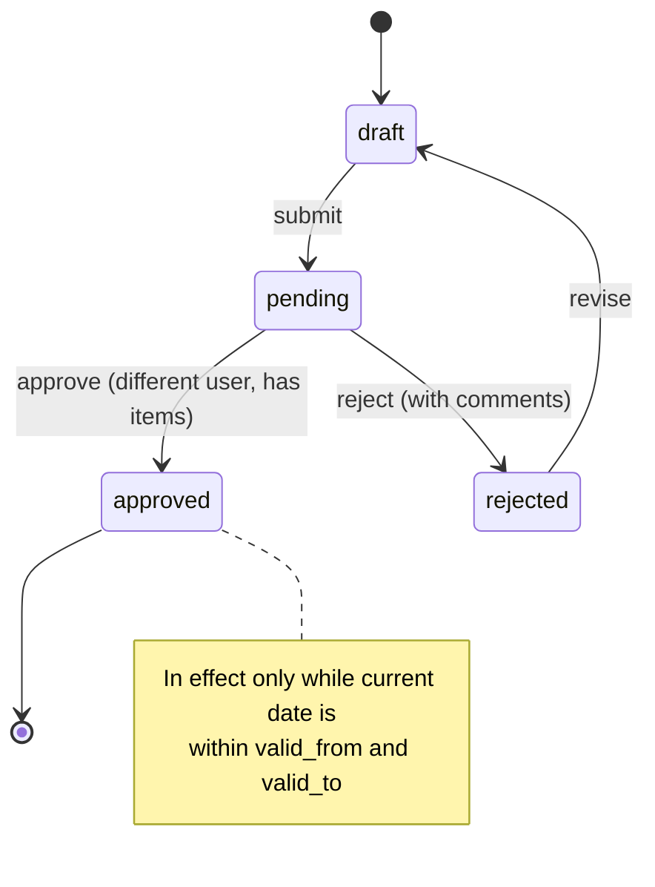
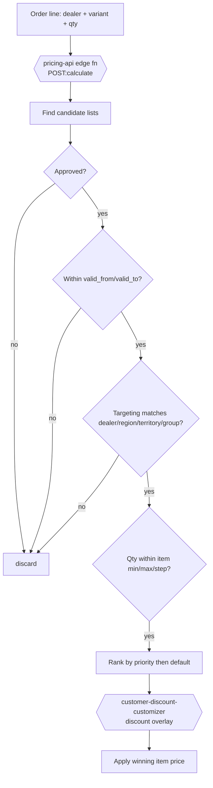

# Price Lists — Developer Guide

> Engineering reference for the pricing master — effective-dated price lists, item pricing, targeting,
> the draft → pending → approved state machine, and the segregation-of-duties control on approval.

## Change Log
| Version | Date | Author | Notes |
|---|---|---|---|
| 1.0 | 2026-06-18 | Platform Engineering | Initial guide — state machine, SoD control, schema, resolution. |

## Glossary
| Term | Meaning |
|---|---|
| **Price list** | A set of priced items with a type, targeting, priority, and a validity window. |
| **Price list item** | A priced product variant/package within a list. |
| **Targeting** | The regions/territories/dealers/customer-groups a list applies to. |
| **Priority** | Tie-breaker when multiple eligible lists could apply. |
| **In effect** | Approved AND current date within `valid_from`/`valid_to`. |
| **SoD** | Segregation of duties — author cannot approve their own list. |

---

## 1. Overview

Price Lists (`src/app/price-lists`) is the pricing master consumed by O2C. A list has a header
(`price_lists`) and items (`price_list_items`). Server actions are gated by
`getServerPermissions().check('price_lists', <op>)` with RLS as the backstop; the module also reads
`products`, `product_variants`, `product_variant_packages`, `master_regions`, and `master_dealers` for
targeting and item selection.

---

## 2. Architecture

---

## 3. Approval state machine

Approval guard (verified in `approvePriceList`): status must be `pending`; `created_by` must not equal
the approver; the list must have at least one active item; tenant must match. Approval stamps
`approved_by`/`approved_at`/`approval_comments`.

---

## 4. Price resolution (consumer side)

Price resolution is performed by the **`pricing-api` edge function** (`POST /functions/v1/pricing-api`,
`POST:calculate`) — the authoritative pricing engine shared with the Products module. Customer/dealer
self-managed discount overlays are handled by the **`customer-discount-customizer`** edge function.

> **Verification note** The exact resolution order is reconstructed from the data model (priority,
> default, validity, targeting, quantity breaks). Confirm the precise tie-break against the O2C pricing
> path before relying on edge ordering.

---

## 5. Data model (verified tables)

| Table | Role | Key fields |
|---|---|---|
| `price_lists` | List header | type, `base_price_list_id`, `valid_from`/`valid_to`, `is_active`, targeting arrays (regions/territories/dealers/customer groups), `min_order_value`, `priority`, `is_default`, `auto_apply`, `approval_status`, `approved_by`/`approved_at`/`approval_comments`, tenant. |
| `price_list_items` | Priced item | `product_variant_id`, `package_id`, `base_price`, `discount_percentage`, `fixed_discount`, `final_price`, min/max/step qty, `tax_percentage`, `cess_percentage`, `tax_inclusive`, `price_with_tax`, `item_valid_from`/`item_valid_to`, margin. |

Types: standard · promotional · customer_specific · volume_discount · seasonal · distributor · institutional.

---

## 6. Permissions
`getServerPermissions().check('price_lists', <op>)` with ops `create`/`read`/`update`/`delete`/`approve`.
Reads also touch `products`, `master_regions`, `master_dealers`. Analyst: create/update; Approver:
approve; Sales/O2C: read.

---

## 7. Security and tenant isolation
- **RLS** on `price_lists` / `price_list_items` scopes to tenant; the action layer gates ops.
- **SoD on approval** is a financial control: `created_by != approver`, enforced server-side — never relax in the UI alone.
- **No price without approval**: O2C must consume only approved, in-window lists; do not resolve drafts.
- **Effective dating** is data, not UI state — resolution must compare current date to `valid_from`/`valid_to` at both header and item level.

---

## 8. Integration points

| Integrates with | Direction | Purpose |
|---|---|---|
| **`pricing-api`** (edge fn) | → | Authoritative price resolution engine (`POST:calculate`). |
| **`customer-discount-customizer`** (edge fn) | → | Customer/dealer self-managed discount overlays. |
| **Products** | ← | Items reference variants/packages; product carries default MRP/cost & tax. |
| **Dealers / Regions** | ← | Targeting audience. |
| **O2C** | → | Consumes resolved price on order lines. |
| **Finance** | → | Tax treatment (inclusive/exclusive, cess) flows to invoices. |

---

## 9. Known gaps and follow-ups
- **Resolution order** is executed by `pricing-api` (`POST:calculate`); the flow in §4 is reconstructed from the data model — confirm the exact tie-break and discount-overlay sequencing against the edge-function body.
- **`pricing-api` / `customer-discount-customizer` contracts** (request/response payloads) should be documented in full; this guide names the engines but not their schemas.
- **Overlap policy** — whether two equally-prioritised in-effect lists can both target a dealer needs an explicit rule.

---

## 10. RACI

| Activity | Pricing Analyst | Pricing Approver | O2C | Eng |
|---|---|---|---|---|
| Build/edit price list | **R/A** | I | I | C |
| Submit for approval | **R/A** | I | — | — |
| Approve / reject | I | **R/A** | — | — |
| Consume price on orders | — | I | **R/A** | — |
| SoD / RLS / resolution logic | — | I | I | **R/A** |

---

## 11. Test automation
- **SoD**: approving your own list is rejected; approving a list with no items is rejected.
- **State machine**: only `pending` → `approved`/`rejected`; illegal transitions rejected.
- **Effective dating**: a list outside its window does not resolve even when approved.
- **Targeting**: a dealer outside the audience never receives the list's price.
- **Priority**: higher-priority in-effect list wins over a lower one.
- **Tenant isolation**: cross-tenant read/write returns zero / rejected (RLS).
- **Tax**: inclusive vs exclusive produces the expected `price_with_tax`.

---

## Related
- Customer hub: [Price Lists](../user-guides/price-lists/README.md)
- [Products (dev)](./products.md) · [Dealers (dev)](./dealers.md) · [O2C (dev)](./o2c.md)
