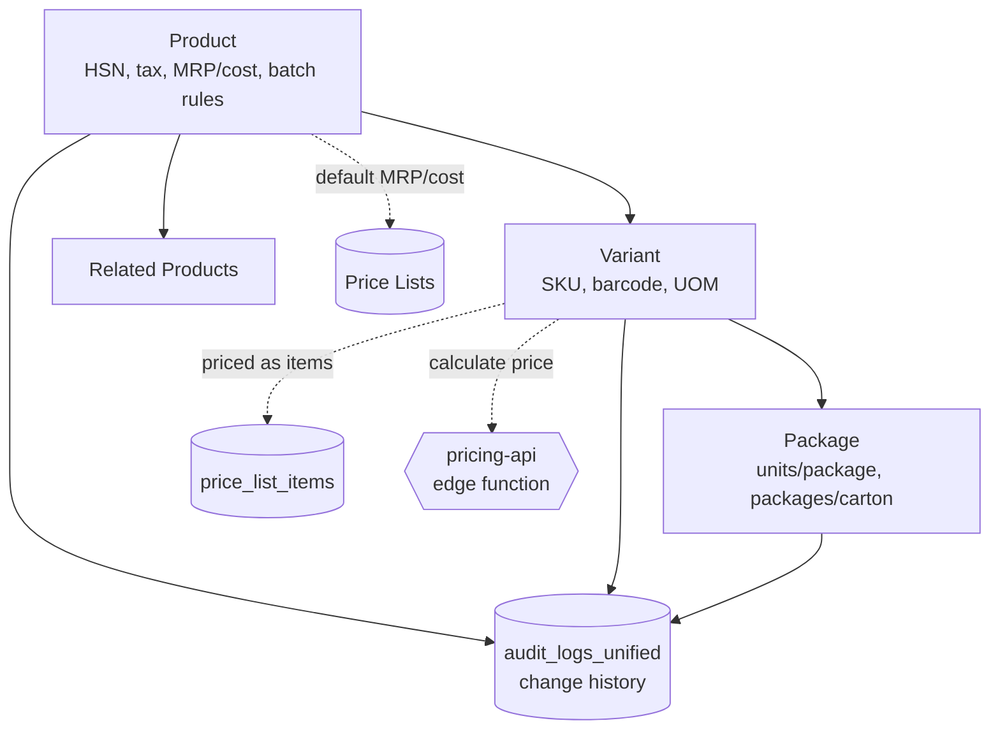
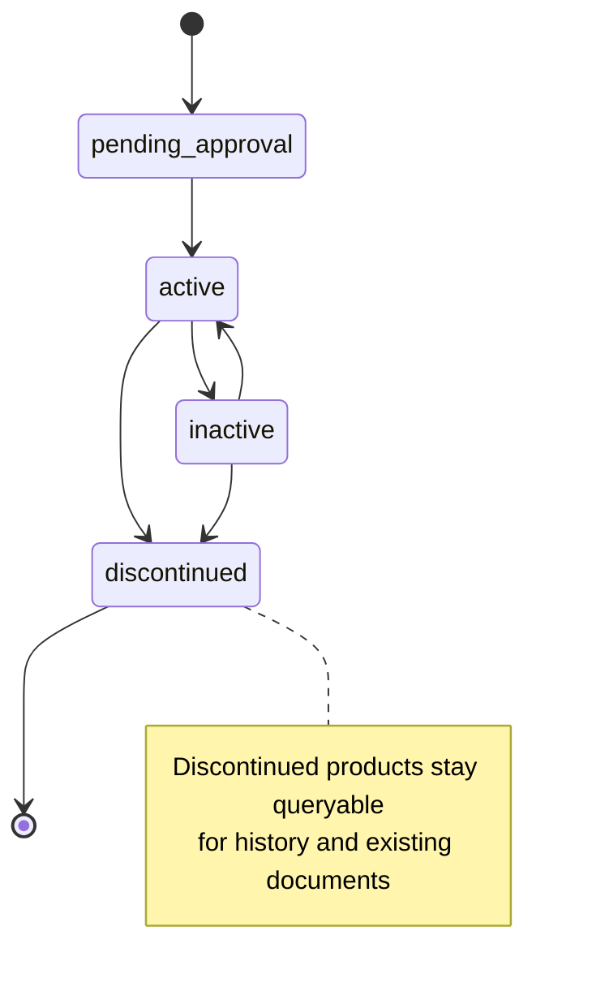

# Products — Developer Guide

> Engineering reference for the product master — the `Product → Variant → Package` hierarchy, related
> products, change history, and bulk import/export — that anchors pricing, inventory, and invoicing.

## Change Log
| Version | Date | Author | Notes |
|---|---|---|---|
| 1.0 | 2026-06-18 | Platform Engineering | Initial guide — hierarchy, server actions, schema, controls. |

## Glossary
| Term | Meaning |
|---|---|
| **Product** | Master record carrying HSN, tax, category, default MRP/cost, and batch/expiry rules. |
| **Variant** | A sellable pack/SKU under a product (unit size, barcode, variant MRP/cost). |
| **Package** | How a variant ships — units per package, packages per carton (logistics/warehouse). |
| **Related product** | A cross-/up-sell link between two products. |
| **Schedule classification** | Regulatory class (carried for pharma-style items). |

---

## 1. Overview

Products is a master-data module at `src/app/products`. It manages a three-level hierarchy and feeds
pricing (`price_lists`), inventory, and O2C invoicing. All writes go through server actions in
`src/app/products/actions/*`, each gated by `getServerPermissions().check('products', <action>)` and
backed by RLS. The pricing panel inside product detail additionally reads the `price_lists` module.

Key surfaces:
- **List / manager**: `ProductsManagerPage`, `ProductsTableView`, realtime via `useProductsRealtime`.
- **Detail**: `[id]/page.tsx` + `ProductDetailModal`, variants/packages/related managers, pricing calculator.
- **Bulk**: `bulkUploadProducts`, `importProducts`, `exportProducts`, `generateProductTemplate`.

---

## 2. Architecture

Server actions are thin: validate (`utils/*-validation.ts`) → permission check → Supabase write →
revalidate. In-process pricing math lives in `utils/pricing-calculator.ts` and `services/pricing.service.ts`;
the **`pricing-api` edge function** is the authoritative pricing engine, called from `pricingEdgeFunction.ts`
(`POST /functions/v1/pricing-api`, ~7 call sites) for live price calculation. *(Note: a separate
`products-pricing-api` edge function exists in the backend but has no active call sites from the app and
is treated as legacy — not part of the supported contract.)*

---

## 3. Product lifecycle

Status drives orderability: only **active** products with a sellable variant can be ordered.
`inactive` and `discontinued` are retained for historical documents.

---

## 4. API surface (server actions)

| Action | Module/op | Purpose |
|---|---|---|
| `createProduct` / `updateProduct` / `deleteProduct` | products c/u/d | Product master CRUD |
| `createProductVariant` / `updateProductVariant` | products c/u | Variant CRUD |
| `createProductVariantPackage` / `updateProductVariantPackage` / `deleteProductVariantPackage` | products c/u/d | Package CRUD |
| `createRelatedProduct` / `updateRelatedProduct` / `deleteRelatedProduct` | products c/u/d | Related-product links |
| `getProducts` / `getProduct` / `getProductById` / `getProductDetails` | products read | Reads |
| `getProductVariants` / `getProductVariantPackages` / `getVariantPackages` | products read | Hierarchy reads |
| `getProduct/Variant/PackageChangeHistory` | products read | Audit reads |
| `bulkUploadProducts` / `importProducts` / `exportProducts` / `generateProductTemplate` | products c/read | Bulk tools |
| `updateProductImages` | products update | Image refs |
| `pricingEdgeFunction` | price_lists | Bridge to the `pricing-api` edge function (live price calculation) |

---

## 5. Data model (verified tables)

| Table | Role | Notes |
|---|---|---|
| `products` | Product master | HSN, `tax_percentage`, `cess_percentage`, category, MRP/cost, batch/expiry, status, tenant. |
| `product_variants` | Variant/SKU | unit size, barcode, variant MRP/cost, UOM, default flag. |
| `product_variant_packages` | Package | units per package, packages per carton, weights/dimensions, sellable/stockable. |
| `related_products` | Cross-/up-sell | product↔product links. |
| `audit_logs_unified` | Change history | who/what/when for product, variant, package. |
| `price_list_items` | (read) | pricing references variants/packages. |

> **Verification gap** Column-level constraints (FKs, CHECKs, defaults) were not exhaustively audited;
> confirm against the migration before relying on a specific column.

---

## 6. Permissions
All actions call `getServerPermissions().check('products', <op>)` with ops `create`/`read`/`update`/`delete`.
The pricing panel also checks `price_lists`. Typical grants: Catalogue Admin (full), Pricing (read +
price_lists), Sales/Ops (read).

---

## 7. Security and tenant isolation
- **RLS** scopes every table to the caller's tenant; the action layer adds the permission gate. Both must hold.
- **Validation** (`utils/*-validation.ts`) runs server-side — never trust client-supplied tax/HSN/codes.
- **Codes** (`product_code`, `variant_code`, `package_code`) must be unique within tenant; enforce at DB and validate in the action.
- **Audit** writes to `audit_logs_unified` are append-style history; do not mutate prior entries.

---

## 8. Integration points

| Integrates with | Direction | Purpose |
|---|---|---|
| **`pricing-api`** (edge fn) | Products → | Authoritative live price calculation (`POST /functions/v1/pricing-api`). |
| **Price Lists** | Products → | Variants/packages are priced as `price_list_items`; product carries default MRP/cost & tax. |
| **Inventory / Warehouse** | Products → | Batch/expiry/serialization rules; packages drive carton handling. |
| **O2C / Invoicing** | Products → | HSN/tax flow to invoices; orders reference variants. |
| **Plant Production** | Products ← | Finished goods produced against product/variant. |

---

## 9. Known gaps and follow-ups
- **Column-level schema audit** pending (see §5).
- **Approval flow** for `pending_approval` products is implied by status but the transition controls were not verified here — confirm before documenting an approval SLA.
- **`pricing-api` edge-function contract** (request/response of `POST:calculate`) should be documented in full alongside the Price Lists guide; this guide names the integration but not the payload schema.
- **`products-pricing-api`** appears unused (no app call sites) — confirm it can be retired rather than maintained.

---

## 10. RACI

| Activity | Catalogue Admin | Pricing | Sales/Ops | Eng |
|---|---|---|---|---|
| Create/maintain products & hierarchy | **R/A** | C | I | C |
| Tax/HSN correctness | **R** | C | I | — |
| Pricing | I | **R/A** | I | — |
| Bulk import/export | **R/A** | I | I | C |
| Schema / RLS / validation | I | — | — | **R/A** |

---

## 11. Test automation
- **Hierarchy integrity**: a package requires a variant; a variant requires a product.
- **Orderability**: only active product + sellable variant is selectable in O2C.
- **Uniqueness**: duplicate codes within a tenant are rejected.
- **Tenant isolation**: cross-tenant reads/writes return zero rows / are rejected (RLS).
- **Permissions**: each action denies callers without the `products` grant.
- **Bulk validation**: malformed import rows are reported per-row, not silently dropped.
- **Tax propagation**: product HSN/tax changes surface to dependent price-list items as expected.

---

## Related
- Customer hub: [Products](../user-guides/products/README.md)
- [Price Lists (dev)](./price-lists.md) · [Raw Materials (dev)](./raw-materials.md) · [O2C (dev)](./o2c.md)
