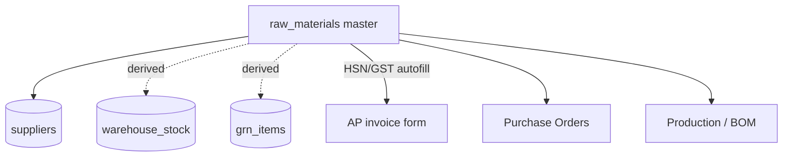
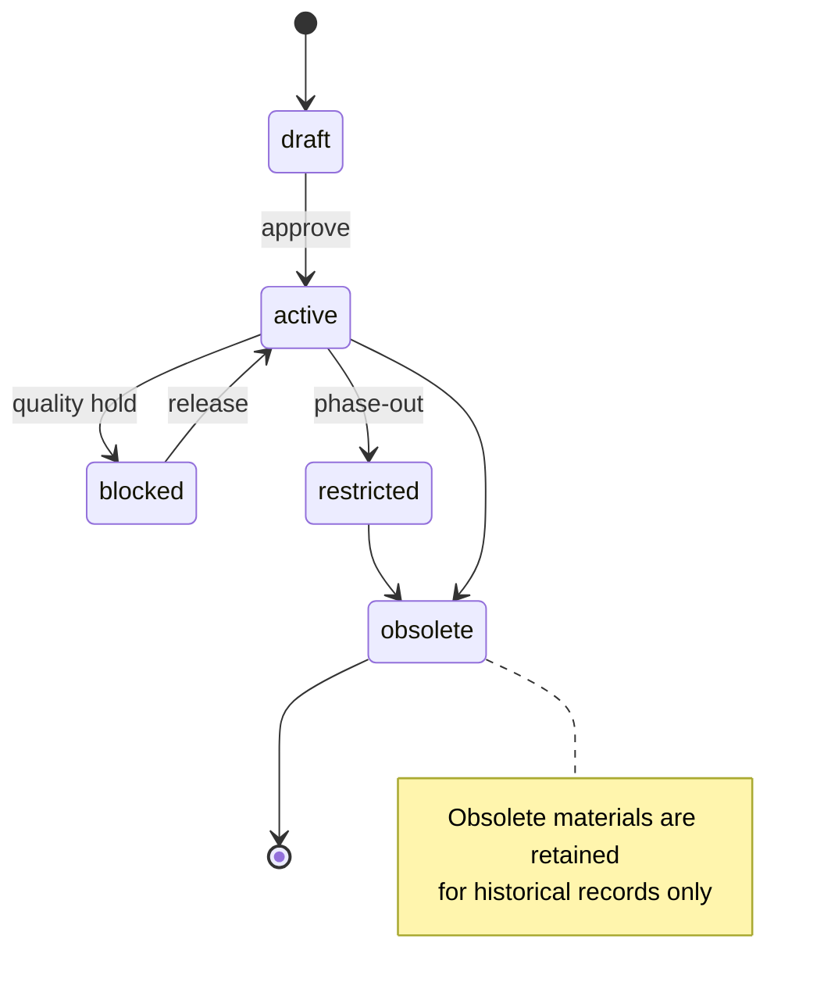

# Raw Materials — Developer Guide

> Engineering reference for the raw-material master — identity, planning, costing, sourcing, quality,
> and GST attributes — consumed by purchasing, production, inventory, and AP invoicing.

## Change Log
| Version | Date | Author | Notes |
|---|---|---|---|
| 1.0 | 2026-06-18 | Platform Engineering | Initial guide — schema, GST autofill, ERP-extended fields, controls. |

## Glossary
| Term | Meaning |
|---|---|
| **Material** | A raw input (chemical/packaging/consumable) bought and consumed in manufacturing. |
| **UOM** | Unit of measurement (from the DB `units_of_measurement` enum). |
| **Primary supplier** | The default sourcing supplier linked to a material. |
| **ABC class** | Inventory-control classification (A/B/C/X) — ERP-extended. |
| **Valuation class** | Accounting classification — ERP-extended. |

---

## 1. Overview

Raw Materials (`src/app/raw-materials`) is a master-data module backed by the `raw_materials` table.
Server actions in `actions/*` are gated by `getServerPermissions().check('raw_materials', <op>)` with
RLS as the backstop. The module joins `suppliers` for the primary supplier and derives stock figures
from `warehouse_stock` / `grn_items` (read-only — stock is not edited here).

GST fields (`hsn_code`, `gst_rate`, `cess_rate`, `is_exempt`, `is_nil_rated`) exist specifically so the
AP invoice form can auto-fill tax for a material.

---

## 2. Architecture

Form and dialogs: `RawMaterialFormDialog`, `RawMaterialDuplicateDialog`, `RawMaterialImportDialog`,
`RawMaterialsManagerPage`. Import/export and bulk-update are server actions.

---

## 3. Material status lifecycle (ERP-extended)

> **Verification note** The shipped table uses `is_active` (boolean) as the authoritative status.
> The richer `material_status` lifecycle above (plus ABC class, valuation class, storage condition,
> batch management, reorder/EOQ) is **defined in the type model as ERP-extended/optional** and may not
> all be present as DB columns yet — confirm against the migration before relying on them.

---

## 4. API surface (server actions)

| Action | Op | Purpose |
|---|---|---|
| `createRawMaterial` / `updateRawMaterial` / `deleteRawMaterial` | c/u/d | Master CRUD |
| `duplicateRawMaterial` | create | Clone an existing material |
| `bulkUpdateMaterials` | update | Mass field update |
| `getRawMaterials` | read | List + filters |
| `getSuppliers` | read | Supplier picker (primary supplier) |
| `importRawMaterials` / `exportRawMaterials` | import/export | Template-based bulk I/O |

> **Edge functions — none (verified 2026-06-18).** This master is pure server-action CRUD; it invokes no
> edge function. The backend `material-requirements-calculator` relates to materials but belongs to
> production planning and is not statically referenced (see Plant Production guide). Downstream, materials
> feed P2P/GRN and AP-invoice tax auto-fill.

---

## 5. Data model (verified)

`raw_materials` — core fields (shipped):

| Group | Fields |
|---|---|
| Identity | `material_code`, `material_description`, `material_category`, `material_type` (liquid/powder/solid/gas), `material_unit_of_measurement` |
| Planning | `material_threshold_quantity`, `material_average_lead_purchase_time` |
| Costing | `standard_cost`, `current_cost` |
| Sourcing | `primary_supplier_id` → `suppliers`, `supplier_part_number` |
| Quality | `quality_grade`, `specifications` |
| GST | `hsn_code`, `gst_rate`, `cess_rate`, `is_exempt`, `is_nil_rated` |
| System | `is_active`, `tenant_id`, `created_by`/`updated_by`/`created_at`/`updated_at` |

ERP-extended (type-model, optional in schema): `material_status`, `abc_classification`,
`material_group`, `procurement_type`, `valuation_class`, `storage_condition`, `shelf_life_days`,
`is_hazardous`, `hazard_class`, `batch_management_type`, `requires_quality_inspection`,
`safety_stock_quantity`, `reorder_point_quantity`, `economic_order_quantity`.

Joined/computed for UI: `primary_supplier`, `stock_on_hand`, `stock_value`.

---

## 6. Permissions
`getServerPermissions().check('raw_materials', <op>)` with ops `create`/`read`/`update`/`delete`/`import`/`export`.
Stores/Materials Admin (full); Procurement/Production/Finance (read).

---

## 7. Security and tenant isolation
- **RLS** scopes `raw_materials` to tenant; action layer gates ops.
- **`material_code` uniqueness** within tenant — enforce at DB, validate in `createRawMaterial`/import.
- **Stock is read-only** here — figures derive from `warehouse_stock`/`grn_items`; never write stock from this module.
- **Import validation** is server-side (`validateImportRow`) — reject malformed type/UOM/required-field rows per-row.
- **GST fields** feed downstream AP tax — treat as finance-relevant; changes should be auditable.

---

## 8. Integration points

| Integrates with | Direction | Purpose |
|---|---|---|
| **Suppliers** | ← | Primary supplier link. |
| **P2P / Purchase Orders** | → | Materials are ordered; lead time informs planning. |
| **GRN / Warehouse** | → | Receipts and stock-on-hand derivation. |
| **Production / BOM** | → | Materials consumed in manufacturing. |
| **Finance (AP)** | → | HSN/GST auto-fill on supplier invoices. |

---

## 9. Known gaps and follow-ups
- **ERP-extended fields** parity between type model and DB schema needs confirmation (see §3/§5).
- **Stock derivation** query path (`warehouse_stock` vs `grn_items`) should be documented as the single source of truth.
- **Approval/`material_status`** workflow is not wired to a control today — `is_active` is the live gate.

---

## 10. RACI

| Activity | Materials Admin | Procurement | Finance | Eng |
|---|---|---|---|---|
| Create/maintain materials | **R/A** | C | I | C |
| Supplier link / lead time | C | **R/A** | I | — |
| HSN/GST correctness | C | I | **R/A** | — |
| Import/export | **R/A** | I | I | C |
| Schema / RLS / validation | I | — | I | **R/A** |

---

## 11. Test automation
- **Uniqueness**: duplicate `material_code` within a tenant is rejected.
- **Import**: invalid type/category/UOM and missing code/description are reported per-row.
- **Tenant isolation**: cross-tenant read/write returns zero / rejected (RLS).
- **Permissions**: each op denies callers without the `raw_materials` grant.
- **GST autofill**: a material with HSN/GST surfaces correct tax on the AP invoice form.
- **Stock read-only**: the module never mutates `warehouse_stock`/`grn_items`.

---

## Related
- Customer hub: [Raw Materials](../user-guides/raw-materials/README.md)
- [Suppliers (dev)](./p2p.md) · [Plant Production (dev)](./plant-production.md) · [P2P (dev)](./p2p.md)
