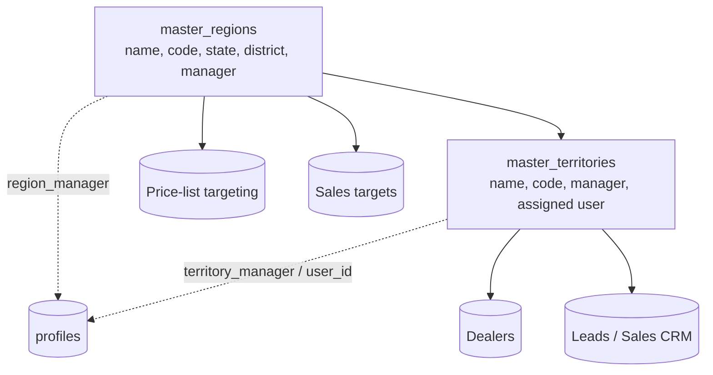
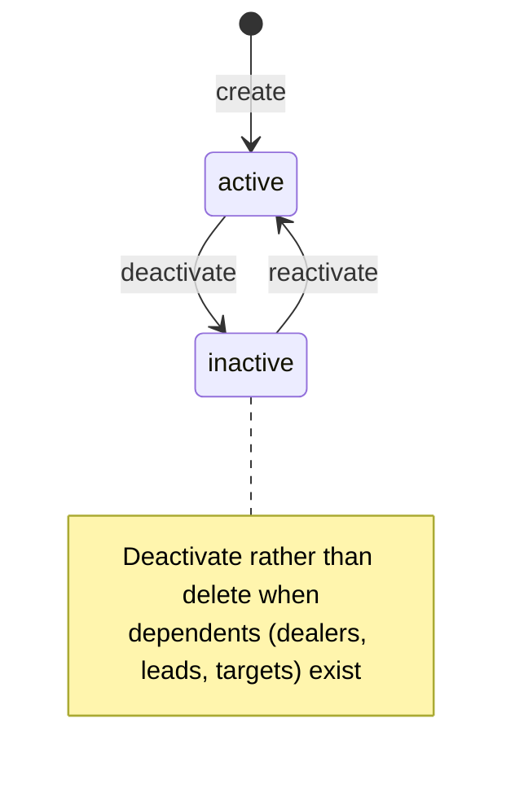

# Regions & Territories — Developer Guide

> Engineering reference for the sales-geography master — the two-level `Region → Territory` structure
> and manager assignment that routes dealers, leads, price-list targeting, and sales targets.

## Change Log
| Version | Date | Author | Notes |
|---|---|---|---|
| 1.0 | 2026-06-18 | Platform Engineering | Initial guide — hierarchy, manager assignment, schema, controls. |

## Glossary
| Term | Meaning |
|---|---|
| **Region** | Top-level geography (state/district scope) with a region manager. |
| **Territory** | A sub-area within a region with a territory manager and assigned user. |
| **Manager assignment** | The user that owns a region/territory (resolved against `profiles`). |

---

## 1. Overview

Regions (`src/app/regions`) is a master-data module managing a two-level hierarchy
(`master_regions` → `master_territories`). Server actions in `actions/*` are gated by
`getServerPermissions().check('master_regions' | 'master_territories', <op>)` with RLS as the backstop.
Manager/user lookups resolve against `profiles` (`searchUsers`). The structure is a routing dimension
consumed by Dealers, Sales CRM (leads/visits/targets), and Price Lists (targeting).

Surfaces: `RegionsContent`, `RegionListArea`, `RegionDetails`, `TerritoryDetails`, add/edit dialogs,
and `UserSelector`/`UserDisplay` for manager assignment. Services: `region.service.ts`,
`territory.service.ts`.

---

## 2. Architecture

---

## 3. Lifecycle

Regions/territories use `is_active` for soft retirement; delete actions exist but should be guarded
against records still routed to the geography.

---

## 4. API surface (server actions)

| Action | Op | Purpose |
|---|---|---|
| `createRegion` / `editRegion` / `deleteRegion` | c/u/d | Region CRUD |
| `createTerritory` / `editTerritory` / `deleteTerritory` | c/u/d | Territory CRUD |
| `getRegion` / `getRegions` | read | Region reads (with territories) |
| `searchUsers` | read | Manager/user picker → `profiles` |

> **Edge functions — none (verified 2026-06-18).** Regions/territories are pure server-action CRUD with no
> edge function. The geography is a *routing dimension* consumed by Dealers, Sales CRM, and Price Lists.

---

## 5. Data model (verified)

| Table | Role | Key fields |
|---|---|---|
| `master_regions` | Region master | `region_name`, `region_code`, `state`, `district`, `description`, `region_manager`, `is_active`, tenant. |
| `master_territories` | Territory master | `region_id` (FK), `territory_name`, `territory_code`, `territory_manager`, `user_id`, `description`, `is_active`, tenant, audit. |
| `profiles` | (read) | Resolves manager/user assignments. |

> **Verification gap** FK/CHECK/default constraints were not exhaustively audited; confirm against the
> migration before relying on a specific column.

---

## 6. Permissions
`getServerPermissions().check('master_regions' | 'master_territories', <op>)`. Sales Admin maintains
both; Regional/Territory Managers read their scope. Create/update are explicitly checked; delete actions
exist and should carry the same gate.

---

## 7. Security and tenant isolation
- **RLS** scopes `master_regions`/`master_territories` to tenant; action layer gates ops.
- **Codes** (`region_code`, `territory_code`) should be unique within tenant.
- **Referential safety**: deleting/deactivating a geography with attached dealers/leads/targets can orphan routing — guard and require reassignment first.
- **Manager assignment** must reference a valid in-tenant `profiles` user.

---

## 8. Integration points

| Integrates with | Direction | Purpose |
|---|---|---|
| **Dealers** | → | Dealers are routed to a territory/region. |
| **Sales CRM** | → | Leads/visits/targets scoped by territory. |
| **Price Lists** | → | Region/territory targeting of pricing. |
| **Profiles / Users** | ← | Manager and assigned-user resolution. |

---

## 9. Known gaps and follow-ups
- **Delete-guard**: confirm delete actions block (or reassign) when dependents exist.
- **Naming**: the price-lists module reads regions via `master_regions`; ensure all consumers use the same master (no legacy `regions` view drift).
- **Column-level schema audit** pending (see §5).

---

## 10. RACI

| Activity | Sales Admin | Regional Mgr | Territory Mgr | Eng |
|---|---|---|---|---|
| Create/maintain regions & territories | **R/A** | C | I | C |
| Assign managers | **R/A** | C | I | — |
| Reassign / retire geography | **R/A** | C | I | — |
| Schema / RLS / delete-guards | I | — | — | **R/A** |

---

## 11. Test automation
- **Hierarchy**: a territory requires a valid parent region.
- **Uniqueness**: duplicate region/territory codes within a tenant are rejected.
- **Manager validity**: assigned manager/user must be an in-tenant profile.
- **Referential safety**: deactivating/deleting a geography with dependents is blocked or forces reassignment.
- **Tenant isolation**: cross-tenant reads/writes return zero / rejected (RLS).
- **Permissions**: each op denies callers without the relevant master grant.

---

## Related
- Customer hub: [Regions & Territories](../user-guides/regions/README.md)
- [Dealers (dev)](./dealers.md) · [Sales CRM (dev)](./sales-crm.md) · [Price Lists (dev)](./price-lists.md)
