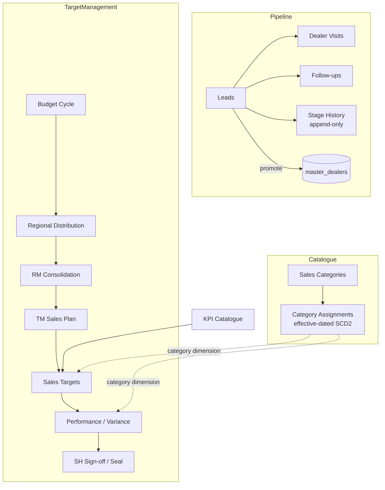
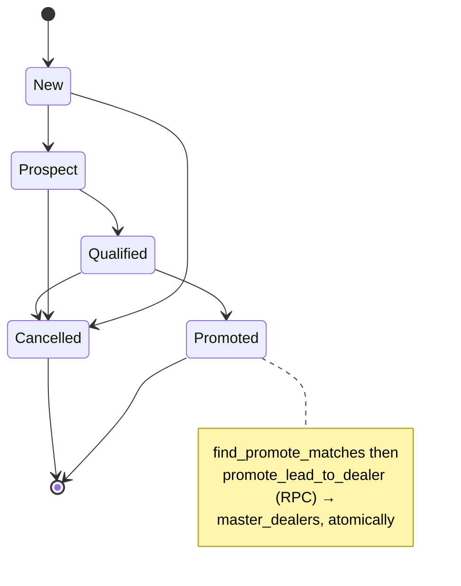
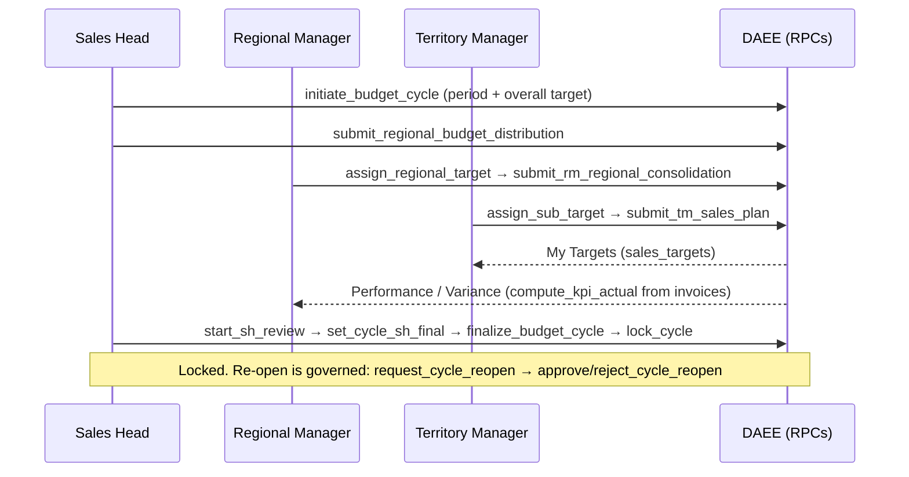

# Sales CRM — Developer Guide

> Engineering reference for the sell-side CRM: product **sales categories**, the dealer **lead pipeline**
> (leads → visits → follow-ups → promote), and the **target-management** cascade (budget cycle →
> regional distribution → consolidation → sales plans → performance/variance → sign-off).

## Change Log
| Version | Date | Author | Notes |
|---|---|---|---|
| 1.0 | 2026-06-18 | Platform Engineering | Initial guide — categories, leads/visits/follow-ups, target cascade, KPI catalogue. |

## Glossary
| Term | Meaning |
|---|---|
| **TM / RM / SH** | Territory Manager / Regional Manager / Sales Head — the three planning tiers. |
| **Budget Cycle** | A planning period plus an overall sales target that the cascade distributes downward. |
| **Regional Distribution** | Allocation of a budget cycle's target to regions (header + lines). |
| **RM Consolidation** | A Regional Manager's roll-up of territory plans within a region. |
| **Sales Plan (TM)** | A Territory Manager's plan against the cycle; produces that TM's targets. |
| **KPI Catalogue** | Tenant-defined set of metrics targets and performance are expressed in. |
| **Sales Category** | An effective-dated grouping of products for analysis and targeting. |
| **Promote** | Converting a qualified lead into a `master_dealers` record. |
| **SCD Type 2** | Slowly-changing dimension with effective-dated versions (used by category assignments). |

---

## 1. Overview

Sales CRM is a tenant-isolated module under the Next.js App Router at `src/app/sales-crm`. It has three
loosely-coupled sub-domains that share the sales org structure (regions/territories) and the KPI catalogue:

1. **Catalogue** — `sales_categories` + effective-dated `sales_category_assignments`; feeds revenue-by-category reporting.
2. **Pipeline** — `leads` with child `sales_crm_visits` / `lead_followups` / `lead_meetings` and an append-only `lead_stage_history`; terminal action **promote** writes `master_dealers`.
3. **Target Management** — the cascade `budget_cycles` → `budget_regional_distributions(+_lines)` → `rm_regional_consolidations` → `tm_sales_plans(+_lines)` → `sales_targets`, measured against the `kpi_catalogue` and sealed via `kpi_signoffs`.

All reads/writes go through server actions guarded by `getServerPermissions().check(module, action)` and
RLS on every table. There are no public API routes for this module.

> **Status note** This module is delivered on a feature branch and is **pre-GA**. The lifecycle and
> cascade below are verified against the branch source; the **seal / re-open** approval mechanics in
> target management are still being finalised and should be re-verified before GA.

---

## 2. Architecture

Server actions live alongside each route segment (`actions.ts` per area). Permission checks and tenant
scoping happen in the action layer; RLS is the backstop. The cascade is **top-down**: a lower tier cannot
plan until the tier above has distributed.

---

## 3. Lead lifecycle

- Every transition appends a row to `lead_stage_history` (who, from, to, when) — the table is append-only and is the audit source.
- `Promoted` is terminal forward; `Cancelled` is terminal lost. Both remain queryable for pipeline reporting.
- **Promote is RPC-driven** (`leadPromotionActions.ts`): `find_promote_matches` returns duplicate candidates (advisory in the UI), then `promote_lead_to_dealer` performs the atomic promote — set `lead.stage='promoted'`, link/create `master_dealers`, and write the `lead_stage_history` row in one transaction. Permission gate: `leads.promote`.
- **GSTIN-override control (4-eyes):** when a match collides on GSTIN, promotion is blocked unless overridden — and the override requires `leads.override_promote` on **both the caller and a named approver**. This is a duplicate-prevention control; enforce it server-side, never relax it in the UI.

---

## 4. Target-management cascade

The cascade is implemented as a **server-side RPC state machine** — each transition is a dedicated
Postgres RPC (not free-form table writes), so atomicity and ordering are enforced in the database.

**RPC surface (verified — business logic lives in RPCs):**

| Stage | RPCs |
|---|---|
| Cycle | `initiate_budget_cycle`, `cancel_budget_cycle`, `finalize_budget_cycle`, `lock_cycle` |
| Distribution | `submit_regional_budget_distribution` |
| Consolidation | `submit_rm_regional_consolidation`, `discard_rm_regional_consolidation`, `force_submit_tm_plan` (logged to `rm_force_submit_events`) |
| TM plan | `submit_tm_sales_plan`, `discard_tm_sales_plan` |
| Targets | `assign_regional_target`, `assign_sub_target` |
| SH review / seal | `start_sh_review`, `set_cycle_sh_final`, `clear_cycle_sh_final` (logged to `sh_review_events` / `cycle_sh_final_overrides`) |
| Re-open | `request_cycle_reopen`, `approve_cycle_reopen`, `reject_cycle_reopen` (via `cycle_reopen_requests`) |
| KPI / forecast | `compute_kpi_actual` (actuals from `invoices`/`invoice_items`), `persist_demand_forecast` |
| Promote | `find_promote_matches`, `promote_lead_to_dealer` |

Ordering invariant: a tier's RPC rejects if the parent tier has not distributed/consolidated to it yet.
Because the transitions are RPCs, ordering and atomicity are enforced in the database, not just the UI.

---

## 5. Data model (verified tables)

| Domain | Table | Notes |
|---|---|---|
| Catalogue | `sales_categories` | Category master. |
| Catalogue | `sales_category_assignments` | Product↔category, **effective-dated** (SCD2); preserves history. |
| Pipeline | `leads` | Lead master + current status. |
| Pipeline | `sales_crm_visits` | Field-visit records (lead or dealer). |
| Pipeline | `lead_followups` | Scheduled next actions with due dates. |
| Pipeline | `lead_meetings` | Meeting records on a lead. |
| Pipeline | `lead_stage_history` | Append-only status-transition audit. |
| Targets | `budget_cycles` | Planning period + overall target. |
| Targets | `budget_regional_distributions` (+ `_lines`) | Cycle → region allocation. |
| Targets | `rm_regional_consolidations` | RM roll-up of territory plans. |
| Targets | `tm_sales_plans` (+ `_lines`) | TM plan against the cycle. |
| Targets | `sales_targets` | Derived per-user/period targets. |
| Targets | `kpi_catalogue` | Tenant KPI definitions. |
| Targets | `kpi_signoffs` | Final-review seal records. |
| Targets | `demand_forecasts` (+ `_lines`) | Demand forecast feeding targets (`persist_demand_forecast`). |
| Workflow audit | `sh_review_events`, `cycle_sh_final_overrides` | SH review actions + final-value overrides. |
| Workflow audit | `rm_force_submit_events` | RM force-submit of a TM plan. |
| Re-open | `cycle_reopen_requests` | Re-open request/approve/reject records. |
| Actuals (read) | `invoices`, `invoice_items` | Source for `compute_kpi_actual` performance. |
| Reference (read) | `fiscal_periods`, `master_regions`, `master_territories`, `role_permissions`, `user_roles`, `tenant_settings` | Period alignment, geography, RBAC, tenant config. |

> **Verification gap** Column-level detail (FKs, NOT-NULL, CHECK constraints) was not exhaustively
> audited for this guide — confirm against the migration before relying on a specific column.

---

## 6. Permissions

All actions call `getServerPermissions().check(module, action)`. Modules in use:
`sales_crm`, `sales_categories`, `sales_category_assignments`, `leads`, `sales_crm_visits`,
`target_management`, `tm_sales_plans`, `rm_regional_consolidations`, `budget_regional_distributions`,
`kpi`, `sales_reports`.

| Tier | Typical grants |
|---|---|
| Sales Admin | `sales_categories.*`, `kpi.*` |
| TM / Field Sales | `leads.*`, `sales_crm_visits.*`, `tm_sales_plans.*` (own scope) |
| RM | pipeline read + `rm_regional_consolidations.*`, `budget_regional_distributions` (region scope) |
| SH | `target_management.*`, `budget_regional_distributions.*`, sign-off |

---

## 7. Security and tenant isolation

- **RLS** on every table scopes rows to the caller's tenant; the action layer adds permission gating. Both layers must hold — do not rely on the UI to hide a tier.
- **Cascade ordering** is a server-side integrity control, not just UX: reject lower-tier writes when the parent tier has not distributed.
- **Promote** must be idempotent against the dealer master — re-running promote on an already-promoted lead must not create a second `master_dealers` row.
- **Append-only** `lead_stage_history` and `kpi_signoffs` are audit surfaces; never update in place.

---

## 8. Integration points

| Integrates with | Direction | Purpose |
|---|---|---|
| **Dealers / master data** | Pipeline → | Promote creates the dealer; downstream onboarding/credit/tax setup happens there. |
| **Products / catalogue** | → Catalogue | Category assignments reference products. |
| **Sales org (regions/territories)** | → all | Scoping for leads, distribution, consolidation. |
| **O2C** | downstream | A promoted dealer's orders feed actuals for performance. |
| **Reporting** | ← Catalogue/Targets | Revenue-by-category and performance/variance views. |

---

## 9. Known gaps and follow-ups
- **Seal / re-open mechanics** are implemented (`finalize_budget_cycle` + `lock_cycle`; re-open via `request_cycle_reopen` → `approve_cycle_reopen` / `reject_cycle_reopen`). Remaining: confirm the *role gate* on each re-open RPC against the RBAC matrix.
- **Actuals source** is `compute_kpi_actual` reading `invoices`/`invoice_items`. Remaining: document the exact predicate (which invoice events/states count, legacy-vs-einvoice) inside that RPC.
- **Promote match rules** — `find_promote_matches` returns candidates; the **GSTIN collision is a hard block** overridable only by dual `leads.override_promote` (§3). Remaining: document the non-GSTIN match keys (phone/email) and whether they are soft-warn.
- **Column-level schema audit** pending (see §5).
- **RPC internals** — this guide names the RPC surface and contracts from the calling code; the RPC bodies (in migrations) were not line-audited. Confirm each RPC's guard before relying on a specific check.

---

## 10. RACI

| Activity | TM | RM | SH | Sales Admin | Eng |
|---|---|---|---|---|---|
| Maintain sales categories / KPIs | I | I | C | **R/A** | C |
| Work leads / visits / follow-ups | **R/A** | C | I | I | — |
| Promote lead to dealer | **R** | **A** | I | C | — |
| Open & distribute budget cycle | I | C | **R/A** | I | — |
| Consolidate region | C | **R/A** | C | I | — |
| Build sales plan | **R/A** | C | I | I | — |
| Seal final review | I | C | **R/A** | I | — |
| Schema / RLS / action gating | — | — | I | I | **R/A** |

---

## 11. Test automation
- **Lifecycle**: assert every lead transition writes `lead_stage_history`; assert illegal transitions are rejected.
- **Promote idempotency**: promote twice → exactly one `master_dealers` row.
- **Cascade ordering**: a TM plan write must fail when the parent region has no distribution; an RM consolidation must fail without a budget cycle.
- **Tenant isolation**: cross-tenant read/write attempts on each table return zero rows / are rejected (RLS).
- **Permissions**: each action denies callers lacking the module grant.
- **Effective dating**: re-assigning a product to a new category preserves the prior assignment's validity window (no overlap).

---

## Related
- Customer hub: [Sales CRM](../user-guides/sales-crm/README.md)
- [Dealers](../user-guides/dealers/README.md) · [Order to Cash](../user-guides/o2c/order-to-cash.md)
