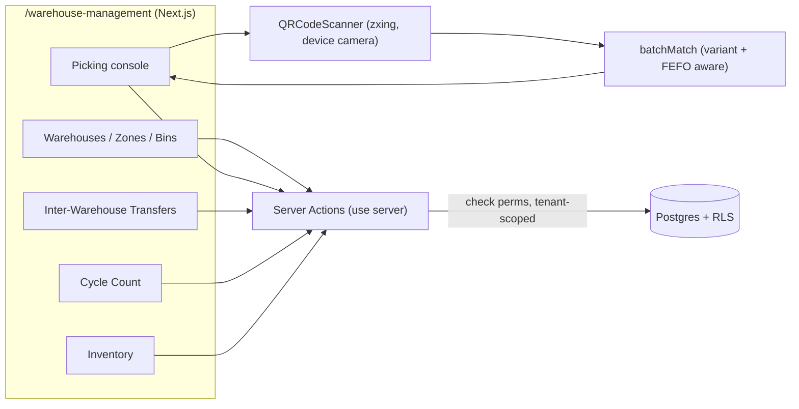
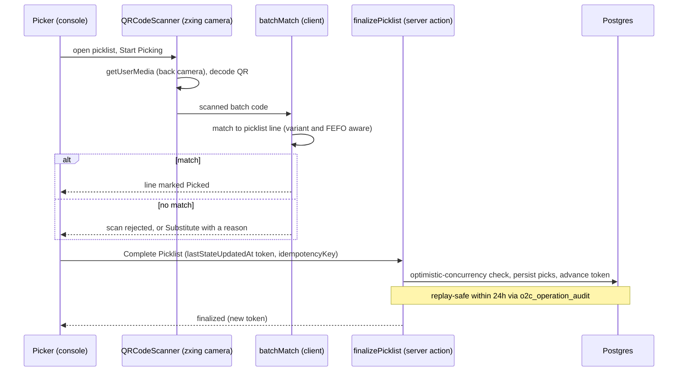
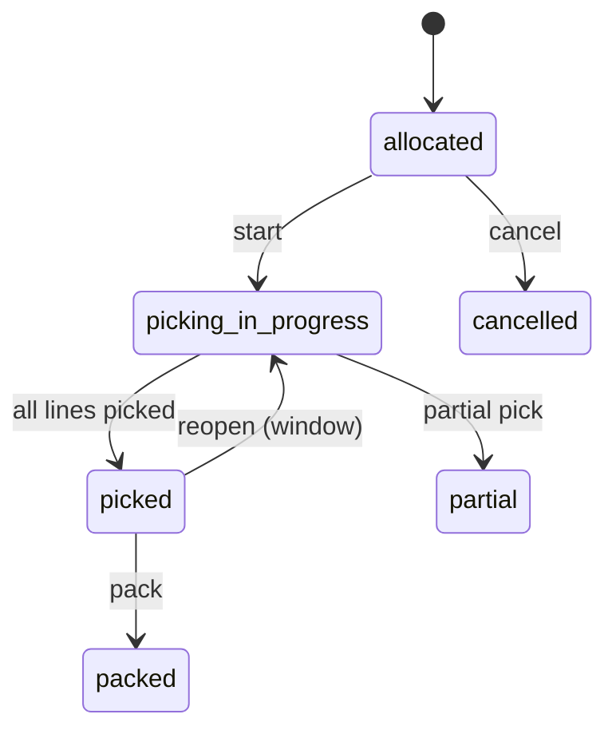
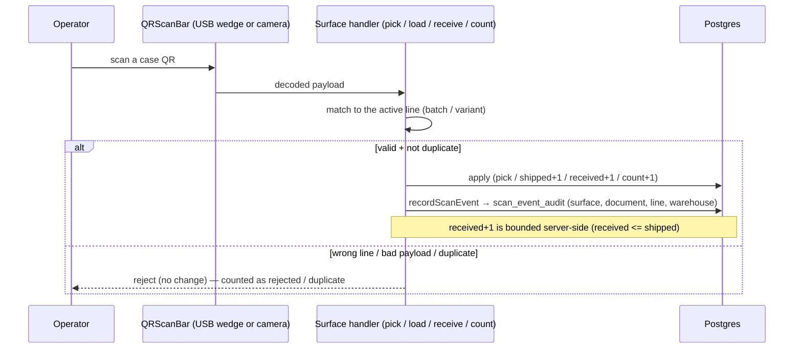
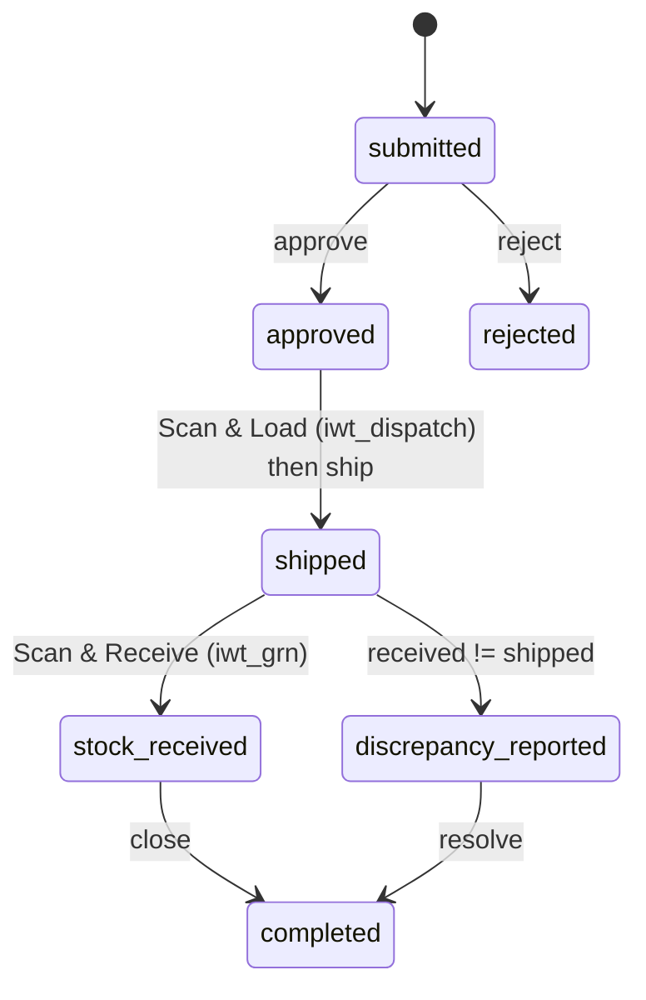

# Warehouse Management — Developer Guide

> **Verified:** 2026-06-17 against `web_app/src/app/warehouse-management` (+ `o2c/inventory`, `raw-material-inventory`) + staging DB.
> **Routes:** `/warehouse-management` and sub-routes — `/warehouses`, `/zones`, `/aisles`, `/racks`, `/bins`, `/picking`, `/iwt`, `/cycle-count`, `/dashboard`, `/reports/stock`; inventory at `/o2c/inventory`; raw materials at `/raw-material-inventory`.
> **Platform architecture:** [Developer Guides README](./README.md)

---

## Change Log

| Version | Date | Author | Summary |
|---|---|---|---|
| 1.0 | 2026-06-17 | Platform Eng | Initial enterprise guide — storage hierarchy, scan-first picking (QR), concurrency/idempotency model, IWT, cycle count, RBAC, RACI, test automation |
| 1.1 | 2026-06-18 | Platform Eng | Added §4a Unified QR scanning (picking / IWT load+receive / cycle count) with scan-flow + IWT-lifecycle diagrams and the `scan_event_audit` ledger (QR programme, branch `pavan/qr-programme-cont-sa`) |

---

## Glossary

| Term | Definition |
|---|---|
| Bin | Smallest storage location (Warehouse → Zone → Aisle → Rack → Bin) |
| FEFO | First-Expiry-First-Out — batch picking order by expiry |
| Picklist | Pick instruction generated from an allocated Sales Order |
| Scan-first | Picking model where each line is confirmed by scanning its batch QR |
| IWT | Inter-Warehouse Transfer |
| Cycle count | Periodic physical stock verification with variance adjustment |
| RLS | Row-Level Security (Postgres tenant isolation) |

---

## 1. Overview
Warehouse Management models physical storage (Warehouse → Zone → Aisle → Rack → Bin), tracks inventory
by **product batch** and **bin** (FEFO), and fulfils Sales-Order demand through a **scan-first picking
console**. It also covers **Inter-Warehouse Transfers** and **Cycle Counts**. Picklists originate in
[O2C](./o2c.md); goods receipts (P2P/IWT) add stock.

## 2. Architecture

QR scanning is **client-side** (device camera via `@zxing/library`); there is no scanning edge function.
QR *generation* lives in Plant Production (`/plant-production/qr-generator`). All writes go through
server actions.

## 3. Storage & Inventory Model
- **Hierarchy tables:** `warehouses` → `warehouse_zones` → `warehouse_aisles` → `warehouse_racks` → `warehouse_bins`; `warehouse_stock` + `bin_movement_history`.
- **Inventory:** `inventory`, `inventory_allocations`, `inventory_transactions`, `inventory_replenishments`, `inventory_barcodes`, `product_batches` (FEFO via `vw_product_batches_fefo`); positions via `vw_current_inventory_positions` / `vw_inventory_with_allocations`.
- **Source-of-truth note:** picking consumes **allocated** inventory; FEFO suggests the batch, the scan confirms it.

## 4. Scan-First Picking (the core flow)

### Concurrency & idempotency (DAEE-620)
- **Optimistic concurrency (C3):** `finalizePicklist` requires the client's `lastStateUpdatedAt` token; it is re-read before mutations and **advanced** on success, so concurrent finalizes are rejected/serialised.
- **Idempotency:** an optional client `idempotencyKey` replays the prior response **within 24h** (stored in `o2c_operation_audit` — no new table). The token-advance latch covers the common retry case even without a key.
- **Scan-rejection audit:** rejected scans are recorded into `o2c_operation_audit.operation_data.scan_rejections`.
- **Reopen:** `reopenPicklist` re-opens a finalized picklist within an allowed window (supervisor permission).

### Picklist state machine

### Substitution
When the FEFO-suggested batch is unavailable, `SubstitutionReasonDialog` requires one of:
`original_batch_damaged`, `original_batch_not_found`, `quality_rejected`, `quantity_shortage`,
`fefo_bypass_physical_access`, `other`. Substitutions persist to `picklist_substitutions`.

## 4a. Unified QR scanning (QR programme — branch `pavan/qr-programme-cont-sa`, on `staging`)
Scanning is not limited to picking. The QR programme adds a shared scan input (`QRScanBar` — USB
wedge **or** camera) and a single **scan audit ledger** (`scan_event_audit`, DAEE-928) written via
`recordScanEvent(surface, document, line, warehouse, …)`. Surfaces:

| Surface | Component | Behaviour |
|---|---|---|
| `picking` | `PickingConsole` | scan-to-pick; variant/FEFO-aware match (`batchMatch`) |
| `iwt_dispatch` | `iwt/components/ScanLoadDialog` (DAEE-896/937) | scan-to-load; shipped-vs-requested counters; `incrementIWTShippedQty` |
| `iwt_grn` | `iwt/components/GRNScanDialog` (DAEE-898) | scan-to-receive at destination; `incrementIWTReceivedQty` enforces received ≤ shipped server-side |
| `stock_audit_cycle_count` | `cycle-count/components/ScanCountDialog` (DAEE-872) | scan-to-count; matches line's `batch_number`, increments case count |
| `stock_audit_fsa` | (full stock audit) | scan-based stock audit |

All surfaces share the contract: a valid scan applies + writes the ledger; a **wrong-line/invalid
payload is rejected** (not applied); **duplicate scans are blocked**. The ledger gives a tamper-evident
trail of every physical scan. **Status:** fresh (SA UAT Wave 6, 2026-06-18) — confirm GA before relying
on it as released.

**Unified scan flow (all surfaces):**

**IWT lifecycle (scan-verified both ends):**

## 5. API Surface (selected server actions)
| Action | Permission | Notes |
|---|---|---|
| `listPicklists` / `getPicklistPreload` | `picklists:read` | list + console preload (variant↔package reverse-lookup) |
| `finalizePicklist` | `picklists:finalize` | token + idempotency + scan-rejection audit |
| `reopenPicklist` | `picklists:reopen` | window-bounded reopen |
| warehouse/zone/aisle/rack/bin CRUD | `warehouses:read` (+ create/update) | storage hierarchy |
| IWT create / ship / receive | (IWT perms) | `iwt_shipping_documents`; receive creates a GRN |
| cycle-count create / recount / approve adjustment | `cycle_count_orders:create|update` | variance approval |

## 6. Permissions (RBAC)
`warehouses`, `picklists` (+ `start`, `finalize`, `reopen`), `cycle_count_orders`, `inventory`,
`back_order_management`; picking also touches `sales_orders` (the source order). Tenant-isolated via RLS.

## 7. Security & Tenant Isolation
All tables RLS-scoped by `tenant_id`; server actions independently `check(module, action)`. QR scanning
runs on the device (camera) — no inventory data leaves the tenant boundary during a scan; matching is
client-side against the preloaded, tenant-scoped picklist.

## 5a. Edge functions (verified wiring)
Warehouse business logic runs largely in edge functions. **Wired** (statically referenced from web_app / sibling functions):

| Edge function | Role | Refs |
|---|---|---|
| `interwarehouse-transfer` | IWT create/ship/receive | wa:5, ef:2 |
| `inventory-operations` | Core stock operations | wa:4, ef:2 |
| `cycle-count-generator` / `cycle-count-processor` | Generate counts / process variance | wa:1 / wa:2 |
| `putaway-processor` | Putaway after receipt | wa:1 |
| `picklist-auto-generation` | Auto-build picklists from allocations | wa:1 |
| `back-order-processor` | Back-order handling | wa:3 |

> **Verification note — present but not statically referenced** (wa:0 / no sibling ref; invocation likely
> cron, background-jobs-processor, or dynamic dispatch — **coverage to confirm**, do not assume live):
> `inventory-transaction-processor`, `inventory-checkin-processor`, `inventory-analytics`,
> `inventory-audit-trail`, `warehouse-stock-fefo`, `warehouse-bin-optimizer`, `warehouse-bin-utilization`,
> `reconcile-inventory-deduction-gap`, `grn-items-processor`.

## 8. Integration Points
- **O2C** — picklists are generated from allocated Sales Orders; finalize feeds back into the O2C fulfilment state.
- **P2P / IWT** — goods receipts add stock; IWT moves stock between warehouses (`interwarehouse-transfer`).
- **Plant Production** — QR codes scanned here are generated by `/plant-production/qr-generator`.

## 9. Known Gaps & Open Items
1. **Camera reliability across devices** — scanning depends on browser `getUserMedia` + `@zxing/library`; a **Manual** entry tab is the documented fallback. Diagnostics/debug panel exist (DAEE-616). Validate on target devices.
2. **Variant-strict matching** — `batchMatch` enforces variant/package correctness (DAEE-1033); mismatched-variant scans are rejected by design. Confirm batch-master coverage so valid batches are not falsely rejected.
3. **Reopen window** — finalized picklists can only be corrected within the reopen window; outside it, corrections need a different process (confirm SOP with product).

## 10. RACI
| Activity | Warehouse Admin | Picker | Supervisor | Inventory Controller | System |
|---|---|---|---|---|---|
| Set up warehouses/zones/bins | R/A | — | — | C | S |
| Pick (scan-first) | — | R | A | — | S |
| Reopen a finalized picklist | — | — | R/A | — | S |
| Inter-warehouse transfer | — | C | R/A | C | S |
| Cycle count + variance approval | — | C | A | R | S |

*R = Responsible, A = Accountable, C = Consulted, S = System executes*

## 11. Test Automation & Validation
Picking/IWT/inventory test assets live under `docs/modules/` and the registry
`docs/test-cases/TEST_CASE_REGISTRY.md`; feature files under `e2e/features/` where present. Priority
coverage: scan match + rejection, substitution (each reason), **finalize idempotency / token-advance
concurrency**, reopen window, IWT ship→receive→stock, and cycle-count variance approval. Camera scanning
itself is validated manually on target devices (headless E2E uses the manual-entry path).
