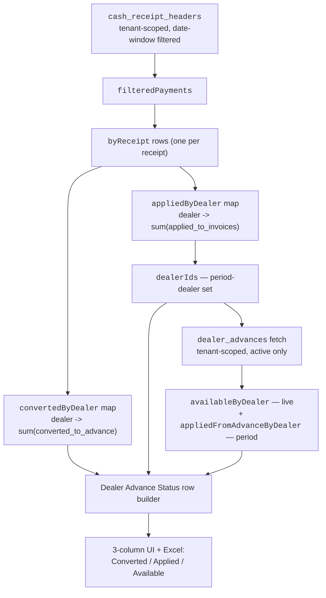
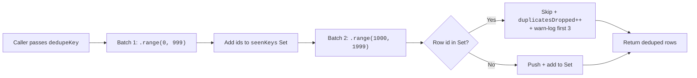

# IMPL-056 — DAEE-1184 / DAEE-1185 Reports UAT Hardening

- **Date**: 2026-07-02
- **Module**: O2C Reports
- **Type**: UAT defect fixes + platform-wide `fetchAllInBatches` hardening
- **Status**: Complete on `pavan/DAEE-1184-1185` (merge-pending to `main` / PROD)
- **Related Stories**: DAEE-1184 (Hierarchical Product Sales), DAEE-1185 (Collection Report)
- **Owner**: Pavana Teja T (CTO)
- **Reviewers**: Goverdhan Reddy Garudaiah (PO), Finance QA
- **Classification**: Internal — Implementation
- **Version**: 1.0
- **Last Updated**: 2026-07-02
- **Next Review**: On merge to `main`

---

## Change Log

| Version | Date | Change | Author |
|---|---|---|---|
| 1.0 | 2026-07-02 | Initial write-up covering all Jul 01–02 commits on the branch | Pavana |

---

## What Was Implemented

Two closely-coupled O2C report tickets were hardened over 2026-07-01 → 2026-07-02 on a single branch (`pavan/DAEE-1184-1185`), plus a cross-cutting `fetchAllInBatches` platform enhancement that grew out of the DAEE-1185 UAT triage.

### 1. DAEE-1184 — Hierarchical Product Sales

- **Phase 2B parity for the on-screen tree.** Excel already collapsed columns per Group By in E-5; the on-screen `<Collapsible>` tree did not. Added a `groupByDepth` derivation (`state → 0`, `region → 1`, `territory → 2`, `dealer → 3`) and wrapped State → Region, Region → Territory, and Territory → Dealer `CollapsibleContent` blocks with a depth guard. Deeper tiers render an italic "Grouped by X — deeper hierarchy hidden" hint rather than nested rows. Drill-down at or above the cap is preserved — the D-3 fix from Phase 2A still holds.
- **Dead code removed.** `REVIEW_LEVELS`, `REVIEW_LEVEL_LABELS`, and the `ReviewLevel` type became unused when Phase 2A removed the "Review at" control. Deleted along with a leftover commented `reviewLevel` state line.
- **E-3 root-cause fix — sales category lookup.** The Phase 2B Excel fix used PostgREST relationship embed `sales_categories!inner(category_name)` on `sales_category_assignments`. This failed at runtime with `PGRST200: Could not find a relationship between 'sales_category_assignments' and 'sales_categories' in the schema cache` because there is no foreign key — the DAEE-505 Type-2 SCD model joins by `category_code VARCHAR`, not by `id`. Replaced with a two-step in-memory lookup matching the sibling pattern in `sales-crm/sales-categories/actions/productCategoryEnrichment.ts`:
  1. Fetch active assignments (`product_id`, `category_code`, `effective_from`, `effective_to`), pick first-active per product at report `to_date`.
  2. Fetch open `sales_categories` versions by `category_code`, resolve `name`.

### 2. DAEE-1185 — Collection Report

- **PO UAT triage (2026-07-01).** After Goverdhan Reddy's final defect register, C-1, C-3, C-4, C-5, C-6, and C-10 were withdrawn or merged. Active items:
  - **C-2 (amended)** — Dealer Advance Status columns reframed around the *advance lifecycle*.
  - **C-7 / C-8 / C-9** — By Dealer / By Region / By Territory allocation split (already implemented in commit `7723436e`; merge-pending to PROD).
- **C-2 (amended) — Dealer Advance Status reframed.** Prior tab mixed a receipt-lifecycle column ("Applied to Invoices (Period)") with two advance-lifecycle columns ("Available in Advance", "Applied to Invoice (from Advance)"). PO clarified: this tab is about the *advance* lifecycle per dealer; receipt-side allocation already lives on By Dealer (C-7). Reworked to three canonical columns in strict order:
  1. **Converted to Advance** — period-scoped `SUM(cash_receipt_headers.amount_converted_to_advance)` on that dealer's period receipts.
  2. **Applied to Invoice** — period-scoped `SUM(dealer_advances.used_balance)` for advances whose source cash receipt is in the filtered window.
  3. **Available Advance Balance** — POINT-IN-TIME `SUM(dealer_advances.available_balance)` on `available` / `partially_used` advances. Renamed twice (originally "Open Advance Balance" → "Available in Advance" → "Available Advance Balance").
- **C-2 subtitle** — the tab card description now explicitly separates *period-scoped* from *point-in-time* per Goverdhan's AC.
- **C-1 root-cause fix (was a defensive dedup, now a platform hardening).** Original C-1 was withdrawn by the PO as a false positive (the extra row was the Excel TOTAL footer, not a data row). The underlying defense-in-depth work was still valuable and stayed:
  - `fetchAllInBatches` gained an optional `dedupeKey?: string` option. When set, the helper suppresses cross-batch duplicates and logs a warning (first three occurrences per call) with the duplicate key. New `duplicatesDropped: number` on the result surfaces the count.
  - Root cause traced to offset-based `.range()` paging being racy against concurrent INSERTs — a stable unique `.order()` tiebreaker is necessary but not sufficient. An insert between page N and page N+1 shifts subsequent offsets and can duplicate the last row of page N as the first row of page N+1. PostgREST array-join duplication was ruled out because the report's nested joins (`master_dealers` → `master_regions` / `master_territories`) do not inline into the parent row.
  - Collection Report opts in for its three parallel fetches (`collection-receipts`, `collection-outstanding-invoices`, `collection-previous-receipts`), plus the two sales-category fetches on the DAEE-1184 E-3 path.

---

## Technical Changes

### Files Updated (`web_app`)

| File | Ticket | Change |
|---|---|---|
| `src/app/o2c/reports/hierarchical-product-sales/components/HierarchicalProductSalesContent.tsx` | DAEE-1184 | `groupByDepth` derivation + 3 depth-guarded `CollapsibleContent` wraps; delete `REVIEW_LEVELS` / `REVIEW_LEVEL_LABELS` / `ReviewLevel` |
| `src/app/o2c/reports/actions/hierarchicalProductSalesActions.ts` | DAEE-1184 | E-3 fix — swap PostgREST embed for two-step lookup (`sales_category_assignments` → `sales_categories` by `category_code`); opt in `dedupeKey: 'id'` |
| `src/lib/supabase/fetchAllInBatches.ts` | DAEE-1185 | New `dedupeKey?: string` option + `duplicatesDropped: number` in result; warn-log on race hit |
| `src/app/o2c/reports/collection-report/actions/collectionReportActions.ts` | DAEE-1185 | `DealerAdvanceStatusRow`: drop `applied_to_invoices_period`, add `converted_to_advance_period`; add `convertedByDealer` map; Excel column reorder + relabel; three parallel fetches opt in `dedupeKey: 'id'` |
| `src/app/o2c/reports/collection-report/components/CollectionReportContent.tsx` | DAEE-1185 | Dealer Advance Status table headers, cells, subtitle reworked to the three lifecycle columns |

### Commits (branch `pavan/DAEE-1184-1185`)

| SHA | Title |
|---|---|
| `2ad5f760` | DAEE-1184 Phase 2A: UI defect fixes (D-1, D-2, D-3, D-4) |
| `c9ab00ca` | DAEE-1184 Phase 2B: Excel defect fixes (E-1..E-6) |
| `7723436e` | DAEE-1185 UAT defects (C-1..C-10): allocation split on By Dealer / Region / Territory + advance split + polish |
| `bebbba1d` | DAEE-1184 + DAEE-1185: on-screen Group By col visibility + `fetchAllInBatches` dedup root-cause fix |
| `795560e7` | DAEE-1184 E-3 fix: sales category lookup — two-step lookup, not PostgREST embed |
| `0e154e1d` | DAEE-1185 C-2 (amended): Dealer Advance Status reframed around advance lifecycle |

`2ad5f760`, `c9ab00ca`, and `7723436e` landed on 2026-06-30 UTC and are included for context because they define the pre-state for the 2026-07-01/02 follow-ups documented here.

### No Schema Change

Both tickets are pure app-layer + report-layer work. No new tables, no new columns, no new indexes, no new RLS. Both reports keep tenant + view-scope filtering upstream of every fetch.

---

## Architecture

### Collection Report — Dealer Advance Status Data Flow (C-2 amended)

### `fetchAllInBatches` dedup path (C-1 root-cause fix)

---

## Business Rules

### DAEE-1184 (Hierarchical Product Sales) — Group By semantics

The Group By dropdown controls both the visible on-screen tree depth AND the Excel Sales Summary sheet's column set. Behavior after this branch:

| Group By | On-screen tree | Excel Sales Summary sheet |
|---|---|---|
| State | State rows + KPIs; deeper hierarchy hidden | State rows only |
| Region | State → Region + KPIs; deeper hidden | State + Region |
| Territory | State → Region → Territory + KPIs; deeper hidden | State + Region + Territory |
| Dealer | Full drill — State → Region → Territory → Dealer → Product → Variant | Full column set |

### DAEE-1185 (Collection Report) — Column canon (post-C-2 amended)

**By Dealer / By Region / By Territory** (already in place before Jul 01/02):

- Dealer / Region / Territory identifier + parent geo columns
- Collections count
- Total Cash Receipt (`SUM(total_receipt_amount)`)
- Unapplied (`SUM(amount_unapplied)`)
- Converted to Advance (`SUM(amount_converted_to_advance)`)
- Applied to Invoices (`SUM(amount_applied)`)
- % of Total (Region / Territory only)
- Identity: Total = Unapplied + Converted + Applied ±₹0.01
- Roll-up: SUM(row-level) = report-level allocation totals within ₹0.01

**Dealer Advance Status** (three columns, in this order):

1. Converted to Advance (period)
2. Applied to Invoice (period)
3. Available Advance Balance (point-in-time / live)

---

## Controls & Edge Cases

| Scenario | Control | File / Line reference |
|---|---|---|
| Concurrent INSERT during multi-batch fetch shifts offsets → duplicate row across page boundaries | `dedupeKey='id'` on `fetchAllInBatches` suppresses + warn-logs | `src/lib/supabase/fetchAllInBatches.ts` |
| Sales category assignment refers to a category code with no currently-open version at `to_date` | Two-step lookup returns undefined; product's category column stays blank (no fallback to `products.product_category` per spec) | `src/app/o2c/reports/actions/hierarchicalProductSalesActions.ts` (E-3 block) |
| Dealer has receipts in period but zero converted-to-advance | `converted_to_advance_period = ₹0`; row still appears with valid Applied / Available columns | `collectionReportActions.ts` — DAS build loop |
| Dealer has active advance but NO period receipts | Not shown on DAS (row set is period-scoped). Documented; can be revisited if PO expands scope. | `collectionReportActions.ts` — `dealerIds = appliedByDealer.keys()` |
| Suspense / unattributed receipts (customer_id NULL) | Bucketed as "Suspense / Unallocated" on By Dealer; excluded from DAS because there is no dealer to attribute | `collectionReportActions.ts` — `dealerId = receipt.customer_id \|\| 'suspense'` |
| Cancelled / reversed dealer advances | Status filter (`available` / `partially_used` / `fully_used`) excludes `reversed`, `expired`, `refunded` | `collectionReportActions.ts` — `.in('status', […])` |
| Group By changed while tree is expanded | Depth cap re-derives from state; deeper `CollapsibleContent` renders the italic hint instead of nested rows on next render | `HierarchicalProductSalesContent.tsx` — `groupByDepth` |
| Sales Summary Excel sheet Group By = state | Hides Region / Territory / Dealer columns per E-5 fix (Phase 2B) | `hierarchicalProductSalesActions.ts` — Sales Summary column builder |

---

## Security / Tenant Isolation

- **Tenant scoping** — every fetch begins with `.eq('tenant_id', tenantId)` where `tenantId` is derived from `getServerPermissions()`. Neither ticket introduces a new fetch, and the two new `dedupeKey` opt-ins are on already-tenant-scoped queries.
- **View scope** — the Collection Report already applies `applyScopeFilter` upstream via `getUserViewScope`; unchanged. The Hierarchical Product Sales fix retains the existing scope-filter path.
- **Permissions** — `invoices:read` gate at the server action level; UI wraps the routes in `ProtectedPageWrapper`. Unchanged.
- **Client / server boundary** — both server action files remain `'use server'` with async-only exports. No client-side calls were introduced.
- **Financial side-effects** — read-only reports; no GL posting, no side effects. C-1 defensive dedup does not change any total.
- **Race conditions** — `fetchAllInBatches` dedup is now explicit at the helper level; race detection surfaces via server logs (`fetchAllInBatches dropped cross-batch duplicate at batch N: id=<uuid>`).

---

## Compliance & Audit Notes

- **Nature of data** — cash-receipt totals and advance balances are financial reporting values. They are read-only in these reports; source-of-truth remains `cash_receipt_headers` and `dealer_advances` tables.
- **Auditability** — no change in what is written; only what is read + shaped. Report exports (XLSX / CSV / PDF) already carry period + filters in the header per existing DAEE report convention.
- **Reg / standards citation** — not applicable to this batch (no compliance-mandated column added).

---

## Integration Points

- **DAEE-505 (Sales Categories)** — the E-3 fix depends on `sales_category_assignments.category_code` being the stable join key (not `id`). Any future refactor that introduces a FK from assignments to categories would let us revert the E-3 two-step lookup to a single embed query.
- **DAEE-1163 (Dealer Geo)** — the Collection Report's `resolveDealerGeo` + IST date helper are unchanged and continue to feed the Excel sheets.
- **DAEE-1172 (1000-row cap)** — this batch's `dedupeKey` option supplements the earlier `fetchAllInBatches` retrofit. Row-cap + dedup are now both platform concerns handled by the helper.
- **`docs/engineering/supabase-1000-row-cap.md`** (in `web_app`) — the source-of-truth doc that all callers reference. `dedupeKey` should be considered an extension of that guarantee.

---

## Verification

- `npm run check:all` — PASS (exit 0) on each of the six commits listed above. Only pre-existing lint warnings; none from any file touched by this batch.
- Manual smoke on staging — Group By on-screen tree renders hint copy at each of state / region / territory when set below Dealer; XLSX export re-runs after the E-3 fix without PGRST200.
- Manual smoke on Collection Report — Dealer Advance Status shows three columns in the PO-required order with the correct labels; subtitle explicitly distinguishes period-scoped from point-in-time.
- `grep -rn 'applied_to_invoices_period' src/` — 0 hits after C-2 amended, confirming the dropped struct key has no orphan reference.

### Unverified / follow-ups

- **PROD race telemetry** — the `dedupeKey` warn-log has not yet fired on staging. It will only fire during an active write window on a large tenant. Recommend surfacing in the app-server log dashboard for one full monthly close before deciding whether keyset paging (`fetchAllInBatches` upgrade) is warranted.
- **Non-Collection callers** — this batch does NOT flip other high-volume `fetchAllInBatches` callsites (finance-KPI, aging, GSTR-1 exports) to `dedupeKey='id'`. They remain opt-in. Follow-up ticket recommended once Collection Report telemetry proves the pattern.
- **UAT re-run needed for C-2** — Finance validation samples from the earlier C-10 UAT round refer to the dropped `Applied to Invoices (Period)` column and must be re-checked against the new lifecycle columns before sign-off.

---

## Test Cases Referenced

See companion test-cases doc for the full UAT matrix: [`docs/test-cases/DAEE-1184-1185-REPORTS-UAT-2026-07.md`](../../test-cases/DAEE-1184-1185-REPORTS-UAT-2026-07.md).

Existing BDD automation touched by scope:

- `e2e/features/o2c/reports/collection-report.feature` (IMPL-054 baseline) — will need scenarios adding for the C-2 amended column set. Not yet extended in this branch.
- `e2e/features/o2c/reports/hierarchical-product-sales.feature` (IMPL-054 baseline) — Group By on-screen hint copy scenarios pending.

---

## Glossary

| Term | Meaning |
|---|---|
| **APD** | Advance Payment Deduction — receipts converted to advance in the period. |
| **DAS** | Dealer Advance Status — the Collection Report tab reframed under C-2 amended. |
| **PGRST200** | PostgREST error code — "Could not find a relationship in the schema cache" (missing FK relationship). |
| **Period-scoped** | Column value depends on the report's `from_date` / `to_date` filter. |
| **Point-in-time** | Column value reflects live DB state at report generation; independent of the report period. |
| **SCD** | Slowly Changing Dimension (Type 2 in DAEE-505) — effective-dated versioning by stable code. |

---

## Known Gaps

- **BDD scenario coverage** for the C-2 amended DAS column set is not yet added — see follow-up above.
- **PROD deploy timing** — C-7 / C-8 / C-9 close only after this branch merges to `main`. Goverdhan should be notified so he does not re-file.
- **Keyset paging in `fetchAllInBatches`** deferred pending real telemetry from `dedupeKey`.
