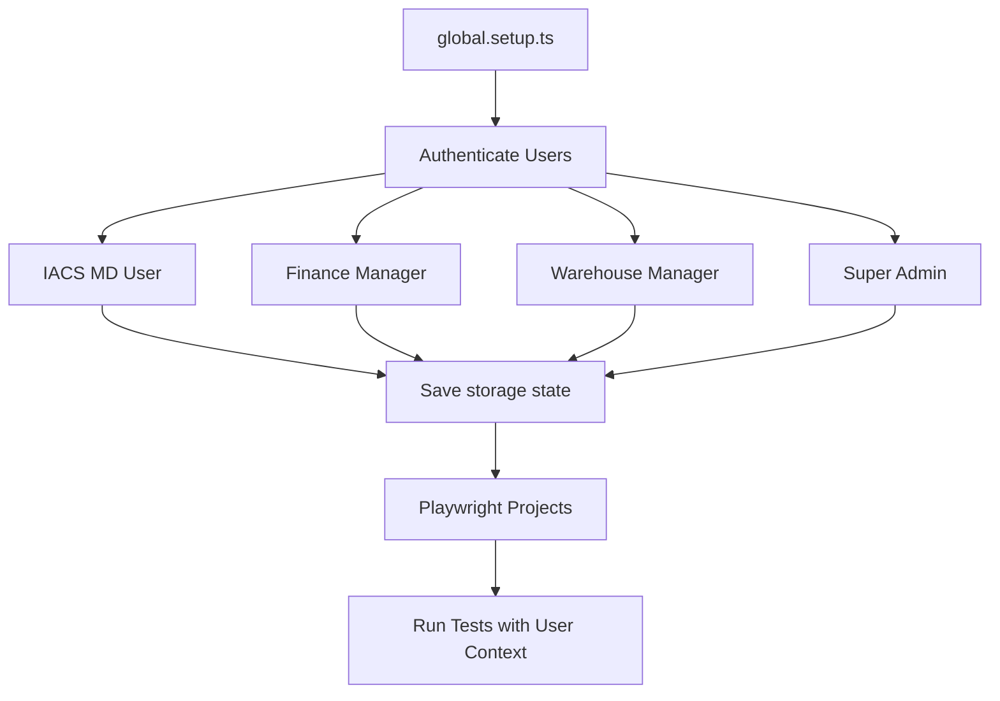
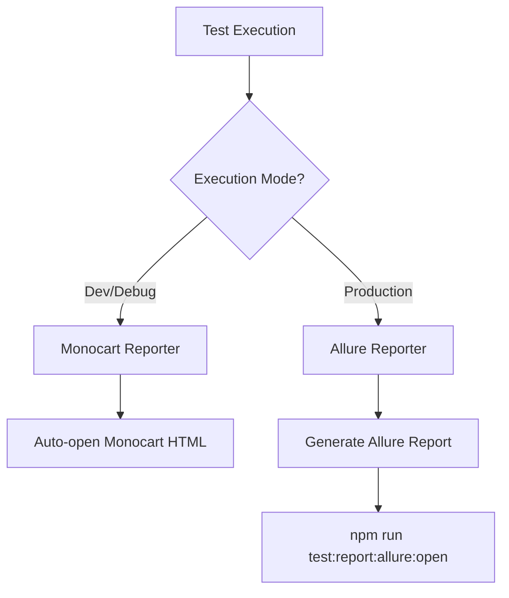
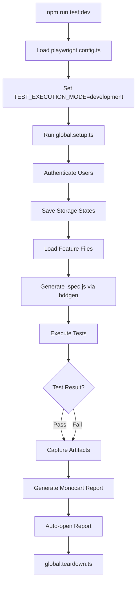

# Framework Architecture

## Overview

The DAEE Platform Automation framework is a multi-layered BDD (Behavior-Driven Development) test automation framework built on Playwright and TypeScript. It follows the Page Object Model pattern with component-based abstraction for ShadCN/Radix UI components.

---

## Architectural Layers

### Layer 1: Feature Files (Business Layer)

**Location**: `e2e/features/[module]/`

**Purpose**: Business-readable test scenarios written in Gherkin syntax.

```gherkin
Feature: Order Management
  Background:
    Given I am logged in to the Application
  
  Scenario: Create order successfully
    When I create a new order
    Then the order should be created successfully
```

**Key Characteristics**:
- Written from user perspective
- No technical implementation details
- Reusable across different implementations
- Tagged for test organization (@smoke, @critical, @regression)

---

### Layer 2: Step Definitions (Orchestration Layer)

**Location**: `e2e/src/steps/[module]/`

**Purpose**: Translate Gherkin steps into executable code using Page Objects and database helpers.

```typescript
When('I create a new order', async function ({ page }) {
  // Orchestrates: POM + Database + Assertions
  const orderBefore = await getOrderCount();
  await ordersPage.createOrder(orderData);
  const orderAfter = await getOrderCount();
  expect(orderAfter).toBe(orderBefore + 1);
});
```

**Key Characteristics**:
- Implements Sandwich Method (DB Before → UI Action → DB After)
- Uses fixtures: `{ page, testContext }`
- Imports utilities: `transactionExtractor`, `TestDataLocator`
- Reuses shared steps from `steps/shared/`

---

### Layer 3: Page Object Models (UI Interaction Layer)

**Location**: `e2e/src/pages/[module]/`

**Purpose**: Abstract UI interactions into high-level, reusable methods.

```typescript
export class OrdersPage extends BasePage {
  async createOrder(data: OrderData): Promise<void> {
    await this.selectComponent.selectByLabel('Customer', data.customer);
    await this.fillInput(this.quantityInput, data.quantity);
    await this.primaryButton.click();
    await this.waitForToast('Order created successfully');
  }
}
```

**Key Characteristics**:
- Inherits from `BasePage` (common utilities)
- Uses component library for ShadCN/Radix patterns
- Semantic locators (getByRole, getByLabel, getByPlaceholder)
- High-level action methods (not just locator getters)

---

### Layer 4: Support Layer (Infrastructure)

**Location**: `e2e/src/support/`

**Components**:

#### Base Classes
- `BasePage`: Common page utilities (navigation, waits, assertions)
- `BaseComponent`: Common component utilities

#### Component Library
- `SelectComponent`: ShadCN/Radix Select interactions
- `DialogComponent`: Modal/Dialog handling
- `ToastComponent`: Toast notification verification
- `FormComponent`: Form validation patterns

#### Data Management
- `TestDataLocator`: Stable prerequisite data (dealers, products, categories)
- `db-helper.ts`: Database query utilities (SELECT only)
- `transaction-extractor.ts`: Extract transaction IDs from UI

#### Utilities
- `PollingHelper`: Retry logic for async operations
- `global.setup.ts`: Multi-user authentication setup
- `global.teardown.ts`: Report generation and cleanup

---

## Multi-User Authentication Architecture

### Overview

DAEE is a multi-tenant SaaS platform. Tests run as different users based on Playwright project routing.

### Authentication Flow



### Storage State Pattern

Each user's authentication state is saved to `.auth/[user].json`:

```json
{
  "cookies": [...],
  "origins": [
    {
      "origin": "https://app.daee.com",
      "localStorage": [
        { "name": "supabase.auth.token", "value": "..." }
      ]
    }
  ]
}
```

### Project Routing

Feature files are routed to Playwright projects based on tags:

```typescript
// playwright.config.ts
{
  name: 'iacs-md',
  testMatch: /.*@iacs-md.*/,
  use: { storageState: '.auth/iacs-md-user.json' }
}
```

**Single-User Test**:
```gherkin
@O2C-001 @smoke @iacs-md
Scenario: Create order
  Given I am logged in to the Application  # Uses @iacs-md project
```

**Multi-User Test**:
```gherkin
@O2C-050 @multi-user @iacs-md @iacs-finance
Scenario Outline: User permissions
  Given I am logged in as "<User>"
  Examples:
    | User            |
    | IACS MD User    |
    | Finance Manager |
```

---

## Conditional Reporting Architecture

### Execution Modes

Framework supports three execution modes controlled by `TEST_EXECUTION_MODE`:

1. **Development** (`development`): Headed, single worker, Monocart report
2. **Debug** (`debug`): Sequential, full capture, Monocart report
3. **Production** (`production`): Parallel, headless, Allure report

### Reporter Configuration

```typescript
// playwright.config.ts
const executionMode = process.env.TEST_EXECUTION_MODE || 'production';
const isDevOrDebug = executionMode === 'development' || executionMode === 'debug';

const reporterConfig = isDevOrDebug
  ? [['list'], ['monocart-reporter', { /* config */ }]]
  : [['list'], ['html'], ['allure-playwright', { /* config */ }]];
```

### Artifact Capture Strategy

**Development/Debug Mode**:
- Screenshots: `on` (every test)
- Videos: `on` (every test)
- Traces: `on` (every test)
- **Purpose**: Full debugging context

**Production Mode**:
- Screenshots: `only-on-failure`
- Videos: `retain-on-failure`
- Traces: `on-first-retry`
- **Purpose**: Minimize storage, capture failures

### Report Generation Flow



---

## Database Verification (Sandwich Method)

### Architecture Pattern

```
┌─────────────────────────────────────┐
│  1. DB BEFORE (Query initial state) │
└─────────────────────────────────────┘
              ↓
┌─────────────────────────────────────┐
│  2. UI ACTION (User interaction)    │
└─────────────────────────────────────┘
              ↓
┌─────────────────────────────────────┐
│  3. DB AFTER (Verify state change)  │
└─────────────────────────────────────┘
```

### Implementation

```typescript
When('I create order', async function ({ page }) {
  // 1. DB BEFORE
  const ordersBefore = await executeQuery(
    'SELECT COUNT(*) FROM orders WHERE user_id = $1',
    [userId]
  );
  
  // 2. UI ACTION
  await ordersPage.createOrder(orderData);
  
  // 3. DB AFTER
  const ordersAfter = await executeQuery(
    'SELECT COUNT(*) FROM orders WHERE user_id = $1',
    [userId]
  );
  
  expect(ordersAfter[0].count).toBe(ordersBefore[0].count + 1);
});
```

### Database Constraints

- **Read-Only**: Framework can only SELECT (no INSERT/UPDATE/DELETE)
- **Connection**: Uses `pg` library with connection pooling
- **Queries**: All queries in `db-helper.ts` for reusability
- **Test Data**: Prefix with `AUTO_QA_${Date.now()}_` for identification

---

## Test Execution Flow



---

## Component Library Architecture

### ShadCN/Radix UI Challenge

ShadCN/Radix components use custom implementations (not native HTML):

**Problem**:
```typescript
// ❌ Doesn't work on Radix Select
await page.selectOption('select', 'value');
```

**Solution**: Component library abstracts interactions:
```typescript
// ✅ Works with Radix Select
await selectComponent.selectByLabel('Category', 'Electronics');
```

### Component Library Structure

```
e2e/src/support/components/
├── SelectComponent.ts       # Radix Select (combobox + listbox)
├── DialogComponent.ts       # Radix Dialog (with animation waits)
├── ToastComponent.ts        # Sonner Toast (data-sonner-toast)
├── FormComponent.ts         # Form validation (role="alert")
└── BaseComponent.ts         # Common component utilities
```

### Interaction Pattern

```typescript
export class SelectComponent {
  async selectByLabel(label: string, option: string): Promise<void> {
    // 1. Click trigger
    await this.page.getByRole('combobox', { name: label }).click();
    
    // 2. Wait for listbox
    await this.page.waitForSelector('[role="listbox"]');
    
    // 3. Click option
    await this.page.getByRole('option', { name: option }).click();
  }
}
```

---

## Key Design Decisions

### 1. Page Object Model over Direct Locators
**Why**: Maintainability, reusability, abstraction

### 2. Component Library for ShadCN/Radix
**Why**: Native selectors don't work, need specialized interaction patterns

### 3. Sandwich Method for Database Verification
**Why**: UI assertions alone are insufficient, need state verification

### 4. Conditional Reporting by Mode
**Why**: Fast debugging in dev, comprehensive reporting in production

### 5. Multi-User Authentication with Storage State
**Why**: Avoid login in every test, support multi-tenant testing

### 6. Semantic Locators (getByRole, getByLabel)
**Why**: Resilient to CSS changes, accessibility-friendly

### 7. TestDataLocator for Stable Data
**Why**: Read-only database, need stable prerequisite data

### 8. AUTO_QA_ Prefix for Test Data
**Why**: Identify test data for manual cleanup (read-only constraint)

---

## Scalability Considerations

### Parallel Execution
- Tests are independent (no shared state)
- Unique test data per test (`AUTO_QA_${Date.now()}_${Math.random()}`)
- Database queries are read-only (no conflicts)

### Module Organization
- Each module has its own feature files, POMs, steps
- Shared steps in `steps/shared/` for reusability
- Component library for common UI patterns

### Performance Optimization
- TestDataLocator caches stable data
- Page Objects reused within scenarios
- Conditional artifact capture (dev vs production)

---

## References

- **Multi-User Auth**: `docs/framework-enhancements/03-multi-user-auth/`
- **Reporting**: `docs/framework/implementation/MONOCART_REPORT.md`
- **Database Schema**: `docs/knowledge-base/database-schema.md`
- **Component Library**: `e2e/src/support/components/`
- **Cursor Rules**: `.cursor/rules/sr-automation-engineer-persona.mdc`
