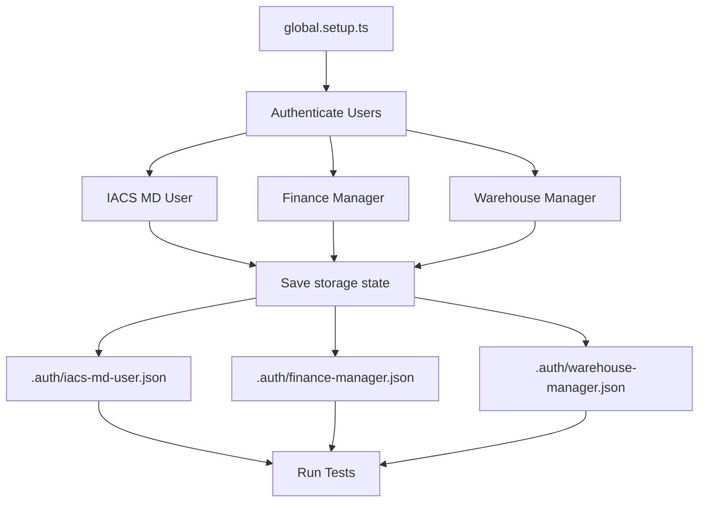

# 02 - Framework Architecture

**Estimated Time**: 2 hours

**Prerequisites**: [01-getting-started.md](./01-getting-started.md)

---

## Learning Objectives

By the end of this module, you will understand:
- ✅ BDD (Behavior-Driven Development) approach
- ✅ Page Object Model (POM) pattern
- ✅ Sandwich Method for database verification
- ✅ Multi-user authentication architecture
- ✅ Component library for ShadCN/Radix UI

---

## 1. BDD (Behavior-Driven Development) (30 minutes)

### What is BDD?

**Definition**: Software development approach where tests are written in business-readable language.

**Benefits**:
- Non-technical stakeholders can read tests
- Tests serve as living documentation
- Focus on behavior, not implementation

### Gherkin Syntax

**Keywords**:
- `Feature`: High-level functionality description
- `Scenario`: Specific test case
- `Given`: Precondition/setup
- `When`: User action
- `Then`: Expected outcome
- `And`: Additional step
- `Background`: Common steps for all scenarios

**Example**:
```gherkin
Feature: Order Management
  As a sales manager
  I want to create orders
  So that I can process customer requests

  Background:
    Given I am logged in to the Application

  Scenario: Create order successfully
    Given I am on the orders page
    When I create a new order with valid data
    Then the order should be created successfully
    And I should see a success message
```

### BDD Workflow

```
1. Write Feature File (.feature)
   ↓
2. Generate Spec Files (npm run bdd:generate)
   ↓
3. Implement Step Definitions (*-steps.ts)
   ↓
4. Create Page Objects (*Page.ts)
   ↓
5. Run Tests (npm run test:dev)
```

**Exercise**: Read `e2e/features/o2c/indents.feature` and identify all Given/When/Then steps.

---

## 2. Page Object Model (POM) (30 minutes)

### What is POM?

**Definition**: Design pattern that creates an object repository for UI elements.

**Benefits**:
- **Maintainability**: Locators in one place
- **Reusability**: Methods used across tests
- **Abstraction**: Hide implementation details

### POM Structure

```typescript
// e2e/src/pages/o2c/IndentsPage.ts
import { Page, Locator } from '@playwright/test';
import { BasePage } from '../../support/base/BasePage';

export class IndentsPage extends BasePage {
  // Locators (what elements to interact with)
  readonly createButton: Locator;
  readonly dealerSearchInput: Locator;
  
  constructor(page: Page) {
    super(page);
    this.createButton = page.getByRole('button', { name: 'Create Indent' });
    this.dealerSearchInput = page.getByPlaceholder('Search dealer');
  }
  
  // Methods (how to interact with elements)
  async goto(): Promise<void> {
    await this.navigateTo('/o2c/indents');
  }
  
  async searchDealerByName(dealerName: string): Promise<void> {
    await this.dealerSearchInput.fill(dealerName);
    await this.page.waitForLoadState('networkidle');
  }
}
```

### POM Hierarchy

```
BasePage (common utilities)
  ↓
IndentsPage (indent-specific)
  ↓
Used by indent-steps.ts
  ↓
Called from feature file
```

**Exercise**: Open `e2e/src/pages/o2c/IndentsPage.ts` and identify:
1. All locators defined
2. All action methods
3. Which methods are inherited from BasePage

---

## 3. Sandwich Method (30 minutes)

### What is Sandwich Method?

**Definition**: Database verification pattern that queries state before and after UI actions.

**Pattern**:
```
┌─────────────────────────────────────┐
│  1. DB BEFORE (Query initial state) │
└─────────────────────────────────────┘
              ↓
┌─────────────────────────────────────┐
│  2. UI ACTION (User interaction)    │
└─────────────────────────────────────┘
              ↓
┌─────────────────────────────────────┐
│  3. DB AFTER (Verify state change)  │
└─────────────────────────────────────┘
```

### Implementation Example

```typescript
When('I create a new indent', async function ({ page }) {
  // 1. DB BEFORE - Query initial state
  const indentsBefore = await executeQuery(
    'SELECT COUNT(*) FROM indents WHERE created_by = $1',
    [userId]
  );
  const countBefore = indentsBefore[0].count;
  
  // 2. UI ACTION - Perform user interaction
  await indentsPage.createIndent({
    dealer: 'VAYUPUTRA AGENCIES',
    products: [{ name: 'Product A', quantity: 5 }]
  });
  
  // 3. DB AFTER - Verify state change
  const indentsAfter = await executeQuery(
    'SELECT COUNT(*) FROM indents WHERE created_by = $1',
    [userId]
  );
  const countAfter = indentsAfter[0].count;
  
  // Assert state change
  expect(countAfter).toBe(countBefore + 1);
});
```

### When to Use Sandwich Method

**✅ Use for**:
- Verifying data creation (orders, indents, users)
- Checking status transitions (draft → submitted)
- Validating relationships (order → order_items)

**❌ Don't use for**:
- Pure UI validation (form errors, button states)
- Navigation assertions (URL changes)
- Visual confirmations (toast messages)

**Exercise**: Find a step definition in `e2e/src/steps/o2c/indent-steps.ts` that uses Sandwich Method. Identify the three parts.

---

## 4. Multi-User Authentication (20 minutes)

### Why Multi-User?

DAEE is a multi-tenant SaaS platform. Tests need to run as different users to verify:
- Permission boundaries (can user X do action Y?)
- Tenant isolation (users can't see other tenant's data)
- Role-based access control (RBAC)

### Authentication Flow



### Storage State

**What it is**: Saved authentication state (cookies, localStorage) for reuse across tests.

**Location**: `.auth/[user].json`

**Benefit**: Avoid login in every test (tests start already authenticated).

### Single-User vs Multi-User Tests

**Single-User** (70% of tests):
```gherkin
@O2C-001 @smoke @iacs-md
Scenario: Create order
  Given I am logged in to the Application  # Uses @iacs-md project
  When I create a new order
  Then the order should be created successfully
```

**Multi-User** (30% of tests):
```gherkin
@O2C-050 @multi-user @iacs-md @iacs-finance
Scenario Outline: User permissions
  Given I am logged in as "<User>"
  When I try to delete an order
  Then I should see "<Result>"
  
  Examples:
    | User            | Result  |
    | IACS MD User    | Success |
    | Finance Manager | Denied  |
```

**Exercise**: Check `.auth/` directory. How many user storage states exist?

---

## 5. Component Library (20 minutes)

### Why Component Library?

**Problem**: ShadCN/Radix UI components use custom implementations (not native HTML).

**Example**:
```typescript
// ❌ Doesn't work on Radix Select
await page.selectOption('select', 'value');

// ✅ Works with component library
await selectComponent.selectByLabel('Category', 'Electronics');
```

### Available Components

**Location**: `e2e/src/support/components/`

1. **SelectComponent**: Radix Select/Combobox
2. **DialogComponent**: Modal/Dialog handling
3. **ToastComponent**: Toast notification verification
4. **FormComponent**: Form validation patterns

### SelectComponent Example

```typescript
// e2e/src/support/components/SelectComponent.ts
export class SelectComponent {
  async selectByLabel(label: string, option: string): Promise<void> {
    // 1. Click trigger
    await this.page.getByRole('combobox', { name: label }).click();
    
    // 2. Wait for listbox
    await this.page.waitForSelector('[role="listbox"]');
    
    // 3. Click option
    await this.page.getByRole('option', { name: option }).click();
  }
}
```

### Usage in Page Objects

```typescript
export class IndentsPage extends BasePage {
  private selectComponent: SelectComponent;
  
  constructor(page: Page) {
    super(page);
    this.selectComponent = new SelectComponent(page);
  }
  
  async selectDealer(dealerName: string): Promise<void> {
    await this.selectComponent.selectByLabel('Dealer', dealerName);
  }
}
```

**Exercise**: Open `e2e/src/support/components/SelectComponent.ts` and trace how it handles Radix Select interactions.

---

## Architecture Diagram

```
┌─────────────────────────────────────────────────────────┐
│                    Feature Files                         │
│              (Business-readable Gherkin)                 │
└─────────────────────────────────────────────────────────┘
                           ↓
┌─────────────────────────────────────────────────────────┐
│                  Step Definitions                        │
│         (Orchestrate POM + DB + Assertions)              │
└─────────────────────────────────────────────────────────┘
                           ↓
┌─────────────────────────────────────────────────────────┐
│                  Page Object Models                      │
│              (UI Interaction Abstraction)                │
└─────────────────────────────────────────────────────────┘
                           ↓
┌─────────────────────────────────────────────────────────┐
│                   Support Layer                          │
│  ┌──────────────┐  ┌──────────────┐  ┌──────────────┐  │
│  │ Component    │  │ TestData     │  │ Database     │  │
│  │ Library      │  │ Locator      │  │ Helper       │  │
│  └──────────────┘  └──────────────┘  └──────────────┘  │
└─────────────────────────────────────────────────────────┘
```

---

## Hands-On Exercise (30 minutes)

### Exercise 1: Trace a Test Execution

1. Open `e2e/features/o2c/indents.feature`
2. Find scenario `@O2C-INDENT-TC-012`
3. Identify the step: "I search for dealer by name"
4. Open `e2e/src/steps/o2c/indent-steps.ts`
5. Find the step definition implementation
6. Open `e2e/src/pages/o2c/IndentsPage.ts`
7. Find the `searchDealerByName` method

**Question**: Draw the execution flow from feature file to page object.

### Exercise 2: Identify Sandwich Method

1. Open `e2e/src/steps/o2c/indent-steps.ts`
2. Find a step that uses database queries
3. Identify:
   - DB BEFORE query
   - UI ACTION
   - DB AFTER query
   - Assertion

### Exercise 3: Explore Component Library

1. Open `e2e/src/support/components/SelectComponent.ts`
2. Read the `selectByLabel` method
3. Answer:
   - Why can't we use native `selectOption()`?
   - What are the three steps to select an option?
   - Why do we wait for `[role="listbox"]`?

---

## Key Takeaways

1. **BDD**: Tests written in business language (Gherkin)
2. **POM**: UI elements abstracted into page objects
3. **Sandwich Method**: Verify UI actions with database queries
4. **Multi-User**: Tests run as different users for permission testing
5. **Component Library**: Abstract ShadCN/Radix interaction patterns

---

## Quiz: Test Your Understanding

1. What are the three parts of the Sandwich Method?
2. What is the difference between a single-user and multi-user test?
3. Why do we need a component library for ShadCN/Radix?
4. What is the purpose of storage state in multi-user authentication?
5. What are the benefits of the Page Object Model pattern?

---

## Next Steps

**Ready to run tests?** Continue to [03-running-tests.md](./03-running-tests.md) to learn about execution modes and reports.

**Need more context?** Review:
- `docs/knowledge-base/architecture.md` - Detailed architecture
- `docs/knowledge-base/database-schema.md` - Database structure
- `.cursor/rules/sr-automation-engineer-persona.mdc` - Framework patterns

---

## Quick Reference

**Architecture Layers**:
1. Feature Files (.feature) - Business scenarios
2. Step Definitions (*-steps.ts) - Implementation
3. Page Objects (*Page.ts) - UI abstraction
4. Support Layer - Utilities and helpers

**Key Patterns**:
- **BDD**: Gherkin syntax (Given/When/Then)
- **POM**: Locators + Action methods
- **Sandwich**: DB Before → UI Action → DB After
- **Multi-User**: Storage state + Project routing
- **Component Library**: ShadCN/Radix abstraction
