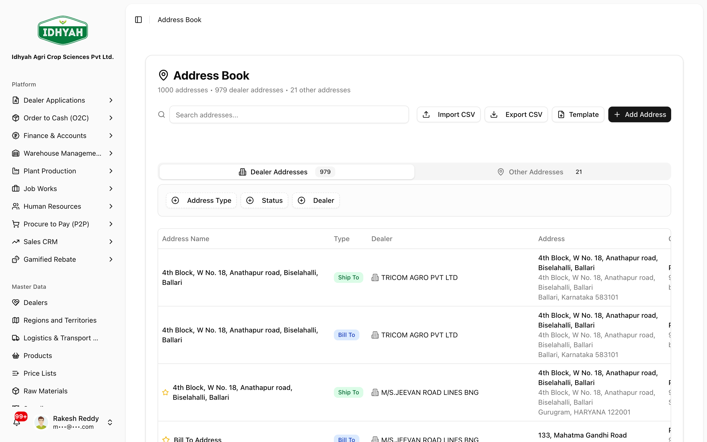
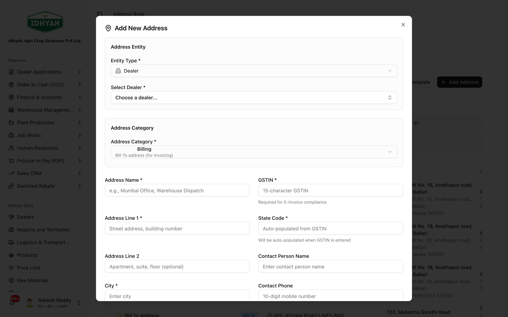
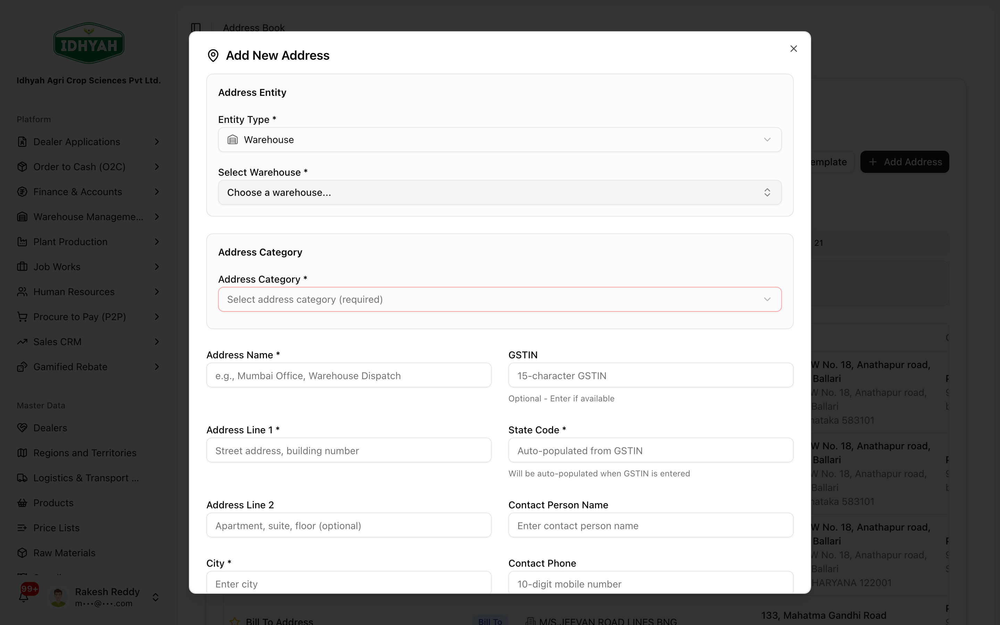
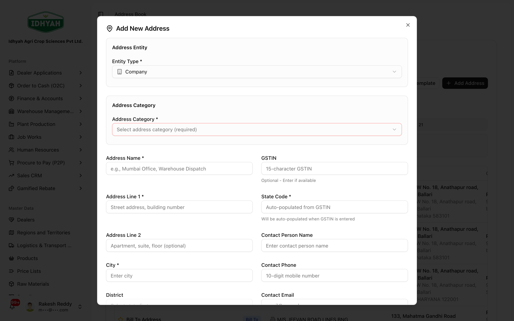

# Address Book

> One place for every address DAEE prints on a document — where you **bill** a dealer, where you
> **ship** the goods, and the **dispatch / seller** details of your own warehouses and company. These
> addresses drive **GST place-of-supply**, so getting them right keeps invoices and E-Way Bills correct.

> **Audience:** Customer + Internal · **Module:** shared master data (`address_book`) · **Status:** 🟢 Authored
> **Verified:** against `web_app/src/lib/address-book-jw.ts` + production tenant data on 2026-07-01.

## What this is for

Every document DAEE issues has **four address corners**:

- **Bill From / Seller** and **Ship From / Dispatch** — *your* side (company profile and the dispatching
  warehouse).
- **Bill To** and **Ship To** — the *dealer's* side (who is invoiced, and where the goods actually go).

The Address Book holds all of them in one shared list so an invoice, delivery challan, E-Invoice and
E-Way Bill all read from the same, tenant-isolated source. Because the **state** of the Bill-To/Ship-To
determines the **place of supply**, these addresses decide whether a sale is taxed as **CGST + SGST**
(intra-state) or **IGST** (inter-state) — which is why they must be accurate.

## The address model

| Address belongs to | Entity type | Typical address roles | Used as |
|---|---|---|---|
| **A dealer** | `dealer` | **Bill-To**, **Ship-To** (or **Both**) | Invoice "Bill To" / delivery "Ship To" |
| **A warehouse / plant** | `warehouse` | **Warehouse**, **Factory** | Ship-From / **Dispatch** + seller place of business |
| **Your company (tenant)** | `company` | **Company** | **Bill From / Seller** on the invoice |

- A dealer can have **many** addresses — e.g. a head office for billing and several delivery sites for
  shipping. One address of each role can be marked **default** so it is pre-selected on new orders.
- Each address carries the fields the documents need: name, two address lines, city, **district**,
  **state + state code**, postal code, country, **GSTIN**, and a **contact** (person, phone, email),
  plus optional **delivery instructions** and **landmark**.

## When to use it

- **Onboarding a dealer** — add at least one **Bill-To** and one **Ship-To** (or a **Both** address).
- **A dealer opens a new delivery site** — add a new **Ship-To** and mark it default if it will be the
  usual destination.
- **Setting up a warehouse / plant** — record its **dispatch / seller** address and **GSTIN** so it can
  ship and appear correctly on the E-Way Bill.
- **Company setup** — record the **company (Bill-From)** address used as the seller on every invoice.

## Who does this

| Role | What they do |
|---|---|
| **Sales / Dealer Admin** | Maintains dealer Bill-To / Ship-To addresses |
| **Warehouse / Ops** | Maintains warehouse dispatch / seller addresses |
| **Finance / Admin** | Maintains the company (Bill-From) profile and GSTINs |
| **O2C / Job Works** | *Selects* Bill-To / Ship-To on an order or job (does not usually create) |

## Step-by-step

The central **Address Book** screen lists every address with its **role**, **default** flag and **GSTIN**:

<!-- capture: { "project": "iacs-md", "route": "/address-book" } -->

### Add or edit an address
**Role:** Sales / Dealer Admin · **Result:** addresses available for selection on orders
1. Open **Address Book** (or a dealer's **Addresses** section) and click **Add address**.

   
   <!-- capture: { "project": "iacs-md", "route": "/address-book", "action": "open-create-dialog" } -->
2. Choose the **role** (Bill-To, Ship-To, or Both), then fill name, address lines,
   city, **district**, **state** (the **state code** drives GST place-of-supply), postal code, **GSTIN**,
   and a contact. Add **delivery instructions / landmark** for Ship-To sites if useful.
3. Mark the usual one **Default** for its role so it's pre-selected on new orders.
4. Save. The address is now selectable as Bill-To / Ship-To across O2C and Job Works.

### Warehouse dispatch / seller address
**Role:** Warehouse / Ops · **Result:** the warehouse can ship with correct seller details
1. In **Add Address**, set **Entity Type = Warehouse** and pick the warehouse. Choose the category —
   **Seller (Registered Office)** or **Dispatch (Shipping Location)** — then record the address and
   **GSTIN**. This becomes the **Ship-From / Dispatch** and seller place of business on invoices and
   E-Way Bills.

   
   <!-- capture: { "project": "iacs-md", "route": "/address-book", "action": "open-create-warehouse" } -->
2. Keep the **GSTIN** correct — it prints on the E-Invoice and E-Way Bill for both O2C dispatch and
   [Inter-Warehouse Transfers](./warehouse-management/iwt.md).

### Company (Bill-From) profile
**Role:** Finance / Admin · **Result:** the seller block on every invoice
1. In **Add Address**, set **Entity Type = Company** and choose the category (**Headquarters** / other).
   This is the tenant's own **Bill-From / Seller** address, inherited as the default seller on documents
   where no warehouse-specific seller applies.

   
   <!-- capture: { "project": "iacs-md", "route": "/address-book", "action": "open-create-company" } -->

## How the addresses are used downstream

- **O2C invoice & E-Invoice** — Bill-From (company) + Ship-From (warehouse) on your side; Bill-To +
  Ship-To (dealer) on theirs. The Ship-To state sets **place of supply** → CGST/SGST vs IGST.
- **Delivery Challan & E-Way Bill** — dispatch (warehouse) → destination (Ship-To); GSTINs on both ends
  come from these addresses.
- **Inter-Warehouse Transfer** — source and destination **warehouse** addresses/GSTINs. See
  [IWT → Pricing, invoice & E-Way Bill](./warehouse-management/iwt.md#pricing-invoice-e-way-bill).
- **Job Works** — customer Bill-To / Ship-To selection on the job work order.

## Common mistakes & warnings

> **Caution** The **state / state code** on the Ship-To (and the seller GSTIN) decide the tax split. A
> wrong state can turn an IGST sale into a CGST/SGST one (or vice-versa) and be rejected by the GST
> portal. Fix the address **before** invoicing, not after.

- **No default set** — orders don't pre-fill an address and users pick the wrong one. Mark one **default**
  per role.
- **Duplicate address names** — the same dealer can't have two addresses of the same role with the same
  name; give each a distinct, meaningful name (e.g. "Main Godown", "City Depot").
- **Missing GSTIN on a warehouse** — the E-Invoice / E-Way Bill will be wrong or blocked. Record it at
  setup.
- **Editing an address after it's on a posted document** — the document keeps what it printed; a new
  correct address only affects future documents.

<!-- INTERNAL:START -->
**Source of truth:** table `address_book` (shared layer `web_app/src/lib/address-book-jw.ts`). Polymorphic
FK — exactly one of `dealer_id` / `warehouse_id` / (both null = company tenant address). Constraints:
`entity_type ∈ {dealer, warehouse, company}`; `address_type ∈ {bill_to, ship_to, both, company,
warehouse, factory}`; `UNIQUE (dealer_id, address_type, address_name, tenant_id)` (duplicate-name guard).
**Tenant isolation:** RLS on `tenant_id` (profile lookup). Selection helpers: `listDealerAddresses`,
`getDefaultAddress` (`is_default = true AND is_active = true`), `listTenantCompanyAddresses` (Bill-From
candidates), `listWarehouseAddresses` (dispatch/seller). Indexes cover `(dealer_id, address_type,
is_default)`, `(tenant_id, address_type)` where `dealer_id IS NULL`, and `(warehouse_id)`. Consumers:
O2C invoice/E-Invoice, delivery challan, E-Way Bill, IWT, Job Works 4-corner confirmation, plant master
paired-write, ITC-04 custody audit.

**Known gaps / follow-ups:** screenshots captured against the dedicated `/address-book` screen for all
three entity types — dealer (Bill-To/Ship-To), warehouse (Seller/Dispatch), and company (Bill-From) —
plus the Add-Address modal (Entity Type, Address Category, GSTIN → State-Code auto-fill). *(Schema &
write paths → developer-guides.)*
<!-- INTERNAL:END -->

## Related workflows
[Dealers](./dealers/README.md) · [Order to Cash (O2C)](./o2c/order-to-cash.md) · [Inter-Warehouse Transfer](./warehouse-management/iwt.md) · [Finance & Accounts](./finance/README.md) · [Job Works](./job-works/README.md)

## Support and escalation
- **Dealer addresses** → Sales / Dealer Admin.
- **Warehouse dispatch / GSTIN** → Warehouse / Ops.
- **Company profile / seller GSTIN, tax-split disputes** → Finance.
