# Dealer Applications

> Onboard a new dealer — from a digitally-signed application to an approved, live dealer record.

> **Audience:** Customer + Internal · **Module:** `/dealer-applications` · **Status:** 🟢 Authored
> **Verified:** against `web_app/src/app/dealer-applications` + staging DB on 2026-06-17.

## What you can do
- **Design the application form** — add custom fields (Form Builder) and a Terms & Conditions template.
- **Create & complete an application** — an 11-section form with GST verification, partners, and licenses.
- **Get it digitally signed** — e-sign the Terms & Conditions.
- **Review & approve** — approve to create a live **dealer** (and address book entry), or reject.
- **Track** — dashboard metrics and status charts.

## Before you begin

### What you need
- Access to **Dealer Applications** — your role determines what you can do (see the table below).
- The applicant's **GSTIN** (15-digit) — it is verified live against the government GST portal; only an **Active** registration can proceed.
- The following information to hand before you start the form: PAN and Aadhaar numbers, partner details, trade and GST licenses (type, number, expiry), bank account/IFSC, registered and dispatch addresses.

### Roles and what each can do

| Role | What they can do |
|---|---|
| **Onboarding / Sales** | Create a new application, fill in all form sections, submit for e-signature |
| **Regional Manager (RM)** | Add a credit recommendation (optional review step before final approval) |
| **Approver / Sales Head** | Review a signed application and approve (creating the dealer) or reject |
| **Admin** | Configure the custom form fields and the Terms & Conditions template |

<!-- INTERNAL:START -->
**Permissions:** view (`dealer_applications:read`), create (`dealer_applications:create`), edit/submit (`dealer_applications:update`), optional RM review (`dealer_applications:rm_approve` — a custom verb, must be seeded), final approve/reject (`dealer_applications:approve`); approval also needs `master_dealers:update` to set the dealer code. Access is tenant-isolated via RLS; GSTIN is verified against the GSTN API. *(Full permissions matrix, tables, edge functions, and known gaps → [Dealer Applications Developer Guide](../../developer-guides/dealer-applications.md).)*
<!-- INTERNAL:END -->

### The lifecycle
An application moves through these stages:

**Draft → Submitted → Signed → Approved** *(or **Rejected** at review)*

You can only **approve** an application once the dealer has **signed** the Terms & Conditions.
<!-- INTERNAL:START -->Status values: `draft, submitted, esigned, approved, rejected` are in active use; `under_review` and `rm_review` exist but are currently unused (0 rows on staging) and final approval gates on `esigned`. Confirm the RM-review path with product. Details → [Developer Guide](../../developer-guides/dealer-applications.md).<!-- INTERNAL:END -->

---

## Quickstart: onboard a dealer
**You'll:** create an application, get it e-signed, and approve it into a live dealer · **Role:** Onboarding/Sales + Approver

1. Go to **Dealer Applications** and click **Add Application**. Enter the **15-digit GSTIN** — it's verified, and only **Active** GST registrations can proceed.
   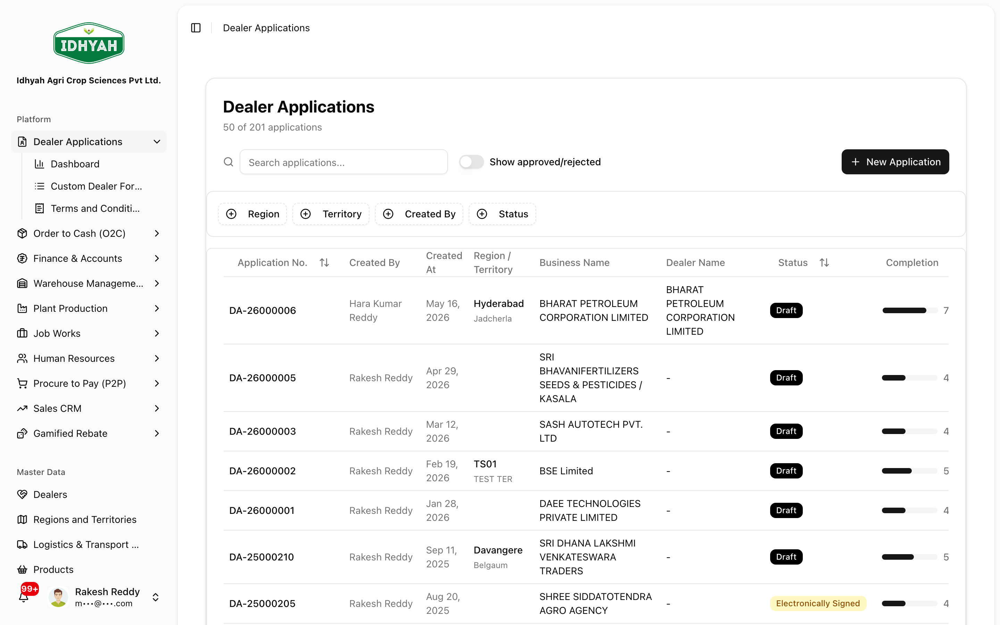
   <!-- capture: { "project": "iacs-md", "route": "/dealer-applications", "highlight": "button:has-text('Add')" } -->
   > **Caution** If the same GSTIN already has an in-progress application (**Draft** or **Submitted**), creation is blocked — continue the existing one instead.
2. Complete the application form (11 sections — see [Guides](#how-to-complete-the-application-form)). Progress autosaves.
   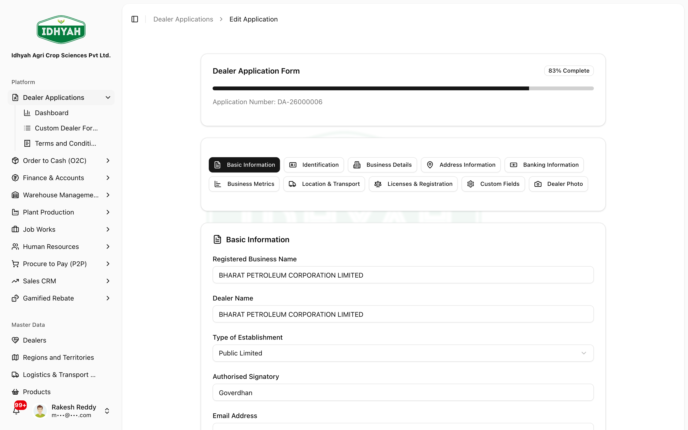
   <!-- capture: { "project": "iacs-md", "route": "/dealer-applications", "action": "open-first-application" } -->
3. Send for **e-signature** of the Terms & Conditions; once the dealer signs, the application is marked **Signed**.
4. Open the **Signed** application and click **Approve** → a live **dealer** record + address book entry are created.
   
   <!-- capture: { "project": "iacs-md", "route": "/dealer-applications", "action": "open-approve" } -->

**Next steps:** set the dealer code & credit limit in [Dealers](../dealers/README.md); raise their first order in [O2C](../o2c/order-to-cash.md).

---

## Guides

### How to set up the application form (Form Builder)
**Role:** Admin · **Page:** `/dealer-applications/custom-dealer-form-builder`
Add **custom fields** that appear in the application's *Custom Fields* section (label, type, required, options).
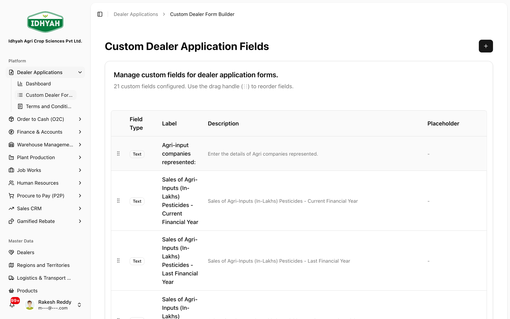
<!-- capture: { "project": "admin", "route": "/dealer-applications/custom-dealer-form-builder" } -->

### How to set up Terms & Conditions
**Role:** Admin · **Page:** `/dealer-applications/dealer-application-terms-and-conditions`
Edit the **T&C** in the rich-text editor; insert **merge variables** (e.g. dealer/business name) that
populate per application. This is the document the dealer e-signs.
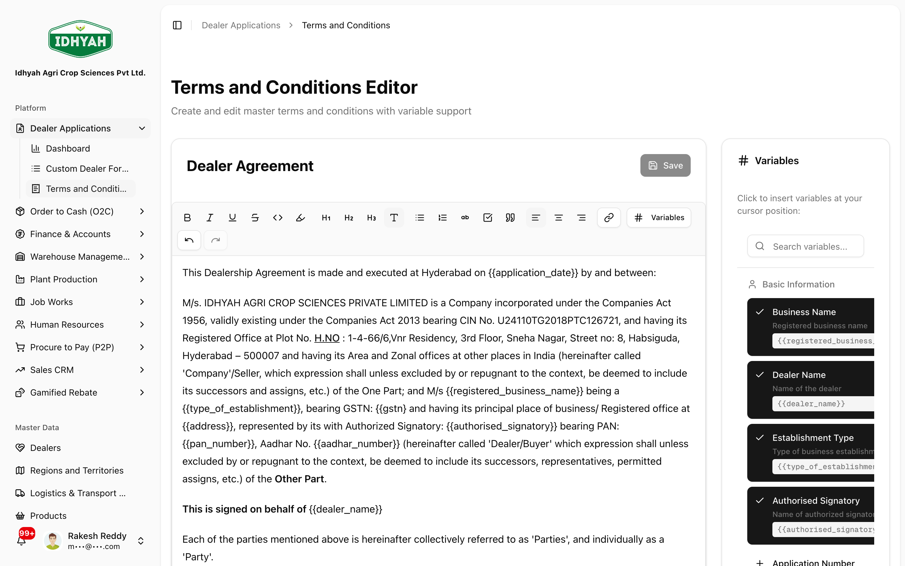
<!-- capture: { "project": "admin", "route": "/dealer-applications/dealer-application-terms-and-conditions" } -->

### How to complete the application form
**Before:** application in **Draft** · **Result:** all sections complete, ready to e-sign

Open the application from the list to enter the form. It's split into the sections shown down the side —
work through them in order. Progress **autosaves** and a completion indicator shows what's left.

1. **Basic Information** — applicant / business name, type of establishment, primary contact.
   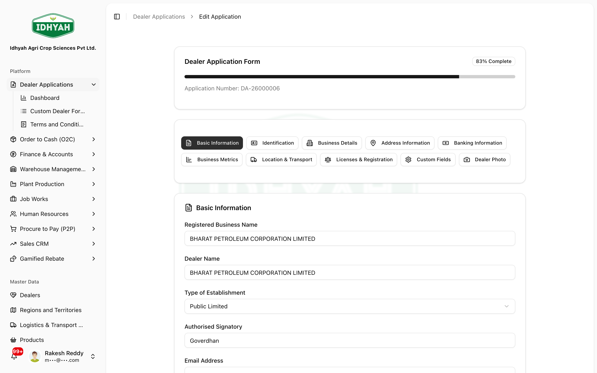
   <!-- capture: { "project": "iacs-md", "route": "/dealer-applications", "action": "open-app-form", "section": "Basic Information" } -->
2. **Identification** — PAN and Aadhaar.
   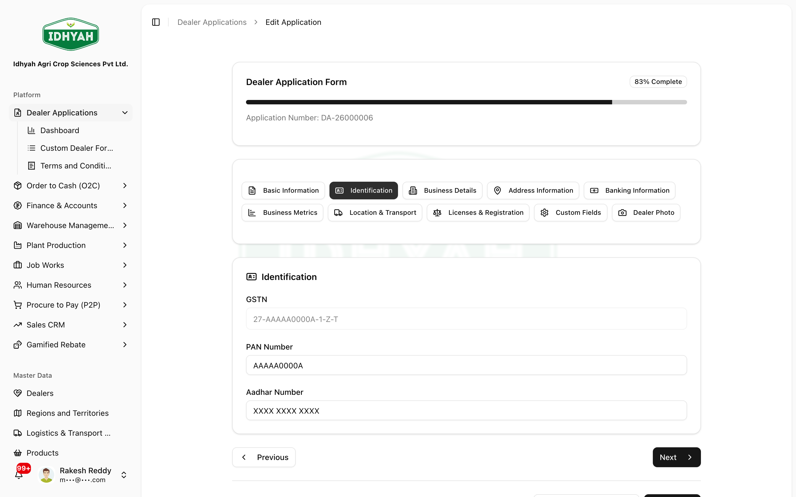
   <!-- capture: { "project": "iacs-md", "route": "/dealer-applications", "action": "open-app-form", "section": "Identification" } -->
3. **Business Details** — GSTIN (verified in real time; a non-Active GST blocks the application), trade name, category.
   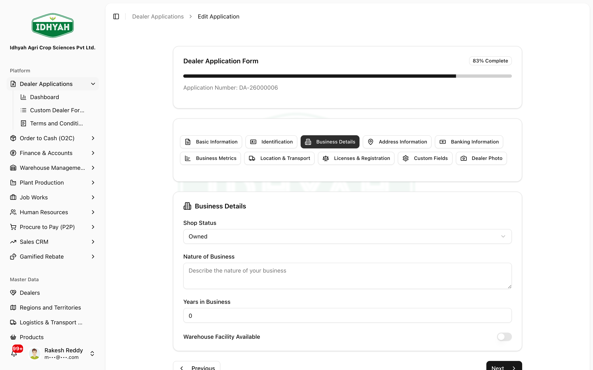
   <!-- capture: { "project": "iacs-md", "route": "/dealer-applications", "action": "open-app-form", "section": "Business Details" } -->
4. **Address Information** — registered and dispatch addresses.
   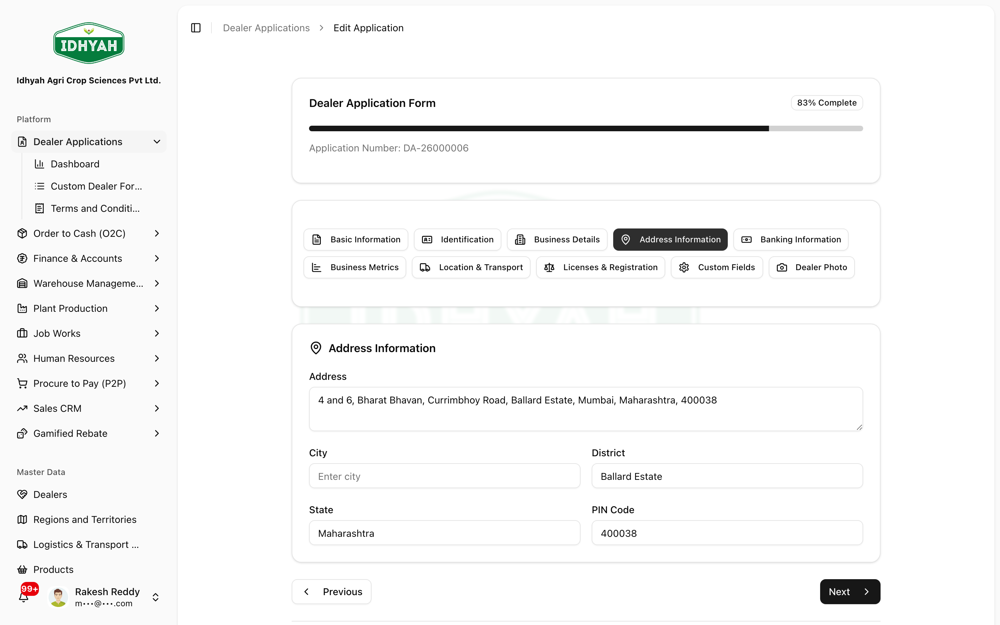
   <!-- capture: { "project": "iacs-md", "route": "/dealer-applications", "action": "open-app-form", "section": "Address Information" } -->
5. **Banking Information** — bank account / IFSC details.
   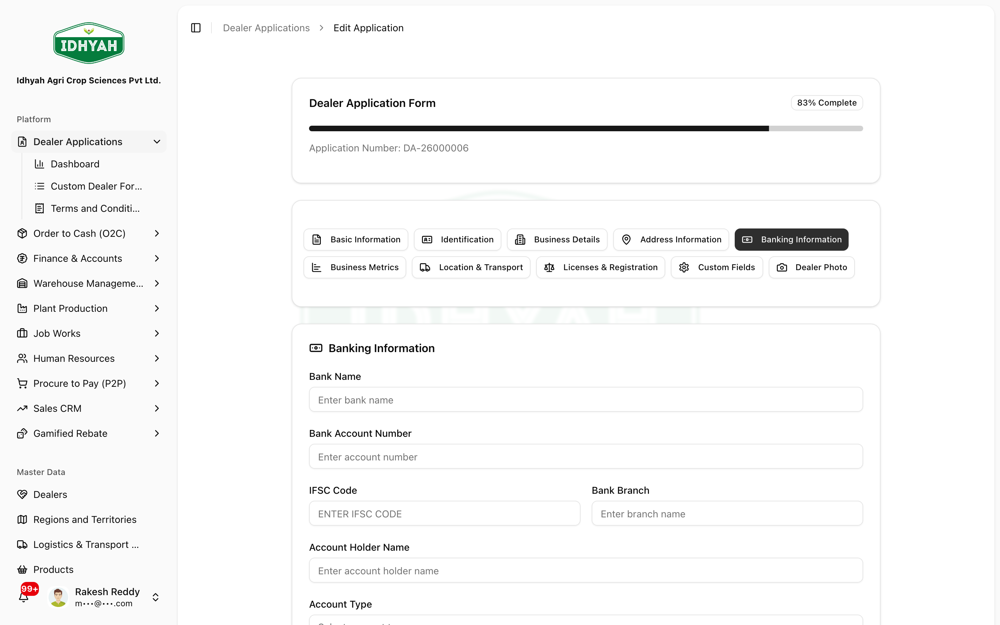
   <!-- capture: { "project": "iacs-md", "route": "/dealer-applications", "action": "open-app-form", "section": "Banking Information" } -->
6. **Business Metrics** — turnover / scale details.
   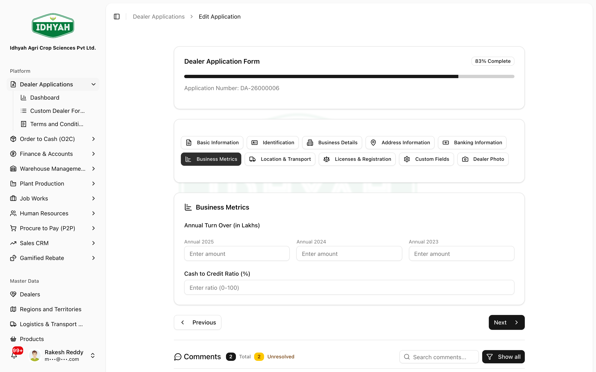
   <!-- capture: { "project": "iacs-md", "route": "/dealer-applications", "action": "open-app-form", "section": "Business Metrics" } -->
7. **Location & Transport** — location and preferred transport.
   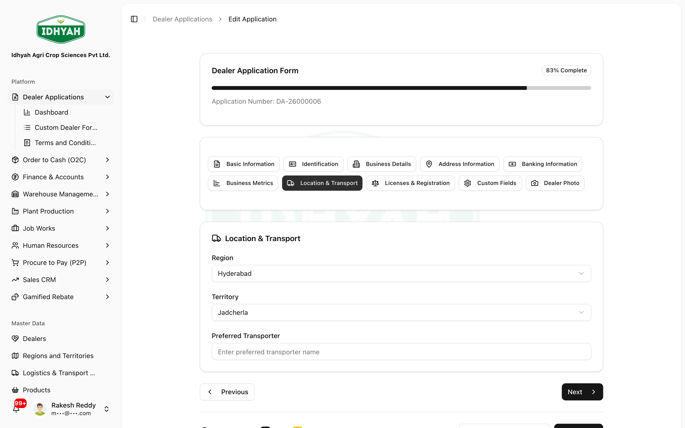
   <!-- capture: { "project": "iacs-md", "route": "/dealer-applications", "action": "open-app-form", "section": "Location & Transport" } -->
8. **Licenses & Registration** — GST, Trade License, etc., each with number and expiry.
   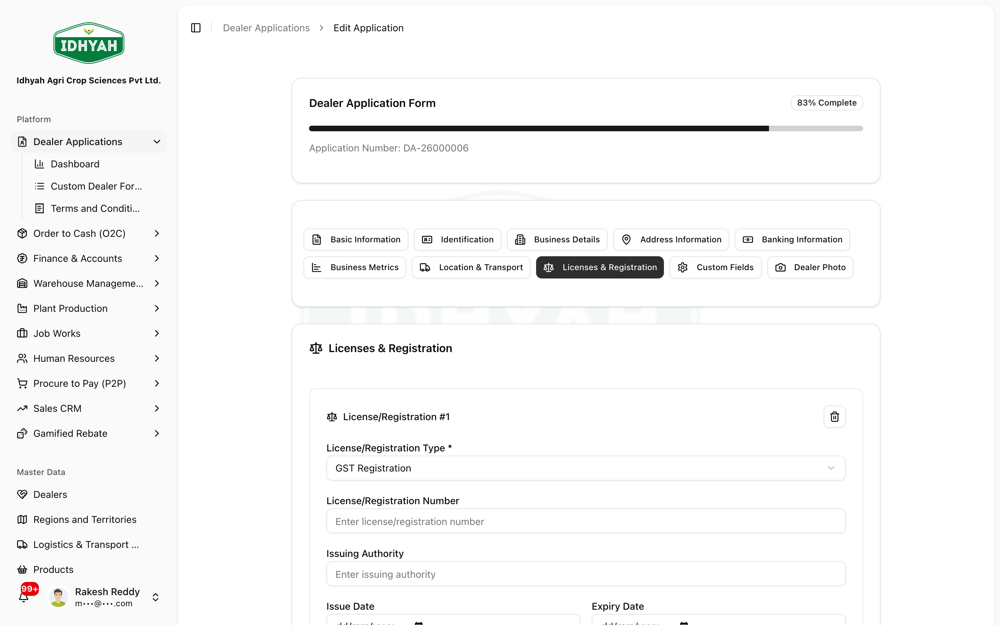
   <!-- capture: { "project": "iacs-md", "route": "/dealer-applications", "action": "open-app-form", "section": "Licenses & Registration" } -->
9. **Custom Fields** — any tenant-specific fields set up in the Form Builder.
   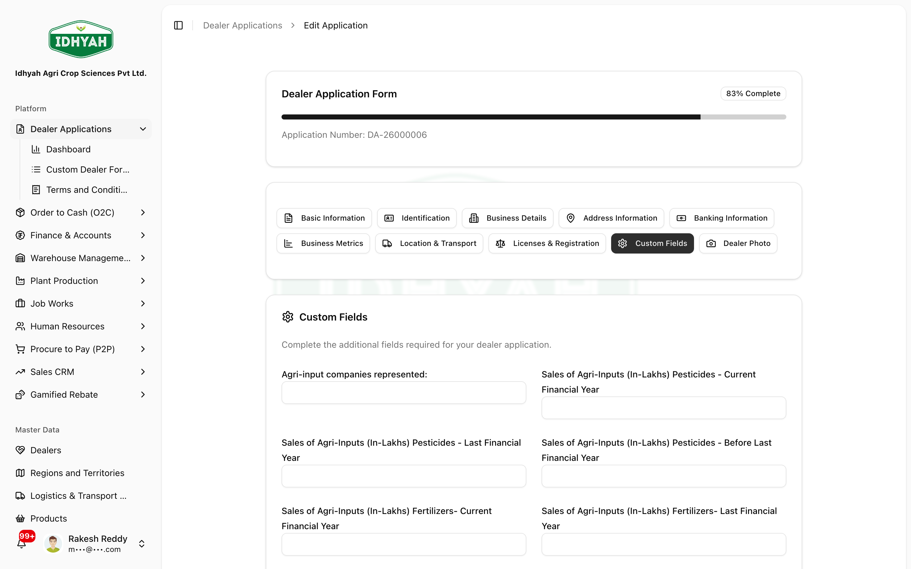
   <!-- capture: { "project": "iacs-md", "route": "/dealer-applications", "action": "open-app-form", "section": "Custom Fields" } -->
10. **Dealer Photo** — capture or upload the dealer's photo.
    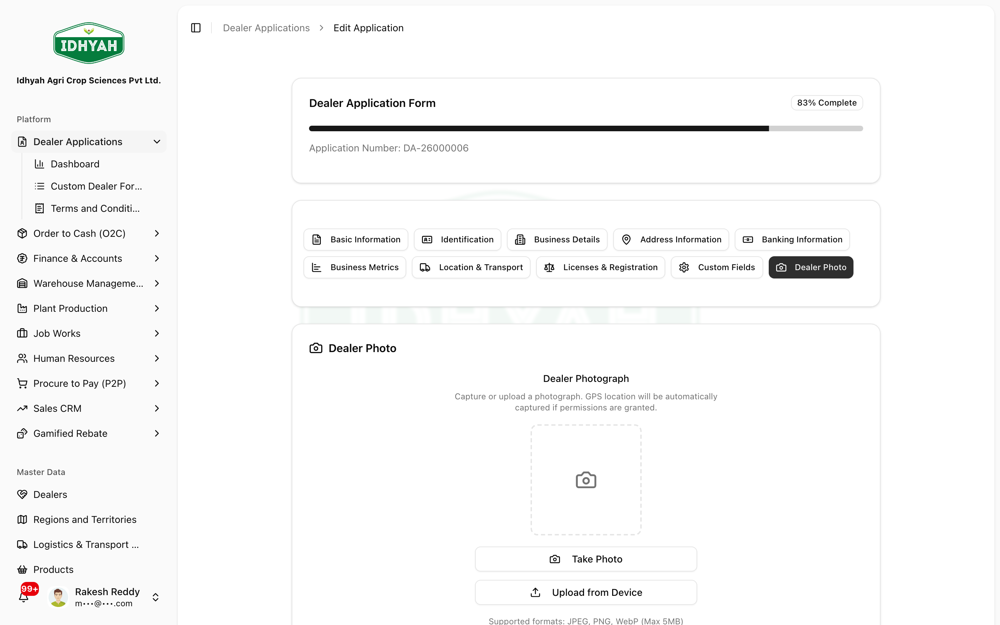
    <!-- capture: { "project": "iacs-md", "route": "/dealer-applications", "action": "open-app-form", "section": "Dealer Photo" } -->

> **Note** A **Partner Details** section also appears when the establishment type has partners.
> **Tip** The GSTIN field in *Business Details* verifies the business in real time — a non-Active GST blocks the application.

### How to submit the application and get it e-signed
**Before:** all form sections complete · **Who:** Onboarding / Sales (needs edit access) · **Result:** application **Signed**, ready for approval

Submitting locks the form and sends the **Terms & Conditions** to the dealer's **authorised signatory**
for a legally-valid electronic signature. Step by step:

1. On the completed application, click **Submit**. DAEE locks the form, generates the **application PDF**,
   and creates the e-signature request. *(You need edit access; an application can't be submitted twice.)*
2. A **secure signing link** is created for the **authorised signatory** named on the form — addressed
   to their **email and mobile number**. Open it with the **Sign Document** button on the application, or
   share the link with the signatory.
3. The signatory reviews the Terms & Conditions and **signs electronically**. The signing status updates
   automatically (it moves through *requested → signed* as the signature provider confirms it).
4. Once signing is confirmed, the application is marked **Signed** and the **signed PDF** can be
   downloaded from the application. It is now ready for **Approve**.

> **Note** The authorised signatory's **email and mobile** must be filled in on the form *before* you
> submit — that's how the signing link is delivered. While you wait, the application stays **Submitted**
> and the page refreshes the signing status on its own.
> **Tip** If the signature **fails or expires**, you can re-send the request from the application.
<!-- INTERNAL:START -->`submitDealerApplication` (needs `dealer_applications:update`) generates the PDF and creates a `dealer_application_esign` row (deduped if one is already `initiated`/`requested`/`drafted`) via the `initiate-esign` edge fn; the provider returns `esign_url`/`signing_url`. The `esign-webhook` flips `esign_status → signed` and `application_status → esigned`. E-sign codes: `drafted → initiated → requested → signed` (failures `request_failed`/`failed_at_provider`/`expired`). **Discrepancy to confirm with product:** `services/esign.service.ts → canInitiateESign` guards on `application_status === 'approved'` (a separate manual re-initiation path), which is inconsistent with this submit-time initiation flow.<!-- INTERNAL:END -->

### How to review as a Regional Manager (optional)
**Who:** Regional Manager · **Before:** application **Signed** · **Result:** a credit recommendation recorded for the approver (or the application **Rejected**)

This is an **optional recommendation step** for organisations that want a regional review *before* final
approval. The RM **advises** the approver — they do **not** create the dealer themselves.

1. Open a **Signed** application and choose the **RM review** action.
2. To **recommend approval** — enter a **recommended credit limit** (a positive amount) and **feedback of
   at least 20 characters** explaining the recommendation.
3. To **reject** — give a **rejection reason of at least 20 characters**.
4. The recommendation and feedback are saved on the application for the **final approver** to see.

> **Note** RM review is a **recommendation only** — it does not create the dealer. The final **Approve**
> step (below) is what creates the live dealer record.
<!-- INTERNAL:START -->`rmApproveDealerApplication`: `credit_limit_recommendation` (positive number), `feedback` (≥20 chars), `action` = approve|reject, `rejection_reason` (≥20 chars). "approve" sets `application_status → rm_review` (NOT `approved`). Currently unused on staging (0 rows). **Known gap:** the final `approveDealerApplication` gates on `esigned`, so an application moved to `rm_review` can be neither finally approved nor rejected — confirm the intended chain with product.<!-- INTERNAL:END -->

### How to approve (create the dealer) or reject
**Role:** Approver
- **Approve** (from a signed application): runs the approval process, which creates the **dealer**
  (master record) and an **address book** entry. Then set the **dealer code**.
  > **Caution** Approval is final — it creates a live dealer you can immediately transact with.
- **Reject** (from a submitted or signed application): marks it **Rejected** with a reason.

---

## Common use cases
- **Onboard a dealer and fulfil the first order** → the full cross-module journey:
  [open the guide](../use-cases/onboard-dealer-first-order.md).
- **Standardise what every applicant must provide** → add required **custom fields** + mandatory **licenses**.

## Reference
- **Statuses:** Draft, Submitted, Signed, Approved, Rejected.
<!-- INTERNAL:START -->Status codes: `draft, submitted, esigned, approved, rejected` (+ unused `under_review`, `rm_review`). E-signature progresses `drafted → initiated → requested → signed` (failures: `request_failed`, `failed_at_provider`). Schema → [Developer Guide](../../developer-guides/dealer-applications.md).<!-- INTERNAL:END -->
- **Key fields:** GSTIN, PAN, Aadhaar, registered business name, dealer name, type of establishment, region, territory, partners, licenses (type/number/expiry), bank, addresses, custom fields, photo.
- **Outputs:** application PDF; on approval → a **dealer** in [Dealers](../dealers/README.md).
<!-- INTERNAL:START -->
**Permissions:** view / create / edit-submit / optional RM review / approve-reject; approval also needs
the Dealers edit permission. GSTIN verification, e-signature, and approval-to-dealer run as backend
services. *(Edge functions, tables and code → [Dealer Applications Developer Guide](../../developer-guides/dealer-applications.md).)*

**Known gap (verify with product):** an application left in **RM review** can currently be **neither
approved nor rejected** — final approval requires the signed state, and reject doesn't accept RM-review.
<!-- INTERNAL:END -->

## Troubleshooting
| What you see | Why it happens | How to fix it |
|---|---|---|
| **"Cannot create dealer application. '&lt;Business&gt;' has GST status '&lt;status&gt;'. Only businesses with Active GST registration can apply."** | When you enter the GSTIN, DAEE checks it live against the government GST portal. This business's GST registration is **not active** — its status is **cancelled, suspended, inactive, or provisional** — so it can't be onboarded as a dealer. The message shows the business name and the **exact status** the portal returned. | First confirm you typed the **correct GSTIN**. If it's right, the dealer must get their **GST registration regularised/reactivated** on the GST portal so its status reads **Active** (a *provisional* registration must be fully activated first); then create the application again. |
| **Creating the application is blocked as a duplicate.** | An application for this GSTIN is already in progress (status **Draft** or **Submitted**) — the same business can't have two open applications. | Open and continue the **existing** application from the list instead of starting a new one. |
| **"Application must be digitally signed before approval."** | You tried to **Approve** the application before the dealer e-signed the Terms & Conditions. | Send it for **e-signature** and wait until its status is **Signed**, then approve. |

## Support and escalation
- **E-sign link not delivered or expired** — re-send from the application detail page. If the failure persists, contact your DAEE administrator to check the e-sign queue.
- **GSTIN shows as non-Active but the business is registered** — ask the dealer to check their GST registration status directly on the [GST portal](https://www.gst.gov.in) and regularise it before re-applying.
- **Application stuck after RM review** — this is a known platform limitation. Raise a request with your DAEE administrator to unlock the application.
- **Dealer created but address book is missing** — contact your administrator; this can happen if the address book step fails during approval and can be corrected manually.

## Next steps & related
[Dealers](../dealers/README.md) · [O2C — take the first order](../o2c/order-to-cash.md) · [Onboard-dealer use case](../use-cases/onboard-dealer-first-order.md)
