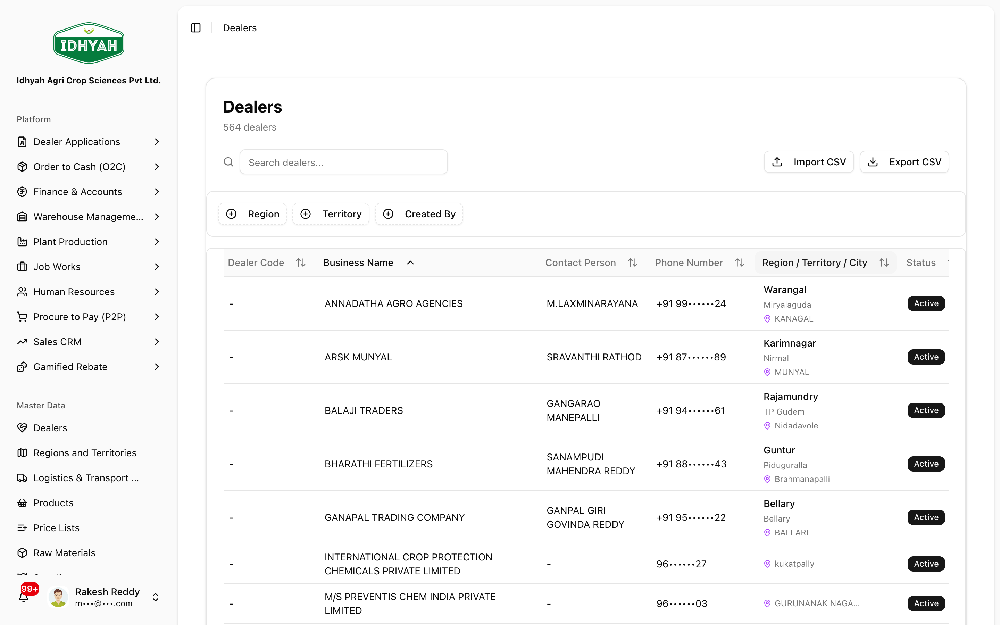
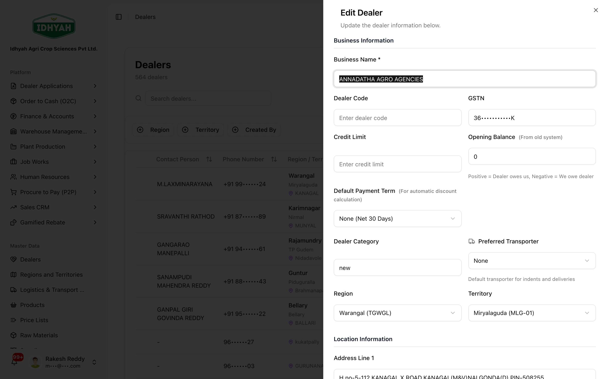
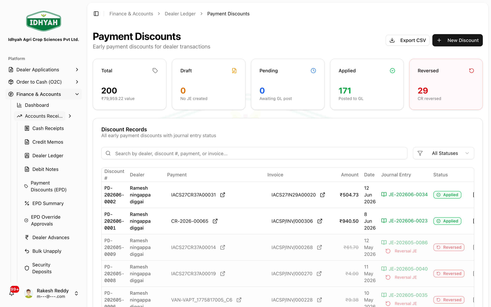
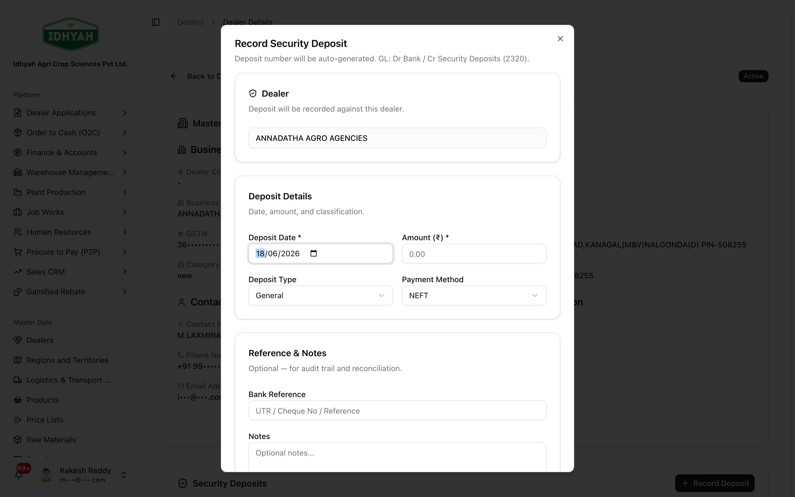

# Dealers

> Your dealer master — credit limits, discounts, security deposits, and the record every O2C order bills against.

> **Audience:** Customer + Internal · **Module:** `/dealers` · **Status:** 🟢 Authored
> **Verified:** against `web_app/src/app/dealers` + staging DB on 2026-06-17.

## What you can do
- **Find & view** any dealer (credit limit, outstanding, region/territory, GSTIN/PAN).
- **Edit** dealer details and **activate/deactivate** a dealer.
- **Set dealer-specific discounts** (early-payment discount, EPD).
- **Record security deposits** held against the dealer.
- **Import / export** dealers via CSV.
- **Audit** every change to a dealer.

> **Note** You don't *create* a dealer here. A dealer is created when a **[Dealer Application](../dealer-applications/dealer-applications.md)** is approved (or via **CSV import**). This module manages dealers after they exist.

## Before you begin
You need the **Dealers** permission. To set discounts you also touch the discount configuration;
to record deposits you use the dealer detail page.
<!-- INTERNAL:START -->
**Permissions:** view (list/detail), create (CSV import; also granted when an application is approved),
and edit. Access is tenant-isolated. *(Code, schema and services → [Dealers Developer Guide](../../developer-guides/dealers.md).)*
<!-- INTERNAL:END -->

---

## Quickstart: set a dealer's credit limit & status
**You'll:** open a dealer and update their credit terms · **Role:** Sales/Admin with Dealers access

1. Go to **Dealers** — search/filter the list to find the dealer.
   
   <!-- capture: { "project": "iacs-md", "route": "/dealers", "highlight": "input[type=search]" } -->
2. On the dealer's row, click the **⋮ (Open menu) → Edit**, set the **credit limit** and **status** (Active/Inactive) in the form, and save.
   
   <!-- capture: { "project": "iacs-md", "route": "/dealers", "action": "open-dealer-edit" } -->
   > **Note** Setting status to **Inactive** flips the dealer off (the system keeps `status` and the
   > active flag in sync). The **credit limit** + **outstanding** drive the O2C credit check at order time.

**Next steps:** [set a dealer discount](#how-to-set-a-dealer-specific-discount-epd) · raise an order in [O2C](../o2c/order-to-cash.md).

---

## Guides

### How to edit a dealer
From the **Dealers** list, click the **⋮ (Open menu)** on the dealer's row → **Edit**. Update business
name, GSTIN/PAN, region/territory, credit limit, and status in the form, then save. Changes are audited.

<!-- capture: { "project": "iacs-md", "route": "/dealers", "action": "open-dealer-edit" } -->

### How to set a dealer-specific discount (EPD)
Dealer early-payment discounts are managed under **Finance → Payment Discounts (EPD)**: add the dealer's
EPD %, which then resolves over the tenant-wide slabs.

<!-- capture: { "project": "iacs-md", "route": "/finance/payment-discounts" } -->
> **Tip** Discounts resolve in priority order: **dealer-specific** → **tenant-wide slabs** → none.
> Configure tenant-wide slabs under **Finance → EPD Slab Configuration**.
<!-- INTERNAL:START -->Dealer-specific EPD is stored per dealer and resolves over the tenant-wide slabs; there is **no** Discounts card on the dealer detail page. *(Schema → [Dealers Developer Guide](../../developer-guides/dealers.md).)*<!-- INTERNAL:END -->

### How to record a security deposit
Open a dealer (from the list), scroll to the **Security Deposits** card, and click **Record Deposit** (amount, date, reference).

<!-- capture: { "project": "iacs-md", "route": "/dealers", "action": "open-record-deposit" } -->
> Deposits are also visible in **Finance → Security Deposits**.

### How to import / export dealers
Use **Export** to download all dealers as CSV; use **Import** to bulk-create/update from CSV.
<!-- INTERNAL:START -->Import requires the Dealers **create** permission.<!-- INTERNAL:END -->

### How to review a dealer's ledger & audit
See running balance in **Finance → [Dealer Ledger](../finance/README.md)**; every field change is in the dealer's **audit** trail.

---

## Common use cases
- **Onboard a dealer and fulfil the first order** → [open the guide](../use-cases/onboard-dealer-first-order.md) (the dealer record is created at the end of that flow).
- **Put a dealer on credit hold** → set status Inactive and/or reduce the credit limit; O2C approval then blocks new orders.

## Reference
- **Key fields:** Business Name, Dealer Code, GSTIN, PAN, Credit Limit, Outstanding, Status, Region, Territory.
- **Status:** Active / Inactive.
- **Where dealers come from:** approved **Dealer Applications**, or **CSV import**. (No direct "create dealer" screen.)
- **Related:** dealer-specific discounts, tenant-wide EPD slabs, security deposits.
<!-- INTERNAL:START -->
**Permissions:** Dealers view / create / edit (tenant-isolated). The data model, tables, edge functions
and GL effects are documented in the **[Dealers Developer Guide](../../developer-guides/dealers.md)** — not repeated here.
<!-- INTERNAL:END -->

## Troubleshooting
| Symptom | Cause | Fix |
|---|---|---|
| Can't create a dealer here | By design — no direct create | Approve a Dealer Application, or use CSV Import |
| New orders blocked for a dealer | Credit limit exceeded / overdue / Inactive | Adjust credit limit/status, or collect overdue (see O2C) |
| Discount not applying | No dealer-specific config + no tenant slab | Add a dealer discount, or configure EPD slabs in Finance |

## Next steps & related
[Dealer Applications](../dealer-applications/dealer-applications.md) · [O2C](../o2c/order-to-cash.md) · [Finance — Dealer Ledger / Security Deposits](../finance/README.md) · [Address Book (Bill-To / Ship-To)](../address-book.md)
