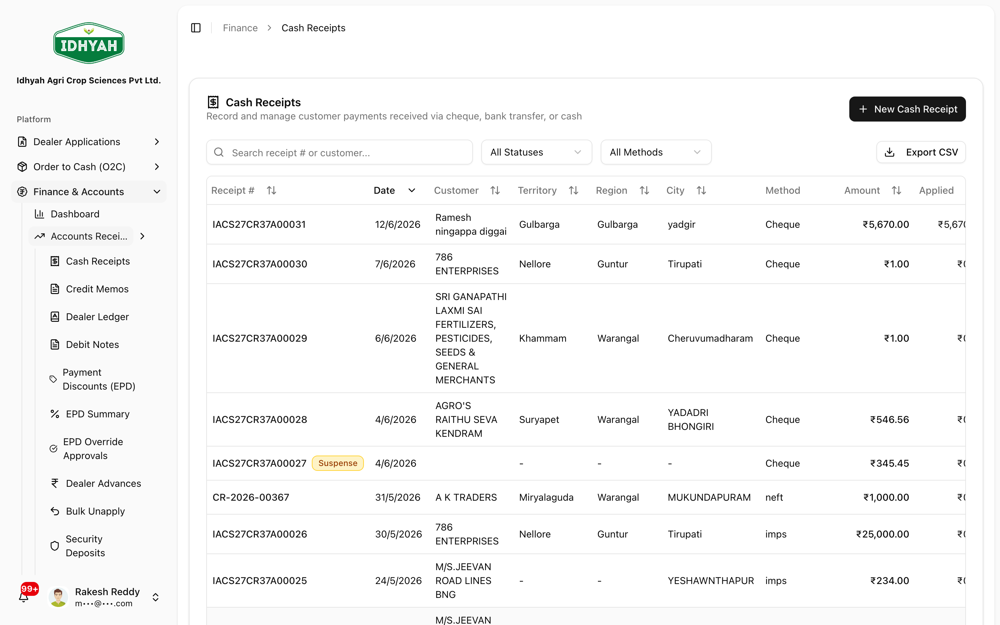
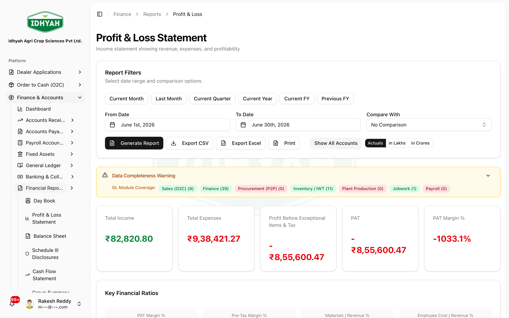
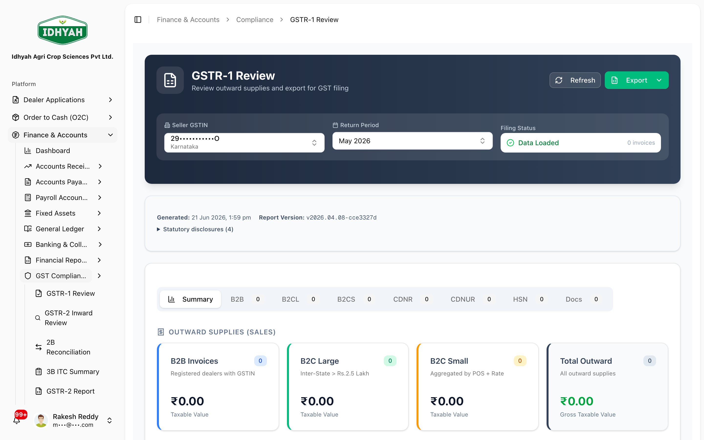

# Finance & Accounts

> Your books of account — receivables, payables, the general ledger, banking, statutory reports, and
> GST compliance. Every transaction across DAEE posts here automatically.

> **Audience:** Customer + Internal · **Module:** `/finance` · **Status:** 🟢 Authored (hub)
> **Verified:** against `web_app/src/app/finance` + production tenant config on 2026-06-18.

> **Detailed guides** — this page is the overview. For step-by-step depth, see:
> **[Receipts, Credits & Discounts](./receipts-credits-discounts.md)** (cash receipts, applying to
> invoices, credit/debit notes, dealer advances, and how **EPD/APD** are calculated & customized) ·
> **[Accounts Payable](./accounts-payable.md)** (supplier payments with **TDS**, supplier
> ledger/AP aging) · **[Payroll Accounting](./payroll.md)** (payroll posting, disbursement,
> statutory liabilities) · **[Bank Collections (VAN)](./van.md)** ·
> **[Finance — Screen Index](./screens.md)** (a picture of every Finance page).

## What you can do
- **Accounts Receivable (AR)** — record **cash receipts**, apply them to invoices, issue **credit/debit notes**, manage **early-payment discounts (EPD)**, **dealer advances**, **security deposits**, and the **dealer ledger** + AR aging.
- **Accounts Payable (AP)** — supplier invoices, **vendor payments**, supplier ledger, AP aging.
- **General Ledger (GL)** — **chart of accounts**, **journal entries**, trial balance, GL report.
- **Banking & Collections** — **VAN** (virtual account) payments, virtual account numbers, **payment reconciliation**.
- **Financial Reports** — Day Book, **P&L**, **Balance Sheet**, Cash Flow, **Schedule III disclosures**, plus assurance reports.
- **GST Compliance** — **GSTR-1**, GSTR-2/2B reconciliation, GSTR-3B ITC.
- **Fixed Assets** — asset register, acquisitions, capitalization, **depreciation runs**.
- **Payroll Accounting** — payroll posting, disbursement, liabilities.
- **Setup** — **posting profiles**, payment terms, **fiscal periods**, EPD configuration, banks, VAN configuration.

## Before you begin

### What you need
- A **chart of accounts** and **posting profiles** configured (these route every transaction to the right GL accounts).
- **Fiscal periods** opened for the dates you're posting to.
- For collections: **bank** and **VAN** configuration; for AR/AP: dealers and suppliers exist.

### Roles and what each can do

| Role | Typical responsibilities |
|---|---|
| **AR clerk** | Record cash receipts, apply to invoices, manage credit/debit notes, EPD |
| **AP clerk** | Capture supplier invoices, run vendor payments |
| **Accountant** | Post journal entries, run depreciation, reconcile bank/VAN |
| **Controller / CFO** | Close fiscal periods, review statements, approve EPD overrides |
| **Auditor** | Read-only review of ledgers, audit trail, and assurance reports |

<!-- INTERNAL:START -->
Access is permission-gated per area (`finance_cash_receipts`, `finance_credit_memos`, `finance_accounts_payable`, `dealer_ledger`, `finance_journal_entries`, `finance_chart_of_accounts`, `finance_fiscal_periods`, `finance_reports`, `finance_disclosures`, `finance_compliance`, `finance_aging_reports`, `ar_aging_snapshots`, `posting_profiles`, `fixed_assets`, `van_payment_collections`, `dealer_security_deposits`, `data_imports`, `finance_bulk_operations`) and tenant-isolated via RLS. GL posting is centralised via posting profiles (`resolveGL`/`resolveMultipleGL` → `createAutoJournalEntry`, returns `journal_id`). Edge fns: `axis-bank-posting`/`axis-bank-validation` (VAN), `debit-note-einvoice`, `o2c-sales-return-management`. *(Posting model, tables, compliance controls → [Finance Developer Guide](../../developer-guides/finance.md).)*
<!-- INTERNAL:END -->

### How Finance is organised
```
AR  ── Cash Receipts · Credit/Debit Notes · EPD · Dealer Advances · Security Deposits · Dealer Ledger · AR Aging
AP  ── Supplier Invoices · Vendor Payments · Supplier Ledger · AP Aging
GL  ── Chart of Accounts · Journal Entries · Trial Balance · GL Report
Bank── VAN Payments · Virtual Account Numbers · Reconciliation
Rpt ── Day Book · P&L · Balance Sheet · Cash Flow · Schedule III · assurance reports
GST ── GSTR-1 · GSTR-2/2B · GSTR-3B
FA  ── Asset Register · Acquisitions · Capitalization · Depreciation
Pay ── Payroll Posting · Disbursement · Liabilities
Set ── Posting Profiles · Payment Terms · Fiscal Periods · EPD config · Banks · VAN config
```
**Everything posts to the GL automatically** through posting profiles — operational events (invoices,
receipts, returns, receipts of goods, depreciation, payroll) create the journal entries for you.

---

## Key workflows

### Record a cash receipt and apply it (with EPD)
**Role:** AR clerk · **Result:** dealer balance reduced; EPD credit if eligible
1. **Cash Receipts → New Cash Receipt** — capture the amount, date, mode, and dealer.
   
   <!-- capture: { "project": "iacs-md", "route": "/finance/cash-receipts" } -->
2. **Apply to Invoices** — tick the dealer's open invoices and set the amount per line.
3. If paid within the early-payment window, an **EPD credit note** is issued automatically.
> **Tip** Full walkthrough (selecting invoices, partial apply, how the discount is figured): **[Receipts, Credits & Discounts](./receipts-credits-discounts.md)**.

### Issue a credit note or debit note
**Role:** AR clerk · **Result:** the dealer's balance is reduced (credit) or increased (debit)
1. **Credit Memos → Create** for a credit note (e.g. an adjustment or earned discount), or **Debit Notes → Create** to raise a charge on the dealer.
2. **Apply** it to the dealer's open invoices. Tax-bearing credit notes carry an e-credit-note and flow to GST returns.
> **Tip** Details and the difference between the two: **[Receipts, Credits & Discounts](./receipts-credits-discounts.md#credit-memos-debit-notes)**.

### Take & apply a dealer advance
**Role:** AR clerk · **Result:** money held as credit, applied to future invoices
1. **Dealer Advances → Create** (or convert the unused part of a cash receipt to an advance).
2. **Apply** the advance to invoices as they're raised — earning **APD** if your organization offers it.

### Record or refund a security deposit
**Role:** AR clerk · **Result:** a refundable deposit tracked against the dealer
1. **Security Deposits → Record Deposit** — amount, date, reference. Use **Refund/Forfeit** when it's returned or retained.

### Correct a misapplied receipt (un-apply)
**Role:** AR clerk / Accountant · **Result:** an application reversed cleanly
1. **Bulk Unapply** — select the receipt(s)/application(s) to reverse; DAEE backs out the allocation and its ledger postings.
> **Caution** Always reverse through **Bulk Unapply** (not by editing entries) so the dealer ledger and GL stay in step.

### Chase overdue payments
**Role:** AR clerk / Controller · **Result:** know who owes what, and follow up
1. **AR Aging** (or **Dealer Outstanding**) — see balances bucketed by age (current / 30 / 60 / 90+ days).
2. **Dealer Ledger** — open a dealer's running account (invoices, receipts, notes, balance); send a **Customer Statement**.

### Approve an EPD override
**Role:** Controller · **Result:** a non-standard discount authorised
1. **EPD Override Approvals** — review requests where a discount differs from the configured slabs and **approve or reject** (within the allowed override cap).

### Post a manual journal entry
**Role:** Accountant · **Result:** a balanced entry posted to the GL
1. **Journal Entries → New** — choose the **fiscal period**, add debit/credit lines (must balance), and a narration.
   
   <!-- capture: { "project": "iacs-md", "route": "/finance/journal-entries" } -->
2. Post. The entry appears in the **Day Book**, **Trial Balance**, and **GL Report**.
> **Caution** You can only post into an **open** fiscal period.

### Pay a supplier
**Role:** AP clerk · **Result:** AP liability settled
1. **Accounts Payable → Vendor Payments** — select approved, matched supplier invoices and record the payment (honours TDS where applicable).

### Run a month-end close
**Role:** Controller · **Result:** period closed, statements ready
1. Ensure all receipts, invoices, returns, depreciation, and payroll for the month are posted.
2. Review **Trial Balance**, **P&L**, **Balance Sheet**, and **GL–AR reconciliation**.
3. **Fiscal Periods → Close** the month (locks posting into it).
   
   <!-- capture: { "project": "iacs-md", "route": "/finance/reports/profit-loss" } -->

### File GST returns
**Role:** Accountant / Compliance · **Result:** GSTR review packs ready
1. **GST Compliance → GSTR-1** (outward) — review sales + credit/debit notes.
   
   <!-- capture: { "project": "iacs-md", "route": "/finance/compliance/gstr1" } -->
2. **GSTR-2B reconciliation** and **GSTR-3B ITC** — match purchases and summarise input-tax-credit.

### Run depreciation
**Role:** Accountant · **Result:** depreciation posted for the period
1. **Fixed Assets → Acquisitions / Capitalization** — make sure new assets are capitalized into the **Asset Register**.
2. **Depreciation Runs → run** the period; DAEE posts the depreciation journal automatically.

### Reconcile a bank/VAN collection
**Role:** Accountant · **Result:** bank credits matched and reconciled
1. **Banking & Collections → Payment Reconciliation** — work the **Pending** queue; click **Reconcile** when a credit ties to its invoice(s).
> **Tip** Full VAN flow (monitor, enable dealer VANs, reconcile): **[Bank Collections (VAN)](./van.md)**.

---

## Pages & areas

| Area | Pages | What you do there |
|---|---|---|
| **Accounts Receivable** | Cash Receipts · Credit Memos · Debit Notes · Payment Discounts (EPD) · EPD Summary · EPD Overrides · Dealer Advances · Bulk Unapply · Security Deposits · **Dealer Ledger** · AR Aging · Dealer Outstanding · Customer Statements | Collect and apply payments, issue notes, run discounts, track what dealers owe |
| **Accounts Payable** | Supplier Invoices · Vendor Payments · Supplier Ledger · AP Aging | Bill capture, pay suppliers, track what you owe |
| **General Ledger** | Chart of Accounts · Journal Entries · Trial Balance · General Ledger | The books — accounts, manual entries, balances |
| **Banking & Collections** | VAN Payments · Virtual Account Numbers · Payment Reconciliation | Bank-linked collections and reconciliation |
| **Financial Reports** | Day Book · P&L · Balance Sheet · Cash Flow · **Schedule III Disclosures** · Group Summary · GL-AR Reconciliation · AR Health · Discount Variance · Reversal Frequency · ECL Provisioning | Statutory and management reporting |
| **GST Compliance** | GSTR-1 · GSTR-2 Inward · 2B Reconciliation · 3B ITC · GSTR-2/3B Reports | Review and prepare GST returns |
| **Fixed Assets** | Asset Register · Acquisitions · Capitalization · Depreciation Runs | Manage assets and depreciation |
| **Payroll Accounting** | Payroll Posting · Disbursement · Liabilities | Post and disburse payroll, track liabilities |
| **Setup** | Posting Profiles (+ customer/vendor/item groups, tax matrix, simulation) · Payment Terms · Fiscal Periods · EPD Configuration/Settings/Calculator · Banks · VAN Configuration · Audit Trail · Data Imports | Configure how transactions post and import data |

---

## Common use cases
- **Collect with an early-payment discount** — receipt within the window → automatic EPD credit note.
- **Month-end close & statutory reporting** — post everything → reconcile → close period → P&L / Balance Sheet / Schedule III.
- **GST filing** — GSTR-1 outward review + GSTR-2B reconciliation + GSTR-3B ITC.
- **Capitalize and depreciate an asset** — acquire → capitalize → scheduled depreciation runs.

## Which report do I use?
| I want to… | Open |
|---|---|
| See every posting for a day/period | **Day Book** |
| Check the books balance | **Trial Balance** |
| See profit for a period | **Profit & Loss** |
| See financial position (assets/liabilities) | **Balance Sheet** |
| See cash movement | **Cash Flow** |
| Produce Companies-Act statements | **Schedule III Disclosures** |
| See who owes us, by age | **AR Aging** / **Dealer Outstanding** |
| See what we owe suppliers, by age | **AP Aging** |
| Send a dealer their account statement | **Customer Statements** |
| Confirm AR ties to the GL | **GL-AR Reconciliation** |
| Drill into one account's entries | **General Ledger Report** |
| Assurance / fraud-risk checks | **Discount Variance**, **Reversal Frequency**, **AR Health**, **ECL Provisioning** |

## Reference
- **Statements & reports:** Day Book, Trial Balance, P&L, Balance Sheet, Cash Flow, Schedule III Disclosures, GL Report, Dealer/Supplier Ledger, AR/AP Aging, Customer Statements; assurance: GL-AR Reconciliation, AR Health, Discount Variance, Reversal Frequency, ECL Provisioning.
- **Core records:** Chart of Accounts, Journal Entries, Fiscal Periods, Posting Profiles (customer/vendor/item groups + tax matrix).

### Glossary
| Term | Meaning |
|---|---|
| **GL** | General Ledger — the central record every transaction posts to |
| **AR / AP** | Accounts Receivable (money dealers owe you) / Accounts Payable (money you owe suppliers) |
| **Posting profile** | The rule that routes a transaction to the correct GL accounts (so you never pick accounts by hand) |
| **Fiscal period** | An accounting month/period; posting is only allowed into an **open** period |
| **EPD** | Early-Payment Discount — a reward for paying an invoice early |
| **APD** | Advance-Payment Discount — a reward for paying in advance (against a dealer advance) |
| **CCN** | Credit note (commercial credit note) — e.g. how an EPD/APD is issued to the dealer |
| **Dealer advance** | Money received before an invoice exists, held as a credit |
| **VAN** | Virtual Account Number — a unique bank account per dealer for automatic collections |
| **ITC** | Input Tax Credit — GST paid on purchases, creditable against GST collected |
| **TDS** | Tax Deducted at Source — income-tax withheld on certain supplier payments |
| **Schedule III** | The Companies Act, 2013 format for the financial statements |
<!-- INTERNAL:START -->Key tables: `journal_entry_headers/_lines/_audit_log`, `master_chart_of_accounts`, `fiscal_periods`, `posting_profiles` (+`posting_profile_audit_log`), `customer/vendor/item_posting_groups`, `cash_receipt_headers/_applications`, `ar_subledger`, `ar_events`, `ar_aging_report/_snapshots`, `ar_write_offs`, `fixed_assets`, `depreciation_runs/_items`, `payroll_runs/_items`, `van_payment_collections`. Schema + posting model → [Developer Guide](../../developer-guides/finance.md).<!-- INTERNAL:END -->

## Troubleshooting
| What you see | Why it happens | How to fix it |
|---|---|---|
| Can't post a journal / receipt to a date | The **fiscal period** is closed | Post into an open period, or have the Controller re-open it |
| Books don't tie out (sub-ledger vs GL) | A posting was missed or reversed | Run **GL-AR Reconciliation**; re-post or adjust the difference |
| Transaction posted to the wrong account | The **posting profile** for that flow points elsewhere | Correct the posting profile in Setup (never hard-code accounts) |
| EPD credit not issued | Outside the early-payment window, or no discount terms | Check the dealer's EPD terms / tenant slabs and the receipt date |
| Applied a receipt to the wrong invoice | Manual mis-allocation | Use **Bulk Unapply** to reverse, then re-apply correctly — don't edit ledger entries |
| Receipt has money left over | The receipt exceeded the open invoices | Apply the rest to other invoices, or convert the remainder to a **dealer advance** |
| Can't see a Finance menu | Your role lacks that permission | Ask your administrator for the relevant Finance & Accounts permission |

## Support and escalation
- **Posting / period / reconciliation issues** → your Accountant or Controller.
- **GST filing questions** → Compliance/Finance.
- **Bank/VAN collection issues** → the Banking team (Axis VAN integration).

## Related workflows
[Order to Cash (O2C)](../o2c/order-to-cash.md) (sales → AR) · [Procure to Pay (P2P)](../p2p/procure-to-pay.md) (purchases → AP) · [Dealers](../dealers/README.md) · [Suppliers](../suppliers/suppliers.md) · [Address Book (Bill-From / Bill-To)](../address-book.md).
