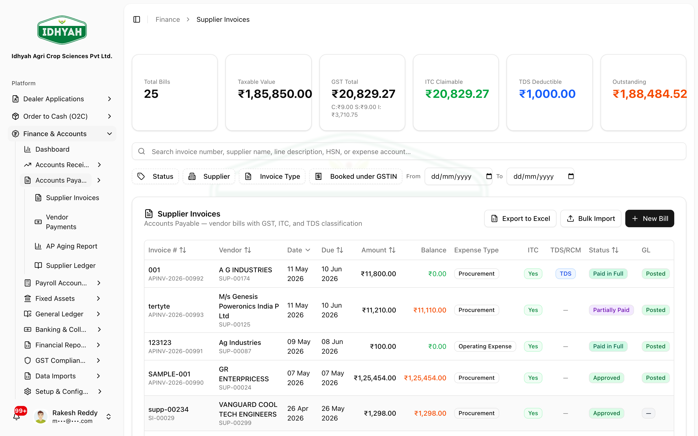
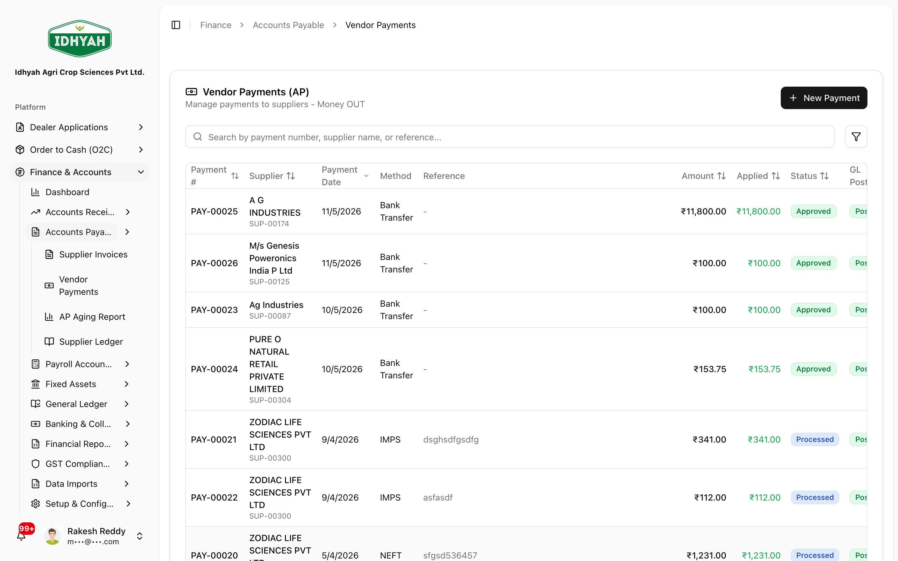
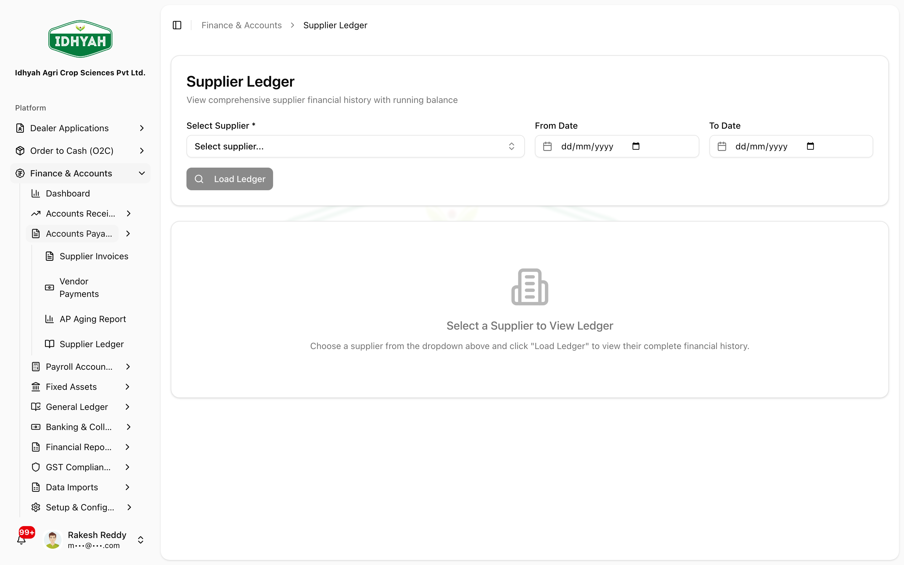

# Accounts Payable (AP) — in detail

> The money-**out** side of Finance for suppliers: capturing **supplier (AP) invoices**, paying vendors
> with **TDS** deducted at source, and tracking what you owe through the **supplier ledger** and **AP
> aging**.

> **Audience:** Customer + Internal · **Module:** `/finance` · **Status:** 🟢 Authored
> **Verified:** against `web_app/src/app/finance` + production config on 2026-07-01.

For the area overview, see the **[Finance & Accounts guide](./README.md)**. For the procurement →
invoice → three-way-match flow, see **[Three-Way Matching & Payments](../p2p/three-way-matching-and-payments.md)**.
For the money-**in** (AR) side, see **[Receipts, Credits & Discounts](./receipts-credits-discounts.md)**.
Payroll accounting is now a separate page — **[Payroll Accounting](./payroll.md)**.

---

## Where supplier invoices come from
- **From procurement** — a PO → GRN → supplier invoice that passes **three-way matching** (the usual path; see the P2P guide).
- **Direct AP invoice** — **Accounts Payable → Supplier Invoices → Create** for bills with no PO (utilities, services, expenses).
  

On approval/posting an AP invoice raises an **AP liability** and books **input tax credit (ITC)** on the GST — through your posting profiles.

> **In ledger terms:** *Dr* Expense/Asset + *Dr* Input GST (ITC) · *Cr* Accounts Payable (supplier).

## Paying a supplier (with TDS)
**Accounts Payable → Vendor Payments** settles approved, matched invoices.


**How TDS works at payment** — when the supplier's profile marks TDS applicable, DAEE withholds income
tax at the configured **section/rate** and pays the supplier the **net**:

```
Net paid to supplier = Invoice payable − TDS
   TDS = TDS-base × TDS rate   (rate from the supplier's section, e.g. 194C / 194Q)
```

- **Example:** a ₹1,00,000 bill with 1% TDS (194C) → TDS ₹1,000 → supplier receives **₹99,000**; **₹1,000** is held as a TDS liability to deposit with the government.
- The supplier's **TDS section, rate, threshold, and any lower-deduction certificate** come from the [Suppliers](../suppliers/suppliers.md) master.

> **In ledger terms:** *Dr* Accounts Payable · *Cr* Bank (net) · *Cr* TDS Payable (withheld).

## Tracking what you owe
- **Supplier Ledger** — each supplier's running account (bills, payments, balance); exportable.
  
- **AP Aging** (`/finance/reports/ap-aging`) — outstanding payables bucketed by age, so you can plan payments and honour the **MSME 45-day** rule for registered small suppliers.

## How your organization can configure this
| Area | What you control |
|---|---|
| **Posting profiles** | Which GL accounts AP, ITC, and TDS payable post to |
| **Supplier tax profile** | Per-supplier TDS section/rate/threshold + lower-deduction certificate (drives the withholding) |
| **Payment terms** | Supplier credit periods that drive AP aging and due dates |
| **Fiscal periods** | AP postings must fall in an open period |

## Common mistakes
| What you see | Why | What to do |
|---|---|---|
| Supplier paid less than the bill | TDS deducted at payment | Expected — the balance is withheld tax to deposit |
| AP invoice won't post to a date | The fiscal period is closed | Post into an open period |
| ITC on a purchase looks wrong | Claimed before GSTR-2B match | Reconcile against 2B first (see Finance → GST Compliance) |
| Duplicate supplier bill | Same invoice captured twice (PO path + direct) | Check the supplier ledger before posting a direct AP invoice |

<!-- INTERNAL:START -->
AP posts via `resolveMultipleGL` (`ap_control`, ITC/TDS accounts) → `createAutoJournalEntry`. TDS fields on the supplier invoice: `tds_applicable`, `tds_section`, `tds_rate`, `tds_amount` (from supplier master). Perms `finance_accounts_payable`. Direct AP invoices at `/finance/ap-invoices`; ledger via `getSupplierLedger`/`exportSupplierLedgerCSV`. AP aging at `/finance/reports/ap-aging`. MSME 45-day: §15 MSMED Act, 2006 (and §43B(h) Income-tax disallowance for delayed payment — verify current applicability).
<!-- INTERNAL:END -->

## Support and escalation
- **Vendor payment / TDS questions** → AP clerk → Accountant.
- **Supplier master / tax profile** → Procurement / Finance.
- **AP posting to a closed period / ITC timing** → Accountant / Controller.

## Related
[Finance & Accounts](./README.md) · [Three-Way Matching & Payments](../p2p/three-way-matching-and-payments.md) · [Suppliers](../suppliers/suppliers.md) · [Receipts, Credits & Discounts](./receipts-credits-discounts.md) (the money-in side) · [Payroll Accounting](./payroll.md) · [Address Book (Bill-From / Bill-To)](../address-book.md).
