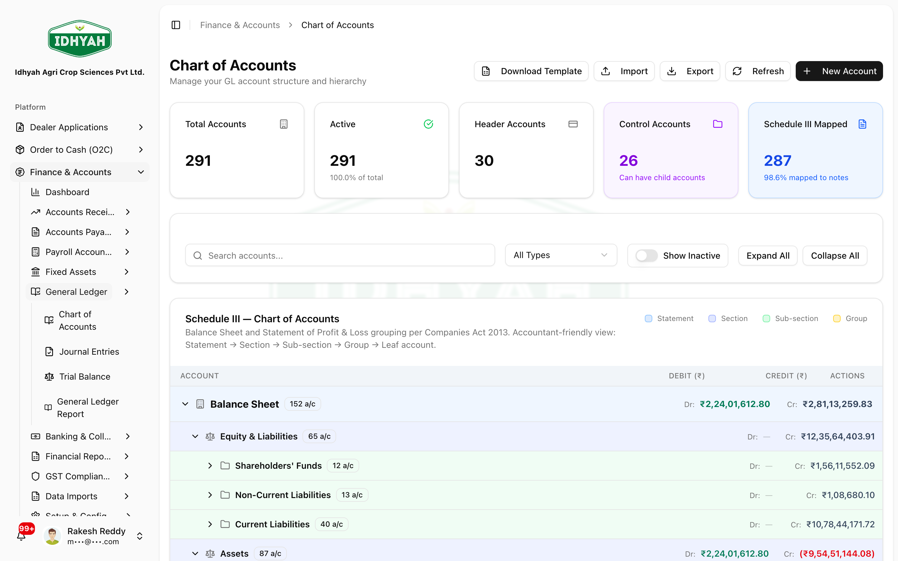

# Chart of Accounts (COA)

> Your **Chart of Accounts** is the master list of every ledger account the business posts to —
> assets, liabilities, equity, income, and expenses. It's the backbone of the General Ledger: every
> invoice, receipt, payment, and journal entry lands in one of these accounts.

> **Audience:** Customer + Internal · **Module:** `/finance/chart-of-accounts` · **Status:** 🟢 Authored
> **Verified:** against `web_app/src/app/finance/chart-of-accounts` on 2026-06-18.

For the full module, see the **[Finance & Accounts guide](./README.md)**.

## What it is (in general)
In any accounting system, the **Chart of Accounts** is the structured list of accounts used to classify
every financial transaction. Each account has:
- A **code** (e.g. `1200`) and a **name** (e.g. *Trade Receivables*).
- An **account class** — one of the five universal types: **Asset, Liability, Equity, Income (Revenue), Expense**.
- A **normal balance** — whether the account normally carries a **debit** (assets, expenses) or **credit** (liabilities, equity, income) balance.
- A **parent** — accounts roll up into groups, forming a hierarchy (e.g. *Trade Receivables* sits under *Current Assets*).

Transactions never post "to the business" in the abstract — they post to **these accounts**, and the
sum of all of them is your General Ledger and, ultimately, your financial statements.

## What you can do in DAEE
- **Browse the accounts** as a hierarchy and see each account's **current balance**.
- **Create, edit, activate/deactivate, and delete** accounts (with safeguards — see cautions).
- **Set opening balances** when you go live or carry forward.
- **Import** a full chart from a template, or **export** it (CSV / Excel) for review or audit.
- View the chart organised under the **Schedule III** presentation used for Indian statutory financial statements.

## Before you begin
- Decide your **numbering scheme** (account codes) and grouping before creating accounts — consistency matters for reporting.
- Know each account's **class** and **normal balance**.
- For go-live, have your **opening balances** (a trial balance) ready.

### Who does this
| Role | What they do |
|---|---|
| **Finance Admin / Controller** | Owns the chart — creates and maintains accounts, sets opening balances |
| **Accountant** | Posts to accounts via invoices, receipts, and journals |
| **Auditor / Management** | Reads balances and exports for review |

<!-- INTERNAL:START -->
Route `/finance/chart-of-accounts` (`ChartOfAccountsManager.tsx`). Server actions: `getChartOfAccounts`, `createChartOfAccount`, `updateChartOfAccount`, `toggleAccountActive`, `deleteChartOfAccount`, `downloadCOATemplate`, `importChartOfAccounts`, `exportChartOfAccounts` (+ `exportChartOfAccountsXLSX`). Tables: `chart_of_accounts` (per-tenant), seeded from `master_chart_of_accounts`; balances from `general_ledger_balances`; `posting_profiles` map transaction types → accounts (also `customer_posting_groups`, `vendor_posting_groups`, `item_posting_groups`). Account fields: `account_code`, `account_name`, `account_type` (asset/liability/equity/revenue/expense), `parent_account`, `normal_balance`, `is_group`, `opening_balance`, `current_balance`, `is_active`, tenant-scoped (RLS). UI builds a **5-level Schedule III tree** (Companies Act 2013) for presentation, separate from the raw parent tree. Never hardcode account codes in app logic — resolve via posting profiles (`resolveGL` / `resolveMultipleGL`). *(GL posting model → [Finance Developer Guide](../../developer-guides/finance.md).)*
<!-- INTERNAL:END -->

### How the chart is structured
```
Account class (Asset · Liability · Equity · Income · Expense)
  └─ Group account            (e.g. Current Assets)
       └─ Ledger account      (e.g. Trade Receivables — 1200)  → carries a balance
Presentation: grouped under Schedule III (Companies Act 2013) for statutory financial statements
Posting profiles map each transaction type → the right account (no hardcoding)
```

### Account types: control, header, posting (leaf)
Two checkboxes on each account decide its role in the hierarchy — this is what the form enforces:

| Kind | How it's set | What it means |
|---|---|---|
| **Control account** | ☑ *This is a control account (can have child accounts)* | A **parent node** — other accounts sit under it; shows a **Control** badge in the tree |
| **Header account** | ☑ *This is a header account (for grouping/reporting)* | A **summary row** — **no direct postings** allowed |
| **Posting (leaf) account** | both boxes **off** | Where invoices, payments, payroll, and manual journals **actually post** |

- These are **independent**: an account can be **both** control and header (common for AR/AP summary groups).
- The **Parent account** dropdown lists **only control accounts** — you cannot place a child under a non-control row.
- Example: `1100 Current Assets` (control) → `1101 Trade Receivables` (control) → `1101001 Dealer AR` (posting/leaf).

---

## Key workflows

### Review the chart and balances
**Role:** Finance / Accountant · **Result:** a clear view of every account and its balance
1. Go to **Finance → Chart of Accounts**. Browse the hierarchy; each account shows its **class**, **normal balance**, and **current balance**.
   
   <!-- capture: { "project": "iacs-md", "route": "/finance/chart-of-accounts" } -->
2. Use the **Schedule III** view to see accounts grouped the way they appear in statutory financial statements.

### Create or edit an account
**Role:** Finance Admin · **Result:** a new/updated ledger account
1. **Create Account** — enter the **code**, **name**, **class** (asset/liability/equity/income/expense) and **normal balance**, then set its place in the hierarchy:
   - **Parent / grouping** level → tick **This is a control account (can have child accounts)**. A summary that must **not** receive postings → also tick **Header account**.
   - **Posting (leaf)** account → leave both boxes **off** and pick the **Parent account** from the searchable dropdown. The picker searches every eligible control account by **code or name** — it is not limited to the first thousand — and shows the account's class next to the code so you can pick correctly on very large charts.
   - Set the flags your policy needs: **Bank account** (asset accounts only), **GST / TDS applicable**, **Allow manual journal**, **Reconcilable**.
2. Set an **opening balance** if you're carrying a balance forward at go-live.
3. **Edit** to correct details; **deactivate** an account you no longer use (keeps history) instead of deleting where possible.
4. **Re-parent** (move an account under a different parent) — you can now move a leaf across **asset sub-groups** (for example, from *Current Assets → Inventory* to *Current Assets → Trade Receivables*) as long as the new parent is a **control account of a compatible class**. The system re-classifies the account in the Schedule III view automatically. If the move would change the account's class (e.g. asset → liability), it is **blocked** with an explanation.

> **Caution** Codes should be **unique** and stable. Changing a code or class on an account that already has postings can distort reports — prefer deactivating and creating a replacement.

> **Tip** Use re-parenting when your chart evolves (e.g. a leaf was miscategorised under the wrong asset sub-group). Do **not** use it to work around a wrong **class** — pick the correct class at creation time.
<!-- INTERNAL:START -->
- **Searchable parent picker (DAEE-1182):** the parent-account dropdown on Create/Edit is a `SearchableSelectDropdown` backed by a paged/count-exact query, so tenants with >1,000 control accounts no longer see a truncated list.
- **Re-parent across asset groups (DAEE-1183):** the classifier honours class compatibility (asset↔asset, liability↔liability, …) and preserves the leaf's balance/history. Blocked when the new parent is not a control account, or when the class would change.
<!-- INTERNAL:END -->

### Import / export the chart
**Role:** Finance Admin · **Result:** bulk setup or an audit copy
1. **Download the template**, fill in your accounts, and **Import** to load the chart in bulk. The template includes an **Is Control Account** column (TRUE/FALSE) — list **parent (control) rows before their children**; validation flags bad rows (e.g. *parent must be a control account*, duplicate code).
2. **Export** to **CSV** or **Excel** for review, audit, or migration; the Excel export preserves the hierarchy.

---

## Pages & areas
| Area | What you do there |
|---|---|
| **Chart of Accounts** | Browse accounts + balances; create/edit/activate/delete |
| **Schedule III view** | See accounts grouped for statutory financial statements |
| **Import / Export** | Bulk template import; CSV/Excel export |

## Reference
- **Account classes:** Asset · Liability · Equity · Income (Revenue) · Expense.
- **Normal balance:** Assets & Expenses = **Debit**; Liabilities, Equity & Income = **Credit**.
- **Hierarchy:** ledger accounts roll up into group accounts → classes → statements.
- **Statutory presentation:** the chart is presented under **Schedule III of the Companies Act, 2013** for Indian financial statements.
- **Posting profiles** decide which account each transaction type hits — so the same operation posts consistently every time.
<!-- INTERNAL:START -->Tables: `chart_of_accounts`, `master_chart_of_accounts`, `general_ledger_balances`, `posting_profiles`. Schema & posting → [Finance Developer Guide](../../developer-guides/finance.md).<!-- INTERNAL:END -->

## Common mistakes & warnings
> **Caution** The Chart of Accounts is foundational — get the structure and codes right **before** you start transacting, because every posting depends on it.
- **Deleting an account with postings** — blocked/unsafe; deactivate instead so history and reports stay intact.
- **Wrong class or normal balance** — an account in the wrong class misstates the financial statements; fix before relying on reports.
- **Hardcoding account codes elsewhere** — accounts should be referenced through **posting profiles**, never pinned by code in a workflow.
- **Parent dropdown is empty / missing an account** — mark the intended parent as a **control account** first; only control accounts can be parents.
- **"Parent must be a control account" on save** — pick a parent with the **Control** badge (or create one).
- **Can't deactivate a control account** — deactivate or reassign its **child accounts** first.
- **Postings landed on the wrong level** — map posting profiles to **leaf** accounts, never to control/header parents.

## Support and escalation
- **Chart structure / new accounts / opening balances** → Finance Admin / Controller.
- **Where a transaction posts** → check the **posting profiles** with Finance.

## Related workflows
[Finance & Accounts](./README.md) · [Receipts, Credits & Discounts](./receipts-credits-discounts.md) · [Accounts Payable](./accounts-payable.md) · [Payroll Accounting](./payroll.md) · [Finance — Screen Index](./screens.md)
