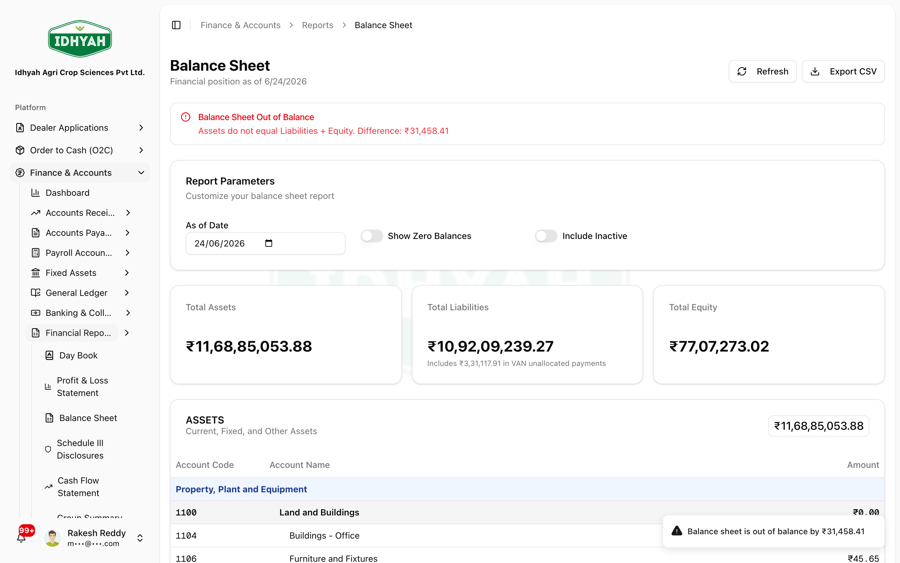
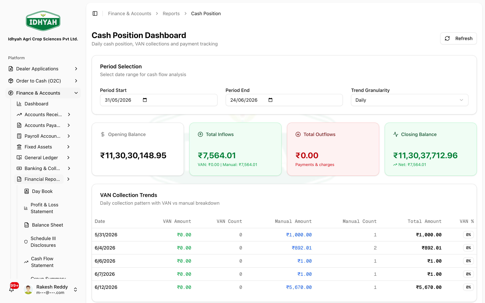
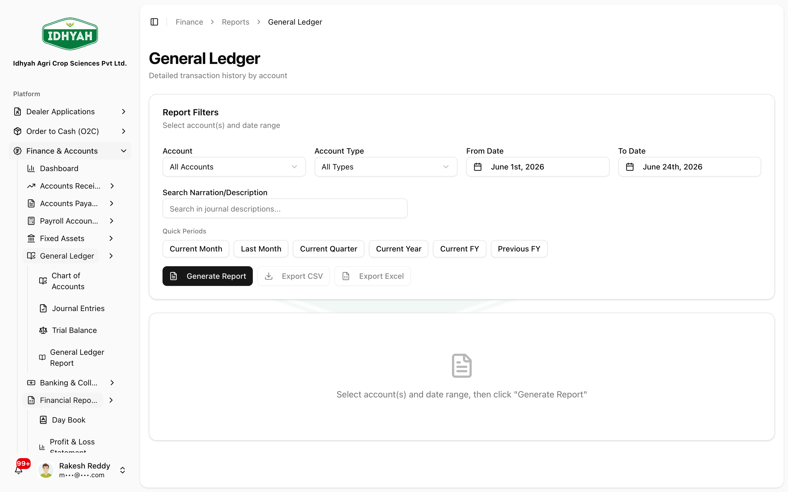

# Financial Reports (statements)

> The statutory and management **financial statements** — Balance Sheet, Profit & Loss, Trial Balance,
> Cash Flow, Day Book, and General Ledger. Each is built **live from the journal entries already posted**
> across DAEE, and the Balance Sheet / P&L are presented under **Schedule III (Companies Act 2013)**.

> **Audience:** Customer + Internal · **Module:** `/finance` (reports) · **Status:** 🟢 Authored
> **Verified:** against `web_app/src/app/finance/reports` on 2026-06-24.

For the full module, see the **[Finance & Accounts guide](./README.md)**.

## What you can do
- **Balance Sheet & Profit / Loss** — the statutory statements, in **Schedule III** presentation.
- **Trial Balance** — period debits/credits per account (it must balance).
- **Cash Flow** — operating / investing / financing movements.
- **Day Book** — every journal entry for a date or period.
- **General Ledger** — account-wise transaction detail.

## Before you begin
- **Permission** to view finance reports.
- The **dates** to report on — the **Balance Sheet** uses an **as-of date**; **P&L / Trial Balance /
  Cash Flow** use a **period (start–end)**; the **Day Book** is **by day**.
- Reports reflect **posted** entries — drafts and cancelled documents are excluded. Posting is driven by
  [Posting Profiles](./posting-profiles.md) onto the [Chart of Accounts](./chart-of-accounts.md).

## The statements

| Statement | Route | What it shows |
|---|---|---|
| **Balance Sheet** | `/finance/reports/balance-sheet` | Assets, liabilities & equity **as at** the period end — **Schedule III** |
| **Profit & Loss** | `/finance/reports/profit-loss` | Income & expense **for the period** — **Schedule III** |
| **Trial Balance** | `/finance/reports/trial-balance` | Period **debit / credit** per account; totals must be equal |
| **Cash Flow** | `/finance/reports/cash-flow` · `/cash-flow-statement` | Cash movement — a **dashboard** view and a formal **statement** |
| **Day Book** | `/finance/reports/day-book` | Every **journal entry** for a chosen date / period |
| **General Ledger** | `/finance/reports/general-ledger` | **Account-wise** transaction detail with running balance |

> Balance Sheet and Trial Balance also have top-level shortcuts (`/finance/balance-sheet`,
> `/finance/trial-balance`); they open the same reports.

## Step-by-step

### Run the Balance Sheet and Profit & Loss
**Before:** entries posted for the period · **Result:** the statutory statements in Schedule III form
1. Open **Finance → Reports → Balance Sheet**. Set the **As-of Date** (and the optional **Show Zero
   Balances** / **Include Inactive** toggles). Assets, liabilities and equity are grouped the way they appear
   in statutory financial statements (**Schedule III**), and the report **flags if it is out of balance**.
   
   <!-- capture: { "project": "iacs-md", "route": "/finance/reports/balance-sheet" } -->
2. Open **Profit & Loss** for the same period to see income and expense, again in Schedule III grouping.
   
   <!-- capture: { "project": "iacs-md", "route": "/finance/reports/profit-loss" } -->

### Check the Trial Balance
**Before:** a period to verify · **Result:** confirmation the books balance
1. Open **Trial Balance**, set the period, and confirm the **total debits equal total credits**. Use it to
   spot an account that looks wrong before relying on the statements.
   
   <!-- capture: { "project": "iacs-md", "route": "/finance/reports/trial-balance" } -->

### Review Cash Flow
**Before:** a reporting period · **Result:** where cash moved
1. Open **Cash Flow** — the **dashboard** summarises operating / investing / financing movement; the
   **Cash Flow Statement** gives the formal presentation.
   
   <!-- capture: { "project": "iacs-md", "route": "/finance/reports/cash-flow" } -->

### Drill into the Day Book and General Ledger
**Before:** you need transaction-level detail · **Result:** the underlying entries behind a figure
1. Open the **Day Book** to list **every journal entry** for a date/period (great for a daily review).
   
   <!-- capture: { "project": "iacs-md", "route": "/finance/reports/day-book" } -->
2. Open the **General Ledger** to see **account-wise** transactions with a running balance — the detail
   behind any line on the Trial Balance or statements.
   
   <!-- capture: { "project": "iacs-md", "route": "/finance/reports/general-ledger" } -->

## Receivables, Payables & Ledger reports

Alongside the statutory statements, DAEE has a set of **operational finance reports** for chasing money
in, planning money out, and reviewing an account's history.

| Report | Where | What it tells you |
|---|---|---|
| **AR Aging** | `Finance → Reports → AR Aging` | Open **receivables** bucketed by age (current / 30 / 60 / 90+), per dealer |
| **AP Aging** | `Finance → Reports → AP Aging` | Open **payables** by age — plan payments and the MSME 45-day rule |
| **Dealer Outstanding** | `Finance → Reports → Dealer Outstanding` | Each dealer's **total open balance** at a glance |
| **Group Summary** | `Finance → Reports → Group Summary` | Balances **rolled up by group** (region/category) for a portfolio view |
| **Customer Statements** | `Finance → Reports → Customer Statements` | A dealer's **statement of account** to send out |
| **Pending Collection** | `Finance → Reports → Pending Collection` | What's **due to be collected**, for follow-up |
| **Dealer Ledger** | `Finance → Dealer Ledger` | One dealer's **running account** — invoices, receipts, notes, balance |
| **Supplier Ledger** | `Finance → Supplier Ledger` | One supplier's running account (bills, payments, balance) |

> **Assurance reports** — DAEE also has **AR Health**, **ECL provisioning**, **GL↔AR reconciliation**,
> **discount variance**, and **reversal frequency** under Reports for controllers and auditors.

### Review aging and chase collections
**Role:** AR clerk / Controller · **Result:** know who owes what, and follow up
1. Open **AR Aging** — balances bucketed by age. Filter by dealer / region as needed.
   
   <!-- capture: { "project": "iacs-md", "route": "/finance/reports/ar-aging" } -->
2. Use **Dealer Outstanding** for a per-dealer total, or **Group Summary** to roll balances up by group.
   
   <!-- capture: { "project": "iacs-md", "route": "/finance/reports/dealer-outstanding" } -->

### Open a dealer's ledger
**Role:** AR clerk / Accountant · **Result:** the full transaction history for one dealer
1. **Finance → Dealer Ledger** — pick the dealer to see the running account (invoices, receipts, credit/
   debit notes, advances) with a closing balance; send a **Customer Statement** from Reports.
   
   <!-- capture: { "project": "iacs-md", "route": "/finance/dealer-ledger" } -->

## Export a report
Every statement can be taken out of DAEE for your **CA, an audit, a board pack, or further analysis** —
start from the task and pick the format that fits:

| You want to… | Use | File |
|---|---|---|
| Reconcile or re-analyse the numbers in a spreadsheet | **Export CSV** / **Export Excel** | `.csv` / `.xlsx` |
| Share or file a clean, presentation-ready copy | **Export PDF** / **Print** | `.pdf` |

**How to export**
1. Open the report and set the **as-of date / period** and any **filters** so the on-screen figures are
   exactly what you want — *the export is a copy of what's on screen*.
2. Click the **Export** control at the **top-right** of the report (e.g. **Export CSV** on the Balance Sheet)
   and choose the format.
3. The file downloads with the **same rows, grouping, and totals** you see: **CSV / Excel** keep the
   account-level detail (ideal for spreadsheets and reconciliation), while **PDF / Print** preserve the
   **Schedule III** layout for sharing or filing.

> **Note** Available formats **vary by report** — **CSV** is offered on every report; some also offer
> **Excel**, **PDF**, or **Print**. If a format isn't shown on a report, it isn't available there yet.

## Common problems
- **Trial Balance doesn't balance** — there's a posting imbalance; investigate via the **General Ledger /
  Day Book** for the period before trusting the statements.
- **A figure differs from what you expect** — confirm the **period**, that the relevant documents are
  **posted** (not draft/cancelled), and that the account is mapped correctly in posting profiles.
- **Report is empty** — no posted entries fall in the selected **period**; widen or correct the dates.

## Reference
- **Presentation:** Balance Sheet & P&L follow **Schedule III, Companies Act 2013**.
- **Basis:** all reports are built from **posted journal entries**; nothing is re-keyed.
- **Dates:** Balance Sheet = **as-of date** · P&L / Trial Balance / Cash Flow = **period** · Day Book = **single day**.
- **Export:** **CSV** on every report; **Excel / PDF / Print** on some — the export **mirrors the on-screen view**.
- **Drill path:** statement → **General Ledger** (account) → **Day Book** (entries).
<!-- INTERNAL:START -->Built from `journal_entries` / `general_ledger_balances`; Schedule III mapping on the chart. Schema & report logic → [Finance Developer Guide](../../developer-guides/finance.md).<!-- INTERNAL:END -->

## Troubleshooting
- **Numbers changed after re-running** — a document was posted/cancelled in the interim; reports are live.
- **Slow to load for a wide range** — narrow the period; very large ranges aggregate more entries.

## Support and escalation
For a statement discrepancy, capture the **report**, the **period**, and a **General Ledger** extract for
the suspect account, and raise it with Finance.

## Related workflows
- [Chart of Accounts](./chart-of-accounts.md) · [Posting Profiles](./posting-profiles.md) ·
  [GST Compliance](./gst-compliance.md) · [Finance & Accounts](./README.md)
