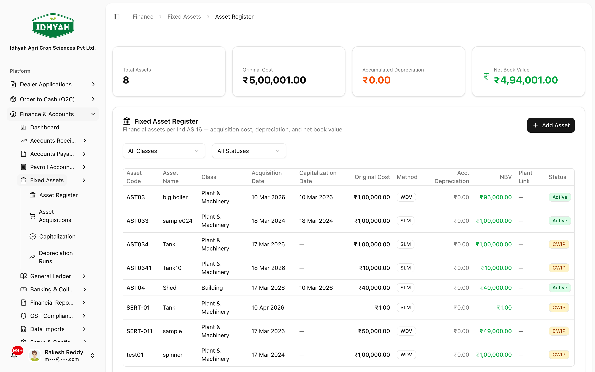
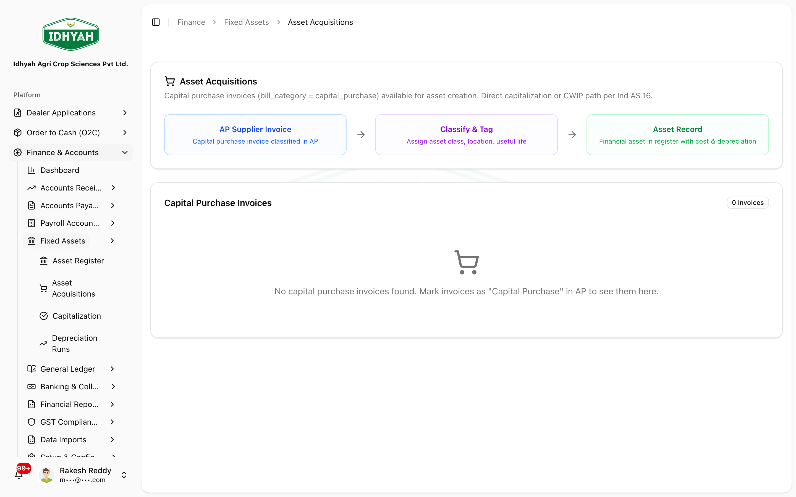
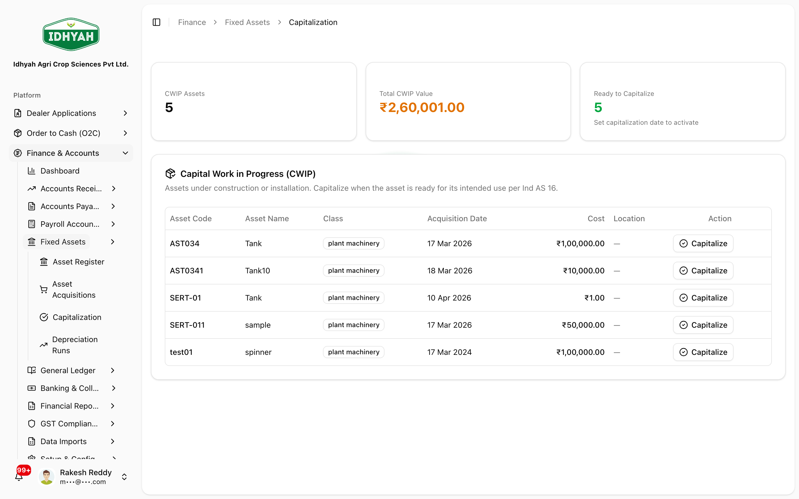
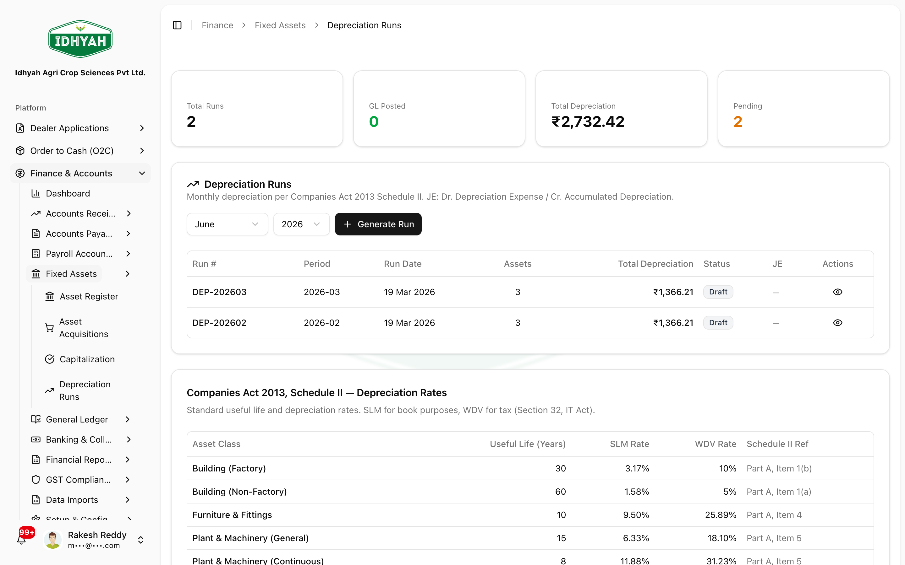

# Fixed Assets (register, capitalization & depreciation)

> The **financial** fixed-asset register (per **Ind AS 16**) — acquisition cost, accumulated depreciation, and
> **net book value (NBV)** for every asset. New assets usually start as **CWIP** (capital work-in-progress)
> until you **capitalize** them, after which DAEE runs **depreciation** per **Companies Act 2013, Schedule II**
> — **SLM for book purposes, WDV for tax** (Section 32, IT Act).

> **Audience:** Customer + Internal · **Module:** `/finance` (fixed assets) · **Status:** 🟢 Authored
> **Verified:** against `web_app/src/app/finance/fixed-assets` on 2026-06-24.

> **Note** This is the **financial** asset register. It is **separate** from plant/equipment maintained under
> [Plant Production](../plant-production/README.md).

For the full module, see the **[Finance & Accounts guide](./README.md)**.

## What you can do
- **Maintain the asset register** — cost, **accumulated depreciation**, and **NBV** per asset.
- **Record acquisitions** — new assets typically start as **CWIP**.
- **Capitalize** a CWIP asset — set its **depreciation method** and **capitalization date** to put it to use.
- **Run depreciation** — monthly runs on **Companies Act 2013, Schedule II** rates (**SLM for books, WDV for tax**).

## Before you begin
**What you need**
- **Permission**: *read* to view the register; *create* to **Add Asset**.
- A unique **Asset Code** and the acquisition details (cost, date).
- GL setup done — the **fixed-asset, CWIP, accumulated-depreciation, and depreciation-expense** accounts
  exist in the [Chart of Accounts](./chart-of-accounts.md) and are mapped via [Posting Profiles](./posting-profiles.md).

### The asset lifecycle
```
Add asset (CWIP) ──▶ Capitalize ──────────▶ Depreciate (each period) ──▶ NBV
 acquisition cost     set method +            Schedule II — SLM (book)     = cost − accumulated
                      capitalization date      / WDV (tax)                  depreciation
```

## Pages & what each does

| Page | Route | Use it to |
|---|---|---|
| **Asset Register** | `/finance/fixed-assets` | Browse all assets with **cost / accumulated depreciation / NBV** cards; **Add Asset** |
| **Asset Acquisitions** | `/finance/fixed-assets/acquisitions` | Review acquisition records |
| **Asset Capitalization** | `/finance/fixed-assets/capitalization` | **Capitalize** CWIP assets — set depreciation method + capitalization date |
| **Depreciation Runs** | `/finance/fixed-assets/depreciation` | **Generate monthly runs** (Schedule II; SLM book / WDV tax) — **Draft → GL posted** |

## Step-by-step

### Add an asset to the register
**Before:** acquisition details ready · **Result:** the asset appears (usually as **CWIP**)
1. Open **Finance → Fixed Assets → Asset Register**. The summary cards show **Total Assets, Original Cost,
   Accumulated Depreciation, and NBV**; the table lists each asset with its **Method** (SLM/WDV), **NBV**, an
   optional **Plant Link**, and **Status** (**CWIP** / **Active**).
   
   <!-- capture: { "project": "iacs-md", "route": "/finance/fixed-assets" } -->
2. Click **Add Asset** and enter the **Asset Code**, name, **asset class**, and **acquisition cost/date**.
   Save — the asset is created (typically with **CWIP** status until capitalized).
3. Review acquisition records under **Asset Acquisitions**.
   
   <!-- capture: { "project": "iacs-md", "route": "/finance/fixed-assets/acquisitions" } -->

### Capitalize a CWIP asset
**Before:** a CWIP asset exists · **Result:** the asset is live and ready to depreciate
1. Open **Asset Capitalization** — it lists **CWIP** assets with cards (CWIP count, **Total CWIP Value**,
   **Ready to Capitalize**). Click **Capitalize** on the asset's row, then set its **Depreciation Method** and
   **Capitalization Date** and confirm.
   
   <!-- capture: { "project": "iacs-md", "route": "/finance/fixed-assets/capitalization" } -->
   > **Note** Capitalization moves the value out of **CWIP** into the fixed-asset account and starts the
   > depreciation clock from the **capitalization date**.

### Run depreciation
**Before:** capitalized assets exist · **Result:** the period's depreciation charge is posted
1. Open **Depreciation Runs**, choose the **period**, and click **+ Generate Run**. Each run is created as
   **Draft** — review the per-asset charge and **total depreciation**, then it posts to GL
   (**JE: Dr Depreciation Expense / Cr Accumulated Depreciation**). Rates follow **Companies Act 2013,
   Schedule II** (**SLM** for books, **WDV** for tax), by asset class and **useful life**.
   
   <!-- capture: { "project": "iacs-md", "route": "/finance/fixed-assets/depreciation" } -->
2. **NBV** on the register updates to **cost − accumulated depreciation**.

## Common problems
- **Asset stuck in CWIP** — it hasn't been **capitalized**. Capitalize it on the Capitalization screen.
- **No depreciation showing** — the asset isn't capitalized, has no **method/useful life** set, or the run
  hasn't been executed for that period.
- **NBV looks wrong** — check the **depreciation method**, **Schedule II rate / useful life**, and
  **salvage value** on the asset.
- **Duplicate asset code** — codes must be **unique**; use a fresh code.

## Reference
- **Depreciation basis:** **Companies Act 2013, Schedule II** — **SLM (book) / WDV (tax)** by asset class and
  **useful life**; per-asset **salvage value**. Asset recognition/measurement per **Ind AS 16**.
- **NBV** = acquisition cost − **accumulated depreciation**.
- **CWIP** holds an asset's value until capitalization; capitalization moves it to the fixed-asset account.
- **Scope:** financial fixed assets only — **distinct** from plant/equipment in Plant Production.
<!-- INTERNAL:START -->Tables/actions: `fixed_assets`, capitalization + `disposeAsset()` server actions; depreciation posts via [Posting Profiles](./posting-profiles.md). Schema → [Finance Developer Guide](../../developer-guides/finance.md).<!-- INTERNAL:END -->

## Troubleshooting
- **"Ready to Capitalize" list is empty** — there are no CWIP assets awaiting capitalization (or you lack
  permission); confirm the asset's status on the register.
- **Depreciation total looks off after capitalizing mid-period** — depreciation starts from the
  **capitalization date**; a partial first period is expected.

## Support and escalation
For a capitalization or depreciation discrepancy, capture the **Asset Code**, its status, and the period,
and raise it with Finance. Asset disposal and write-offs are controller-level actions.

## Related workflows
- [Chart of Accounts](./chart-of-accounts.md) · [Posting Profiles](./posting-profiles.md) (where the
  fixed-asset/CWIP/depreciation accounts are mapped) · [Finance & Accounts](./README.md)
