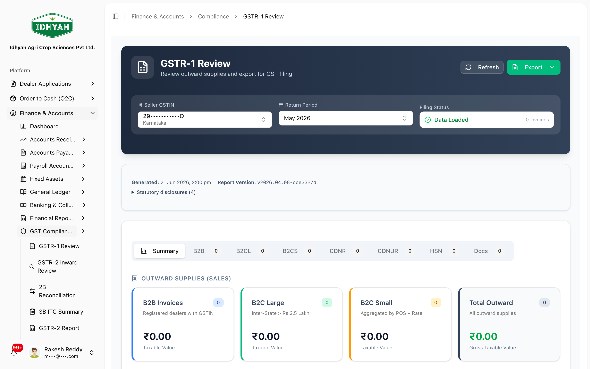
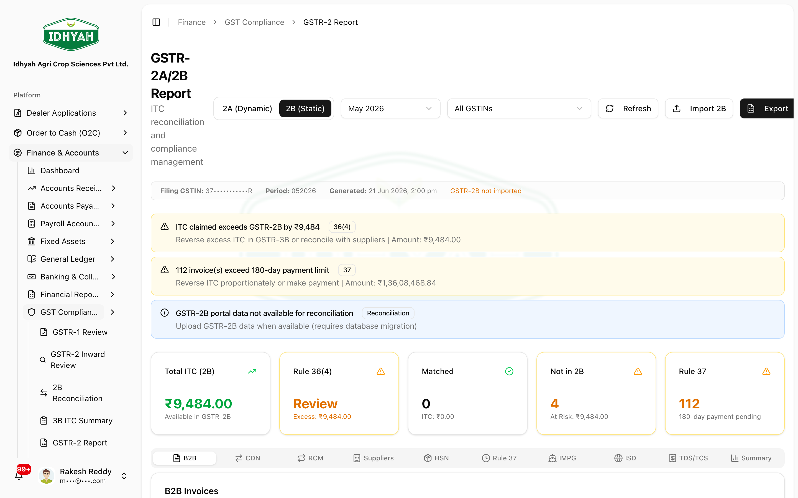
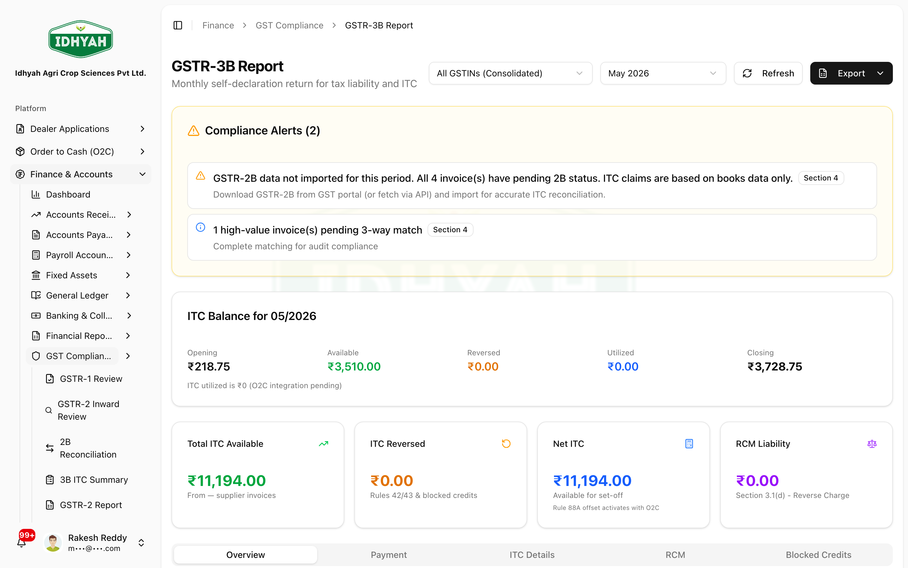

# GST Compliance (GSTR-1, 2B, 3B)

> Prepare, reconcile, and export your monthly GST returns straight from your books. DAEE builds each
> return from the invoices, credit/debit notes, and supplier bills already posted in Finance — so the
> figures match your ledgers, and you export a **government-schema file** to upload on the GST portal.

> **Audience:** Customer + Internal · **Module:** `/finance` (compliance) · **Status:** 🟢 Authored
> **Verified:** against `web_app/src/app/finance/compliance` on 2026-06-21.

For the full module, see the **[Finance & Accounts guide](./README.md)**.

## What you can do
- **File outward supplies (GSTR-1)** — review B2B / B2C / HSN / credit-debit notes for a period and
  **export the government JSON / Excel** to upload on the portal.
- **Reconcile inward credit (GSTR-2B)** — import the portal's **GSTR-2B JSON** and **auto-match** it
  against your purchase records, then work the mismatches.
- **File the summary return (GSTR-3B)** — review the auto-computed tax liability and **eligible ITC**
  (with the **Rule 36(4)** cap applied), then export and file.

## Before you begin
**What you need**
- Your company **GSTIN** configured in tenant settings (per place of business, if you have more than one).
- The **return period** you intend to file (each screen loads a recent month by default — switch it to your filing period).
- For inward reconciliation: the **GSTR-2B JSON** downloaded from the GST portal for that period.
- Access is **permission-gated** (`finance_compliance`, plus `gstr2_report` / `gstr3b_report` for those
  reports) and **tenant-isolated**.

**The three returns, in plain terms**

| Return | What it is | DAEE source |
|---|---|---|
| **GSTR-1** | Your **outward** supplies (sales) — what you owe output tax on | Invoices + credit/debit notes |
| **GSTR-2A / 2B** | Your **inward** supplies (purchases) as reported by your suppliers — your **ITC** | Imported portal JSON, matched to supplier bills |
| **GSTR-3B** | The **monthly summary** — net tax payable after ITC | Computed from the above |

### The filing cycle (typical monthly cadence)
```
 Sales posted ──▶ GSTR-1 (outward)        ──▶ export JSON ──▶ upload on portal
 Purchases posted                          ──▶ download GSTR-2B JSON from portal
        └──────▶ Import 2B + Auto-Match ──▶ reconcile mismatches
 Then ─────────▶ GSTR-3B (summary, ITC w/ Rule 36(4) cap) ──▶ export ──▶ file & pay
```
> Statutory due dates depend on your filing scheme (monthly vs **QRMP**). Confirm the current dates on
> the GST portal — DAEE prepares the data; it does not file on your behalf.

## Pages & what each does

| Page | Route | Use it to |
|---|---|---|
| **GSTR-1 Review** | `/finance/compliance/gstr1` | Review outward supplies for a period; export government JSON / Excel |
| **GSTR-2 Inward (ITC)** | `/finance/compliance/gstr2-inward` | See inward ITC summarised to **GSTR-3B Table 4(A)** |
| **GSTR-2 Report (2A/2B)** | `/finance/compliance/gstr2-report` | Compare books vs portal: *in books not in 2B* / *in 2B not in books*; TCS (GSTR-8) |
| **GSTR-2B Reconciliation** | `/finance/compliance/gstr2b-recon` | Import the portal **2B JSON** and **auto-match** to your bills |
| **GSTR-3B ITC** | `/finance/compliance/gstr3b-itc` | ITC summary for the period |
| **GSTR-3B Report** | `/finance/compliance/gstr3b-report` | The full 3B with liability + eligible ITC (Rule 36(4) cap) |

> `/finance/compliance` opens **GSTR-1** by default.

## Step-by-step

### File GSTR-1 (outward supplies)
**Before:** invoices for the period are posted · **Result:** a government JSON ready to upload
1. Open **Finance → Compliance → GSTR-1**. Pick the **Seller GSTIN** (if you have more than one) and the
   **Return Period** (it loads a recent month by default). The **Filing Status** confirms when data is loaded.
   
   <!-- capture: { "project": "iacs-md", "route": "/finance/compliance/gstr1" } -->
2. Review each tab — **Summary**, **B2B**, **B2CL**, **B2CS**, **CDNR**, **CDNUR**, **HSN**, **Docs**
   (each shows its invoice count) — and the **Statutory disclosures**, against your books.
3. Click **Export** and choose the **government JSON** to upload on the GST portal. **Excel** (incl.
   government-schema) and **CSV** exports are available for internal review.
   > **Tip** With multiple GSTINs you can review/export one **Seller GSTIN** at a time.

### Import & reconcile GSTR-2B (inward credit)
**Before:** the period's **GSTR-2B JSON** downloaded from the portal · **Result:** matched ITC + a mismatch worklist
1. Open **GSTR-2B Reconciliation**. Download the **2B JSON** from the GST portal (*Services → Returns →
   GSTR-2B → Download*), then **Choose JSON File** (or paste it) and click **Import & Auto-Match**. The
   importer accepts the standard **B2B, CDNR (credit/debit notes), and IMPG (imports)** sections.
   
   <!-- capture: { "project": "iacs-md", "route": "/finance/compliance/gstr2b-recon" } -->
   > **Why this matters** Per **Section 16(2)(aa)**, ITC is claimable only when the supplier has filed and
   > the invoice appears in your **2B**. The ITC claim window closes on **30 Nov of the following financial
   > year** (Section 16(4)).
2. Open **GSTR-2 Report** to work the result. Toggle **2A (Dynamic)** / **2B (Static)**, then review the
   cards — **Total ITC (2B)**, **Rule 36(4)** (excess ITC to review), **Matched**, **Not in 2B** (at risk),
   and **Rule 37** (invoices past the **180-day** payment limit — reverse ITC or pay). Drill into the
   **B2B / CDN / RCM / Suppliers / HSN** tabs as needed; **Import 2B** and **Export** are also on this screen.
   
   <!-- capture: { "project": "iacs-md", "route": "/finance/compliance/gstr2-report" } -->
   > **Note** Claimable ITC is governed by what's in **2B** — reconcile before filing GSTR-3B.

### File GSTR-3B (summary return)
**Before:** GSTR-1 reviewed and 2B reconciled · **Result:** the 3B figures ready to file & pay
1. Open **GSTR-3B Report**, pick the **GSTIN** (or **All GSTINs (Consolidated)**) and the **return
   period**. Check the **Compliance Alerts** banner first — it flags issues like *2B not imported for this
   period* or *invoices pending 3-way match* that would make the ITC inaccurate.
   
   <!-- capture: { "project": "iacs-md", "route": "/finance/compliance/gstr3b-report" } -->
2. Review the **ITC Balance** ledger (Opening → Available → Reversed → Utilized → Closing) and the
   summary cards — **Total ITC Available**, **ITC Reversed** (Rules 42/43 & blocked credits), **Net ITC**,
   and **RCM Liability** (Section 3.1(d)). The **ITC Details** tab applies the **Rule 36(4)** cap (ITC
   restricted to **105%** of the ITC in GSTR-2B); other tabs cover **Payment**, **RCM**, **Blocked Credits**.
3. Cross-check the **ITC summary** on **GSTR-3B ITC** (Table 4) and the inward view on **GSTR-2 Inward**.
4. Click **Export** (JSON / Excel / PDF), then file and pay on the GST portal.

## Export a return
Start from what you're trying to do — the format follows the task:

| You want to… | Use | File |
|---|---|---|
| **File on the GST portal** | **Export JSON** (government schema) | `.json` |
| Review or reconcile in a spreadsheet | **Export Excel** / **Export CSV** (incl. government-schema / single-GSTIN Excel) | `.xlsx` / `.csv` |
| Share or archive a clean copy | **Export PDF** (A4 landscape) | `.pdf` |

**How to export**
1. Select the **Return Period** (and **Seller GSTIN**, where shown) so the on-screen figures are exactly
   what you want — *the export is a copy of what's on screen*.
2. Click the **Export** control (top-right) and choose the format.
3. Upload the **government JSON** to the GST portal to file; use Excel/CSV for internal review and PDF to share.

> **Note** The GSTR-2B screen also offers **Download GSTR-2B JSON** (the portal file you imported), so you can
> re-export exactly what was reconciled. Available formats vary slightly by return.

## Common problems
- **Return shows ₹0 / empty** — either no documents were posted in that **period**, or you're on the
  wrong **Return Period / Seller GSTIN**. The period loads a recent month by default; switch it if needed.
- **"GSTR-2B not imported"** on the GSTR-2 Report — import the portal **2B JSON** on the
  **GSTR-2B Reconciliation** screen first, then return to the report.
- **ITC looks lower than your bills** — that's **Rule 36(4)**: claimable ITC is capped at **105%** of
  the ITC reflected in GSTR-2B. Reconcile and chase suppliers for missing invoices.
- **Figures don't match the ledger** — GST returns are built from posted documents; an unposted or
  cancelled invoice/credit note won't appear. Confirm the document's status in Finance.

## Reference
- **Export formats:** government **JSON** (portal upload), **Excel** (incl. government-schema Excel and
  single-GSTIN export), **CSV**, and **PDF** (A4 landscape) for review.
- **Permissions:** `finance_compliance` (GSTR-1 review, GSTR-2 inward, GSTR-2B recon, GSTR-3B ITC);
  `gstr2_report` and `gstr3b_report` for those reports.
- **Source of truth:** posted invoices, credit/debit notes, and supplier bills — never re-keyed.

## Troubleshooting
- **Import fails / "GSTR-2B Import Error"** — confirm you uploaded the correct **2B JSON** for that
  period (not 2A, not a different month) and that the file isn't truncated.
- **Wrong period in the file name** — re-select the period and re-export; the export reflects the
  currently selected period.

## Support and escalation
For a filing discrepancy, capture the **period**, the screen, and the export file, and raise it with
Finance. For portal/API errors, include the portal's error message.

## Related workflows
- [Finance & Accounts](./README.md) · [Chart of Accounts](./chart-of-accounts.md) ·
  [Receipts, Credits & Discounts](./receipts-credits-discounts.md) ·
  [Order to Cash](../o2c/order-to-cash.md) (where outward invoices originate)
