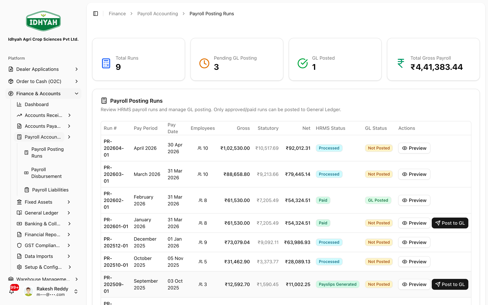
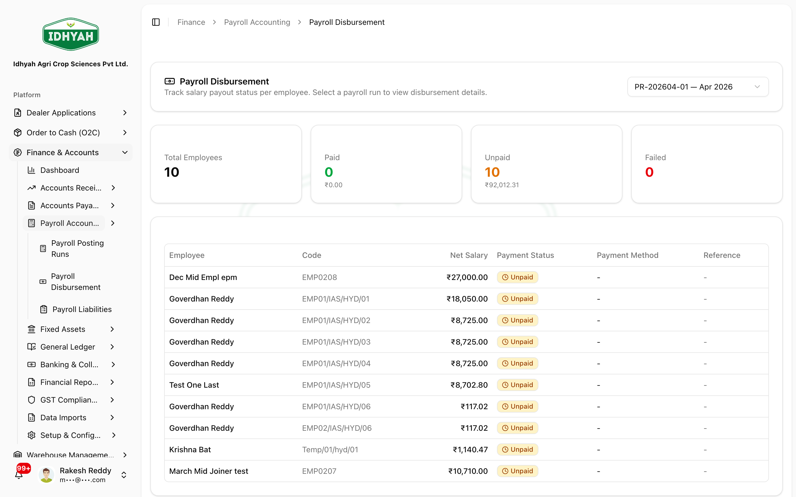
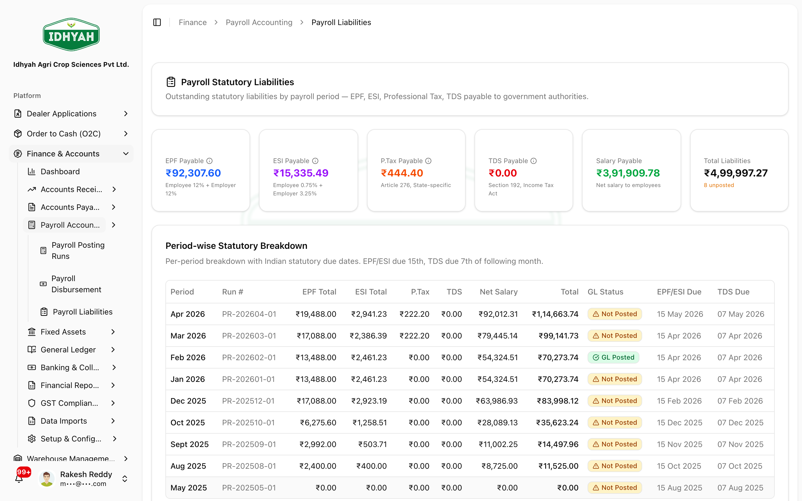

# Payroll Accounting — in detail

> The payroll side of Finance: **posting** a finished payroll run to the ledger, **disbursing** net pay,
> and **tracking statutory liabilities** (PF / ESI / PT / TDS) until they're deposited.

> **Audience:** Customer + Internal · **Module:** `/finance` · **Status:** 🟢 Authored
> **Verified:** against `web_app/src/app/finance` + production config on 2026-07-01.

> **Note** Payroll is *calculated* in **HR (HRMS)** — employees, attendance, salary structures, and
> payslips. **Finance → Payroll Accounting** is where the finished payroll is **posted to the books,
> disbursed, and its statutory dues tracked.**

For the area overview, see the **[Finance & Accounts guide](./README.md)**. For the supplier money-out
side, see **[Accounts Payable](./accounts-payable.md)**.

---

## The payroll run lifecycle
A payroll run moves through: **Draft → Payslips generated → Processed → Approved → Paid**, and
separately carries a **GL-posted** flag. Each run summarises **total gross**, **statutory**,
**deductions**, and **net** for the period.

### 1. Post payroll to the GL
**Payroll Accounting → Payroll Posting Runs** — review approved HRMS runs and **Post to GL**.

Posting books the salary cost as an expense and splits out what's payable to employees vs. to the
government:

> **In ledger terms:** *Dr* Salary & Wages Expense (gross) · *Cr* Net Pay Payable (take-home) ·
> *Cr* statutory liabilities — **PF**, **ESI**, **Professional Tax**, **TDS** (the deductions).

Only **approved** runs should be posted; a run shows whether it's already **GL-posted** so you don't double-post.

### 2. Disburse net pay
**Payroll Disbursement** — pay employees their **net** amount.

> **In ledger terms:** *Dr* Net Pay Payable · *Cr* Bank.

### 3. Track & deposit statutory liabilities
**Payroll Liabilities** — the running balance of **PF / ESI / PT / TDS** withheld but not yet deposited.

When you deposit each due with its authority:

> **In ledger terms:** *Dr* PF/ESI/PT/TDS Payable · *Cr* Bank.

## How your organization can configure this
| Area | What you control |
|---|---|
| **Posting profiles** | Which GL accounts salary expense, net-pay payable, and each statutory liability post to |
| **Fiscal periods** | Payroll postings must fall in an open period |

## Common mistakes
| What you see | Why | What to do |
|---|---|---|
| Can't post payroll | Run isn't **Approved**, or already **GL-posted** | Approve the run first; check the GL-posted flag to avoid double-posting |
| Payroll liabilities keep growing | Statutory dues posted but not yet deposited | Deposit PF/ESI/PT/TDS and record the payment against the liability |
| Payroll won't post to a date | The fiscal period is closed | Post into an open period |

## Support and escalation
- **Payroll posting / statutory deposits** → Accountant / Controller (and HR for the underlying run).
- **Payslip / salary-structure questions** → HR (payroll is calculated in HRMS).

## Related
[Finance & Accounts](./README.md) · [Accounts Payable](./accounts-payable.md) · [Receipts, Credits & Discounts](./receipts-credits-discounts.md) · Human Resources (payroll calculation).
