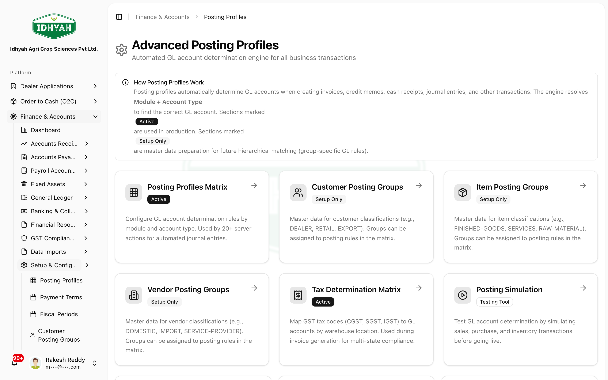

# Posting Profiles (how transactions map to GL accounts)

> Posting profiles are the rules that decide **which general-ledger accounts each business event hits** —
> a sales invoice, a cash receipt, a goods receipt, a payroll run. Set them up once and every posting
> across DAEE lands on the right accounts **automatically**, with **no account codes hardcoded** anywhere.

> **Audience:** Customer + Internal · **Module:** `/finance` (posting profiles) · **Status:** 🟢 Authored
> **Verified:** against `web_app/src/app/finance/posting-profiles` on 2026-06-24.

For the full module, see the **[Finance & Accounts guide](./README.md)**.

## What you can do
- **Maintain the mapping rules** — for each **Module + Account Type**, set the **GL account** (the Matrix engine).
- **Differentiate by group** — post different **customers, vendors, or items** to different accounts via
  **posting groups** (when one default isn't enough).
- **Configure GST** — set how tax is determined and where it posts, in the **Tax Determination Matrix**.
- **Simulate before you rely on it** — preview exactly which accounts an event will resolve to.

## Before you begin
**What you need**
- **Permission** to view/edit posting profiles.
- A **Chart of Accounts** already set up — posting profiles point at **posting (leaf) accounts** you created
  there. This is **step 2 of GL setup** (after the [Chart of Accounts](./chart-of-accounts.md)).
- Access is **permission-gated** and **tenant-isolated**; setup is admin-level.

**What a posting profile is (in plain terms)**
A rule that says *"for **this module + account type** (optionally narrowed to a **warehouse**, **item group**,
or **customer/vendor group**), use **this GL account**."* When you create an invoice, receipt, journal, etc.,
the engine **resolves** the matching rule — so the same operation posts consistently, and no workflow pins an
account code. When several rules could match, the **most specific one wins** (see *Rule priority* below).

**Rule priority (most specific wins)** — priority is auto-calculated by specificity:
**Warehouse +50** · **Item posting group +30** · **Customer/Vendor posting group +20** · **System default 10**.
(e.g. a rule with Warehouse + Item Group + Customer Group scores 10 + 50 + 30 + 20 = **100**.)

### Where it fits in GL setup
```
Chart of Accounts ──▶ Posting Profiles Matrix ──▶ Posting Groups ──────▶ Simulation (verify)
 (leaf accounts)      (module + type → GL,         (master data,           (preview the resolved
                       by priority)                 assigned to rules)      account before go-live)
```

## Pages & what each does

| Page | Route | Status | Use it to |
|---|---|---|---|
| **Advanced Posting Profiles** (hub) | `/finance/posting-profiles` | — | Launch page — opens the Matrix, posting groups, tax matrix, and simulation |
| **Posting Profiles Matrix** | `/finance/posting-profiles/matrix` | 🟢 Active | **Add/maintain the GL rules** (Module + Account Type, by priority) — the live engine |
| **Tax Determination Matrix** | `/finance/posting-profiles/tax-matrix` | 🟢 Active | Map **GST codes (CGST/SGST/IGST) → GL by warehouse** for multi-state compliance |
| **Posting Simulation** | `/finance/posting-profiles/simulation` | 🧪 Testing tool | **Preview** the GL account a scenario resolves to |
| **Customer / Vendor / Item Posting Groups** | `…/customer-groups`, `/vendor-groups`, `/item-groups` | ⚙️ Setup-only master data | Define classifications (e.g. DEALER/RETAIL/EXPORT) to **assign to Matrix rules** |

## Step-by-step

### Add or edit a GL rule (Posting Profiles Matrix)
**Before:** Chart of Accounts is set up · **Result:** each module + account type resolves to the correct GL account
1. Open **Finance → Posting Profiles** — the hub launches each tool. Click into **Posting Profiles Matrix**,
   the live engine (used by 20+ posting actions).
   
   <!-- capture: { "project": "iacs-md", "route": "/finance/posting-profiles" } -->
2. In the Matrix, review the rules (filter by **Module** / **Account Type**; toggle **Show Inactive**). Each
   rule maps a **Module + Account Type** to a **GL account**, optionally narrowed by **warehouse / item group /
   customer-vendor group**. The **Priority** column shows which rule wins (most specific first).
   
   <!-- capture: { "project": "iacs-md", "route": "/finance/posting-profiles/matrix" } -->
3. Click **+ Add Rule** (or edit one) and choose the **GL account** — always a **posting (leaf)** account.
   Use **Download Template / Import / Export** for bulk changes.
   > **Note** Watch for rules with **empty / placeholder accounts** — those scenarios can't post correctly.

### Differentiate by group (posting groups)
**Before:** the Matrix has base rules · **Result:** a subset posts to its own accounts
1. Open **Customer**, **Vendor**, or **Item Posting Groups** and define the classifications you need
   (e.g. **DEALER / RETAIL / EXPORT** for customers; **FINISHED-GOODS / RAW-MATERIAL** for items).
   
   <!-- capture: { "project": "iacs-md", "route": "/finance/posting-profiles/customer-groups" } -->
2. In the **Matrix**, **add a rule that references the group** — it scores extra priority (+30 item, +20
   customer/vendor) so members of that group resolve to its account.
   > **Note (current behaviour)** Posting groups are **master data you assign to Matrix rules** today.
   > **Automatic** matching from the dealer/customer record (hierarchical GL by customer type) is planned for
   > **Phase 2** — until then, apply the differentiation through Matrix rules.

### Configure GST (Tax Determination Matrix)
**Before:** tax accounts exist in the chart · **Result:** GST posts to the right accounts per state
1. Open the **Tax Determination Matrix** and map the **GST codes (CGST / SGST / IGST)** to GL accounts by
   **warehouse location** — this drives correct tax posting for **multi-state** invoicing and feeds
   **[GST Compliance](./gst-compliance.md)**.

### Simulate a posting before go-live
**Before:** rules + any groups configured · **Result:** confidence the right account will be hit
1. Open **Posting Simulation**, choose a **Module** and **Account Type** (optionally an **Item / Customer
   Posting Group** and **Warehouse**), and click **Simulate**. It shows the **resolved GL account** and the
   rule that applied — verify before relying on it.
   
   <!-- capture: { "project": "iacs-md", "route": "/finance/posting-profiles/simulation" } -->

## Common problems
- **A transaction won't post / posts nowhere** — the event's profile has **empty or placeholder accounts**.
  Open the profile and set the debit/credit accounts.
- **Posted to the wrong account** — a **posting group** is routing those members elsewhere, or a more
  specific rule won. Check group membership and the **rule priority**, then **simulate** to confirm.
- **A new scenario isn't covered** — add a **rule** in the Matrix for that Module + Account Type.
- **GST posted incorrectly** — review the **Tax Determination Matrix**, not the base profile.
- **Posting to a control/header account** — profiles must point at **posting (leaf)** accounts; pick a leaf.

## Reference
- **Scope:** rules span **9 modules**; each resolves a **Module + Account Type** (by priority) to a **GL account**.
- **Posting groups:** Customer (dealers), Vendor (suppliers), Item (products) — all **optional** overrides.
- **Tax:** GST is determined via the **Tax Determination Matrix**.
- **Principle:** accounts are **always** resolved through posting profiles — **never hardcoded** in a workflow.
<!-- INTERNAL:START -->Resolution helpers: `resolveGL` / `resolveMultipleGL` read `posting_profiles`. Schema & module coverage → [Finance Developer Guide](../../developer-guides/finance.md).<!-- INTERNAL:END -->

## Troubleshooting
- **Profile changes don't seem to apply** — confirm you edited the profile for the **correct module + event**,
  and re-run **Posting Simulation** for that scenario.
- **Group has no effect** — confirm the member (dealer/supplier/product) is actually assigned to the group
  and that the profile references the group.

## Support and escalation
For a mis-posting, capture the **module + event**, the document, and a **Posting Simulation** result, and
raise it with Finance. Structural changes (new modules/events) are an admin/controller task.

## Related workflows
- [Chart of Accounts](./chart-of-accounts.md) (the accounts profiles point at) ·
  [GST Compliance](./gst-compliance.md) (consumes tax determination) ·
  [Finance & Accounts](./README.md)
