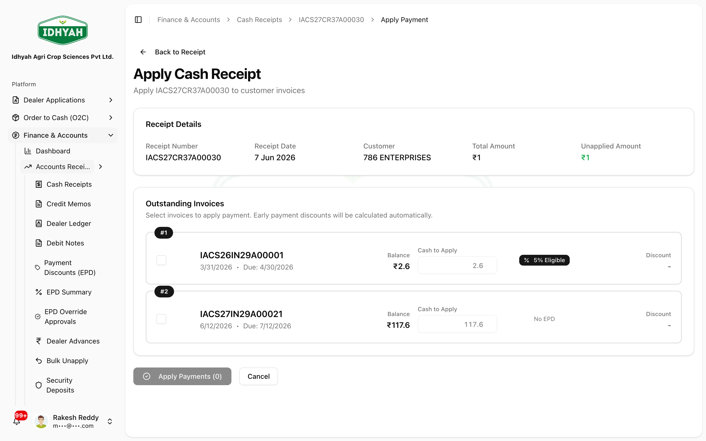
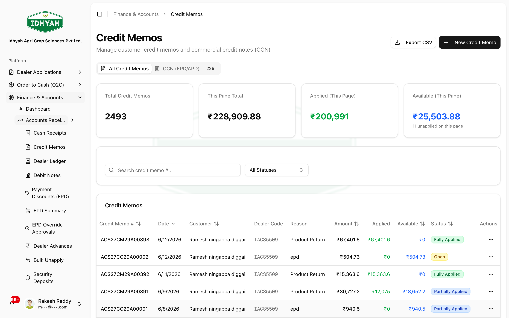
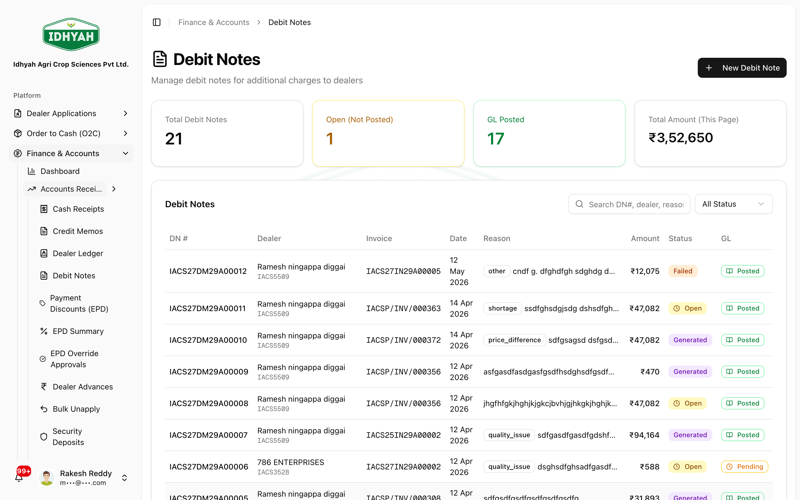
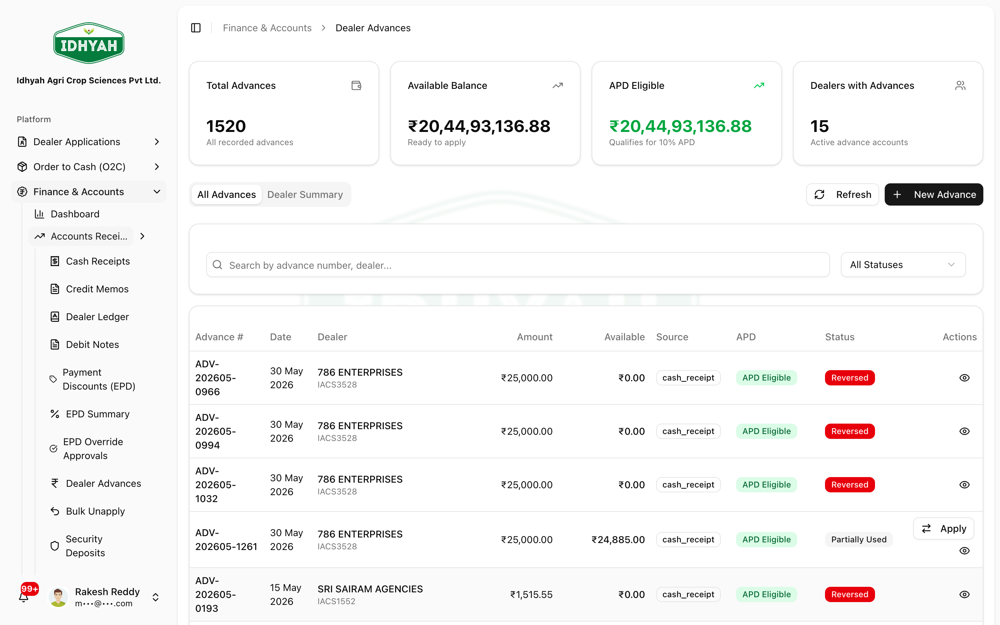
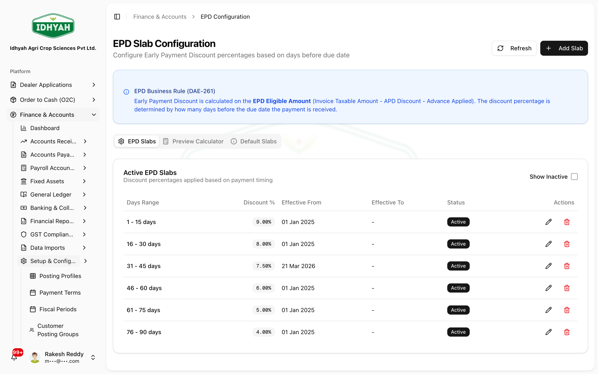
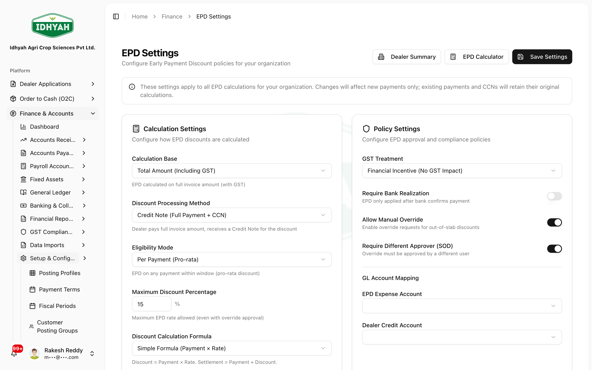
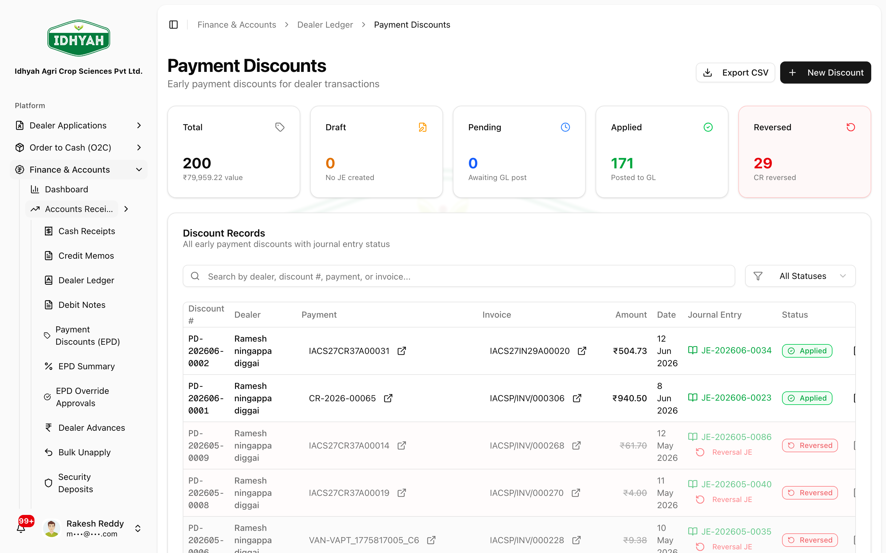
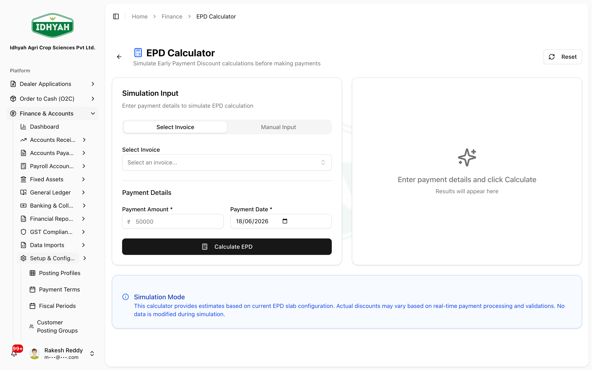

# Receipts, Credits & Discounts — in detail

> How money-in works in DAEE: recording **cash receipts**, **applying** them to invoices (selecting
> which invoices to settle), issuing **credit notes** and **debit notes**, handling **dealer
> advances**, and exactly how **early-payment discount (EPD)** and **advance-payment discount (APD)**
> are calculated — plus the **default (best-practice) calculation** and **how your organization can
> customize it**.

> **Audience:** Customer + Internal · **Module:** `/finance` · **Status:** 🟢 Authored
> **Verified:** against `web_app/src/app/finance` + production tenant configuration on 2026-06-18.

For the area overview and the rest of Finance, see the **[Finance & Accounts guide](./README.md)**.

---

## The money-in documents at a glance

| Document | What it is | Effect on the dealer balance |
|---|---|---|
| **Cash Receipt** | Money received from a dealer | **Reduces** what the dealer owes (once applied to invoices) |
| **Credit Memo (CCN)** | A credit note issued to the dealer (e.g. an earned EPD, a sales return) | **Reduces** what the dealer owes |
| **Debit Note** | A charge raised on the dealer (e.g. a recovery/adjustment) | **Increases** what the dealer owes |
| **Dealer Advance** | Money received *before* an invoice exists | Held as a credit, **applied** to future invoices |

All four are **applied** against invoices — applying is what actually moves the dealer's outstanding
balance and posts to the ledger.

---

## Cash Receipts — record and apply

### Record a receipt
**Finance → Accounts Receivable → Cash Receipts → New Cash Receipt** — capture the dealer, amount,
date, and payment mode.


### Apply the receipt to invoices (selecting invoices)
"Applying" links the money to specific **open invoices**. On the receipt, click **Apply**:

1. DAEE lists the dealer's **open invoices** (oldest first), each with its **outstanding** amount and a **checkbox**.
2. **Tick the invoices** to settle, and set the **amount to apply** per line (full or partial). The header shows **Cash to Apply**, **Amount to Apply**, and **Invoices Selected** so you can see the running total.
3. Click **Apply Cash Receipt**. Each selected invoice's balance drops by the applied amount; a fully-covered invoice becomes **Paid**.
4. Any **unused amount** stays available to apply later, or can be converted to a **dealer advance**.


<!-- capture: { "project": "iacs-md", "route": "/finance/cash-receipts/11693c97-eeb2-470f-b9b0-fc03d4aa09fd/apply" } -->

> **Tip** If the receipt qualifies for an **early-payment discount**, DAEE issues the **EPD credit note** as part of this flow (see below).
> **Caution** Applying and unapplying post to the ledger. Reverse only through **Bulk Unapply** so the books and the dealer ledger stay in step.

---

## Credit Memos & Debit Notes

- **Credit Memo (CCN)** — a credit note to the dealer. Sources: an **EPD/APD discount earned**, a **sales return**, or a manual adjustment. Apply it to open invoices to reduce the balance. CCNs that represent a tax credit carry an **IRN/e-credit-note** and flow to GSTR-1.
  
- **Debit Note** — a charge raised **on** the dealer (e.g. recovering an over-credit). It **increases** the dealer's outstanding and is reported in GST returns.
  

Both are issued from Finance → Accounts Receivable, numbered per your organization's format, and post to the ledger automatically.

---

## Dealer Advances

A **dealer advance** is money received before there's an invoice to apply it to.


1. **Create the advance** (or convert the unused part of a cash receipt to an advance).
2. The advance is **held as a credit** on the dealer's account.
3. **Apply** it to invoices as they're raised — optionally earning **APD** (below).
4. Unused advances are tracked and aged; an organization policy governs leftovers at year-end.

---

## Security Deposits

A **security deposit** is a **refundable** amount a dealer places with you (e.g. against a credit line) —
it is *not* revenue and *not* applied to invoices; it sits as a liability until returned or retained.


<!-- capture: { "project": "iacs-md", "route": "/finance/dealer-security-deposits" } -->

1. **Record Deposit** — **Finance → Dealer Security Deposits → Record Deposit** or open a specific dealer's
   page and use the **Record Deposit** button there:
   - Pick the **dealer** with the searchable dealer picker (search by **dealer code, name, or geography** — covers every dealer, not just the first thousand). On a dealer's page the dealer is pre-filled.
   - Enter the **amount** and **date**, then the **payment mode**. When the mode is a bank credit (NEFT/RTGS/UPI/Cheque/DD), pick the receiving **Bank Account** — DAEE lists your active bank ledger accounts so the cash side of the posting hits the right ledger.
   - Add a reference (UTR / cheque no.) and notes for the audit trail.
   The deposit is booked as a **liability** against that dealer, with the cash-side posted against the bank account you picked.
2. **Refund** — when the relationship ends or the deposit is no longer needed, **refund** it back to the
   dealer (the liability is cleared, cash goes out).
3. **Forfeit** — if terms allow retaining it (e.g. against dues/damages), **forfeit** part or all; the
   forfeited amount moves out of the deposit liability per your posting profile.

> **Caution** A security deposit is a **liability, not income** — never apply it to an invoice like a
> receipt or advance. Use **Refund** or **Forfeit** to close it so the dealer's liability balance is
> correct.

> **Tip** If the payment mode is **Cash**, the Bank Account picker doesn't apply — the cash side lands on your default cash ledger from the posting profile.
<!-- INTERNAL:START -->
- **Searchable dealer picker (DAEE-1172):** the dealer selector on Security Deposits is a `SearchableSelectDropdown` backed by a paged query — no 1000-row cap. Same helper as Chart of Accounts and other master-data pickers rolled out in the DAEE-1172 sweep.
- **Bank Account picker on Record Deposit (DAEE-1181 / CA-180):** the `RecordDealerDepositDialog` reads active bank ledger accounts (COA `is_bank_account = true`) and posts the cash side against the picked ledger — replaces the previous hard-coded fallback path.
<!-- INTERNAL:END -->

---

## Early-Payment Discount (EPD)

EPD rewards a dealer for **paying an invoice early** — the earlier they pay, the higher the discount.

**In general accounting**, this is a **cash (sales) discount**. A seller offers a small percentage off
if the buyer settles within a short window — the classic term is written **“2/10 net 30”**: *2% off if
paid within 10 days, otherwise the full amount is due in 30 days.* It's a deliberate trade-off — the
business gives up a little margin to **collect cash sooner and reduce credit risk**. The discount is
**not** a change to the original sale price for tax; it's recorded **separately** (in DAEE, as a credit
note), so the original invoice and its GST stay intact and auditable.

### The default calculation (ERP best practice)
At its simplest, EPD follows the classic *"x% if paid within n days"* term:

```
discount amount = eligible base × discount %
   where discount % is chosen by how early the payment is (days since the invoice date)
```

DAEE generalises this into **time-banded slabs** (a sliding scale instead of a single "n days"),
which is the recommended setup for distribution businesses: the sooner a dealer pays, the larger the
reward, tapering to zero.

### The four inputs
1. **How early** — DAEE counts the days **from the invoice date** to the payment date.
2. **The discount %** — read from your **EPD slabs** (days-since-invoice → %).
3. **The base amount** — the % is applied to your configured **calculation base** (the GST-inclusive invoice total, or the taxable value only).
4. **The result** — DAEE creates an **EPD credit note (CCN)** for `base × %`, reducing what the dealer owes.

### Example (a live agri-inputs configuration)
Slabs in this example:

| Days since invoice | Discount |
|---|---|
| 1–15 | **9%** |
| 16–30 | **8%** |
| 31–45 | **7%** |
| 46–60 | **6%** |
| 61–75 | **5%** |
| 76–90 | **4%** |

- **Base:** the invoice total **including GST**.
- **Worked example:** a dealer pays a ₹1,00,000 (GST-inclusive) invoice **10 days** after the invoice date → the 1–15 day slab = **9%** → an EPD credit note of **₹9,000**.

### Whose rate applies (precedence)
1. A **dealer-specific** early-payment configuration, if one exists for that dealer.
2. Otherwise, the **organization-wide EPD slabs**.

> **Note** A small **backdating window** is allowed (e.g. 3 days) so a receipt entered a day or two late still earns the correct discount. Manual overrides can be capped (e.g. 20%).

### How to customize EPD
Unlike APD, **EPD is self-service** — you control every part of the calculation yourself from
**Finance → Setup**, no admin/DB change needed:

**1. Set the slabs — `EPD Slab Configuration`**

- Click **Create EPD Slab** to add a band (days-from, days-to, discount %); **Edit** or **Deactivate** existing slabs.
- Slabs have an **effective window** and an **active** flag, so you can schedule a new scale without deleting the old one.
- A **Default EPD Slab Configuration** provides a sensible starting scale you can adjust.

**2. Set the behaviour — `EPD Settings`**

- **Calculation Base** — apply the discount to the **invoice total (GST-inclusive)** or the **taxable value only**.
- **Discount Calculation Formula** — how the discount is computed.
- **Eligibility Mode** — when EPD is assessed (e.g. per payment).
- **Maximum Discount Percentage** — a hard cap.
- **Allow Manual Override** (and its limit) — whether finance can adjust the rate case-by-case.

**3. Give one dealer a special rate — `Payment Discounts (EPD)`**

- **Create Payment Discount** for a specific dealer; it **overrides** the organization-wide slabs for that dealer only.

**4. Preview before you commit — `EPD Calculator`**

- Enter an amount and a pay date to see the discount your current configuration would produce.

<!-- INTERNAL:START -->
Calc: `app/finance/cash-receipts/utils/epdCalculation.ts → calculateEPD`. Days = `ceil((paymentDate − invoiceDate)/day)` (DAYS FROM INVOICE, not days-before-due — VAN-DEF-003). Rate: `discount_configurations` (dealer, `discount_type='early_payment'`, active + valid window) → else `epd_discount_slabs` (`days_from`/`days_to`/`discount_percentage`, `is_active`, `customer_id`/`dealer_category_id`/`priority` targeting). Base from tenant `epd_calculation_base` (`TOTAL_AMOUNT` → ratio 1.0; else `taxableRatio`); caps via `epd_max_override_percent`; formula via `epd_partial_payment_formula` (DAE-261). `epd_approach=APPROACH_B_CCN` → discount realised as a **credit note**. `ccn_auto_apply`, `ccn_numbering_format=CCN/{FY}/{SEQ:5}`, `epd_eligibility_mode=PER_PAYMENT`, `epd_allowed_backdate_days=3`. Example numbers verified on PROD (uvlofpzmvlaaandzosrt) for the agri-inputs tenant (all slabs `is_active`, eff 2025-02-22). Staging drift: staging 31-45 slab = 7.5% vs PROD 7.0% — PROD authoritative.

**Verified PROD EPD `tenant_settings` — Idhyah Agri (`d2353f40-…`, read-only 2026-06-18, 22 keys):** `epd_approach=APPROACH_B_CCN`, `epd_discount_approach=CCN_PER_PAYMENT`, `epd_rate_source=slab_only`, `epd_customer_slabs_enabled=true`, `epd_calculation_base=TOTAL_AMOUNT` (GST-inclusive), `epd_partial_payment_formula=SIMPLE`, `epd_eligibility_mode=PER_PAYMENT`, `epd_gst_treatment=FINANCIAL_INCENTIVE` (non-GST), `epd_max_discount_percentage=15`, `epd_allow_manual_override=true` (`epd_max_override_percent=20`), `epd_allowed_backdate_days=3`, `epd_requires_realization=false`, `epd_sod_enabled=true`, `epd_require_different_approver=true`, `epd_recapture_auto_apply=false` (`epd_recapture_min_threshold=1`, `epd_recapture_approval_threshold=10000`, `epd_recapture_notify_user=true`), GL: `epd_ar_account_code=1601`, `epd_dealer_credit_account_code=2650`, `epd_expense_account_code=6502`. **Governance contrast vs APD:** EPD has SoD + different-approver **ON** and recapture auto-apply **OFF**; APD is the reverse — note when reconciling controls.
<!-- INTERNAL:END -->

---

## Advance-Payment Discount (APD)

APD is different from EPD: it rewards paying **in advance** (against a **dealer advance**, before the
invoice exists), not paying an existing invoice early.

**In general accounting**, APD is an **advance/prepayment incentive** — a discount for putting money in
before any goods are invoiced. Because there is **no invoice and no tax point yet**, it is normally
treated as a **financial incentive** (outside GST), not a reduction of a taxable sale. The benefit is
realised later — when the advance is applied to an invoice — and is recorded as a **credit note**, so
the accounting stays clean and traceable.

### How it's calculated
- **Enabled per organization.**
- A **rate** (commonly a flat %) on the **advance amount** (gross).
- **Eligibility** can be limited (e.g. direct advances only).
- **GST treatment** — typically treated as a **non-GST financial incentive** (no tax on the discount).
- **Expiry** — an unused advance discount lapses after a set window (e.g. 30 days).
- When the advance is applied to an invoice, the APD benefit is issued as a **credit note (CCN)**, subject to the rules above.

**Example (a live configuration):** APD enabled, **10%** on the gross advance, direct advances only,
non-GST, 30-day expiry.

### Where APD is configured
Unlike EPD — which has self-service screens (**EPD Slab Configuration**, **EPD Settings**, **EPD
Calculator**) — **APD has no self-service screen today.** Because APD changes affect statutory and
accounting treatment (GST, TDS, year-end), it's configured **for your organization by your DAEE
administrator** — during onboarding, or later on request. There's nothing for an end user to toggle
day-to-day; you **decide the policy below once** and your administrator applies it.

### What to decide (and what each setting is for)
Give your administrator your answers to these. The example column shows a typical live agri-inputs
configuration.

| Decision | What it controls (why it matters to you) | Example |
|---|---|---|
| **Enable APD?** | Whether advance-payment discounts are offered at all | On |
| **Discount rate** | The % rewarded on a qualifying advance | 10% |
| **Calculation base** | Whether the % applies to the **gross** advance or a net figure | Gross |
| **Eligibility** | Which advances qualify — e.g. **direct advances only** vs all | Direct only |
| **Customer slabs?** | Whether different dealers get different rates (vs one flat rate) | Off (flat rate) |
| **Maximum discount** | A hard cap on the discount % so a mis-entry can't over-credit | 100% (no extra cap) |
| **GST treatment** | Whether the benefit is a **non-GST financial incentive** or a taxable adjustment | Non-GST |
| **TDS applicable?** | Whether tax is deducted at source on the incentive, and the **section / rate / threshold** | No (else 194H, 5%, ₹15,000) |
| **Expiry** | How many days an unused advance discount stays valid before it lapses | 30 days |
| **Year-end leftover** | What happens to unused APD at year-end — **carry forward** or write back | Carry forward |
| **Requires realisation?** | Whether the discount is only granted once the advance is actually applied | No |
| **Credit-note auto-apply** | Whether the APD credit note is applied to invoices automatically or manually | Manual |
| **Partial allocation** | How the discount splits when an advance is applied across several invoices | Proportional |
| **Governance (SoD)** | Whether a **separate approver** is required and segregation-of-duties is enforced | Off |
| **Manual override** | Whether staff may override the computed discount, and the **override cap** | Off (cap 5%) |
| **Backdating window** | How many days a late-entered advance can still earn the right discount | 7 days |
| **Recapture (clawback)** | If an advance is reversed/cancelled, automatically **reclaim** the discount — with an approval threshold and notification | Auto, approve > ₹10,000, notify |

> **Note** Because APD touches GST and TDS, treat these as **finance-policy decisions**, not casual
> toggles — confirm the GST and TDS treatment with your accountant before going live.

<!-- INTERNAL:START -->
**No dedicated self-serve APD UI** (confirmed: `src/app/finance/settings` has only `van-configuration` + `banks`; EPD has `epd-settings`; APD is read by `dealer-advances`/`ApplyAdvanceDialog.tsx` but never written from a settings page). Configured directly in `tenant_settings` (category `finance`, one row per key, `unique_tenant_setting` on `(tenant_id, setting_key)`).

**Verified PROD values — Idhyah Agri Crop Sciences (`tenant_id d2353f40-81ea-4f43-99d5-58dcf0becdc5`, read-only, 2026-06-18):** `apd_enabled=true`, `apd_rate=10`, `apd_calculation_base=gross`, `apd_eligibility_mode=direct_only`, `apd_customer_slabs_enabled=false`, `apd_max_discount_percentage=100`, `apd_gst_treatment=non_gst`, `apd_tds_applicable=false` (`apd_tds_section=194H`, `apd_tds_rate=5`, `apd_tds_threshold=15000`), `apd_expiry_days=30`, `apd_yearend_leftover_policy=carry_forward`, `apd_requires_realization=false`, `apd_ccn_auto_apply=false`, `apd_partial_allocation_formula=proportional`, `apd_sod_enabled=false`, `apd_require_different_approver=false`, `apd_allow_manual_override=false`, `apd_max_override_percent=5`, `apd_allowed_backdate_days=7`, `apd_recapture_auto_apply=true`, `apd_recapture_approval_threshold=10000`, `apd_recapture_min_threshold=0`, `apd_recapture_notify_user=true`, `apd_expense_account_code=6503` (26 keys total, all `is_active=true`). Advance-apply + CCN follow DAEE-602 Option-B JE (advance-apply Dr 1709/Cr 2650; CCN issue Dr 6503/Cr 2652 — `apd_expense_account_code` is the configurable Dr leg).
<!-- INTERNAL:END -->

---

## How DAEE adapts to your finance configuration

DAEE's finance behaviour is **configured per organization (tenant)** — the same software runs different
rules for different businesses. None of the numbers above are hard-coded; they come from **your**
settings. Tenants start from sensible **defaults** and customize.

| Area | What you can configure |
|---|---|
| **EPD** | On/off, the **slabs** (days → %), the **calculation base** (GST-inclusive vs taxable-only), the formula, eligibility mode, the backdating window, and the maximum/override caps |
| **APD** | On/off, the **rate**, base, eligibility, GST treatment, expiry, and approval/recapture/TDS/year-end controls |
| **Credit notes (CCN)** | Numbering format and whether they auto-apply |
| **Discount precedence** | Dealer-specific rates override the organization-wide slabs |
| **Accounts** | Which GL accounts receivables, bank, revenue, GST payable, and discount expense post to |
| **Periods & numbering** | Fiscal periods (what dates can be posted), document number formats and effective dates |
| **Posting profiles** | How each transaction type maps to GL accounts |
| **Banking automation** | VAN auto-allocation and auto-posting (see [Bank Collections (VAN)](./van.md)) |

> **Note** Settings can be **activated or deactivated** over time. Your live, **active** configuration
> drives every calculation — so two dealers (or two organizations) can legitimately see different
> discounts for the same payment timing.

## Related
[Finance & Accounts](./README.md) · [Bank Collections (VAN)](./van.md) · [Finance — Screen Index](./screens.md) · [Dealers](../dealers/README.md) · [Order to Cash (O2C)](../o2c/order-to-cash.md)
