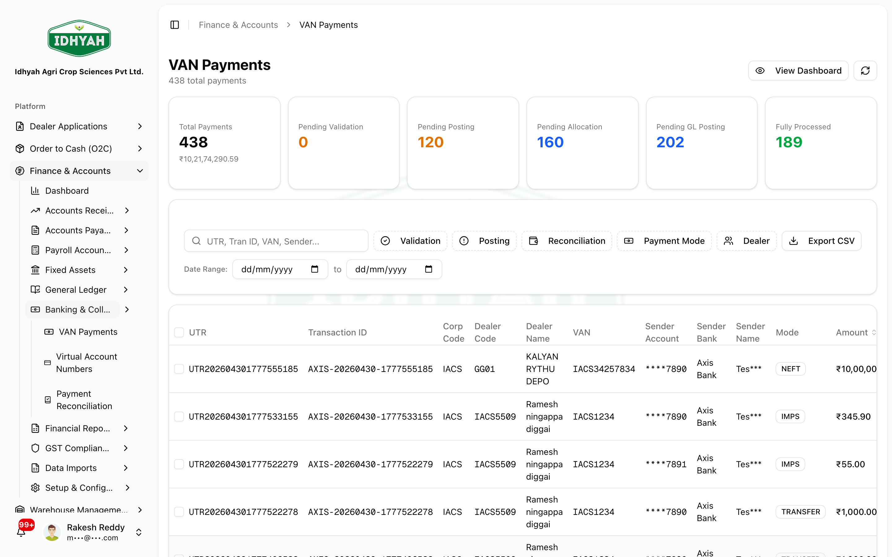
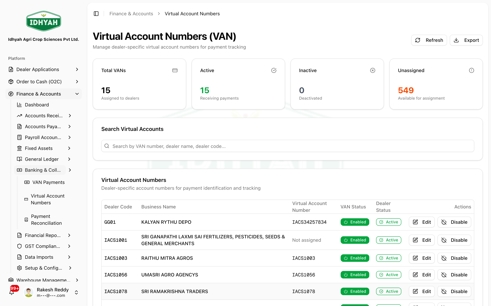
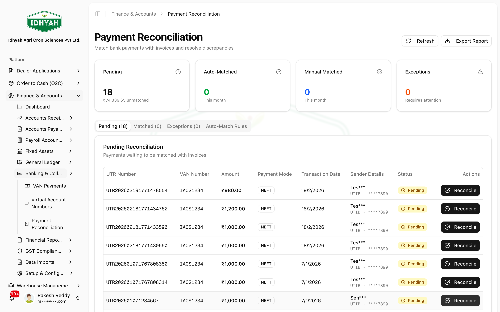

# Bank Collections (VAN)

> Collect dealer payments straight into **Virtual Account Numbers (VANs)** — each dealer pays a unique
> bank account, the bank notifies DAEE, and the credit is auto-identified, posted as a cash receipt,
> allocated to invoices, and run through EPD. This guide covers monitoring collections, enabling and
> editing dealer VANs, and working the reconciliation queue.

> **Audience:** Customer + Internal · **Module:** `/finance` (Banking & Collection) · **Status:** 🟢 Authored
> **Verified:** against `web_app/src/app/finance` + the Finance-team VAN guide + production config on 2026-06-18.

## What VAN is and why it matters
A **Virtual Account Number (VAN)** is a unique bank account number assigned to each dealer. When the
dealer transfers money (IMPS/NEFT/RTGS) to their VAN, the bank (**Axis Bank Power eColl**) notifies
DAEE in real time. Because the VAN identifies the dealer, DAEE can **automatically**:
1. **Validate** the credit, then **post** it to the ERP as a **cash receipt**;
2. **Allocate** it to the dealer's open invoices (FIFO, if auto-allocation is enabled);
3. Apply **early-payment discount (EPD)** and generate the related **credit note (CCN)** where eligible.

The result: faster, lower-error collections with a complete audit trail tied to the bank **UTR**.

## Before you begin

### What you need
- The correct **Finance & Accounts** permissions (VAN payments, dealer virtual accounts, payment reconciliation). *If a menu is missing, ask your administrator.*
- Dealers set up, each with an **active** status, ready to be assigned a VAN.
- Your bank VAN integration configured (see **VAN Configuration** in Setup).

### Roles and what each can do

| Role | Typical responsibilities |
|---|---|
| **Accounts / Finance user** | Monitor VAN collections, post & allocate, clear reconciliation |
| **Collections / Banking** | Enable & edit dealer VANs, share VAN/IFSC instructions with dealers |
| **Admin** | Configure the bank VAN integration and automation settings |

### Where to find it
In the sidebar, open **Finance & Accounts → Banking & Collection**:

| Screen | Route | Use for |
|---|---|---|
| **VAN Payments** | `/finance/van-payments` | Live feed and list of bank collections |
| **Virtual Account Numbers** | `/finance/van-management` | Enable/disable and edit dealer VANs |
| **Payment Reconciliation** | `/finance/reconciliation` | Items posted but not yet matched/reconciled |

### The collection lifecycle
```
Dealer pays VAN ──▶ Bank notifies DAEE ──▶ Validate ──▶ Post (cash receipt) ──▶ Allocate to invoices ──▶ GL + EPD/CCN
```

---

## VAN Payments — monitor collections


### How to read this screen
1. **Summary cards (top row):**
   - **Total Payments** — count and value for the filtered period.
   - **Pending Validation** — awaiting bank/API checks.
   - **Pending Posting** — not yet posted to the ERP.
   - **Pending Allocation** — a cash receipt exists but invoices aren't fully matched.
   - **Pending GL Posting** — allocated but the journal isn't posted.
   - **Fully Processed** — validated, posted, allocated, and GL complete.
2. **Search, filters, export:** search by **UTR, Transaction ID, VAN, or Sender**; filter chips for Validation, Posting, Reconciliation, Payment Mode, and Dealer; set a date range and **Export XLSX** (Excel) for month-end packs. The Dealer filter's dealer picker covers **every** dealer, not just the first thousand.
3. **Table & row actions:** each row shows corp/dealer codes, dealer name, dealer **Region / Territory / City**, VAN, masked sender bank, mode (IMPS/NEFT/…), amount, timestamps, and **status** (e.g. *Verification Success* or *Allocated*). When a payment has been posted, the row also links to the **Cash Receipt** it created — click through to see the invoice application in Finance.

> **Tip** Rows still at **Verification Success** may need **posting** before they move to **Allocated**. Use the **row menu (⋮)** to post from here.

> **Note** Manual invoice allocation is **not** available from the VAN Payments list any more. Post the receipt first, then apply it from **Cash Receipts** — that gives you the standard receipt-application dialog (with dealer advances and EPD handling) instead of a stripped-down list-side allocation.
<!-- INTERNAL:START -->
- **VAN Payments list geography + Cash Receipt link:** DAEE-1167 Part A shipped Region / Territory / City columns and the *cash_receipt_id* link on every posted row.
- **Excel-primary export:** DAEE-1167 Part B replaced the CSV-only export with an XLSX workbook (Summary + Data sheets) that matches the on-screen filters.
- **Manual invoice allocation removed from the list:** DAEE-1168 dropped the list-side "Allocate" surface in favour of the canonical Cash Receipt allocation flow (avoids two divergent allocation paths).
- **Row-cap fixes:** DAEE-1124 lifted the ~1000-row cap on the Dealer picker for the VAN filter (and mirror fixes in Credit Utilization + EPD Summary); DAEE-1167 also fixed a regression that capped the VAN Management dealer list + summary cards at 1000. All list/count/sum queries page via `fetchAllInBatches`.
<!-- INTERNAL:END -->

---

## Virtual Account Numbers — enable & edit


**Step by step:**
1. **Open Virtual Account Numbers** (`/finance/van-management`). Review the KPI cards: **Total VANs, Active, Inactive, Unassigned**.
2. **Search and pick the dealer** by VAN, dealer name, or dealer code. Confirm the **dealer status is Active** before enabling or editing — *inactive dealers can't be toggled.*
3. **Assign or change the VAN number** — click **Edit**, enter the **Virtual Account Number** assigned by the bank (**alphanumeric, 4–20 characters, unique**), and **Save Changes**. If your organization shows daily/monthly **collection limits**, set them here too. *(The dealer code in the dialog is read-only.)*
4. **Enable or disable collections** — use **Enable** so the VAN status shows **Enabled** (green); use **Disable** to stop new collections mapping to that dealer.

> **Tip** After enabling, share the correct **IFSC + VAN** payment instructions with the dealer (the payer-facing VAN instructions).
> **Caution** Disabling a dealer VAN stops new auto-mapping — confirm with your commercial team before toggling it off.

---

## Payment Reconciliation — clear the queue


The **Pending** tab lists payments **posted successfully** to the ERP that still have reconciliation
status **pending**. Work the tabs:
- **Pending** — ready to complete; click **Reconcile** on a row when the amount ties out.
- **Matched** — already reconciled.
- **Exceptions** — validation/posting failures to investigate.
- **Auto-Match Rules** — rules that auto-reconcile routine credits.

**Refresh** pulls the latest counts; **Export Report** supports audit packs.

### What happens after a successful VAN posting
- **Cash receipt** — DAEE creates (or links) a **cash receipt** for the bank credit and ties it to the VAN payment record.
- **Auto-allocation** — if auto-allocation is enabled, the receipt is applied to open invoices (commonly **FIFO**); otherwise finance allocates manually until the amount ties out.
- **EPD / CCN** — where early-payment rules apply, DAEE records the EPD and generates the **EPD credit note (CCN)** as a non-GST commercial adjustment, with GL impact aligned to your posting profiles. *(See [Receipts, Credits & Discounts](./receipts-credits-discounts.md).)*

---

## Quick tips
- **Same-day checks** — compare **VAN Payments** totals with the **Pending** card on Reconciliation before sign-off.
- **UTR is the key** — always quote the **UTR** when speaking with the bank or internal audit; it links bank ↔ ERP ↔ DAEE.
- **Disable with care** — disabling a dealer VAN stops new auto-mapping; confirm with commercial first.

## Common mistakes
| What you see | Why it happens | What to do |
|---|---|---|
| A credit isn't auto-allocating | Auto-allocation is off, or no matching open invoice | Post the VAN row, then open **Cash Receipts** and apply it — the list-side allocate action is no longer available. |
| Can't enable a dealer's VAN | The dealer is **Inactive** | Activate the dealer first, then enable the VAN |
| "VAN already exists" on save | VANs must be **unique** (4–20 alphanumeric) | Use the exact VAN the bank assigned; check it isn't mapped elsewhere |
| Payment stuck at *Verification Success* | Posted/validated but not yet posted to ERP or allocated | Use the row menu to **Post** (then apply from Cash Receipts); check **Exceptions** if posting fails |
| A dealer you know exists is missing from the Dealer filter | Was a symptom of the ~1000-row picker cap on very large tenants | Fixed — the filter now covers every dealer. Retry the search; escalate if still missing. |

## Support and escalation
- **Posting / allocation / reconciliation** → your Accountant or Finance lead.
- **VAN enablement / dealer mapping** → Collections / Banking team.
- **Bank integration / API issues** → your administrator (bank VAN integration).

<!-- INTERNAL:START -->
**Integration (developer/admin):** VAN runs on the **Axis Bank Power eColl** integration via edge functions
`axis-bank-validation` (verify) and `axis-bank-posting` (post), authenticated with **API Key + HMAC-SHA256**
request signing (mandatory in production), idempotent, sub-3s SLA, full audit trail, dual-key rotation.
Endpoints: `POST /functions/v1/axis-bank-validation`, `POST /functions/v1/axis-bank-posting`. Tenant settings
(`tenant_settings`, category `finance`/`automation`/`axis_bank`): `van_auto_allocation_enabled`,
`van_auto_gl_posting_enabled`, `van_notification_emails`, `van_posting_api_endpoint`, `van_validation_api_endpoint`,
`axis_bank_van_gl_account_code`. Data: `van_payment_collections`. Full API contract: `daee-production/docs/axis-bank-security/DAEE_Axis_Bank_VAN_Production_Integration_Guide_Enterprise` (CONFIDENTIAL — Axis Bank integration team).
<!-- INTERNAL:END -->

## Related
[Finance & Accounts](./README.md) · [Receipts, Credits & Discounts](./receipts-credits-discounts.md) · [Finance — Screen Index](./screens.md) · [Dealers](../dealers/README.md)
