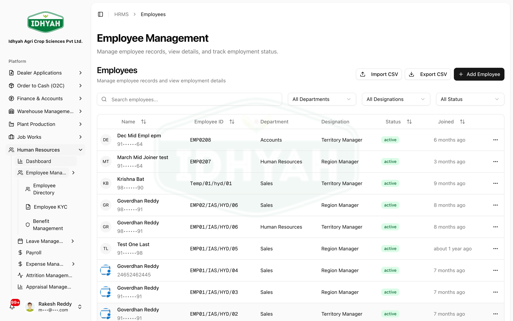
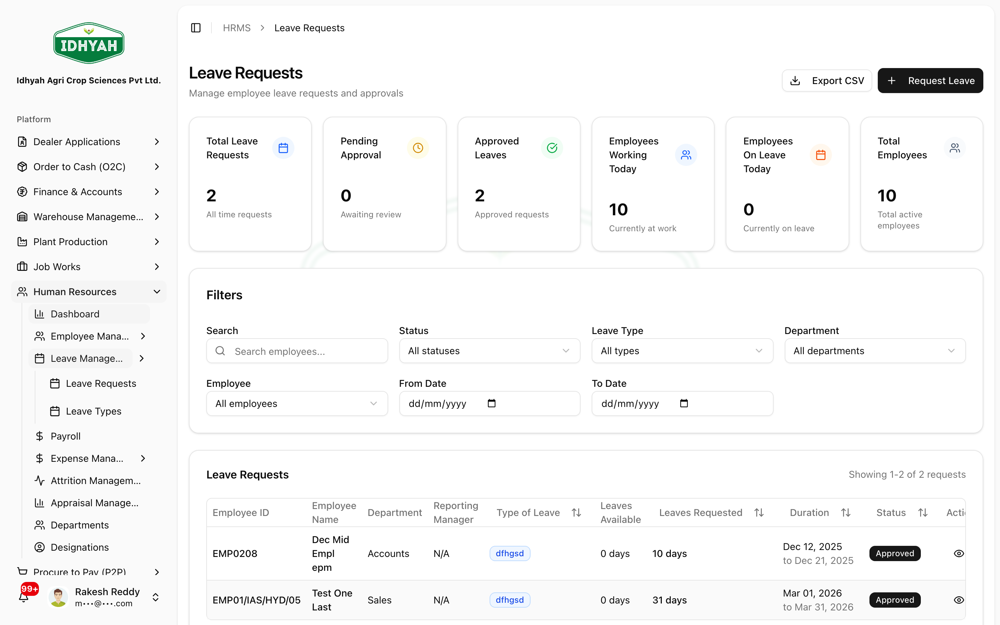
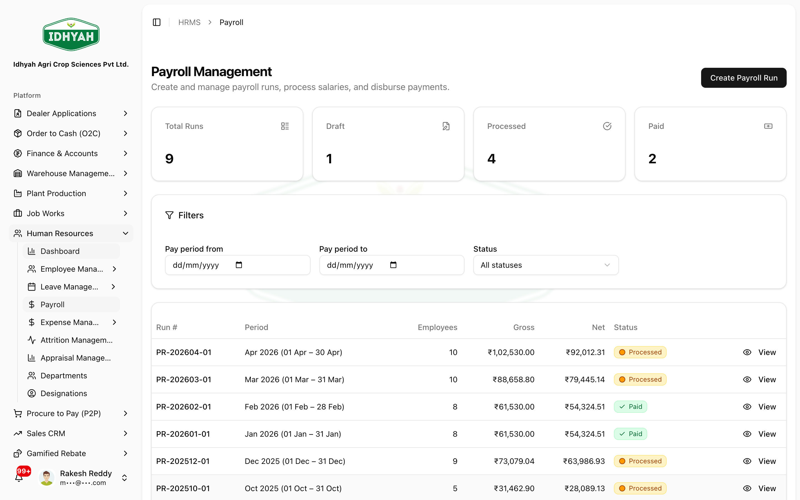

# Human Resources (HRMS)

> Manage your people — from onboarding and leave to payroll, expenses, and exits — with an employee
> self-service portal and a clean handover of payroll to Finance.

> **Audience:** Customer + Internal · **Module:** `/hrms` · **Status:** 🟢 Authored
> **Verified:** against `web_app/src/app/hrms` + staging DB on 2026-06-18.

## What you can do
- **Employees** — maintain the employee master, **KYC**, bank details, dependents, salary, and benefits.
- **Org structure** — set up **departments** and **designations**.
- **Leave** — define **leave types**, track balances, and run **leave requests → approval**.
- **Payroll** — run payroll (gross, statutory deductions, TDS, net), generate payslips, and approve runs.
- **Expenses** — employees submit **expense claims** against **categories**; managers approve.
- **Appraisals** — performance reviews.
- **Attrition & exits** — resignations and retention tracking.
- **Self-service (Centura)** — an **employee portal** for payslips, leave, and personal details.

## Before you begin

### What you need
- **Departments** and **designations** set up (so employees can be assigned).
- **Leave types** and **expense categories** configured.
- Salary structures defined for payroll.
- Finance posting profiles configured (so payroll posts to the books — see [Payroll Accounting](../finance/payroll.md)).

### Roles and what each can do

| Role | Typical responsibilities |
|---|---|
| **HR Admin** | Onboard employees, KYC, org structure, leave types, expense categories |
| **Manager / Approver** | Approve leave requests, expense claims, resignations |
| **Payroll Officer** | Run payroll, generate payslips, approve runs |
| **Employee** | Self-service: view payslips, apply for leave, submit expenses (Centura portal) |
| **Finance** | Post approved payroll to the GL (see Finance) |

<!-- INTERNAL:START -->
Access is permission-gated per area (`employees`, `employee_kyc`, `employee_benefits`, `departments`, `designations`, `leave_requests`, `leave_types`, `expense_claims`, `expense_categories`, `hrms_payroll`, `performance_reviews`, `salary_structures`, `training_records`, `hrms_resignations`, `centura`, `hrms_dashboard`) and tenant-isolated via RLS. The employee self-service portal (Centura) runs through the `hrms-employee-portal` edge function. Payroll tax (TDS, PT slabs, LOP, proration) is computed in HRMS. *(Tables, payroll calc, posting handover → [HRMS Developer Guide](../../developer-guides/hrms.md).)*
<!-- INTERNAL:END -->

### How HR is organised
```
Setup    ── Departments · Designations · Leave Types · Expense Categories · Salary Structures
People   ── Employees (KYC · bank · dependents · benefits · salary)
Time     ── Leave Requests · Leave Balances
Pay      ── Payroll Runs · Payslips  →  (posted to GL in Finance)
Spend    ── Expense Claims (by category)
Grow     ── Appraisals
Exit     ── Resignations · Retention tracking
Portal   ── Centura (employee self-service)
```

---

## Key workflows

### Onboard an employee
**Role:** HR Admin · **Result:** an active employee, ready for payroll
1. **Employees → New** — capture personal details, **department & designation**, joining date, and contact.
2. Add **KYC**, **bank details**, **dependents**, **salary**, and **benefits**.
   
   <!-- capture: { "project": "iacs-md", "route": "/hrms/employees" } -->
> **Tip** Set up **departments** and **designations** first so they're available to assign.

### Apply for and approve leave
**Role:** Employee → Manager · **Result:** leave approved and balance updated
1. **Leaves → New** — choose a **leave type** and dates; the request goes to the approver.
   
   <!-- capture: { "project": "iacs-md", "route": "/hrms/leaves" } -->
2. The manager **approves or rejects** it; an approved request reduces the employee's **leave balance**.

### Run payroll
**Role:** Payroll Officer · **Result:** an approved payroll run, ready to post & disburse
1. **Payroll → New** — choose the pay period; DAEE computes **gross, statutory deductions (PF/ESI/PT), TDS, and net** per employee.
   
   <!-- capture: { "project": "iacs-md", "route": "/hrms/payroll" } -->
2. Generate **payslips**, review, and **approve** the run.
3. Finance then **posts it to the ledger** and disburses net pay — see [Payroll Accounting](../finance/payroll.md).

### Submit and approve an expense claim
**Role:** Employee → Manager · **Result:** an approved claim, ready for reimbursement
1. **Expenses → New** — pick an **expense category**, enter the amount, attach proof; submit.
2. The manager **approves or rejects**; approved claims are reimbursed.

### Handle a resignation
**Role:** Employee → HR/Manager · **Result:** a tracked exit
1. A **resignation** is raised and routed for approval; retention activity is logged.
2. On approval the exit is recorded for final settlement and reporting.

---

## Pages & areas

| Area | Pages | What you do there |
|---|---|---|
| **Employees** | Employee Directory · Employee KYC · Benefits | Maintain the employee master and statutory KYC |
| **Org structure** | Departments · Designations | Define the org for assignment and reporting |
| **Leave** | Leave Requests · Leave Types | Configure leave and run request→approval |
| **Payroll** | Payroll | Run payroll, payslips, approval (posting is in Finance) |
| **Expenses** | Expense Claims · Expense Categories | Submit and approve reimbursements |
| **Appraisals** | Appraisal Management | Performance reviews |
| **Attrition** | Attrition · Resignations | Manage exits and retention |
| **Self-service** | Centura portal | Employee access to payslips, leave, details |

---

## Common use cases
- **New joiner to first payslip** — onboard → KYC/bank/salary → included in the next payroll run.
- **Monthly payroll** — run → payslips → approve → Finance posts & disburses.
- **Leave management** — employees apply via self-service; managers approve; balances update.
- **Expense reimbursement** — claim by category → approval → reimbursement.

## Reference
- **Statuses:** Leave — Pending → Approved / Rejected / Cancelled. Expense — Pending → Approved / Rejected → Paid. Payroll — Draft → Payslips generated → Processed → Approved → Paid. Resignation — Pending → Approved → Resigned.
<!-- INTERNAL:START -->Tables: `employees`, `employee_kyc`, `employee_bank_details`, `employee_dependents`, `employee_benefits`, `employee_salaries`, `employee_leave_balances`, `employee_resignations`, `employee_retention_log`, `departments`, `designations`, `leave_types`, `leave_requests`, `expense_categories`, `expense_claims`, `payroll_runs`, `payroll_items`. Payroll calc + GL handover → [Developer Guide](../../developer-guides/hrms.md).<!-- INTERNAL:END -->
- **Integration:** approved payroll flows to **Finance → Payroll Accounting** for GL posting and disbursement.

## Troubleshooting
| What you see | Why it happens | How to fix it |
|---|---|---|
| Can't assign a department/designation | It hasn't been created yet | Set up Departments & Designations first |
| Employee missing from payroll | No active salary, or joined after the period | Add/activate the salary; check joining date |
| Leave rejected as "insufficient balance" | The leave type balance is exhausted | Check the employee's leave balance and type |
| Payroll won't post to the ledger | The run isn't **Approved** | Approve the payroll run first (posting is done in Finance) |
| Expense claim stuck | Awaiting manager approval | Follow up with the approver |

## Support and escalation
- **Employee data / KYC / org setup** → HR Admin.
- **Payroll calculation / TDS** → Payroll Officer; **posting/disbursement** → Finance.
- **Self-service (Centura) access** → HR Admin / IT.

## Related workflows
[Finance → Payroll Accounting](../finance/payroll.md) (payroll posting & disbursement) · Finance (statutory deposits).
