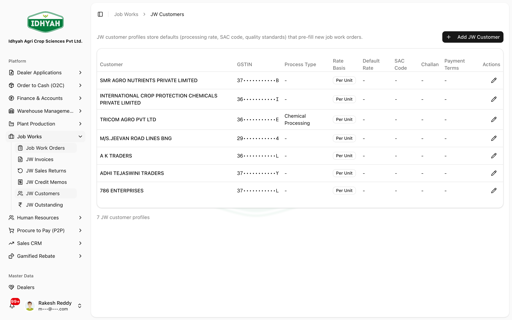
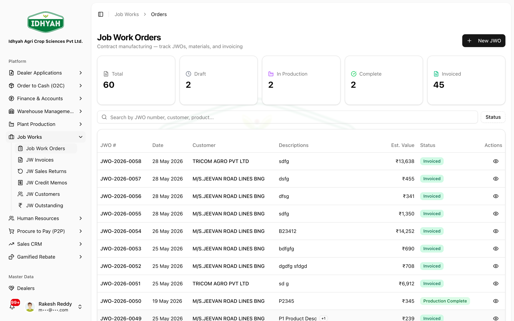
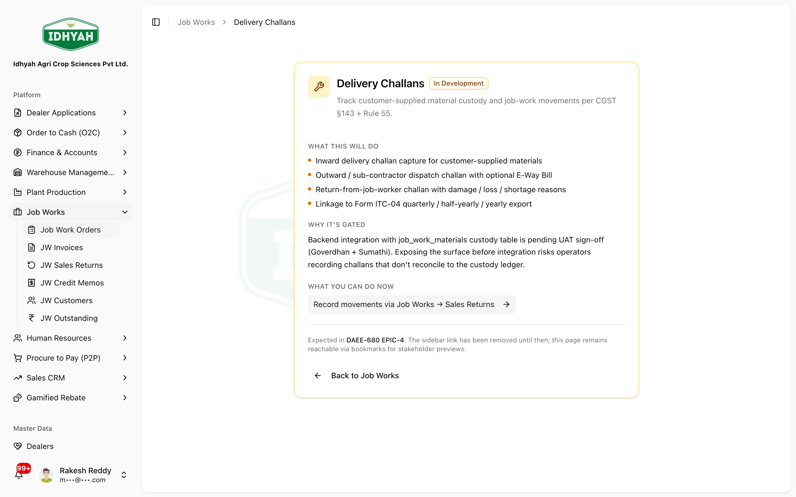
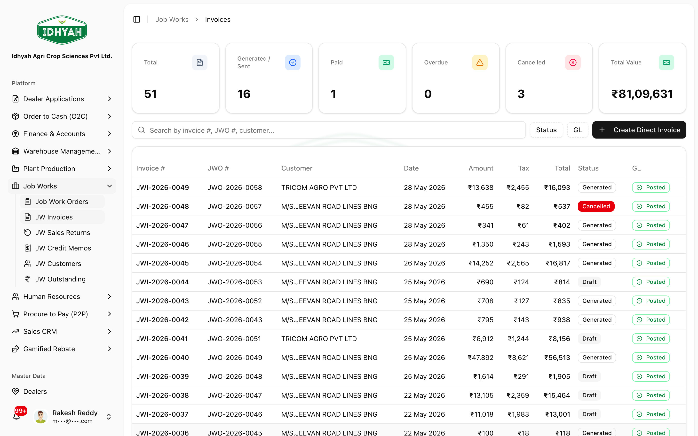
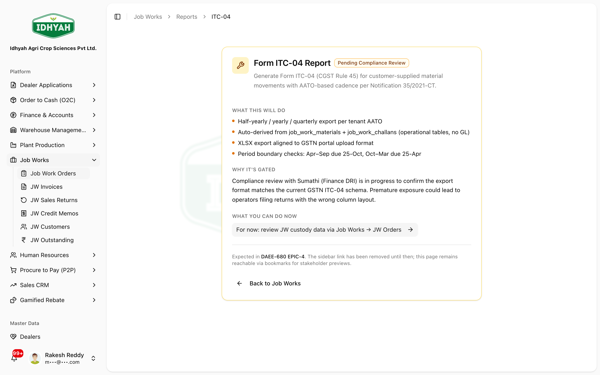
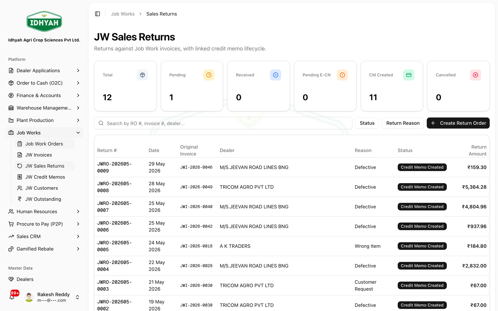
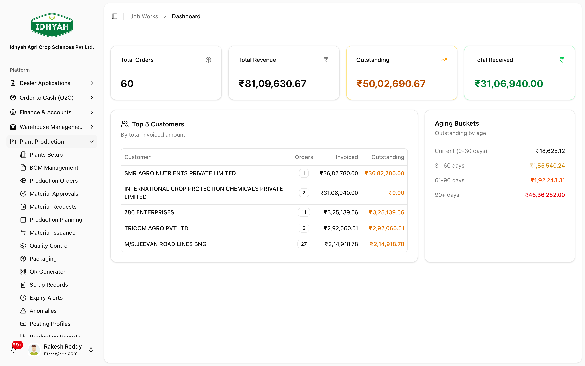

# Job Works

> Run manufacturing as a service for your customers — receive their materials, process them, dispatch
> the output, and bill the job-work service compliantly (E-Invoice, ITC-04).

> **Audience:** Customer + Internal · **Module:** `/job-work` · **Status:** 🟢 Authored
> **Verified:** against `web_app/src/app/job-work` + staging DB on 2026-06-18.

## What you can do
- **Maintain job-work customers** — the principals who send you materials to process.
- **Manage job-work orders** — what to make, from whose materials, and on what terms.
- **Record delivery challans** — **inward** (customer-supplied materials received) and **outward** (processed goods dispatched, with an optional E-Way Bill).
- **Invoice the service** — raise **JW Invoices** for the processing charge with **E-Invoice (IRN)**.
- **Handle returns & credits** — **JW Sales Returns** and **JW Credit Memos** (e-credit notes).
- **Stay compliant** — job-work **compliance alerts** (and **ITC-04** reporting, *coming soon* — see note).
- **Track** — a job-work **dashboard** and outstanding.

> **Note** In Job Works, your business is the **job worker** providing a manufacturing service. The
> materials belong to your **customer (the principal)**; you bill only for the processing (job-work
> service, GST HSN 9988-series), not for the goods.

## Before you begin

### What you need
- **Job-work customers** set up (with GSTIN — drives interstate vs intra-state tax and E-Way Bills).
- The **service / process** you provide defined, with the right **job-work HSN** and tax rate.
- Accounting rules configured (job-work invoices and credit notes post to the GL).
- For dispatch with goods movement: **transport providers** (for E-Way Bills).

### Roles and what each can do

| Role | Typical responsibilities |
|---|---|
| **Job-work coordinator** | Maintain customers, create job-work orders, record challans |
| **Stores** | Capture inward materials, dispatch outward challans |
| **Finance (AR)** | Raise JW invoices, process returns and credit notes, collect |
| **Compliance** | Review ITC-04 and job-work compliance alerts |

<!-- INTERNAL:START -->
Access is permission-gated (`job_work_orders`, `finance_credit_memos`, `journal_entries`) and tenant-isolated via RLS. JW invoices/credit notes post to the GL and run E-Invoice through the shared GST integration (`external-einvoice-processor`); credit notes carry IRN + e-credit-note status. Delivery Challans are under Job Work (DAEE-680). *(Tables, posting model, e-invoice path → [Job Works Developer Guide](../../developer-guides/job-works.md).)*
<!-- INTERNAL:END -->

### The flow at a glance
```
Customer (principal)   Order            Goods movement              Bill & adjust
────────────────────   ──────────────   ─────────────────────────   ─────────────────────────
JW Customers      ──▶  Job Work    ──▶  Inward Challan (receive) ──▶ JW Invoice (service + IRN)
(GSTIN, profile)       Order             → process → Outward          → JW Sales Return
                                          Challan (dispatch +EWB)      → JW Credit Memo (e-credit)
                                                                       → ITC-04 reporting
```

---

## Quickstart: process a job-work order and bill it
**You'll:** receive materials → process → dispatch → invoice the service · **Roles:** Coordinator + Stores + Finance

1. **JW Customers** — ensure the principal is set up (name, GSTIN, address).
   
   <!-- capture: { "project": "iacs-md", "route": "/job-work/customers" } -->
2. **Job Work Orders** — create the order (customer, what to process, quantity, charge).
   
   <!-- capture: { "project": "iacs-md", "route": "/job-work" } -->
3. **Delivery Challans → Inward** — record the customer-supplied materials received. After processing, raise an **Outward** challan to dispatch the output (add an E-Way Bill if goods move).
   
   <!-- capture: { "project": "iacs-md", "route": "/job-work/challans" } -->
4. **JW Invoices** — bill the processing charge; generate the **E-Invoice (IRN)**.
   
   <!-- capture: { "project": "iacs-md", "route": "/job-work/invoices" } -->
5. *(If needed)* **JW Sales Returns** → **JW Credit Memos** issue an e-credit note.
6. **ITC-04** (the statutory job-work return) is **in preparation** — meanwhile track goods sent/received as custody data via **Job Work Orders** and the **Challans**.
   
   <!-- capture: { "project": "iacs-md", "route": "/job-work/reports/itc-04" } -->
   > **Note** The ITC-04 export is undergoing compliance review and is **not yet available for filing**. Use your inward/outward **Challans** as the source of goods-movement data until it's released.

---

## Pages & buttons

### JW Customers (`/job-work/customers`)
| Button | What it does |
|---|---|
| **Create / Edit** | Maintain a job-work customer (principal) — name, GSTIN, address. |

### Job Work Orders (`/job-work`)
| Button | What it does |
|---|---|
| **Create** | Raise a job-work order (customer, process, quantity, charge). |
| **(open an order)** | View the order, linked challans, and activity. |

### Delivery Challans (`/job-work/challans`)
| Button | What it does |
|---|---|
| **Inward** | Capture customer-supplied materials received. |
| **Outward** | Dispatch processed goods (optional **E-Way Bill**). |

### JW Invoices (`/job-work/invoices`)
| Button | What it does |
|---|---|
| **Create** | Bill the job-work service charge. |
| **Generate E-Invoice** | Obtain the **IRN** from the GST portal. |

### JW Sales Returns & Credit Memos (`/job-work/sales-returns`, `/job-work/credit-memos`)
| Button | What it does |
|---|---|
| **Create Return Order** | Record a return against a JW invoice. |
| **Create Credit Memo** | Issue a JW credit note (e-credit note with IRN). |


<!-- capture: { "project": "iacs-md", "route": "/job-work/sales-returns" } -->

### Compliance & Reports (`/job-work/reports/itc-04`, `/job-work/dashboard`)
| Page | What it does |
|---|---|
| **ITC-04** | The statutory return for goods sent to / received from job work — **coming soon** (in compliance review; not yet available for filing). |
| **Dashboard** | Metrics (orders, revenue, **outstanding**, received), **Top-5 customers**, and **AR aging buckets**. |
| **JW Outstanding** | Opens the **dealer-outstanding report scoped to job-work customers** — open it from the **Job Works** menu (not the generic Finance menu) so it filters to JW. |
| **Compliance Alerts** | *Coming soon* (**Pending UAT**) — an alert queue for cancel/reverse & IRP anomalies, **not yet exhaustive**, so the sidebar link is hidden for now. Until it ships, review the **JE Audit Log** under **Finance → Audit**. |


<!-- capture: { "project": "iacs-md", "route": "/job-work/dashboard" } -->

---

## Common use cases
- **Receive → process → dispatch → bill** — the standard job-work cycle, ending in a service invoice with IRN.
- **Return of processed goods** — JW Sales Return → JW Credit Memo (e-credit note).
- **Quarterly ITC-04 filing** — *(coming soon)* track goods movement to/from job work via challans; the ITC-04 export is in compliance review.
- **Move goods compliantly** — outward challan with an E-Way Bill when the dispatch crosses the threshold.

## Reference
- **Statuses:** Order — Pending → Open → Received → Completed (or Cancelled). Invoice — Draft → Generated → Posted. Sales return — Received → Goods received (pending e-credit) → Credit memo created → Returned. Credit memo — Generated → Partially/Fully applied → Settled (or Reversed).
<!-- INTERNAL:START -->Status codes incl. `pending, open, received, generated, posted, cancelled, returned, goods_received_pending_ecredit, credit_memo_created, partial_applied, fully_applied, settled, reversed, resolved`. Tables: `job_work_orders(+_items)`, `job_work_materials`, `job_work_invoices(+_invoice_items)`, `job_work_credit_memos(+_lines/_applications)`, `job_work_sales_returns(+_items)`, `job_work_customer_profiles`, `job_work_import_rows`. Schema → [Developer Guide](../../developer-guides/job-works.md).<!-- INTERNAL:END -->
- **Outputs:** delivery challans, JW service invoices (IRN), e-credit notes, ITC-04 data, GL postings.

## Troubleshooting
| What you see | Why it happens | How to fix it |
|---|---|---|
| Tax looks wrong on a JW invoice | Interstate vs intra-state depends on the customer's GSTIN/state | Check the customer's GSTIN and state on their profile |
| Can't dispatch with an E-Way Bill | Outward challan needs valid transporter/GSTIN details | Add a master transporter with a GST id (see O2C E-Way Bill) |
| Credit note stuck "pending e-credit" | The e-credit note (IRN) hasn't been generated yet | Generate the e-credit note; check compliance alerts |
| ITC-04 report not in the menu | The ITC-04 export is **in compliance review** and the menu link is hidden until release | Track goods movement via **Challans** for now; the report will appear when released |

## Support and escalation
- **Order / challan questions** → your Job-Work coordinator.
- **Invoice / credit / collection** → Finance (AR).
- **ITC-04 / compliance** → Compliance/Finance.

## Related workflows
[Plant Production](../plant-production/README.md) (your own manufacturing) · [Order to Cash (O2C)](../o2c/order-to-cash.md) (E-Invoice / E-Way Bill mechanics) · Finance → Accounts Receivable (collection).
