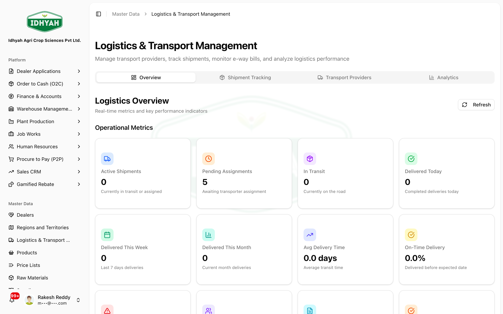

# Logistics & Transport

> Manage who moves your goods and how shipments are going: maintain your **transport providers**, track
> **shipments** against sales orders, monitor **E-Way Bills**, and read **logistics analytics** — all in
> one console.

> **Audience:** Customer + Internal · **Module:** `/logistics-transport-management` · **Status:** 🟢 Authored
> **Verified:** against `web_app/src/app/logistics-transport-management` on 2026-06-18.

## What you can do
- **Transport Providers master** — add and maintain carriers with GSTIN, **GST Transporter ID**, contact, and coverage (region/territory).
- **Shipment tracking** — see each shipment against its sales order: transporter, mode, vehicle, driver, route, dispatch/delivery dates, LR number, freight, and status.
- **E-Way Bill monitoring** — track E-Way Bill number, validity, and status for shipments.
- **Analytics** — logistics metrics, provider performance, and monthly trends.

## Before you begin
- Your **regions / territories** are set up (used for provider coverage).
- For **E-Way Bill** use, providers need a valid **GST Transporter ID**.
- Shipment tracking is populated from **sales orders / dispatch** — it isn't created from scratch here.

### Roles and what each can do

| Role | Typical responsibilities |
|---|---|
| **Logistics / Dispatch Admin** | Maintain transport providers; monitor shipments and E-Way Bills |
| **Sales / Operations** | View shipment status against their orders |
| **Management** | Read analytics — provider performance and trends |

<!-- INTERNAL:START -->
Permission-gated on `master_transport_providers` (provider CRUD); the dashboard also reads shipment, E-Way Bill, region, and profile data. Tenant-isolated via RLS. Tables: `master_transport_providers`, `transport_details`, `ewaybill_generation_log`, `master_regions`, `profiles`. E-Way Bills here are **viewed/tracked** — generation runs in the O2C/e-invoice path, not this console. *(Schema, statuses, controls → [Logistics & Transport Developer Guide](../../developer-guides/logistics.md).)*
<!-- INTERNAL:END -->

### How the console is organised
```
Overview            ── headline logistics metrics
Transport Providers ── the carrier master (CRUD, CSV export)
Shipment Tracking   ── shipments per sales order, with E-Way Bill status
Analytics           ── provider performance · monthly trends
```

---

## Key workflows

### Maintain transport providers
**Role:** Logistics Admin · **Result:** carriers ready for dispatch & E-Way Bills
1. Open **Logistics & Transport → Transport Providers** and **Add** a provider — name, GSTIN, **GST Transporter ID**, point of contact, contact number, and coverage (region/territory).
   
   <!-- capture: { "project": "iacs-md", "route": "/logistics-transport-management" } -->
2. Keep providers **active/inactive** as needed; export the provider list to CSV for review.
> **Tip** Enter the **GST Transporter ID** accurately — it's what lets a provider be used for E-Way Bill generation downstream.

### Track shipments
**Role:** Logistics / Sales · **Result:** live visibility of every dispatch
1. Open the **Shipment Tracking** tab to see shipments against sales orders — transporter, **mode** (road/rail/air/ship), **vehicle** and type, driver, route (distance, source/destination pincode), and dates.
2. Follow each shipment through its status: **planned → assigned → in transit → out for delivery → delivered** (or **delayed / cancelled**).
> **Caution** Shipment records flow from the order/dispatch process — use this tab to **monitor and follow up**, not to invent shipments.

### Monitor E-Way Bills & analytics
**Role:** Logistics Admin / Management · **Result:** compliance and performance visibility
1. On a tracked shipment, check the **E-Way Bill** number, **validity date**, and status (pending / generated / active / expired / cancelled / failed).
2. Use the **Analytics**/**Overview** tabs for provider performance and monthly trends.
> **Caution** Watch **validity dates** — an expired E-Way Bill on goods in transit is a compliance risk; act before expiry.

---

## Pages & areas

| Tab | What you do there |
|---|---|
| **Overview** | Headline logistics metrics at a glance |
| **Transport Providers** | Add/edit/deactivate carriers; CSV export |
| **Shipment Tracking** | Monitor shipments per order, vehicle/driver/route, status, E-Way Bill |
| **Analytics** | Provider performance and monthly trends |

---

## Common use cases
- **Onboard a carrier** — add the provider with GSTIN and GST Transporter ID → it's available for dispatch and E-Way Bills.
- **Chase a late delivery** — find the shipment in tracking, check status and expected delivery, contact the provider.
- **Review carrier performance** — use analytics to compare providers over recent months.

## Reference
- **Transport modes:** road · rail · air · ship.
- **Vehicle types:** regular · over-dimensional cargo · tanker.
- **Shipment status:** planned · assigned · in transit · out for delivery · delivered · delayed · cancelled.
- **E-Way Bill status:** pending · generated · active · expired · cancelled · failed.
<!-- INTERNAL:START -->Tables: `master_transport_providers`, `transport_details`, `ewaybill_generation_log`. EWB generation is in the O2C/e-invoice path. Schema → [Developer Guide](../../developer-guides/logistics.md).<!-- INTERNAL:END -->

## Troubleshooting
| What you see | Why it happens | How to fix it |
|---|---|---|
| A provider can't be used for E-Way Bill | Missing/invalid GST Transporter ID | Add the correct GST Transporter ID to the provider |
| A shipment isn't listed | It hasn't been dispatched/recorded against the order yet | Check the order/dispatch step; tracking is downstream |
| E-Way Bill shows failed | Generation was rejected upstream | Review the error on the order's e-invoice/E-Way Bill step and retry there |
| E-Way Bill expired | Past its validity date | Treat as a compliance issue; regenerate/extend via the order's E-Way Bill flow |

## Support and escalation
- **Provider master** → Logistics / Dispatch Admin.
- **Shipment / delivery issues** → Logistics Admin + the carrier.
- **E-Way Bill generation failures** → the order's e-invoice / E-Way Bill flow owner.

## Related workflows
[Regions & Territories](../regions/README.md) · [Order to Cash (O2C)](../o2c/order-to-cash.md) · [Warehouse — Inter-Warehouse Transfer](../warehouse-management/iwt.md)
