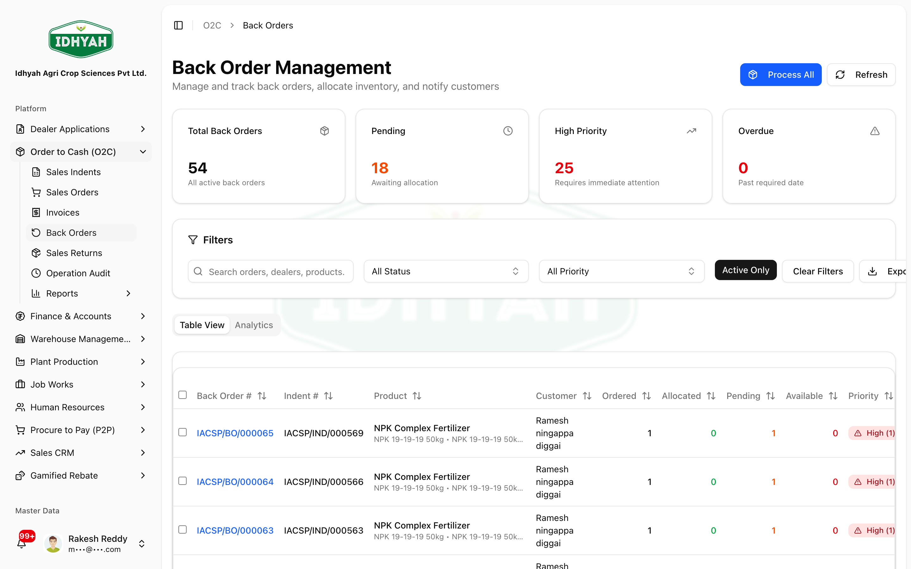
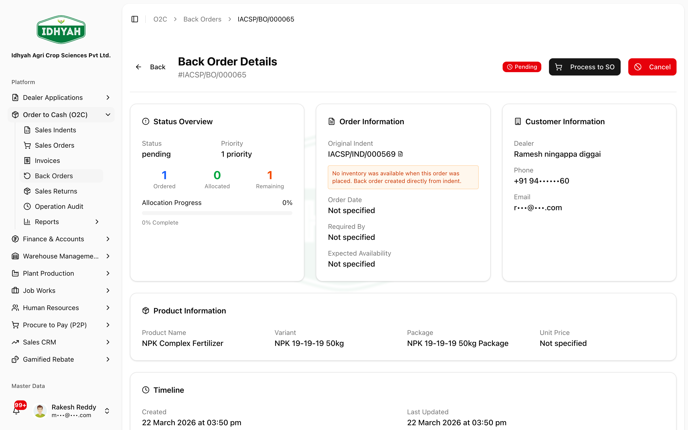

# Back Orders — in detail

> When an approved order can't be fully filled because stock is short, DAEE creates a **Back Order** for
> the shortfall — so the sale isn't lost. Back orders are tracked, prioritised, and **fulfilled
> automatically as stock arrives**.

> **Audience:** Customer + Internal · **Module:** `/o2c/back-orders` · **Status:** 🟢 Authored
> **Verified:** against `web_app/src/app/o2c/back-orders` on 2026-07-02.

For the whole order flow, see the **[Order to Cash guide](./order-to-cash.md)**.

## What this is for
A **Back Order** captures the **unfulfilled quantity** of an order line when there isn't enough stock at
approval/processing time. Instead of blocking the order, DAEE ships what's available and holds the rest
as a back order to fill later.

## When to use it
- An indent is **Approved with Back Orders**, or **Process Workflow** finds short stock → the short lines
  become back orders automatically.
- You want to **see all open demand** waiting on stock, and fulfil it when goods come in.

## Who does this
| Role | What they do |
|---|---|
| **O2C / Sales** | Reviews open back orders, prioritises, notifies dealers |
| **Warehouse / Inventory** | Replenishes stock; fulfilment allocates against back orders |

## The lifecycle
```
Pending  →  (stock arrives → allocate)  →  Fulfilled
        └─ (or Cancelled)
```

## Step-by-step

### 1. Back orders are created for you
When an approved order is short on stock (**Approve with Back Orders** / **Process Workflow**), the
shortfall lines become **Pending** back orders — no manual creation needed.

<!-- capture: { "project": "iacs-md", "route": "/o2c/back-orders" } -->

### 2. Review the queue and prioritise
The **Back Order Management** list is your open-demand queue — cards for **Total / Pending / High
Priority / Overdue**, and a table with **Ordered / Allocated / Pending / Available** per line. Filter by
status, priority, or search by dealer/product.
- **Escalate priority** on urgent lines so they're fulfilled first.
- **Notify customers** about expected fulfilment.
- Open a line to see its **detail** — the source order, dealer, product/variant, and quantities.

<!-- capture: { "project": "iacs-md", "route": "/o2c/back-orders", "action": "open-first-invoice" } -->

### 3. Fulfil as stock arrives
Each back order shows **Ordered / Allocated / Remaining** and an **Allocation Progress**. When stock is
replenished:
- On a back order's detail, click **Process to SO** to convert the fulfillable quantity into a **Sales
  Order**, **or**
- Run **Process All** on the list to process across the whole queue in priority order (respecting
  available stock).

A processed back order flows into the normal **Sales Order → pick → dispatch → invoice** path like any
order line.

> **Caution** Fulfilment consumes real stock in **priority order** — check **Available** vs **Pending**
> before Process All so urgent dealers aren't starved by newer demand.

### 4. Cancel if no longer needed
If the dealer no longer wants the shortfall, **cancel** the back order (single, or **bulk-cancel** several).
Cancelled back orders are closed and drop out of open demand.

## Expected result
- No lost sales on short stock — the fulfillable part ships, the rest is tracked.
- Open back orders give a clear **demand signal** for replenishment.
- Fulfilled back orders continue through picking, invoicing, and collection like any order.

## Common mistakes & warnings
> **Caution** Fulfilment consumes real stock — allocate to back orders in **priority order** so urgent
> dealers aren't starved by newer orders.
- **Treating a back order as a lost sale** — it's live demand; cancel it explicitly if it's truly dead.
- **Manually re-keying short lines** — don't; the shortfall is already a back order, re-keying double-counts.

## Related workflows
[Order to Cash](./order-to-cash.md) · [Sales Returns](./sales-returns.md) · [Managing Inventory](../warehouse-management/inventory.md)

## Support and escalation
Prioritisation / dealer communication → **O2C lead**. Stock replenishment → **Inventory Controller**.
