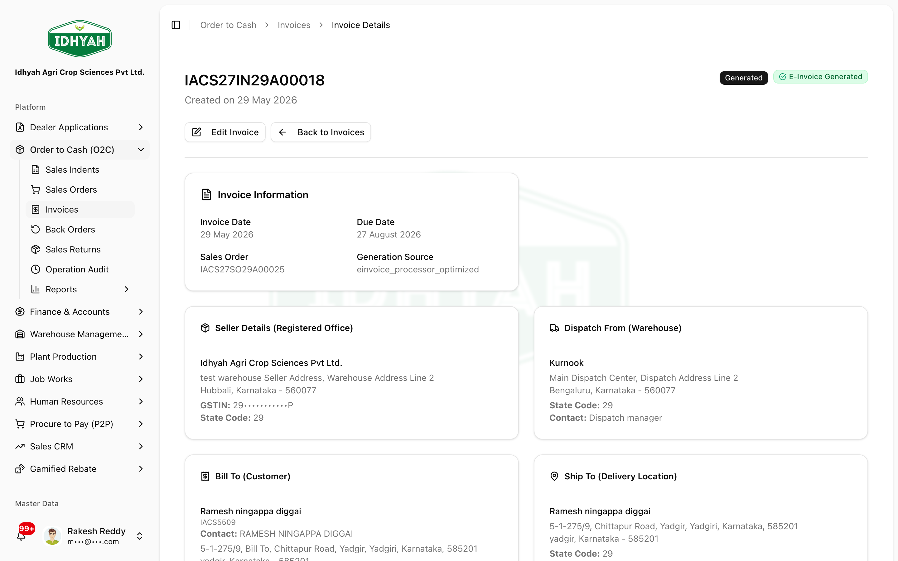
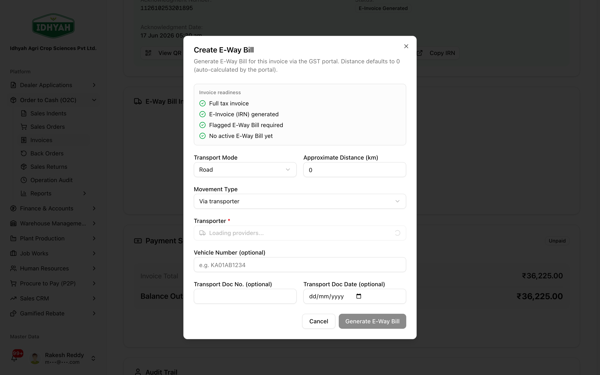

# Invoices & E-Way Bills — in detail

> The **compliance stage**: the **Tax Invoice** with its **E-Invoice (IRN)** and QR, the **E-Way Bill**
> for goods movement (Part-A/B, transporter, cancel), the **invoice PDF**, and invoice **edit / cancel**.

> **Audience:** Customer + Internal · **Module:** `/o2c/invoices` · **Status:** 🟢 Authored
> **Verified:** against `web_app/src/app/o2c/invoices` on 2026-07-03.

Part of **[Order to Cash](./order-to-cash.md)**. Previous → **[Sales Orders](./sales-orders.md)**.
Collection is handled in **[Finance → Receipts, Credits & Discounts](../finance/receipts-credits-discounts.md)**.

## What this is for
The **Invoice** is the statutory Tax Invoice for a sale. From it you generate the **E-Invoice (IRN)** from
the GST portal, the **E-Way Bill** for transport, and the invoice **PDF**; you can also **edit** or
**cancel** the invoice (with a full accounting reversal).

## Pages & buttons
### Invoice detail (`/o2c/invoices/…`)
| Button | What it does |
|---|---|
| **Generate E-Invoice** | Fetches the **IRN** from the GST portal (if not already done on the Sales Order). |
| **Create E-Way Bill** | Opens the E-Way Bill dialog (movement type, transporter/vehicle, distance). |
| **Add / Update Part-B**, **Update Transporter**, **Cancel E-Way Bill**, **Download E-Way Bill PDF** | Manage an existing E-Way Bill. |
| **Generate Invoice PDF** | Download the invoice document. |
| **Record Payment** | Jumps to **Cash Receipts** to collect against this invoice ([Finance](../finance/receipts-credits-discounts.md#cash-receipts-record-and-apply)). |
| **Edit Invoice** / **Cancel Invoice** | Edit details, or cancel with a full accounting reversal. |

## Step-by-step

### 1. The E-Invoice / IRN
**Before:** Sales Order picked · **Result:** invoice **Generated** with an IRN
1. On the **invoice**, the **IRN** appears once the E-Invoice is generated (with its QR code). If it wasn't
   generated from the Sales Order, click **Generate E-Invoice** here.
   
   <!-- capture: { "project": "iacs-md", "route": "/o2c/invoices/62dc71f0-7427-49ac-8f7e-578b219a1c73" } -->

### 2. Create and manage the E-Way Bill
**Before:** IRN generated · **Result:** E-Way Bill issued (Part-A, + Part-B when vehicle known)
1. In the **E-Way Bill Information** section, click **Create E-Way Bill**. Choose the **movement type**
   (*Via transporter* → pick from the master, or *Own vehicle*), set distance/mode, and **Generate**.
   
   <!-- capture: { "project": "iacs-md", "route": "/o2c/invoices/c127052c-67df-4202-87c4-c810d47c3875", "action": "click-create-ewb" } -->
   > **Caution** Generate the **IRN first** — the E-Way Bill needs it. Cancellation honours the GST portal's
   > **24-hour** window.
2. After generation, manage it with **Add/Update Part-B** (vehicle), **Update Transporter**, **Cancel**, or
   **Download E-Way Bill PDF**.
   > **Where E-Way Bills live** They're created and managed here on the **invoice**. The standalone O2C
   > *E-Way Bills* menu now redirects to **[Logistics & Transport](../logistics/README.md)**, where every
   > E-Way Bill and shipment is monitored.

### 3. Invoice PDF, payment, edit / cancel
- **Generate Invoice PDF** to download the document.
- **Record Payment** to collect — this is a **Finance** activity ([Cash Receipts](../finance/receipts-credits-discounts.md#cash-receipts-record-and-apply)).
- **Edit Invoice** / **Cancel Invoice** — cancel performs a **full accounting reversal** (and, within the
  portal window, cancels the IRN/E-Way Bill).

## Common mistakes & warnings
> **Caution** Cancelling an invoice reverses the ledger and (within 24h) the IRN/E-Way Bill — don't cancel
> to "fix" a small edit if the goods have shipped; use a [sales return](./sales-returns.md) or a credit note instead.
- **E-Way Bill before IRN** — blocked; the IRN must exist first.
- **Editing after dispatch** — prefer a credit note / return over cancelling a shipped invoice.

## Related workflows
[Order to Cash](./order-to-cash.md) · [Sales Orders](./sales-orders.md) · [Sales Returns](./sales-returns.md) · [Logistics & Transport](../logistics/README.md) · [Receipts, Credits & Discounts](../finance/receipts-credits-discounts.md)

## Support and escalation
E-Invoice / E-Way Bill portal errors → **Finance / O2C**. Invoice cancel / reversal questions → **Finance**.
