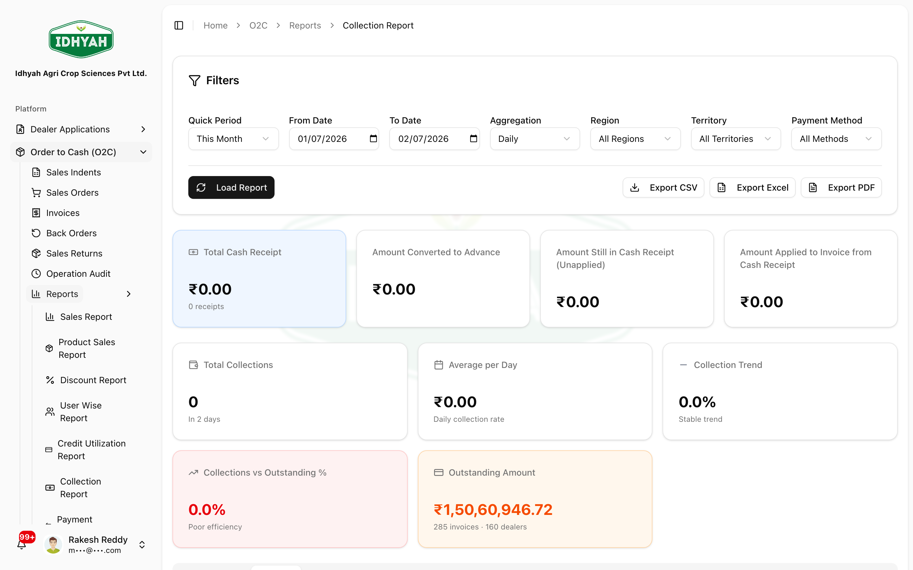
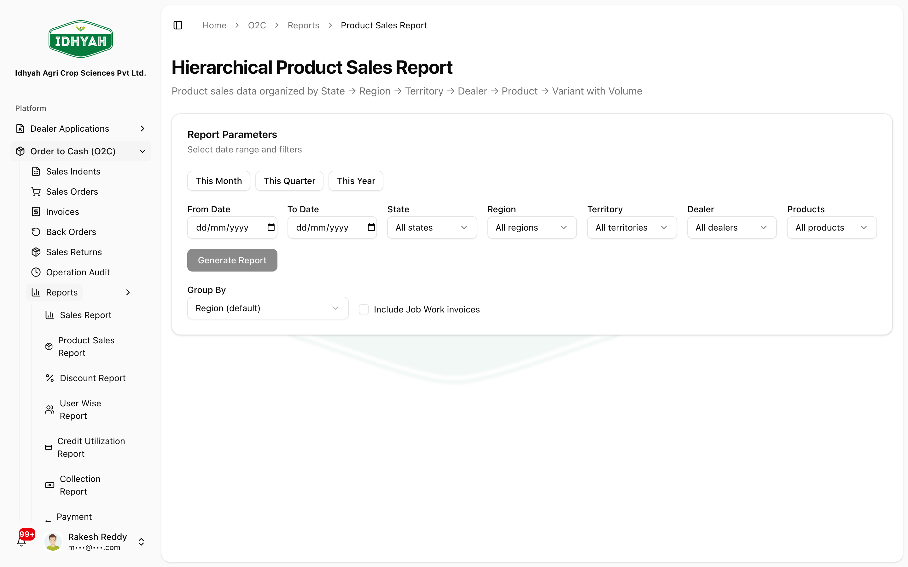

# O2C Reports — Collection & Product Sales

> Understand what you collected, and what you sold, without exporting to spreadsheets first.

> **Audience:** Customer + Internal · **Module:** `/o2c/reports` · **Status:** 🟢 Authored
> **Verified:** against `web_app/src/app/o2c/reports/collection-report` and `web_app/src/app/o2c/reports/hierarchical-product-sales` on 2026-07-02.

## What you can do
- **See who paid and how the money split** — one page shows collections, unapplied receipts, converted-to-advance, and applied-to-invoice amounts across every dealer, region and territory.
- **See where the money is sitting in dealer advances** — per dealer: how much was converted this period, how much has been applied to invoices, and what is still available.
- **See what you sold, at any grain** — group product sales by state, region, territory or dealer with one click. Drill down when you want detail, keep it summarised when you don't.
- **Export the same numbers to Excel** — every on-screen table is available as an XLSX sheet with the same columns and totals.

## Before you begin

### What you need
- Sign in to DAEE with a role that can read O2C reports.
- Cash receipts and invoices exist for the date range you want to look at.
- If you plan to use the region / territory / dealer filters, make sure the relevant master data is set on the dealers.

<!-- INTERNAL:START -->
Frontend permission gate: `sales_reports:read` (through `ProtectedPageWrapper`); the backend server actions
verify `invoices:read`. Tenant + view-scope filters are applied inside every action *before* paging. The
Collection Report + Hierarchical Product Sales queries page through `fetchAllInBatches` with `dedupeKey='id'`
so large tenants (>1,000 receipts) do not silently truncate. (Full permission matrix + data model → O2C
Developer Guide.)
<!-- INTERNAL:END -->

### Roles and what each can do

| Role | Typical use of these reports |
|---|---|
| **Finance** | Reconcile collections against the ledger; check per-dealer advance lifecycle. |
| **Sales Head / Regional Manager** | Compare collections and sales across regions and territories; identify slow-paying dealers. |
| **Territory Manager (TM)** | Drill down to a single dealer or single product variant to review activity. |
| **Admin** | Export XLSX for external analysis, audit, or archival. |

---

## Quickstart: read this month's collections
**You'll:** open the Collection Report, review the summary cards, and check the allocation split · **Time:** ~2 min · **Role:** Finance / Sales Head

1. Go to **O2C → Reports → Collection Report**. The page loads with **This Month** already selected.
   
   <!-- capture: { "project": "iacs-md", "route": "/o2c/reports/collection-report" } -->
2. Look at the **cards at the top of the report** (shown above) — **Total Cash Receipt** and **Total Collections**, alongside the **allocation** split: **Amount Converted to Advance**, **Amount Still in Cash Receipt (Unapplied)**, and **Amount Applied to Invoice**. The allocation cards show what the money became — together they reconcile to the total cash received.
3. Change the **Quick Period** or set custom **From / To** dates and click **Load Report** to re-run.
   > **Tip** Region and Territory filters cascade — pick a region first, and the territory dropdown narrows to that region.

**Next steps:** [Read the By Dealer / Region / Territory tabs](#how-to-read-by-dealer-by-region-and-by-territory) · [Read the Dealer Advance Status tab](#how-to-read-the-dealer-advance-status-tab) · [Export to Excel](#how-to-export-a-report-to-excel).

---

## Pages & tabs

### Collection Report (`/o2c/reports/collection-report`)

| Tab | What it shows |
|---|---|
| **Summary** | Cards for Total Collections, Total Amount, per-day average, and the allocation split (unapplied · converted to advance · applied to invoices). |
| **By Receipt** | One row per cash receipt in the window, with allocation columns and dealer geography. Newest first. Export XLSX for the full list if >500 rows. |
| **Dealer Advance Status** | One row per dealer with receipts in the window, focused on the *advance lifecycle*: converted this period, applied to invoice from advance this period, and the live available balance. |
| **By Period** | Collections aggregated daily / weekly / monthly for the window. |
| **By Dealer** | One row per dealer, with all four allocation columns and the % of total. |
| **By Region** | One row per region, allocation split, and % of total. |
| **By Territory** | One row per territory with its parent region, allocation split, and % of total. |
| **Aging** | Outstanding invoices bucketed by days overdue. |
| **Efficiency** | Collection efficiency (collected ÷ due) and status band. |
| **Comparison** | This period vs previous period for total collected, count, and average. |

### Hierarchical Product Sales (`/o2c/reports/hierarchical-product-sales`)

The **Group By** dropdown controls the depth of the on-screen tree AND the Excel Sales Summary sheet:

| Group By | You'll see |
|---|---|
| **State** | State rows only. Expanding a state shows a hint that deeper hierarchy is hidden. |
| **Region** | State → Region rows. |
| **Territory** | State → Region → Territory rows. |
| **Dealer** | Full drill: State → Region → Territory → Dealer → Product → Variant. |

The Excel export always contains detail sheets (Product / Variant Detail) regardless of Group By — Group By only shapes the Summary sheet and the on-screen tree.

---

## Step-by-step

### How to read By Dealer, By Region and By Territory
**Before:** report generated for a period · **Result:** you know how each dealer's / region's / territory's money split

Each of these three tabs shares the same four allocation columns:

| Column | What it means |
|---|---|
| **Total Cash Receipt** | Sum of receipt amounts in the period. |
| **Unapplied** | Amount received but not yet allocated to invoices or advance. |
| **Converted to Advance** | Amount that became a dealer advance in the period. |
| **Applied to Invoices** | Amount directly applied to invoices in the period. |

- The three allocation columns always add up to **Total Cash Receipt** (within one paisa, to allow rounding).
- The sum across all rows in a tab equals the report-level summary allocation (also within one paisa).
- The **% of Total** column on By Region and By Territory is share of total collections.

> **Tip** If you set the **Territory** filter at the top of the page, all three tabs (By Dealer / By Region / By Territory) narrow to that territory's data.

### How to read the Dealer Advance Status tab
**Before:** report generated for a period · **Result:** you know each dealer's advance lifecycle

The Dealer Advance Status tab focuses on the **advance** side, not the receipt side. Three amount columns:

| Column | Scope | What it means |
|---|---|---|
| **Converted to Advance** | Period-scoped | Money that became a dealer advance during the filtered period. |
| **Applied to Invoice** | Period-scoped | Advance amount consumed against invoices during the filtered period. |
| **Available Advance Balance** | **Point-in-time (live)** | The dealer's current consumable advance balance at the moment the report ran. |

> **Note** The first two columns depend on the date window; **Available Advance Balance** does not — it is the live balance right now, regardless of the report period. The tab subtitle repeats this.

> **Caution** If a dealer had no receipts in the window, they will not appear on this tab — even if they hold an active advance. Use the **Finance → Dealer Advances** screen to see all active advances.

### How to choose a Group By on Hierarchical Product Sales
**Before:** report generated · **Result:** the tree matches the grain you want

1. On the top filter card, pick a value in the **Group By** dropdown.
   
   <!-- capture: { "project": "iacs-md", "route": "/o2c/reports/hierarchical-product-sales" } -->
2. The tree redraws. If you pick anything other than **Dealer**, expanding a row shows a small italic hint — for example, *"Grouped by State — deeper hierarchy hidden. Change Group By to drill in."*
3. Change Group By at any time. The tree resets to the correct depth cap on the next render.

> **Tip** Use **State** or **Region** for a board-review summary. Use **Dealer** when you want to see which variant a specific dealer bought.

### How to export a report to Excel
**Before:** report generated · **Result:** an `.xlsx` file with every tab as a sheet, plus totals

1. Click **Export Excel** in the top-right toolbar (the **Export CSV / Excel / PDF** buttons are shown in the report screenshot at the top of this page).
2. The workbook contains one sheet per on-screen tab, plus a **Summary** sheet at the front. Column headers match the on-screen labels.
3. Number columns are formatted as currency. Totals rows appear at the bottom of each sheet where relevant.

> **Tip** Filter the report first (region / territory / dealer / payment method), then export — the workbook always reflects the current filters.

### How to filter down to one region, one territory or one dealer
**Before:** report generated · **Result:** every tab (and the export) narrows to that scope

1. On the filter card, pick a **Region**. The **Territory** dropdown narrows to territories in that region.
2. Optionally pick a **Territory**. Optionally pick a **Payment method**.
3. Click **Load Report**. Every tab and card re-computes.

> **Note** All three geo filters cascade downwards — Region → Territory → Dealer — but you can leave any of them at **All**.

---

## Common use cases

- **Month-end collection review.** Finance opens Collection Report → Summary + Allocation → drills into By Region for outliers → exports XLSX for the ledger reconciliation pack.
- **Weekly sales scorecard.** Sales Head opens Hierarchical Product Sales with **Group By = Region** for the current week → expands the top region to see territories → exports XLSX for the leadership deck.
- **Chase a slow-paying dealer.** Territory Manager opens Collection Report → **By Dealer** → sorts on Total Cash Receipt → notices a large **Unapplied** number for one dealer → coordinates with Finance to apply or refund.
- **Reconcile one dealer's advance.** Finance opens Collection Report → **Dealer Advance Status** for the month → cross-checks the three columns against the dealer's advance ledger in Finance.
- **Board-pack export.** Admin opens both reports at **State** grain, exports XLSX, and pastes the Summary sheets into the board deck.

---

## Reference

### Collection Report fields
- **Total Collections** — number of cash receipts in the window.
- **Total Amount** — sum of receipt amounts.
- **Unapplied** — sum of `amount_unapplied` on receipts.
- **Converted to Advance** — sum of `amount_converted_to_advance` on receipts.
- **Applied to Invoices** — sum of `amount_applied` on receipts.
- **Available Advance Balance (DAS tab)** — live sum of dealer advance balances on advances that are still available or partially used.

### Hierarchical Product Sales fields
- **Group By** — state / region / territory / dealer. Controls tree depth and Sales Summary sheet columns.
- **Filters** — State (GSTIN), Region, Territory, Dealer, Product.
- **Sales Category** column (Excel detail sheets) — the current active category assignment for the product at the report `to_date`; blank when no assignment exists.

<!-- INTERNAL:START -->
- **Tables read:** `cash_receipt_headers`, `cash_receipt_applications`, `dealer_advances`, `invoices`,
  `invoice_items`, `master_dealers` (+ `master_regions`, `master_territories`), `sales_category_assignments`,
  `sales_categories`, `sales_return_orders`, `sales_return_items`.
- **Server actions:** `getCollectionReport`, `exportCollectionReportXLSX`, `getHierarchicalProductSalesReport`.
- **Helper:** `fetchAllInBatches` with `dedupeKey='id'` for the three Collection Report parallel fetches and
  the two sales-category lookups.
- **GL effects:** none — these are read-only reports.
- **1000-row cap:** guarded via `fetchAllInBatches` on every list/count/sum/export query.
<!-- INTERNAL:END -->

### Statuses shown

| Report | Where | Values |
|---|---|---|
| Collection Report → Aging | Bucket column | Current · 0-30 · 31-60 · 61-90 · 90+ |
| Collection Report → Efficiency | Status band | Excellent · Good · Fair · Poor |
| Collection Report → Dealer Advance Status | Underlying advance status | `available`, `partially_used`, `fully_used` (only these contribute to the tab) |

---

## Common mistakes

- **Confusing "Available Advance Balance" with a period total.** It is *not* period-scoped — it is the live balance regardless of the date window. If you need the period-scoped consumption, look at **Applied to Invoice** on the same row.
- **Missing a dealer on the Dealer Advance Status tab.** A dealer with an active advance but no receipts in the window is not shown. To see all advances, use **Finance → Dealer Advances**.
- **Reading a stale on-screen tree after changing Group By.** The tree resets on the next render — if you expanded rows before switching Group By, collapse and re-expand to see the new grain.
- **Assuming the Excel export ignores filters.** It doesn't — always set the filters you want *before* clicking Export XLSX.
- **Treating "% of Total" as a per-region share of dealer count.** It is a share of total collection **amount**, not of dealers.

---

## Troubleshooting

| Message | Cause | Fix |
|---|---|---|
| "No collections found for this period" | The date window has zero receipts, or the region/territory filter excluded them all | Broaden the date window; clear filters. |
| "No dealers with receipts in the selected period." (Dealer Advance Status) | Same — the tab is period-scoped to receipts | Broaden the date window; check Finance → Dealer Advances for advance activity. |
| Sales Category column blank on Hierarchical Product Sales export | No active `sales_category_assignments` row for the product at the report `to_date` | Assign a category via **Sales CRM → Sales Categories** and re-run. There is no fallback to the legacy product category. |
| Numbers on the Excel Summary sheet do not match the on-screen Summary card exactly | Rounding: sums are rounded per row and again in the totals row | Any difference is within ±₹0.01. If larger, capture a screenshot and escalate to Support. |
| Export XLSX button spins forever | The result set is very large (nearing the 100,000-row export ceiling) | Narrow the date window or filter by region / territory / dealer. |

---

## Support and escalation

- **Numbers do not tie back to the ledger** — export the Collection Report XLSX for the same period; share the **Summary** + **By Receipt** sheets with your Finance lead. If the ledger side is off, that is a Finance-side reconciliation, not a report defect.
- **A dealer appears on By Dealer but not on Dealer Advance Status** — expected if the dealer has zero converted-to-advance in the window. Confirm from By Receipt: search the dealer, look at the *Converted to Advance* column.
- **Group By dropdown does not change the on-screen tree** — refresh the page and re-generate. If it still misbehaves, note the exact Group By value and date window and escalate to Support.
- **Excel export missing a sheet** — a sheet is only added when there is data for it. Confirm the on-screen tab is also empty. If it isn't, capture a screenshot and escalate.

---

## Related workflows

- [Cash Receipts — record and apply](../finance/receipts-credits-discounts.md#cash-receipts-record-and-apply) — where the money that shows up in the Collection Report is recorded.
- [Dealer Advances](../finance/receipts-credits-discounts.md) — the source-of-truth screens for the balances shown on the Dealer Advance Status tab.
- [Sales Categories](../sales-crm/README.md) — where the *Sales Category* column on Hierarchical Product Sales export is assigned.
- [Order to Cash overview](./order-to-cash.md) — the full O2C workflow these reports draw from.

## Next steps & related
[Finance → Financial Reports](../finance/financial-reports.md) · [Sales CRM → Sales Categories](../sales-crm/README.md) · [Order to Cash](./order-to-cash.md)
