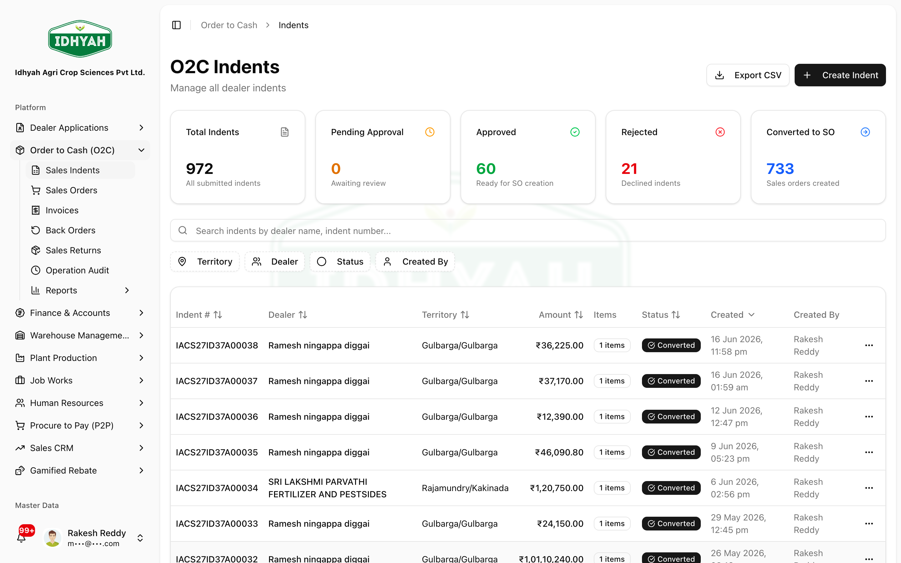
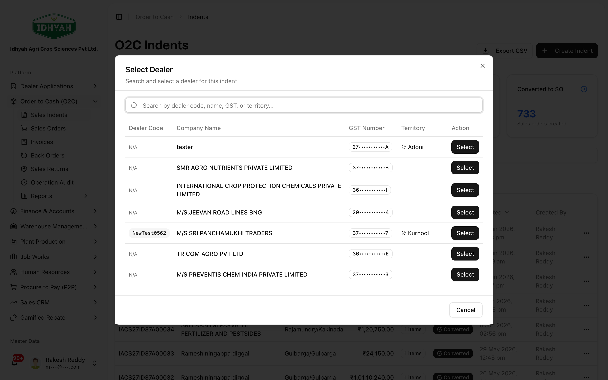
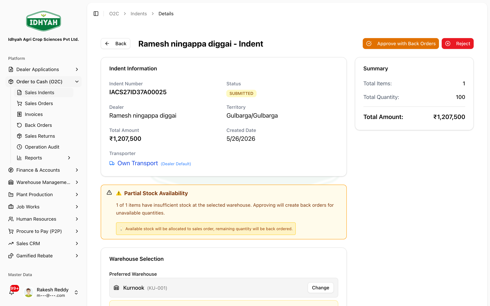
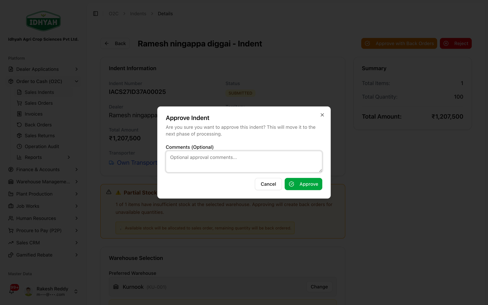
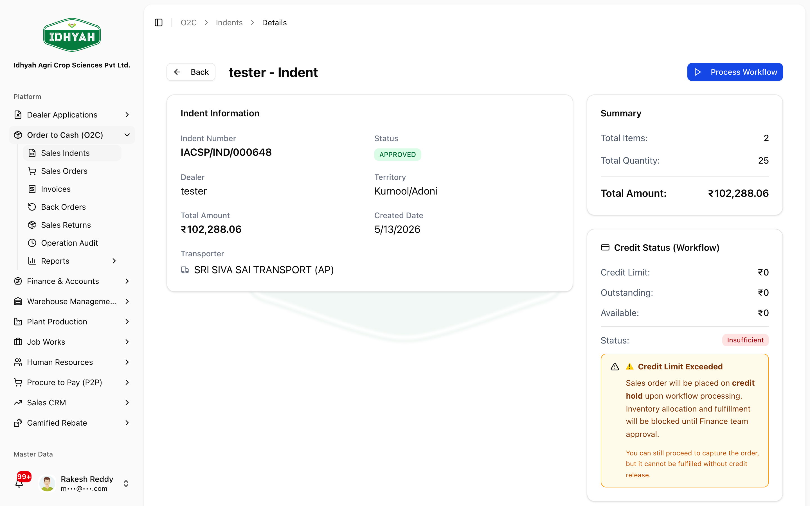
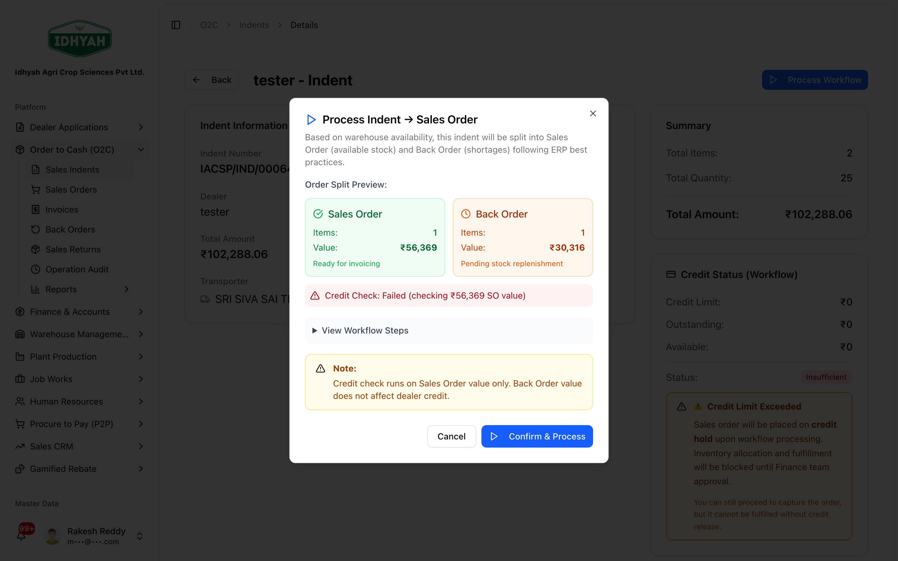

# Sales Indents — in detail

> The **start of O2C**: raise a dealer's demand as an **Indent**, route it for **approval** (with the
> dealer overdue/credit check), then **Process Workflow** to turn it into a **Sales Order**.

> **Audience:** Customer + Internal · **Module:** `/o2c/indents` · **Status:** 🟢 Authored
> **Verified:** against `web_app/src/app/o2c/indents` on 2026-07-03.

Part of **[Order to Cash](./order-to-cash.md)**. Next stage → **[Sales Orders](./sales-orders.md)**.

## What this is for
An **Indent** captures what a dealer wants to buy. It's reviewed and **approved** (running a credit /
overdue check), then converted into a **Sales Order** that the warehouse fulfils.

## Pages & buttons
### Sales Indents list (`/o2c/indents`)
| Button | What it does |
|---|---|
| **Create Indent** | Opens the new-indent form (dealer + product lines). |
| **Search / filters** | Narrow the list by dealer, status, or date. |
| **(row)** | Opens that indent's detail page. |

### Indent detail (`/o2c/indents/…`)
| Button | When it shows | What it does |
|---|---|---|
| **Warehouse selector** | Indent **Submitted** | Choose the fulfilling warehouse — required before you can Approve. |
| **Approve** / **Approve with Back Orders** | Indent **Submitted** | Confirmation dialog; approves and runs the dealer **overdue/credit check**. "with Back Orders" appears when lines are short on stock. |
| **Reject** | Indent **Submitted** | Reject with a reason. |
| **Process Workflow** | Indent **Approved** | Creates the **Sales Order**; out-of-stock lines become **Back Orders**. |
| **Approve Anyway** | Stock-warning dialog | Proceed despite shortfalls (creates back orders for the short lines). |

## Step-by-step

### 1. Raise an indent
**Before:** active dealer + products on a price list · **Result:** indent **Submitted**
1. **O2C → Sales Indents** shows all indents. Click **Create Indent**.
   
   <!-- capture: { "project": "iacs-md", "route": "/o2c/indents" } -->
2. Pick the **dealer**, add **product lines** (quantity), review totals, and **Submit**. Price, discount
   and tax default from the dealer's price list — DAEE picks the most specific in-effect list for that
   dealer (see [how the selling price is chosen](../price-lists/README.md#how-the-selling-price-is-chosen-on-an-order)).
   If no list applies, the line falls back to the product's cost price and is flagged, so check pricing
   before submitting.
   
   <!-- capture: { "project": "iacs-md", "route": "/o2c/indents", "action": "open-create-dialog" } -->

### 2. Approve an indent (incl. the overdue block)
**Before:** indent **Submitted** · **Result:** **Approved**
1. Open the indent. Confirm the **warehouse**, review the lines, then click **Approve** (or **Approve with
   Back Orders** if some lines are short on stock).
   
   <!-- capture: { "project": "iacs-md", "route": "/o2c/indents/4c5b0044-2c00-4762-a366-dddedf57b0eb" } -->
2. Confirm in the dialog. The system runs a **dealer overdue check** before approving.
   
   <!-- capture: { "project": "iacs-md", "route": "/o2c/indents/4c5b0044-2c00-4762-a366-dddedf57b0eb", "action": "click-approve" } -->
   > **Caution** If the dealer has any **invoice unpaid for 90+ days** (from the invoice date), approval is
   > **blocked** — you must **collect the overdue amount** first. The block clears automatically once no
   > invoice is 90+ days unpaid. A stock shortfall can still be passed with **Approve Anyway** (creates back
   > orders) — that does *not* bypass the overdue block.
   > **Note** Multi-level approval chains are supported — each configured level approves in turn.
<!-- INTERNAL:START -->
**Current behaviour (verified on `pavan/DAEE-629`):** the 90-day overdue rule in `processApproval.ts` is a
**hard block** with no Sales-Head override — the action returns an error and stops. The only override in the
live path is `skipStockCheck` (the stock warning → "Approve Anyway"). A **tenant-configurable window +
Sales-Head override with a mandatory, audited reason is implemented under DAEE-769 but is NOT merged**
(branch `pavan/DAEE-769`: `lib/o2c/indent-overdue-policy.ts`, `evaluate-dealer-overdue.ts`,
`getDealerOverdueForIndent.ts`). Do not present the override as live until DAEE-769 ships. (O2C Developer
Guide §12.)
<!-- INTERNAL:END -->

### 3. Process the workflow (create the Sales Order)
**Before:** indent **Approved** · **Result:** a **Sales Order** (short lines → Back Orders)
1. On the approved indent, review the **inventory status**, then click **Process Workflow**.
   
   <!-- capture: { "project": "iacs-md", "route": "/o2c/indents/17e43d65-5d4d-4f3d-80fe-e14c1f21eee3" } -->
2. Confirm in the dialog — the **Sales Order** is created. Any out-of-stock lines become **Back Orders** to
   fulfil when stock arrives (see [Back Orders](./back-orders.md)).
   
   <!-- capture: { "project": "iacs-md", "route": "/o2c/indents/17e43d65-5d4d-4f3d-80fe-e14c1f21eee3", "action": "click-process-workflow" } -->

## Common mistakes & warnings
- **Approving before choosing the warehouse** — the warehouse is required first.
- **Trying to push past the overdue block** — it's a hard block; collect the 90+ day dues first.
- **Re-keying short lines** — short lines are already **Back Orders**; don't duplicate them.

## Related workflows
[Order to Cash](./order-to-cash.md) · [Sales Orders](./sales-orders.md) · [Back Orders](./back-orders.md) · [Price Lists](../price-lists/README.md)

## Support and escalation
Approvals / overdue exceptions → **Sales Head**. Pricing on lines → **Pricing Manager**.
