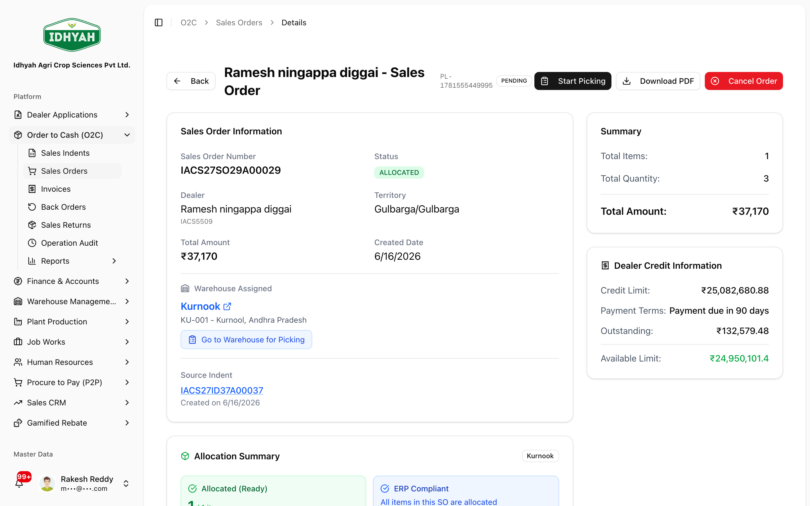
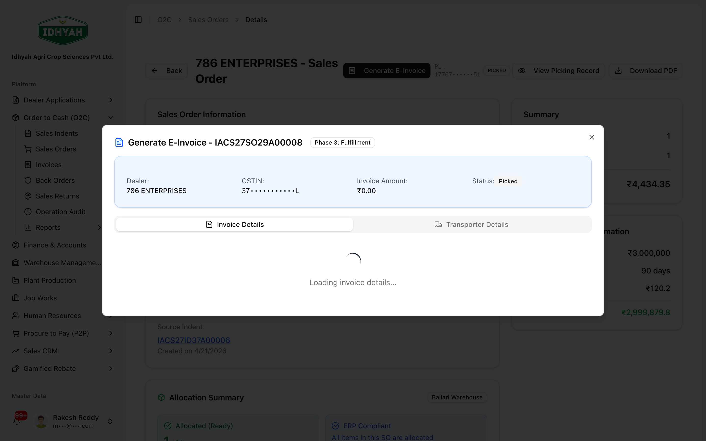

# Sales Orders — in detail

> The **fulfilment stage**: an approved indent becomes a **Sales Order**, stock is **allocated**, a
> **picklist** is generated and picked (scan-first), and the order is invoiced with an **E-Invoice (IRN)**.

> **Audience:** Customer + Internal · **Module:** `/o2c/sales-orders` · **Status:** 🟢 Authored
> **Verified:** against `web_app/src/app/o2c/sales-orders` on 2026-07-03.

Part of **[Order to Cash](./order-to-cash.md)**. Previous → **[Sales Indents](./sales-indents.md)** · Next → **[Invoices](./invoices.md)**.

## What this is for
A **Sales Order (SO)** is created from an approved indent (via **Process Workflow**). It drives
**allocation**, **picking**, and **invoicing**. Short-stock lines are tracked as [Back Orders](./back-orders.md).

## Pages & buttons
### Sales Order detail (`/o2c/sales-orders/…`)
| Button | When it shows | What it does |
|---|---|---|
| **Confirm Inventory Allocation** | Stock available | Allocates stock to the order. |
| **Generate Picklist** | Order **Allocated**, no picklist | Creates the picklist and opens the scan-first picking console. |
| **View Picklist** / **Download PDF** | A picklist exists | Open or print the picklist. |
| **Generate E-Invoice** | Order **Picked / Packed / Ready to ship** | Opens the **E-Invoice** modal to create the Tax Invoice + **IRN** (and, optionally, the E-Way Bill). |
| **Retry E-Invoice** | A previous attempt failed | Re-attempts E-Invoice generation. |
| **View E-Invoice** | Invoice already generated | Jumps to the [invoice](./invoices.md). |

## Step-by-step

### 1. Allocate and generate the picklist
**Before:** Sales Order created · **Result:** a picklist ready to pick
1. Open the **Sales Order**. When stock is available it shows **Allocated** — click **Generate Picklist** to
   create the picklist and open the **picking console** (or **View Picklist** if one exists).
   
   <!-- capture: { "project": "iacs-md", "route": "/o2c/sales-orders/7197803c-a3b5-4004-a05f-19aae1b9b6d7" } -->

### 2. Pick by scanning
Picking is **scan-first** — the picker scans each item's **batch QR** to confirm the correct batch/variant.
Full detail: **[Warehouse → Pick an order by scanning](../warehouse-management/README.md#quickstart-pick-an-order-by-scanning)**.

### 3. Generate the E-Invoice
**Before:** order **Picked / Ready to ship** · **Result:** Tax Invoice + **IRN** (and optional E-Way Bill)
1. Click **Generate E-Invoice** to open the invoicing modal — it creates the **Tax Invoice + IRN** and can
   generate the **E-Way Bill** in the same step.
   
   <!-- capture: { "project": "iacs-md", "route": "/o2c/sales-orders/4ef4d411-44c9-4ecf-abb8-b0eb771622e7", "action": "click-generate-einvoice" } -->
2. Continue on the **[Invoice](./invoices.md)** to manage the IRN, E-Way Bill, and PDF.

## Common mistakes & warnings
> **Caution** Don't invoice before the order is **Picked** — the E-Invoice reflects what was actually picked.
- **No stock to allocate** — the shortfall is a [Back Order](./back-orders.md); fulfil it when stock arrives.
- **Skipping the scan** — picking is scan-verified for a reason; use the Manual fallback only when a label truly won't scan.

## Related workflows
[Order to Cash](./order-to-cash.md) · [Sales Indents](./sales-indents.md) · [Invoices](./invoices.md) · [Warehouse Management](../warehouse-management/README.md) · [Back Orders](./back-orders.md)

## Support and escalation
Allocation / picking → **Warehouse Ops**. E-Invoice failures → **Finance / O2C** (retry on the order).
