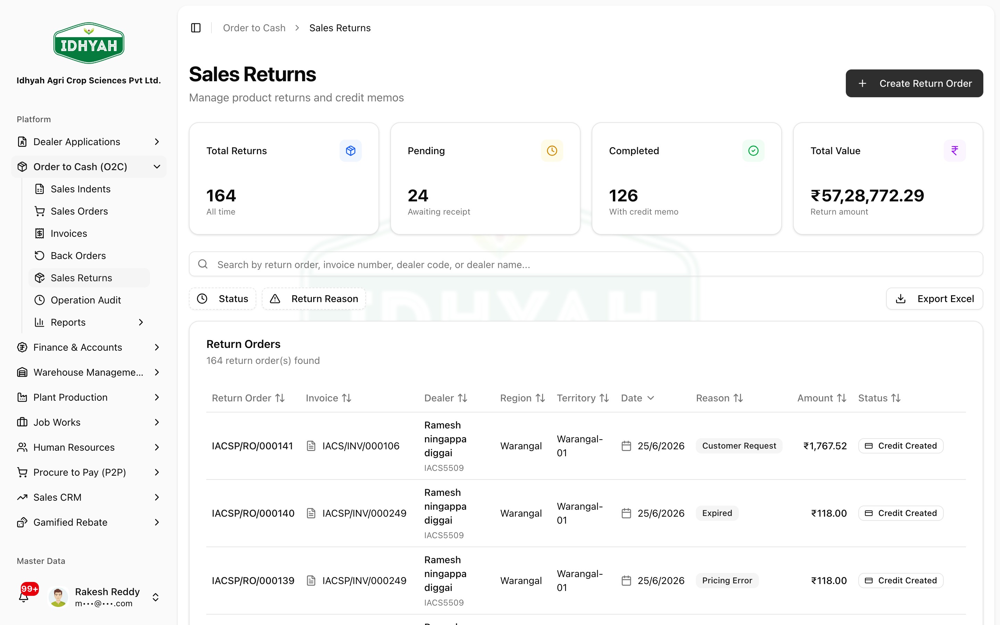
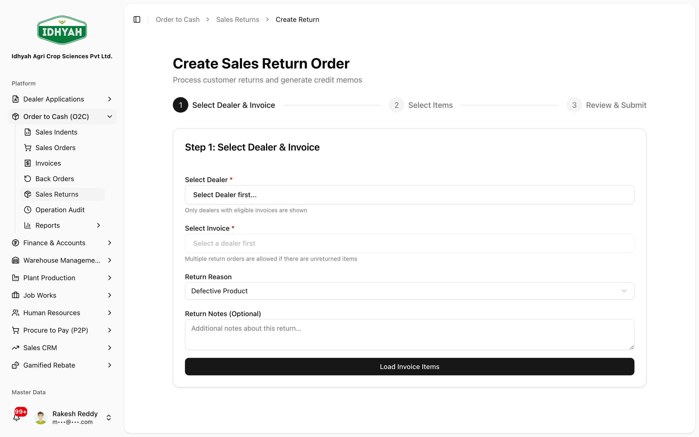
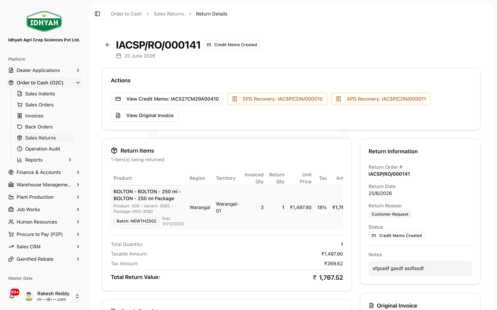

# Sales Returns — in detail

> When a dealer sends goods back, raise a **Return Order** against the original invoice — DAEE receives
> the stock, issues a **Credit Note** (with an e-credit-note for GST), and reverses the ledger, so
> inventory, the dealer balance, and GSTR-1 all stay correct.

> **Audience:** Customer + Internal · **Module:** `/o2c/sales-returns` · **Status:** 🟢 Authored
> **Verified:** against `web_app/src/app/o2c/sales-returns` on 2026-07-02.

For the whole order flow, see the **[Order to Cash guide](./order-to-cash.md)**. The financial document
this produces (the credit note) is covered in
**[Receipts, Credits & Discounts](../finance/receipts-credits-discounts.md#credit-memos-debit-notes)**.

## What this is for
A **Sales Return** reverses part or all of a delivered/invoiced sale — for damaged goods, wrong items,
or dealer returns. It is always raised **against a specific invoice** so the credit, tax, and stock
reversal match what was actually sold.

## When to use it
- A dealer returns goods after delivery/invoicing.
- You need to issue a **credit note** that flows to GST (CDNR in GSTR-1).
- You need the returned stock **back into inventory**.

## Prerequisites
- An **invoice** exists for the goods being returned (only invoiced lines are returnable).
- The invoice doesn't already have an **active return** in progress (one open return per invoice).
- A warehouse to **receive** the returned stock.

## Who does this
| Role | What they do |
|---|---|
| **O2C / Sales** | Raises the Return Order against the invoice |
| **Warehouse / Stores** | Receives and inspects the returned goods |
| **Finance** | Confirms the Credit Note / e-credit-note and the GL reversal |

## The lifecycle
```
Pending  →  Approved  →  Received (goods back in)  →  Pending credit  →  Credit Note issued
                                                   └─ (or Rejected / Cancelled)
```

## Step-by-step

### 1. Create the Return Order (3-step wizard)
**O2C → Sales Returns → Create Return Order.** Creation is a guided **3-step wizard**.

<!-- capture: { "project": "iacs-md", "route": "/o2c/sales-returns" } -->

**Step 1 — Select Dealer & Invoice.** Pick the **dealer** (only dealers with **eligible invoices** are
shown), then the **invoice**. Choose a **Return Reason** (e.g. *Defective Product*), add optional notes,
and click **Load Invoice Items**.

<!-- capture: { "project": "iacs-md", "route": "/o2c/sales-returns/new" } -->

**Step 2 — Select Items.** Tick the lines being returned and set the **return quantity per line** — you
**can't exceed** the invoiced quantity (or what's already returned on prior returns for that invoice).

**Step 3 — Review & Submit.** Confirm the lines, quantities, and tax, then **Submit**. The return is
created in **Pending**.

> **Note** Only **invoiced** lines are returnable, and an invoice with an **active** return in progress is
> blocked from a second one — finish or cancel the first.

### 2. Approve the return
Open the return to review the **items, quantities, tax, and reason**, then **Approve** (or **Reject** with
a reason). Approval authorises receiving the goods. The detail page is also where, once processed, you
reach the **Credit Memo**, the **original invoice**, and any **EPD / APD recovery** raised on the return.

<!-- capture: { "project": "iacs-md", "route": "/o2c/sales-returns", "action": "open-first-invoice" } -->

### 3. Receive the goods back
When the stock physically arrives, **record the goods receipt** on the return. Received quantities are
checked against the approved return; any **shortfall is flagged as a discrepancy** for review. Received
stock is **added back to inventory** at the receiving warehouse.

### 4. Credit Note is issued
Once received, DAEE issues a **Credit Note (CCN)** against the original invoice and, for tax-bearing
returns, an **e-credit-note** that flows to **GSTR-1 (CDNR)**. The dealer's balance is reduced and the GL
is reversed **per line** (output tax, revenue, COGS/stock).
> **Tip** If the e-credit-note fails at the portal, use **Retry** on the return — don't raise a second return.

## Expected result
- Returned stock **back in inventory**; dealer balance **reduced** by the credit note.
- A **Credit Note + e-credit-note** matching the returned lines and their tax.
- GL reversed line-by-line so AR, stock, and GST returns reconcile.

## Common mistakes & warnings
> **Caution** The credit note tax must mirror the **original invoice line** (CGST/SGST vs IGST, rate,
> HSN). DAEE derives this from the invoice — don't override rates manually, or GSTR-1 CDNR will mismatch.
- **Returning more than invoiced** — blocked; you can only return what was sold on that invoice.
- **Two returns on one invoice** — a second return is blocked while one is active; finish or cancel the first.
- **Issuing credit before receiving** — the credit note follows the **goods receipt**; receive first.
- **e-credit-note failed at the portal** — use **retry**; don't create a second return.

## Related workflows
[Order to Cash](./order-to-cash.md) · [Back Orders](./back-orders.md) · [Receipts, Credits & Discounts](../finance/receipts-credits-discounts.md) · [GST Compliance](../finance/gst-compliance.md)

## Support and escalation
Return approvals → **O2C lead**. Goods-receipt discrepancies → **Inventory Controller**. Credit-note /
e-credit-note / GL questions → **Finance**.
