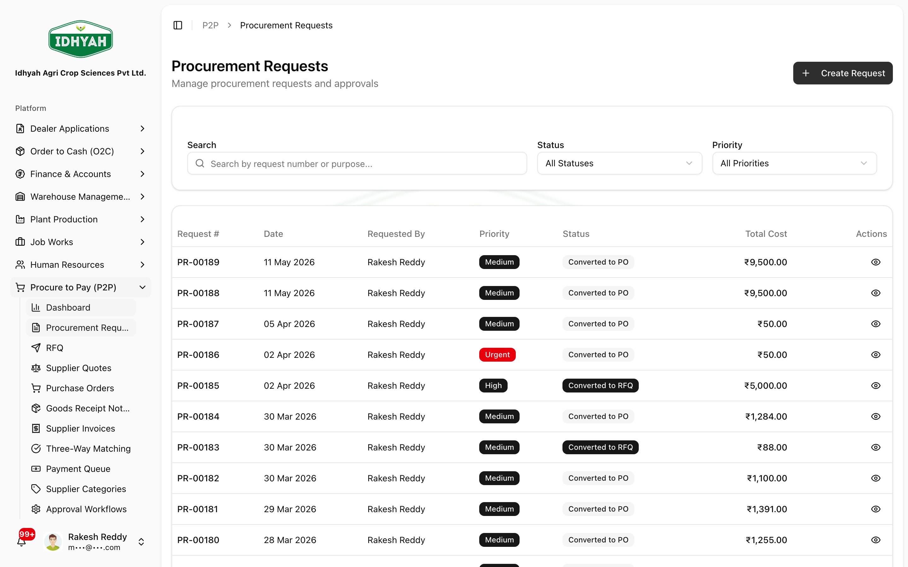
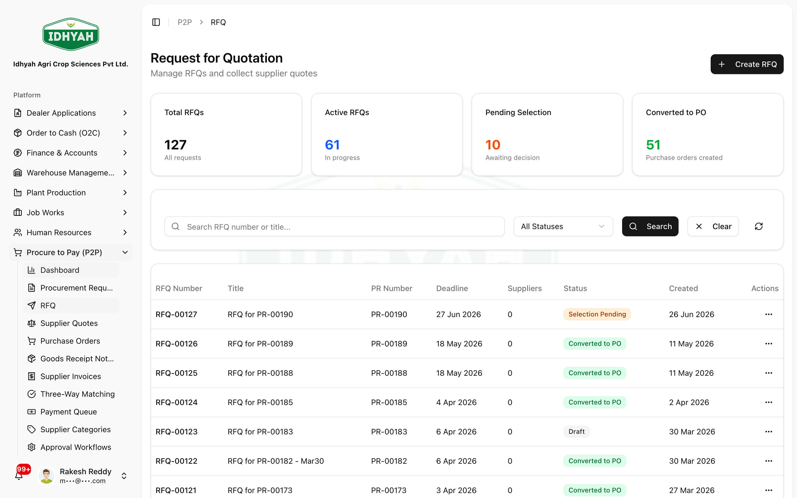
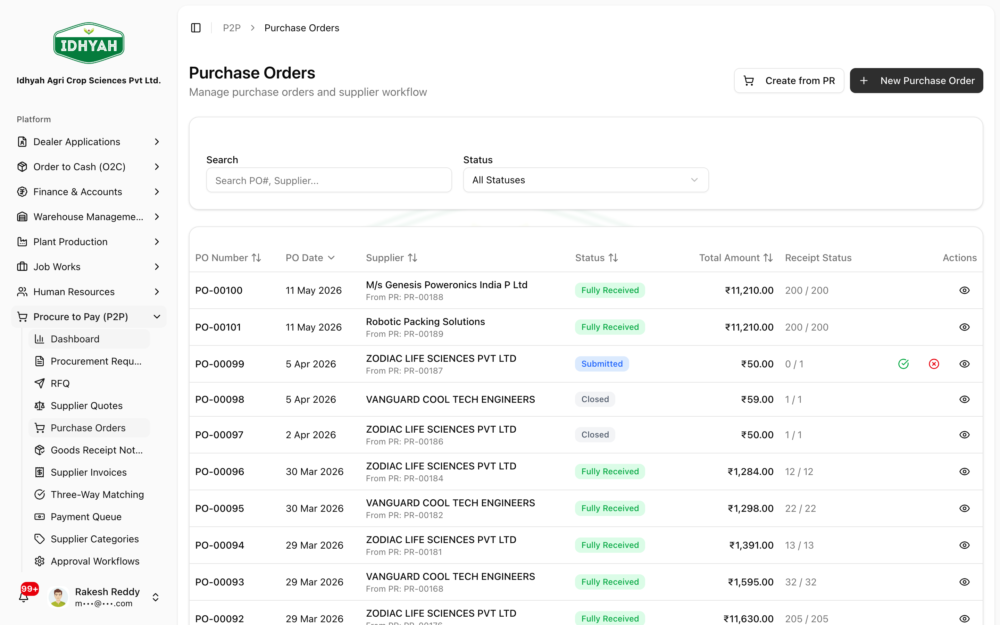
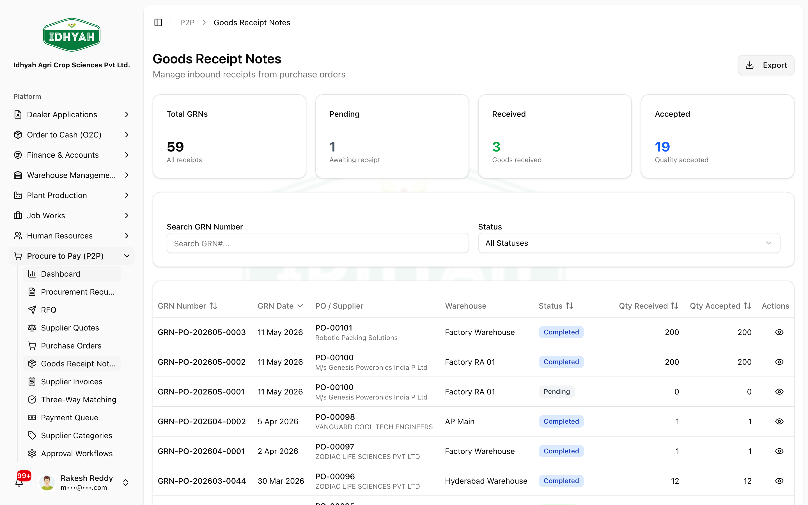
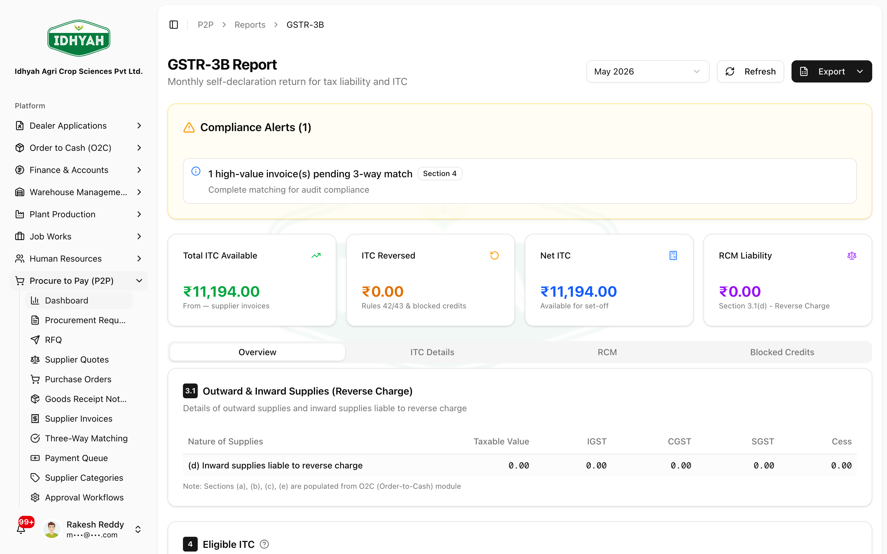

# Procure to Pay (P2P)

> Buy what the business needs — from request to supplier payment — with approvals, three-way
> matching, and GST input-tax-credit built in.

> **Audience:** Customer + Internal · **Module:** `/p2p` · **Status:** 🟢 Authored
> **Verified:** against `web_app/src/app/p2p` + staging DB on 2026-06-17.

## What you can do
- **Request** — raise and approve a **Procurement Request (PR)** for materials or services.
- **Source competitively** — issue an **RFQ** to suppliers, collect and **compare quotes**, and award.
- **Purchase** — create and approve a **Purchase Order (PO)** and send it to the supplier.
- **Receive** — record a **Goods Receipt Note (GRN)** with a quality check.
- **Bill** — capture the **Supplier Invoice**.
- **Control spend** — run **Three-Way Matching** (PO ↔ GRN ↔ Invoice) and clear variances.
- **Pay** — queue approved invoices in the **Payment Queue**.
- **Stay compliant** — supplier **GST verification**, **input tax credit (ITC)** + **GSTR-2B** reconciliation, **TDS**, **MSME**, and **reverse charge (RCM)**.

## Before you begin

### What you need
- Active, **GST-verified [suppliers](../suppliers/suppliers.md)**.
- The **raw materials / products** you intend to procure.
- A **warehouse** to receive goods into.
- Your company **GSTIN** and accounting rules configured (for GL posting and input-tax-credit).
- *(Optional)* an **approval workflow** configured for multi-level PR/PO approvals.

### Roles and what each can do

| Role | Typical responsibilities in P2P |
|---|---|
| **Procurement / Purchaser** | Raise PRs and RFQs, capture supplier quotes, create POs |
| **Approver** | Approve PRs, quote selection, POs, and matching variances |
| **Stores / Warehouse** | Record GRNs and the goods-quality check |
| **Accounts Payable (Finance)** | Capture supplier invoices, run three-way matching, queue payments |
| **Admin** | Maintain suppliers, supplier categories, and approval workflows |

<!-- INTERNAL:START -->
Access is permission-gated per entity (`procurement_requests`, `rfq`, `supplier_quotes`, `purchase_orders`, `po_grn_invoice_matching`, `supplier_invoices`, `suppliers`, `supplier_bank_accounts`, `approval_workflow_config`) and tenant-isolated via RLS. GL postings use posting profiles (`vendor_posting_groups`). Only external integration is `gstn-verification` (supplier GSTIN). *(Full permissions matrix, tables, edge functions → [P2P Developer Guide](../../developer-guides/p2p.md).)*
<!-- INTERNAL:END -->

### The flow at a glance
```
Request            Source (optional)              Purchase        Receive        Bill & Pay
─────────          ───────────────────────────    ──────────      ──────────     ────────────────────
Procurement   ──▶  RFQ → Supplier Quotes →    ──▶  Purchase   ──▶  Goods     ──▶  Supplier Invoice
Request (PR)       Compare → Award                 Order (PO)       Receipt        → Three-Way Match
  (approve)                                        (approve,        Note (GRN)     → Payment Queue
                                                    send)            (+ quality)
```
The **RFQ/quote stage is optional** — an approved PR can convert directly to a PO. The **Three-Way
Match** (PO ↔ GRN ↔ Invoice) is the spend control before payment.

---

## Quickstart: procure to pay
**You'll:** request → purchase → receive → bill → match → pay · **Roles:** Procurement + Approver + Stores + AP

1. **Procurement Requests → Create** a PR (items + quantities), **Submit**, then **Approve** it.
   
   <!-- capture: { "project": "iacs-md", "route": "/p2p/procurement-requests" } -->
2. **Source it (RFQ & Quotes).** Convert the approved PR to an **RFQ**, issue it to suppliers, record
   their **Quotes**, **compare** them side-by-side, and **approve the selection**. *(Skip this only when
   you're buying against an existing rate/contract and go straight to the PO.)*
   
   <!-- capture: { "project": "iacs-md", "route": "/p2p/rfq" } -->
3. **Purchase Orders → Create** (or convert from the PR/RFQ), **Approve**, and **Send to supplier**.
   
   <!-- capture: { "project": "iacs-md", "route": "/p2p/purchase-orders" } -->
4. When goods arrive, **GRN → Create** against the PO, enter received quantities, and **Approve the quality check** (the PO's received quantity and status update automatically).
   
   <!-- capture: { "project": "iacs-md", "route": "/p2p/grn" } -->
5. **Supplier Invoices → Create** to capture the supplier's bill.
   
   <!-- capture: { "project": "iacs-md", "route": "/p2p/supplier-invoices" } -->
6. **Three-Way Matching** compares PO ↔ GRN ↔ Invoice. If everything is within tolerance it **auto-matches**; otherwise it flags a **variance** for an approver to **approve or reject**.
   
   <!-- capture: { "project": "iacs-md", "route": "/p2p/matching" } -->
7. **Payment Queue → Mark for Payment** to queue approved, matched invoices for settlement.
   
   <!-- capture: { "project": "iacs-md", "route": "/p2p/payment-queue" } -->
8. **Settle the payment in Finance.** The actual **vendor payment — with TDS withheld** — is executed in
   **Finance → [Accounts Payable](../finance/accounts-payable.md#paying-a-supplier-with-tds)** (net paid
   to the supplier; TDS booked as a liability to deposit).

---

## Pages & buttons

### Procurement Requests (`/p2p/procurement-requests`)
| Button | What it does |
|---|---|
| **Create** | Start a new PR (items, quantities, required-by date). |
| **Submit** | Send the PR for approval. |
| **Approve / Reject** | Approver decision (multi-level if a workflow is configured). |
| **Convert to RFQ / Convert to PO** | Move an approved PR into sourcing or straight to a purchase order. |

### RFQ & Supplier Quotes (`/p2p/rfq`, `/p2p/quotes`)
| Button | What it does |
|---|---|
| **Create RFQ** | Build a request for quotation from an approved PR; add the suppliers to invite. |
| **Issue** | Send the RFQ to the selected suppliers. |
| **Record Quote** | Capture a supplier's quote (prices, lead time, terms). |
| **Compare / Evaluate** | Build a comparison sheet and score the quotes. |
| **Approve Selection** | Award the RFQ to the chosen supplier(s). |

### Purchase Orders (`/p2p/purchase-orders`)
| Button | What it does |
|---|---|
| **Create** | Raise a PO (from a PR/RFQ or directly). |
| **Approve / Reject** | Approver decision. |
| **Send to Supplier** | Issue the approved PO. |
| **Close** | Close a fully-received or cancelled PO. |

### Goods Receipt Notes (`/p2p/grn`)
| Button | What it does |
|---|---|
| **Create** | Record receipt against a PO (received quantities per line). |
| **Approve Quality** | Pass the quality check; updates the PO's received quantity and moves it to **Partially received** / **Fully received**. |
| **Reject** | Reject the receipt (quality fail). |

### Supplier Invoices (`/p2p/supplier-invoices`)
| Button | What it does |
|---|---|
| **Create** | Capture the supplier's invoice (against the PO/GRN). |
| **Approve** | Approve for matching/posting. |
| **Cancel** | Cancel with the corresponding accounting reversal. |

### Three-Way Matching (`/p2p/matching`)
| Button | What it does |
|---|---|
| **Auto-Match** | Compare PO ↔ GRN ↔ Invoice; within tolerance → **matched**. |
| **Approve Variance / Reject Variance** | Clear (or reject) a price, quantity, or combined variance. |

### Payment Queue (`/p2p/payment-queue`)
| Button | What it does |
|---|---|
| **Mark for Payment** | Queue approved, matched invoices for settlement (bulk-capable). |

### Supplier Categories & Approval Workflows (`/p2p/suppliers/categories`, `/p2p/approval-workflow`)
| Button | What it does |
|---|---|
| **Create Category** | Group suppliers for sourcing and reporting. |
| **Create Workflow** | Define multi-level approval rules (by amount, role, or entity). |

### Reports (`/p2p/reports`)
The procurement side of GST — your **inward supplies and input tax credit (ITC)**:

| Report | What it shows |
|---|---|
| **GSTR-2 / 2A-2B** (`/p2p/reports/gstr2`) | Inward supplies from suppliers; **books-vs-2B** reconciliation for ITC |
| **GSTR-3B (ITC)** (`/p2p/reports/gstr3b`) | **ITC available vs claimed**, the **Rule 36(4)** 105% cap, and **Net ITC available (A − B)** |


<!-- capture: { "project": "iacs-md", "route": "/p2p/reports/gstr3b" } -->
> **Tip** These are the inward/ITC views of **[Finance → GST Compliance](../finance/gst-compliance.md)** — use whichever entry point fits your workflow. Supplier and AP reports (ledger, AP aging) live under **Finance → Accounts Payable**.

---

## Common use cases
- **Source competitively, then buy** — PR → RFQ → compare quotes → award → PO. Use for higher-value or new-supplier purchases.
- **Emergency / direct purchase** — approved PR converted **straight to a PO** (skip RFQ) for urgent or single-source needs.
- **Receive, bill and pay with control** — GRN → Supplier Invoice → three-way match → Payment Queue.
- **Clear a price or quantity variance** — when the invoice doesn't match the PO/GRN, an approver reviews and approves or rejects the variance before payment.

## Reference
- **Statuses:** PR — Draft → Submitted → Approved → Converted (or Rejected/Cancelled). RFQ — Draft → Issued → Under evaluation → Selection approved → Converted. PO — Draft → Submitted → Approved → Sent → Partially received → Fully received → Closed. GRN — Pending → Received → Quality approved (or Rejected). Invoice — Draft → Approved → Posted → Partially paid → Paid (or Cancelled). Match — Pending → Matched / Variance → Variance approved/rejected.
<!-- INTERNAL:START -->Status codes — PR: `draft, submitted, approved, converted_to_rfq, converted_to_po, rejected, cancelled, completed`. RFQ: `draft, issued, under_evaluation, selection_pending, selection_approved, converted_to_po, declined, cancelled`. Quote: `draft, submitted, under_evaluation, shortlisted, selected, accepted, rejected, withdrawn`. PO: `draft, submitted, approved, sent_to_supplier, partially_received, fully_received, closed, cancelled`. GRN: `pending, received, partially_received, approved, rejected, completed, cancelled`. Supplier invoice: `draft, approved, posted, partially_paid, paid, paid_in_full, cancelled, matched`. Matching: `pending, auto_matched, matched, price_variance, quantity_variance, multiple_variance, variance_approved, variance_rejected`. Schema → [Developer Guide](../../developer-guides/p2p.md).<!-- INTERNAL:END -->
- **Reports:** GSTR-2 (inward supplies) and GSTR-3B ITC summaries are under **P2P → Reports**; supplier and AP reports are under **Finance → Accounts Payable**.
- **Outputs:** Purchase Order PDF; on receipt → stock in the warehouse; on invoice approval/posting → an AP liability and **input tax credit**.

## Troubleshooting
| What you see | Why it happens | How to fix it |
|---|---|---|
| Can't approve / pay a supplier invoice | It hasn't passed **three-way matching**, or a **variance** is open | Run the match; have an approver **approve the variance** (or correct the invoice/GRN), then proceed |
| GRN won't let you approve quality | The PO isn't in a receivable state, or quantities aren't entered | Ensure the PO is **Sent** / **Partially received** and enter received quantities first |
| Can't add a supplier | The GSTIN isn't verified or is inactive | Verify the supplier's **GSTIN** (only active registrations); see [Suppliers](../suppliers/suppliers.md) |
| PO still shows **Partially received** | Not all ordered quantity has been received and quality-approved | Record the remaining GRN(s); the PO moves to **Fully received** when complete |

## Support and escalation
- **Procurement/approval questions** → your Purchasing lead or the configured approver.
- **Matching variances or payment holds** → Accounts Payable (Finance).
- **Supplier GST/compliance issues** → Finance/Compliance; see [Suppliers](../suppliers/suppliers.md).

## Related workflows
[Suppliers](../suppliers/suppliers.md) · [Order to Cash (O2C)](../o2c/order-to-cash.md) (the sell-side counterpart) · Finance → Accounts Payable (vendor payments, supplier ledger, AP aging).
