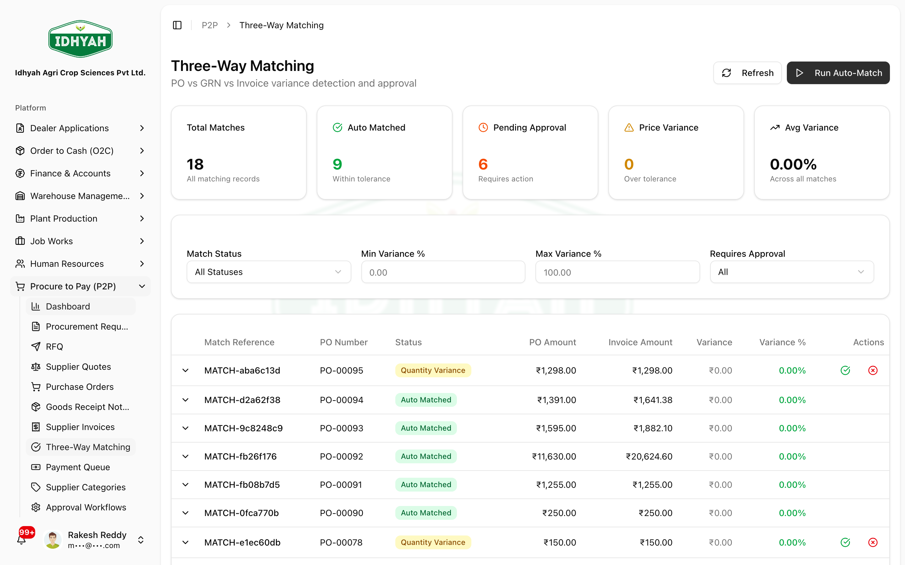
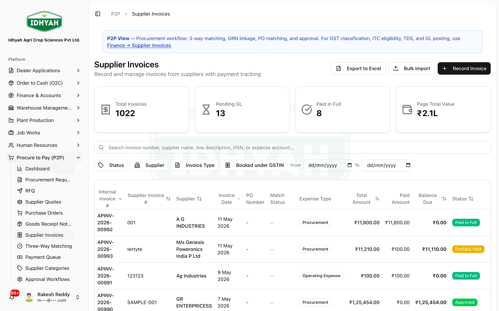
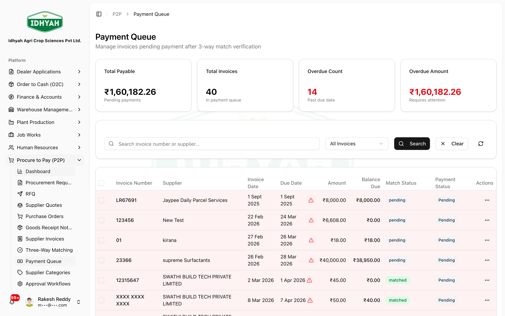

# Three-Way Matching & Vendor Payments — in detail

> The buy-side "money" mechanics: capturing a **supplier invoice**, running **three-way matching**
> (PO ↔ GRN ↔ Invoice) with a **tolerance**, clearing **variances**, paying suppliers with **TDS**,
> and how it all feeds **input-tax-credit (ITC)** and **GSTR-2B**. Includes how the tolerance is
> calculated and how your organization can configure it.

> **Audience:** Customer + Internal · **Module:** `/p2p` · **Status:** 🟢 Authored
> **Verified:** against `web_app/src/app/p2p` + production tenant config on 2026-06-18.

For the end-to-end buy flow, see the **[Procure to Pay guide](./procure-to-pay.md)**.

---

## Why three-way matching exists
Before you pay a supplier, DAEE checks that **three documents agree**:

| Document | Answers |
|---|---|
| **Purchase Order (PO)** | What you agreed to buy, and at what price |
| **Goods Receipt Note (GRN)** | What actually arrived (quantity, quality) |
| **Supplier Invoice** | What the supplier is billing you |

If all three line up (within tolerance), the invoice is safe to pay. If they don't, DAEE raises a
**variance** that must be approved before payment — the core control against overpayment and fraud.

---

## How the match is calculated

When you **Auto-Match** an invoice, DAEE compares the PO, GRN, and invoice line by line and computes
**price**, **quantity**, and **timing** variances, then decides:

```
within tolerance  →  matched / auto_matched
outside tolerance →  price_variance | quantity_variance | multiple_variance  (needs approval)
```

**The tolerance is a band** — a match passes if it is within *either*:
- a **percentage** of the value (default **2%**), **or**
- a **flat amount** (default **₹1,000**).

> **Example:** a ₹50,000 invoice with an ₹800 difference passes (under ₹1,000). A ₹5,00,000 invoice
> with a ₹9,000 difference also passes (under 2% = ₹10,000). A ₹50,000 invoice with a ₹4,000
> difference is **flagged** (over both 2% = ₹1,000 *and* ₹1,000).

This "percentage **or** flat amount" rule means small absolute differences on large invoices, and tiny
roundings on small invoices, don't create needless work — while genuine discrepancies are caught.



### Clearing a variance
1. Open the flagged record — DAEE shows the **PO vs GRN vs Invoice** figures and the variance type.
2. Investigate (wrong price, short/over delivery, billing error).
3. **Approve Variance** to accept and let payment proceed, or **Reject Variance** (correct the invoice/GRN instead).

> **Caution** Only approve a variance you can explain — this is the control that authorises payment.

<!-- INTERNAL:START -->
`p2p/matching/actions.ts → autoMatchDocuments` + `calculateMatchVariance`. `isWithinTolerance = varianceResult.variance_percentage <= tolerancePercentage || abs(total_variance) <= toleranceAmount`. Defaults `tolerance_percentage=2.00`, `tolerance_amount=1000.00`, overridable per call (`AutoMatchInput.tolerance_percentage`/`tolerance_amount`). Statuses: `pending → auto_matched | matched` or `price_variance | quantity_variance | multiple_variance → variance_approved | variance_rejected`. Perms `po_grn_invoice_matching:create|read|approve_variance|reject_variance`.
<!-- INTERNAL:END -->

---

## Capturing a supplier invoice
**Supplier Invoices → Create** records the supplier's bill against the PO/GRN.


On approval/posting, DAEE posts an **AP liability** and the **input tax credit (ITC)** through your
posting profiles. The invoice also carries the supplier's **TDS** profile:
- **TDS applicable** (yes/no), **TDS section** (e.g. 194C/194Q), **TDS rate**, and the computed **TDS amount**.
- TDS is **deducted at payment** — you pay the supplier the invoice value **net of TDS**, and the
  withheld tax becomes a liability to deposit.

<!-- INTERNAL:START -->
Supplier-invoice posting uses `resolveMultipleGL` (`ap_control`, ITC accounts). TDS fields on the invoice: `tds_applicable`, `tds_section`, `tds_rate`, `tds_amount` (driven by the supplier's tax profile — see [Suppliers](../suppliers/suppliers.md)). Perms `supplier_invoices:create|approve|update|delete`.
<!-- INTERNAL:END -->

---

## Paying the supplier
**Payment Queue → Mark for Payment** queues approved, **matched** invoices for settlement (bulk-capable).


1. Only invoices that have **passed matching** (or had their variance approved) become payable.
2. The payment honours **TDS** — the supplier receives the **net** amount; the withheld TDS is tracked for deposit.
3. The payment posts to the GL (settles the AP liability) and updates the **supplier ledger** and **AP aging**.

---

## Input Tax Credit (ITC) & GSTR-2B
Purchases generate **ITC** — the GST you paid that offsets the GST you collect on sales. Before
claiming it:
1. **2B Reconciliation** (`/finance/compliance/gstr2b-recon`) matches your purchases against the
   government **GSTR-2B** statement.
2. **3B ITC Summary** (`/finance/compliance/gstr3b-itc`) summarises the creditable ITC for your GSTR-3B.

> **Note** Claim ITC only on purchases that appear in GSTR-2B and meet the §16 CGST conditions (valid
> tax invoice, goods/services received, supplier filed).

---

## How your organization can configure this
| Setting | What it controls |
|---|---|
| **Match tolerance** | The percentage and flat-amount bands that decide auto-match vs variance (defaults 2% / ₹1,000) |
| **Approval workflows** | Who must approve POs and matching variances (by amount/role) |
| **Supplier tax profile** | Per-supplier TDS section/rate, GST registration type, MSME flag — drives deduction and tax treatment |
| **Posting profiles** | Which GL accounts AP, ITC, and TDS post to |

## Common mistakes
| What you see | Why | What to do |
|---|---|---|
| Can't pay an invoice | It hasn't matched, or a variance is open | Run the match; approve the variance (or fix the invoice/GRN) |
| Variance on every line | PO price ≠ invoice price (rate revision) | Correct the PO/invoice, or approve if the new price is agreed |
| ITC looks too high | Claimed before GSTR-2B match | Reconcile against 2B first; claim only eligible ITC |
| Supplier underpaid | TDS deducted at payment | Expected — the balance is withheld tax to deposit |

## Related
[Procure to Pay](./procure-to-pay.md) · [Suppliers](../suppliers/suppliers.md) · [Finance — Receipts, Credits & Discounts](../finance/receipts-credits-discounts.md) (the sell-side equivalent) · Finance → Accounts Payable.
