# Plant Production

> Manufacture finished goods — from bill of materials and production orders to material issue, quality
> control, packaging, and **QR-coded batches**.

> **Audience:** Customer + Internal · **Module:** `/plant-production` · **Status:** 🟢 Authored
> **Verified:** against `web_app/src/app/plant-production` + staging DB on 2026-06-18.

## What you can do
- **Set up plants** — manufacturing plants, their assets and licenses.
- **Define recipes** — **Bills of Material (BOM)** with versions and approvals.
- **Plan & order production** — production planning and **Production Orders** (work orders) with approval.
- **Issue materials** — raise **Material Requests**, approve, and record **Material Issuance** against an order.
- **Control quality** — **QC** on finished goods (pass / fail / rework / hold / downgrade).
- **Package & label** — **Packaging** jobs that produce finished-goods batches.
- **Generate QR codes** — single, bulk, and historical **QR labels** for manufactured packages.
- **Handle exceptions** — **Scrap** records, **Expiry Alerts**, production **Anomalies**.
- **Report** — production summary, QC analysis, scrap analysis.

## Before you begin

### What you need
- At least one **manufacturing plant** set up (with its licenses).
- **Products** and **raw materials** defined, with **raw-material stock** available to issue.
- An **approved BOM** for the product you intend to make.
- Your accounting rules configured (production movements and QC/packaging post to the GL).

### Roles and what each can do

| Role | Typical responsibilities |
|---|---|
| **Production Planner** | Plan production, create production orders |
| **Approver / Plant Head** | Approve BOMs, production orders, and material requests |
| **Stores** | Issue raw materials against approved requests |
| **QC Inspector** | Record quality checks on finished goods |
| **Packaging Operator** | Run packaging jobs and generate QR labels |
| **Admin** | Maintain plants, posting profiles |

<!-- INTERNAL:START -->
Access is permission-gated (`plant_production`, `job_work_orders`, `qc_parameters`, `production_scrap`, `production_scans`, `inventory_barcodes`, `document_attachments`) and tenant-isolated via RLS. QC and packaging post to the GL via `createAutoJournalEntry` (posting profiles). QR generation is client-side (`qrcode` library, DAEE-427); finished-goods QR feeds inventory/scanning in Warehouse. Edge fns `external-einvoice-processor`/`cancel-einvoice-gstzen` are used by the Job Work sub-area. *(Tables, posting model → [Plant Production Developer Guide](../../developer-guides/plant-production.md).)*
<!-- INTERNAL:END -->

### The flow at a glance
```
Setup            Recipe        Plan & Make                         Finish & Label
──────────       ─────────     ───────────────────────────────    ───────────────────────────
Plants     ──▶   BOM      ──▶  Production Planning → Production ──▶ Quality Control → Packaging
(+licenses)      (approve)     Order (approve) → Material Request   → QR Generator (label batches)
                               → Material Issuance                  → Finished Goods (+ variants)
```
Exceptions branch off anywhere: **Scrap**, **Expiry Alerts**, **Anomalies**.

---

## Set up a plant
**Role:** Plant Admin / Plant Head · **Result:** a plant ready to manufacture, with assets and licenses

1. **Plant Production → Plants → Add Plant** — register the plant (name, code, location).
   
   <!-- capture: { "project": "iacs-md", "route": "/plant-production/plants" } -->
2. Open the plant (**View**) to manage its **assets**, **licenses**, and **documents**.
   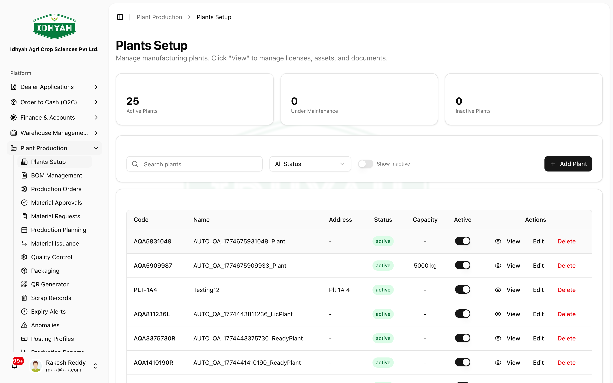
   <!-- capture: { "project": "iacs-md", "route": "/plant-production/plants", "action": "open-first-product" } -->
   - **Add asset** — register each piece of the plant's **machinery/equipment** (used for capacity and
     maintenance).
   - **Add license** — record each manufacturing **license** with its **number and validity dates**, so
     expiry is tracked.

> **Why licenses matter** Regulated agri-inputs manufacturing requires valid licenses; recording them
> here keeps production compliant and auditable.

## Define a Bill of Materials (BOM)
**Role:** Production / R&D · **Result:** an approved, versioned recipe a production order can consume

1. **Plant Production → BOM → Create BOM** — choose the **output product**, its **base quantity + UOM**
   (the yield the recipe produces).
   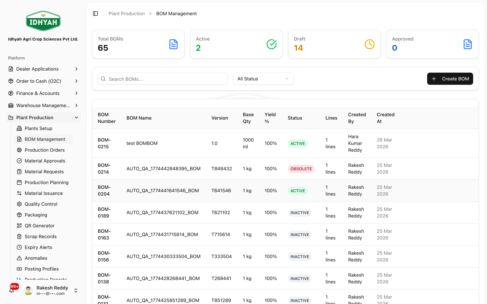
   <!-- capture: { "project": "iacs-md", "route": "/plant-production/bom" } -->
2. **Add component lines** — the **raw materials** and **quantity per base** consumed to make the output.
3. **Approval workflow** — a BOM moves **Draft → (Submit Review) → Pending → (Approve) → Active**. Only an
   **Active** BOM can be used by a production order; rejecting sends it back to draft. Each approved change
   creates a new **version** (full history is tracked).
   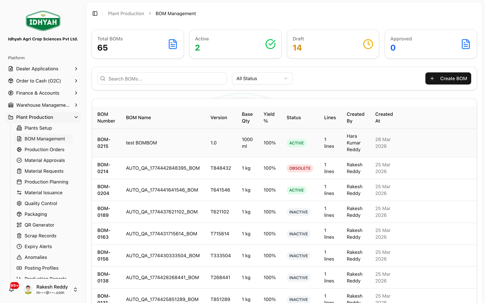
   <!-- capture: { "project": "iacs-md", "route": "/plant-production/bom", "action": "open-first-product" } -->

> **Caution** A production order needs an **Active** BOM. If you edit an approved BOM, it becomes a new
> version that must be re-approved before it's used — in-flight orders keep the version they started with.

---

## Quickstart: make a batch and label it
**You'll:** create a work order → issue materials → produce & record finished goods → QC → close → package → label · **Roles:** Planner + Stores + QC + Packaging

> **Prerequisite** For a **BOM-driven** run, the product needs an **Active BOM** — see
> [Define a BOM](#define-a-bill-of-materials-bom). A **Manual** run needs no BOM.

1. **Create a Work Order.** **Production Orders → Create**. In **BOM & Product** it's an **either/or**
   selection:
   - **BOM-driven** — select the **BOM** (the product auto-fills) *or* the **product** (its **Active BOM**
     auto-fills if one exists); DAEE derives the **material requirements** from the BOM.
   - **Manual** — if the product has **no BOM** you're notified and can run it **without one** (trials,
     re-packs, ad-hoc), entering the output yourself.

   Set the **Quantity + UOM**, priority/schedule, and manufacturing **plant**, then **Approve** the order.
   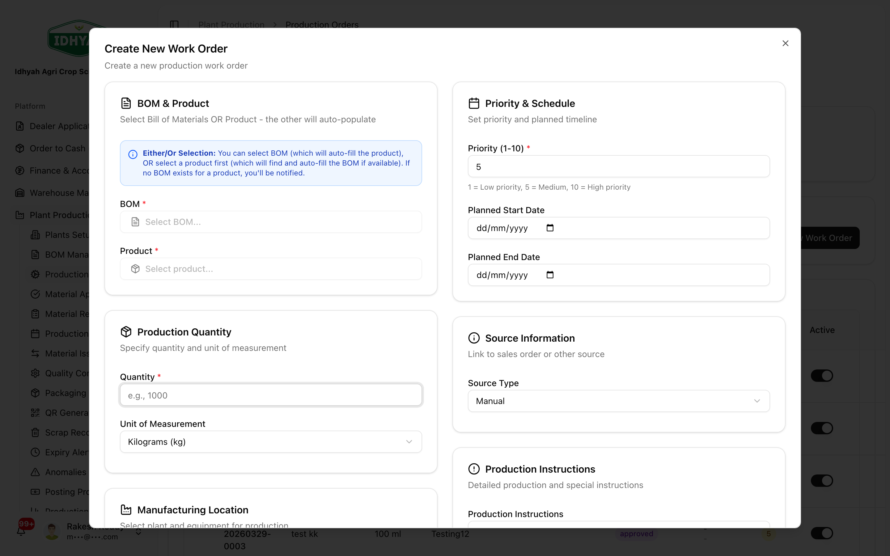
   <!-- capture: { "project": "iacs-md", "route": "/plant-production/work-orders", "action": "open-create-dialog" } -->
2. **Issue materials.** **Material Requests** — raise and approve the materials the order needs (a
   BOM-driven order pre-computes the requirements); **Material Issuance** records the stock issued from the
   warehouse to the order.
   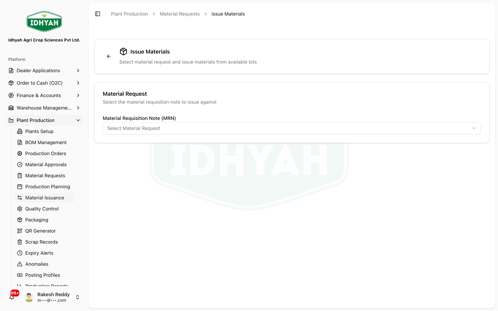
   <!-- capture: { "project": "iacs-md", "route": "/plant-production/material-issuance" } -->
3. **Produce and record finished goods.** As production completes, **record the finished-goods output** on
   the work order — the produced **batch** (quantity, manufacturing date) that QC and packaging act on.
   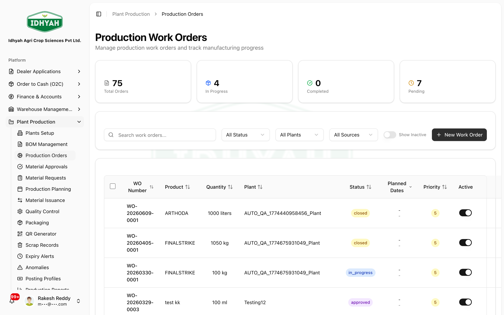
   <!-- capture: { "project": "iacs-md", "route": "/plant-production/work-orders" } -->
4. **Quality Control.** Inspect the finished-goods batch and record **Pass / Fail / Rework / Hold /
   Downgrade**. **Only a QC-passed batch can be packaged.**
   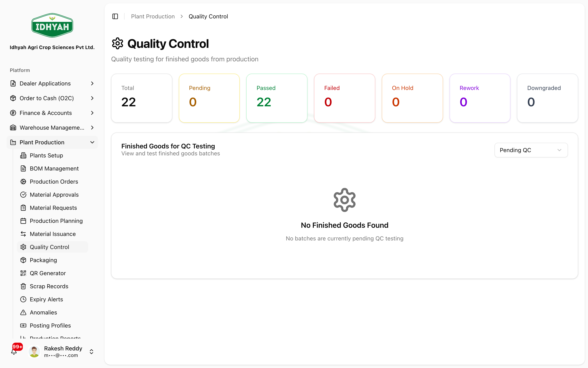
   <!-- capture: { "project": "iacs-md", "route": "/plant-production/quality" } -->
5. **Close the work order** once the batch is produced and QC-passed — it's now available to packaging.
6. **Package the batch** into sellable variants (see [Packaging](#packaging-variant-splits-yield) below),
   then **generate QR labels**.
   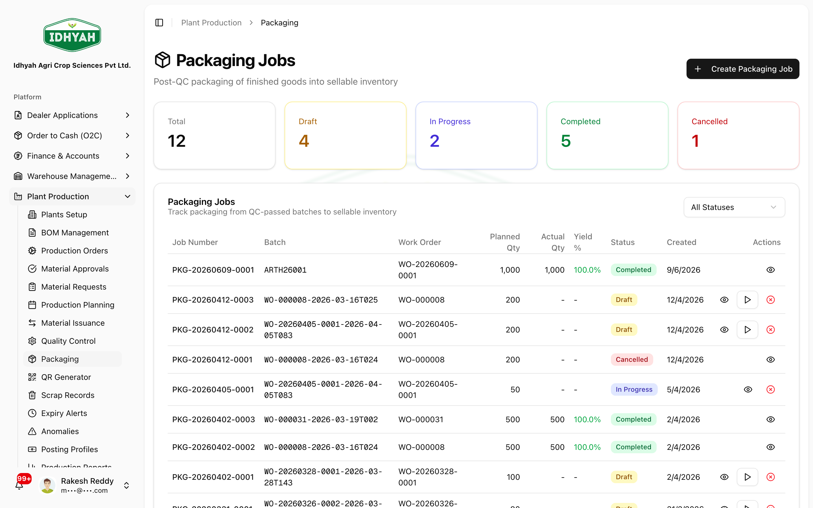
   <!-- capture: { "project": "iacs-md", "route": "/plant-production/packaging" } -->
   
   <!-- capture: { "project": "iacs-md", "route": "/plant-production/qr-generator" } -->

**Next steps:** the QR-labelled finished goods are scanned during [warehouse picking](../warehouse-management/README.md#quickstart-pick-an-order-by-scanning).

---

## Packaging (variant splits & yield)
**Role:** Packaging · **Result:** a bulk finished-goods batch split into sellable **variant** packages

Packaging is a **post-QC** step: it takes a **QC-passed** finished-goods batch and splits it into the
product's **variants** (pack sizes), tracking yield.

1. **Plant Production → Packaging → Create** and select the **QC-passed finished-goods batch** to package.
   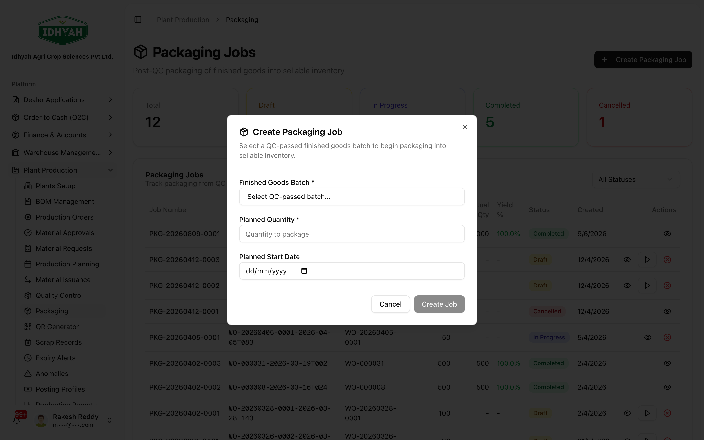
   <!-- capture: { "project": "iacs-md", "route": "/plant-production/packaging", "action": "open-create-dialog" } -->
2. **Choose the variant split.** Pick which **variants** (e.g. 1 L / 500 ml / 250 ml) to package and how
   much of the bulk goes to each. DAEE derives the **number of packages** per variant from the bulk
   quantity and each variant's pack size, so the splits can't exceed what you produced.
3. **Start**, then **Complete with yield** — the system records the packaged output (and any variance
   between expected and actual yield) and creates the **finished-goods packages** ready to label and stock.

> **Caution** Packaging consumes the bulk batch — the variant quantities must reconcile to the available
> bulk. A QC-**failed** or un-recorded batch can't be packaged.

---

## Pages & buttons

### Plants (`/plant-production/plants`)
| Button | What it does |
|---|---|
| **Add Plant** | Register a manufacturing plant (with assets and licenses). |

### BOM (`/plant-production/bom`)
| Button | What it does |
|---|---|
| **Create BOM** | Define a product's bill of materials. |
| **Submit / Approve** | Move the BOM through review to **Active** (versions are tracked). |

### Production Planning (`/plant-production/planning`)
Plan output ahead of raising orders. Cards show **Total / Active / Pending Approval / Completed** plans.
| Button | What it does |
|---|---|
| **Create Plan** | Create a plan with a **Type** (e.g. Demand-Based), a **Period**, and **Planned Quantity**. |
| **Approve** | Plans move through **approval** before they're active. |
| **Schedules** | Open a plan's production **schedules**. |

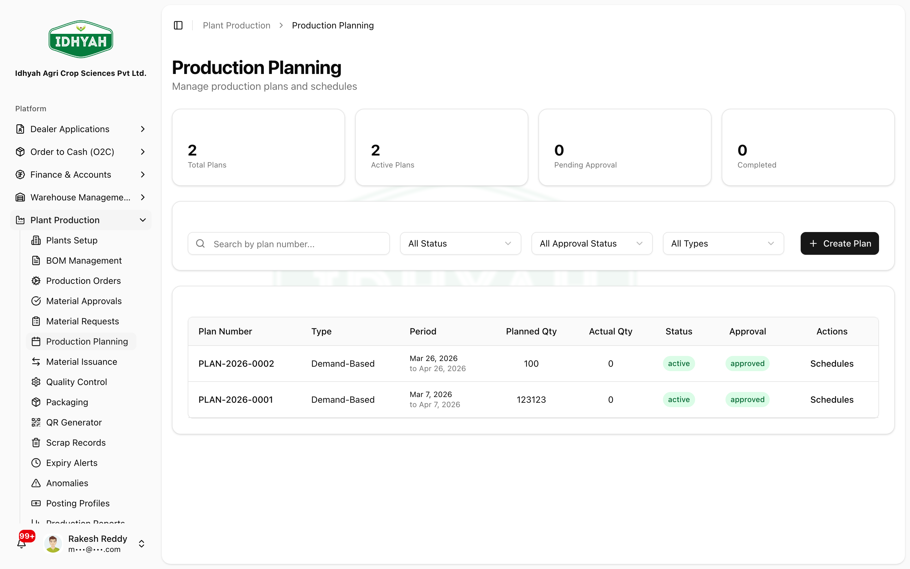
<!-- capture: { "project": "iacs-md", "route": "/plant-production/planning" } -->

### Production Orders (`/plant-production/work-orders`, `/work-orders/approvals`)
| Button | What it does |
|---|---|
| **Create** | Raise a production order (product + quantity). |
| **Approve / Reject** | Approver decision (Approvals queue). |
| **Start / Pause / Complete / Close** | Drive the order through production. |

### Material Requests & Issuance (`/material-requests`, `/material-issuance`)
| Button | What it does |
|---|---|
| **Create Request** | Request the raw materials a production order needs. |
| **Approve** | Approve the material request (partial issue supported). |
| **Issue** | Record materials issued from the warehouse to the order. |

### Quality Control (`/plant-production/quality`, `/quality-control`)
| Button | What it does |
|---|---|
| **Record QC** | Inspect output and set **Passed / Failed / Rework required / Hold / Downgraded**. |

### Packaging (`/plant-production/packaging`)
| Button | What it does |
|---|---|
| **Create / Start** | Run a packaging job (reserves material → in progress → completed). |

### QR Generator (`/plant-production/qr-generator`)
| Tab / Button | What it does |
|---|---|
| **Single QR** | Generate a QR label for one finished-goods batch/package. |
| **Bulk QR** | Generate QR labels for many at once. |
| **Generated History** | Review and reprint previously generated QR labels. |
| **Download / Print label** | Produce the printable label (PDF). |

### Exceptions & Reports
| Page | What it does |
|---|---|
| **Scrap** (`/scrap`) | Record scrap by **Type** (Raw Material / WIP / Finished Product) & **Reason**; **approved** before it posts (Ind AS 2.16a). |
| **Expiry Alerts** (`/expiry-alerts`) | Monitor batch shelf life (FEFO) — **Expired / Near Expiry (≤30d) / Warning (31–90d) / Safe (>90d)**. |
| **Anomalies** (`/anomalies`) | Review and action flagged production anomalies. |
| **Reports** (`/reports`) | **Production Summary** (yield, planned vs actual), **QC Analysis** (pass/fail, rework), **Scrap Analysis** (normal vs abnormal). |
| **Posting Profiles** (`/posting-profiles`) | How production movements post to the GL → see [Posting Profiles](../finance/posting-profiles.md). |

**Record and approve scrap** — on **Scrap Records**, click **Record Scrap** and enter the **Type** (Raw Material / WIP / Finished Product), **Reason** (Spillage, Contamination, Quality Reject, Damage), and quantity. A supervisor **approves** it (**Pending → Approved / Rejected**) before it posts.
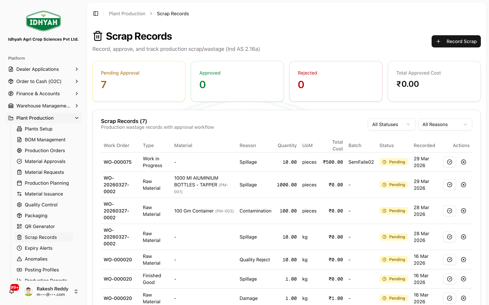
<!-- capture: { "project": "iacs-md", "route": "/plant-production/scrap" } -->

**Watch batch expiry** — **Expiry Alerts** lists finished-goods batches by **Expiry Date** (**FEFO**) across four tiers — **Expired**, **Near Expiry (≤30d)**, **Warning (31–90d)**, **Safe (>90d)** — for FSSAI traceability and Ind AS NRV.
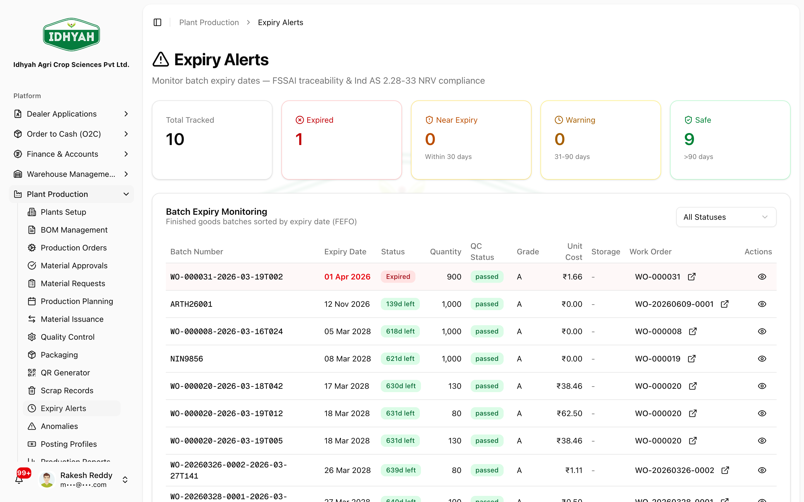
<!-- capture: { "project": "iacs-md", "route": "/plant-production/expiry-alerts" } -->

**Review production reports** — **Reports** gives **Production Summary** (output, planned vs actual, yield, material cost), **QC Analysis** (pass/fail rates, rework & downgrade), and **Scrap Analysis** (normal vs abnormal, Ind AS 2.16a, cost impact).
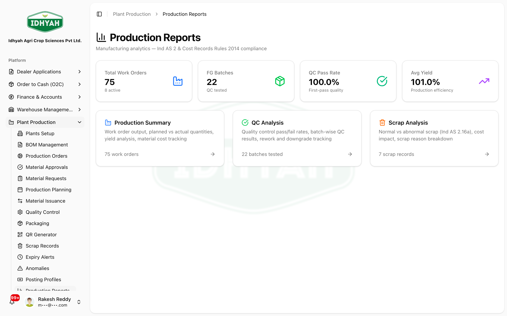
<!-- capture: { "project": "iacs-md", "route": "/plant-production/reports" } -->

---

## Common use cases
- **Make-to-stock run** — approved BOM → production order → issue materials → QC → package → QR-label the batch.
- **Reprint a batch label** — QR Generator → **Generated History** → reprint.
- **Handle a QC failure** — set **Rework required** or **Failed**, and record **Scrap** if output is discarded.
- **Watch shelf life** — monitor **Expiry Alerts** for batches approaching expiry.

## Reference
- **Statuses:** BOM — Draft → Under review → Approved → Active (or Obsolete). Production Order — Pending → Approved → In progress → Completed → Closed (or Paused/Rejected/Cancelled). Material Request — Pending → Approved → Partial issued. QC — Pending → Passed / Failed / Rework required / Hold / Downgraded. Packaging — Draft → Material reserved → In progress → Completed (or Cancelled).
<!-- INTERNAL:START -->Tables: `manufacturing_plant(+_assets/_licenses)`, `bom_header/_lines/_versions`, `production_planning`, `production_schedules`, `production_work_order`, `work_order_material_request/_issued/_material_approval_history`, `work_order_finished_goods(+_variants)`, `packaging_jobs`, `production_scrap_records`, `production_anomalies`, `production_scans`. QR via `qrcode` lib (DAEE-427) → `generateQRCodeForBatch`/`generateBulkQRCodes`/`getQRHistory`; labels via `lib/pdf/batchLabelPdf`. Schema → [Developer Guide](../../developer-guides/plant-production.md).<!-- INTERNAL:END -->
- **Outputs:** finished-goods batches (with variants), QR labels (PDF), GL postings for production movements.

## Troubleshooting
| What you see | Why it happens | How to fix it |
|---|---|---|
| Can't create a production order | The product has no **approved/active BOM** | Approve the BOM first, then create the order |
| Material can't be issued | The request isn't approved, or stock is short | Approve the request; replenish raw-material stock |
| QC won't let output proceed | Result is **Failed / Rework required / Hold** | Rework or scrap as appropriate, then re-inspect |
| QR won't generate for a batch | The batch isn't packaged/finished yet | Complete packaging first; for older stock use **Bulk QR** / backfill |
| BOM won't save edits | Only **Draft / Under Review** BOMs are editable | Create a new version rather than editing an Approved/Active BOM |
| BOM missing on a production order | The BOM isn't active | **Activate it (Approved → Active)** so orders can use it |
| Can't delete a BOM | Production orders still **reference** it | **Mark it obsolete** instead of deleting |
| "Duplicate component" when adding a line | The material is already on the BOM | Update the quantity on the **existing** line |
| No products / raw materials in the BOM picker | They aren't set up yet | Create & **activate** the finished good in **Products**; add materials in **Raw Materials** |
| Can't post finished goods | **QC is pending** for the batch | Complete **Quality Control** first |
| Can't approve a work order / material request you raised | **Segregation of duties** — no self-approval | A **different approver** must action it |

## Support and escalation
- **BOM / order approvals** → Plant Head.
- **Material shortages** → Stores / Procurement (see [P2P](../p2p/procure-to-pay.md)).
- **QC / scrap decisions** → QC lead.

## Related workflows
[Warehouse Management](../warehouse-management/README.md) (QR labels are scanned at picking) · [Procure to Pay (P2P)](../p2p/procure-to-pay.md) (raw materials) · Job Works (sub-contracted production).
