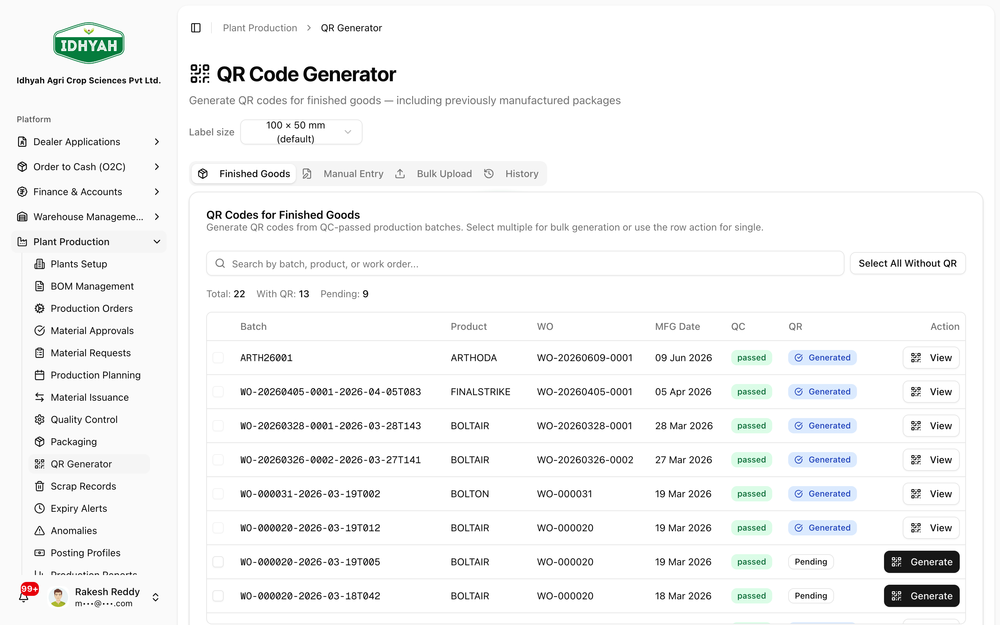
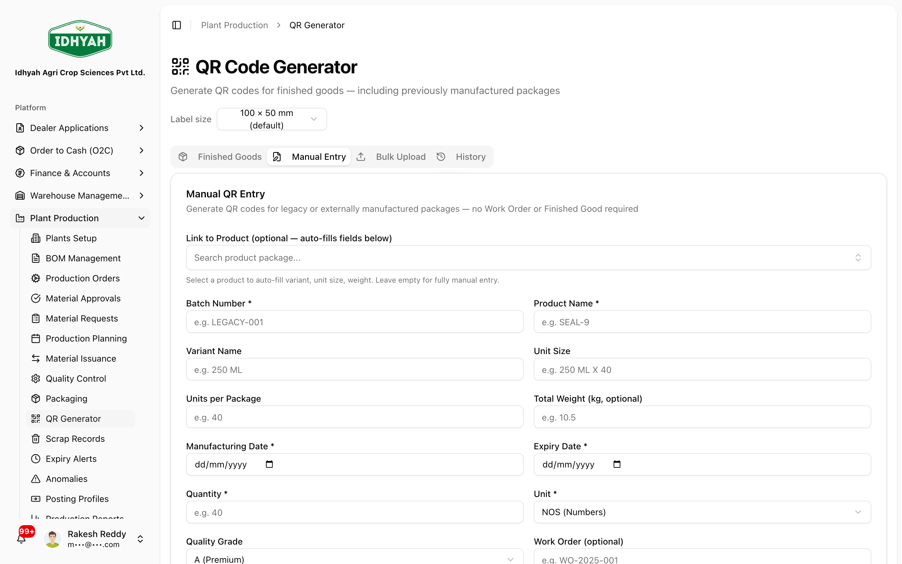
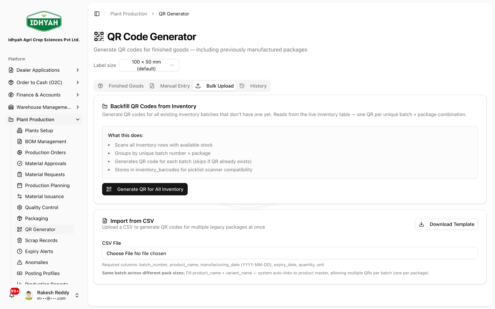
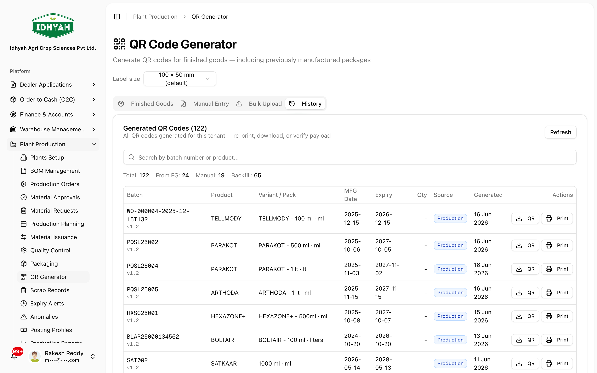
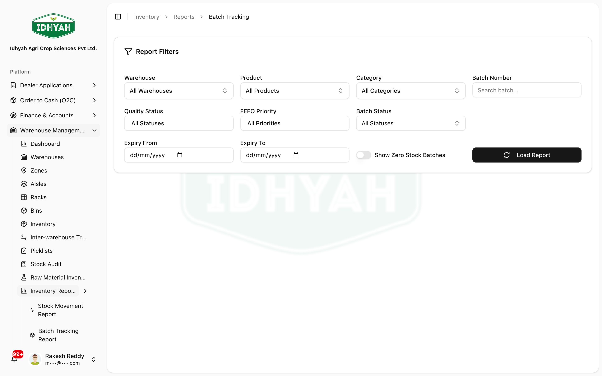

# QR Labels & Batch Traceability — in detail

> Everything about QR codes in DAEE: what the QR encodes (and the **Indian compliance** behind each
> field), the **batch + variant** model, and **every way to generate labels** — for a produced batch,
> in bulk, manually for legacy/external stock, via upload, reprinted from history, or backfilled for
> existing inventory — plus how the label is **scanned downstream**.

> **Audience:** Customer + Internal · **Module:** `/plant-production` · **Status:** 🟢 Authored
> **Verified:** against `web_app/src/app/plant-production` (`actions/qrCodeActions.ts`, DAEE-107) + `lib/qr` on 2026-06-18.

For the full manufacturing flow, see the **[Plant Production guide](./README.md)**.

> **Where this lives** QR labels are **generated in Plant Production** (at packaging of a finished-goods
> batch) — which is why the screenshots below are Plant Production screens. They are then **scanned in
> Warehouse** (picking, transfers, cycle counts). This page is cross-linked from both modules for that
> reason; label *generation* is a Plant Production activity, label *scanning* is a Warehouse activity.

---

## Why QR labels matter
Every finished-goods batch gets a **QR label** that becomes the unit's identity for life:
- **Warehouse picking** scans it to confirm the correct batch + variant is picked.
- **Traceability** — trace a unit back to its production order, materials, QC, and expiry.
- **Compliance** — the QR carries the legally-mandated batch/quantity/date information.

### What the QR encodes — and why (compliance)
Each QR carries the statutory product information required for Indian packaged goods:

| Field on the label | Why it's mandatory |
|---|---|
| **Manufacturing date** | FSSAI Act, 2006 |
| **Expiry date** (must be after the mfg date) | Consumer Protection Act, 2019 |
| **Net quantity + unit** | Legal Metrology Act, 2009 |
| **Batch number + product name** | Legal Metrology (Packaged Commodities) Rules, 2011 |

The QR resolves to the **batch/variant identity** (not a web link), and the same payload always
produces a byte-identical code, so a batch reads consistently wherever it's scanned. Labels print as a
standardised, print-friendly PNG on a batch label (PDF), at a **label size you choose**.

<!-- INTERNAL:START -->
`actions/qrCodeActions.ts` (DAEE-107, Phase 11). Server-side `qrcode` v1.5.4; stored in `inventory_barcodes` (`barcode_type='QR'`). Image params `lib/qr/qrCodeEncoding.ts QR_LABEL_PNG_OPTIONS` (width 400, margin 2, errorCorrectionLevel 'M'; DAEE-616 aligned create+reprint). Label PDF `lib/pdf/batchLabelPdf.generateLabelPDF` with `LabelSizeSelector`. Perms: generate=`plant_production:create`, read/history=`plant_production:read`.
<!-- INTERNAL:END -->

---

## The batch + variant model
Production output is tracked as **finished goods**, split into **variants** (the actual sellable packs).
Each variant batch carries: variant/package, **batch number** (what the QR resolves to), quantity
produced, **packages count** + **units per package**, **packaging & expiry dates**, and **QC status**.
A QR is tied to a **specific variant + batch** — so scanning enforces the *exact* pack, not just the
right product (the variant-strict check the warehouse relies on).

---

## Where QR codes are scanned (warehouse operations)
A QR label is **generated** here in Plant Production, then **scanned** at several points in the warehouse.
Every scan is recorded to a single **scan audit ledger**, and the scanner works with either a **USB
barcode gun (wedge)** or the **device camera**.

| Scan surface | Where it happens | What scanning does |
|---|---|---|
| **Scan to pick** | Order picking (scan-first console) | Confirms the exact batch/variant for a sales-order line before dispatch |
| **Scan to load** | Inter-Warehouse Transfer — **dispatch** | Scans each case as it's loaded; tracks shipped-vs-requested |
| **Scan to receive** | Inter-Warehouse Transfer — **goods receipt** | Scans each case off the truck at the destination; enforces received ≤ shipped |
| **Scan to count** | Cycle Count (stock audit) | Scans stock against a count line; increments the verified count |

In each case a **wrong-line or invalid scan is rejected** (it doesn't change the count/quantity), and
**duplicates are blocked** — so the physical scan, not manual typing, is what's trusted. The full
step-by-step for these lives in the **[Warehouse Management guide](../warehouse-management/README.md)**.

<!-- INTERNAL:START -->
Scanning surfaces & components (branch `pavan/qr-programme-cont-sa`, on `staging`): picking `PickingConsole`; IWT dispatch `iwt/components/ScanLoadDialog` (surface `iwt_dispatch`, DAEE-896/937); IWT receipt `iwt/components/GRNScanDialog` (surface `iwt_grn`, DAEE-898, `incrementIWTReceivedQty` enforces received≤shipped); cycle count `cycle-count/components/ScanCountDialog` (surface `stock_audit_cycle_count`, DAEE-872); plus `stock_audit_fsa`. Shared `QRScanBar` (USB wedge or camera) → `recordScanEvent` → **`scan_event_audit`** ledger (DAEE-928, records surface/document/line/warehouse). Rejected/duplicate scans counted but not applied. Fresh (Wave-6 UAT 2026-06-18) — confirm full release before treating as GA.
<!-- INTERNAL:END -->

## The QR Generator — four tabs
**Plant Production → QR Generator.** Pick your **label size** (top), then use the tab for your use case.

<!-- capture: { "project": "iacs-md", "route": "/plant-production/qr-generator" } -->

---

## Use case 1 — Single QR for a produced batch
**Tab:** Finished Goods · **When:** label one QC-passed batch from a production order.
1. Search/select the **finished-goods batch** (by batch number, product, or work order).
2. Click **Generate** — DAEE creates the QR from the batch's real data (no typing).
3. **Download** the label PDF or **Print** it (at your chosen label size).

> **Tip** Batches that already have a QR are marked; only those **without** a QR are offered for generation.

## Use case 2 — Bulk QR for a whole run
**Tab:** Finished Goods (bulk select) · **When:** label many batches at once after a production run.
1. **Select multiple** batches (or **Select All** of the without-QR list).
2. **Generate Bulk** — DAEE produces every label in one operation and reports how many succeeded.
3. Download/print the set.

## Use case 3 — Manual QR (legacy / external stock)
**Tab:** Manual · **When:** stock that predates DAEE, or externally-manufactured goods with **no ERP batch record**.

<!-- capture: { "project": "iacs-md", "route": "/plant-production/qr-generator", "action": "click-tab", "section": "Manual" } -->
1. Enter the label fields: **batch number, product name, variant, unit size, units per package, total weight, manufacturing date, expiry date, quantity + unit, quality grade**, and optionally work order / plant code.
2. DAEE **validates compliance** as you go — manufacturing and expiry dates are mandatory and **expiry must be after manufacturing**; quantity + unit and batch + product name are required.
3. **Generate** — the QR is created from your entries and stored like any other.

## Use case 4 — Bulk Upload (many manual QRs)
**Tab:** Bulk Upload · **When:** label a large set of legacy/external packs from a file.

<!-- capture: { "project": "iacs-md", "route": "/plant-production/qr-generator", "action": "click-tab", "section": "Bulk Upload" } -->
1. Prepare the upload with one row per pack (the same compliance fields as Manual).
2. Upload — DAEE validates each row and generates the QR codes, reporting successes and any rows that failed validation.

## Use case 5 — Reprint from History
**Tab:** History · **When:** a label was lost or damaged, or you need another copy.

<!-- capture: { "project": "iacs-md", "route": "/plant-production/qr-generator", "action": "click-tab", "section": "History" } -->
1. Find the previously generated QR (by batch/product/date).
2. **Reprint / Download** — the reprint uses the identical encoding, so the code is the same as the original.

## Use case 6 — Backfill existing inventory (one-time)
**When:** you have on-hand stock with **no QR** (e.g. from before QR was standard) and want it all labelled.
1. Run **Backfill from Inventory** — DAEE scans inventory rows that have stock but no QR and generates **one QR per unique batch + variant**.
2. Rows missing a batch number, dates, or variant are **skipped** (and reported) — fix those via **Manual** entry.
> **Note** Backfill is a one-time catch-up; new production auto-labels going forward.

---

## The lifecycle of a labelled batch
```
Packaging job → finished-goods batch (+variant) → QC passed → QR label generated
   → stocked in warehouse (FEFO) → scanned at picking (variant-strict) → dispatched to dealer
```

## Trace a batch (where it came from, where it went)

Generating a label is only half of traceability — the point is that any batch can be **traced end to
end**. There are two entry points:

### The Batch Tracking report
**Warehouse Management → Inventory Reports → Batch Tracking** (`/inventory/reports/batch-tracking`) — the
**recall / audit** view. Search by **batch number** (partial match works) or product to see each batch,
its **current location and quantity**, **manufacturing / expiry** dates, and the **supplier batch number**
where applicable. Export to PDF/Excel for a recall dossier or an auditor.

<!-- capture: { "project": "iacs-md", "route": "/inventory/reports/batch-tracking" } -->

### The batch detail (inventory)
Open a stock line from **Warehouse Management → Inventory** to see one batch's **origin** — product,
package, HSN, manufacturing/expiry, and the **warehouse + bin** it sits in — plus its **QR label**. This is
the quickest "what is this physical case?" lookup. See
[Managing Inventory → Open a batch and print its QR label](../warehouse-management/inventory.md#2-open-a-batch-and-print-its-qr-label).

> **Why it matters (compliance).** For agri-inputs, batch traceability underpins **product recall** and
> **shelf-life/expiry** control — you can identify every location holding an affected batch, and prove
> manufacturing and expiry dates on demand.

## Label options
- **Label size** — choose the physical label size before generating/printing (selector at the top of the page).
- **Download** — get the label as a PDF to print later or in bulk.
- **Print** — send directly to a label printer.

## Common mistakes
| What you see | Why | What to do |
|---|---|---|
| Can't generate a QR for a batch | The batch isn't packaged/QC-passed yet | Complete packaging and QC first |
| Manual entry rejects the dates | Expiry must be **after** manufacturing; both are mandatory | Correct the dates |
| Manual entry won't submit | Missing a mandatory compliance field (qty/unit, batch, product) | Fill the required fields |
| Backfill skipped some stock | Rows missing batch number, dates, or variant | Label those via **Manual** entry |
| A scan is rejected at picking | Wrong product/variant/batch for the picklist line | Scan the correct batch, or substitute with a reason (warehouse) |
| Older stock has no QR | Produced before QR was standard | Use **Backfill** or **Manual / Bulk Upload** |
| Printed label unreadable | Print quality/size | Reprint from **History** (standardised print-friendly encoding) |

## Related
[Plant Production](./README.md) · [Warehouse Management](../warehouse-management/README.md) (scanning at picking) · [Procure to Pay](../p2p/procure-to-pay.md) (raw materials).
