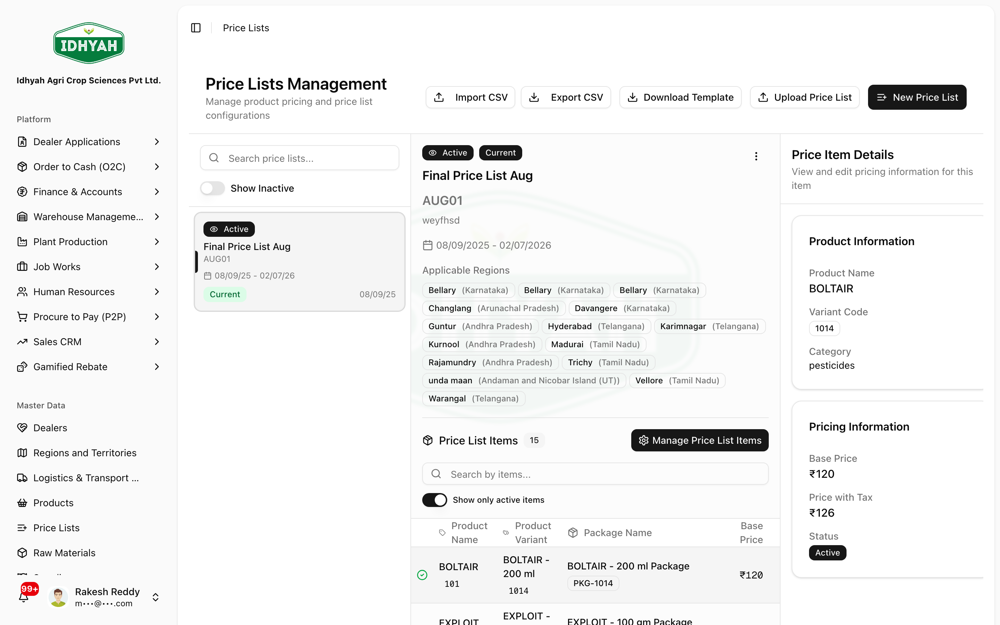

# Price Lists

> Set the prices you sell at: build **effective-dated** price lists, target them at regions, territories,
> dealers or customer groups, and route them through an **approval** step before they go live.

> **Audience:** Customer + Internal · **Module:** `/price-lists` · **Status:** 🟢 Authored
> **Verified:** against `web_app/src/app/price-lists` on 2026-06-18.

## What you can do
- **Build price lists** of several **types** — standard, promotional, customer-specific, volume-discount, seasonal, distributor, institutional.
- **Price the items** — base price, discount % or fixed discount, tax-inclusive/exclusive, min/max/step quantity, margin.
- **Target & prioritise** — assign a list to regions, territories, dealers or dealer categories; set **priority**, a default list, and auto-apply.
- **Effective-date** — set **valid-from / valid-to** at the list and the item level so prices switch over automatically.
- **Approve** — submit for review; an approver (not the author) approves before it can be used.
- **Bulk-maintain** — CSV import/export and bulk edits across many items.

## Before you begin
- **Products and variants** exist (price-list items reference variants/packages).
- Your **regions / territories / dealers** are set up if you want to target the list.
- You know the **valid-from** date and whether prices are **tax-inclusive**.

### Roles and what each can do

| Role | Typical responsibilities |
|---|---|
| **Pricing Analyst** | Builds and edits price lists; submits for approval |
| **Pricing Approver / Manager** | Reviews and **approves** (cannot approve their own list) |
| **Sales / O2C** | Consumes the approved, in-effect price on orders |

<!-- INTERNAL:START -->
Permission-gated on `price_lists` (`create`/`read`/`update`/`delete`/`approve`); reads `products`, `product_variants`, `product_variant_packages`, `master_regions`, `master_dealers`. Tenant-isolated via RLS. Tables: `price_lists`, `price_list_items`. **Segregation of duties:** the approve action rejects when `created_by == approver` and requires the list to have active items. *(State machine & controls → [Price Lists Developer Guide](../../developer-guides/price-lists.md).)*
<!-- INTERNAL:END -->

### Lifecycle of a price list
```
Draft  →  Pending (submitted)  →  Approved  (or Rejected)
        plus  Valid-from / Valid-to  controls WHEN an approved list is in effect
```
> **Note** A new list is **created as a draft** — saving it does **not** make it live. It only starts
> pricing orders after it is **submitted, approved, and inside its valid-from/valid-to window**. If you
> see a list appear right after you save it, that's the draft; it is not yet in effect.

---

## How the selling price is chosen on an order

When an item is added to an indent/order for a dealer, DAEE resolves the price **automatically**. It
looks only at lists that are **active, approved and in their valid-from/valid-to window**, that **contain
this product package**, and whose targeting matches the dealer — then picks the **most specific** one in
this order:

| Priority | Match | Beats |
|---|---|---|
| **1 (highest)** | List with this **dealer explicitly assigned** (dealer is in the list's dealer list) | everything below |
| **2** | **Dealer-specific** type list | territory / regional / default |
| **3** | **Territory-specific** type list | regional / default |
| **4** | **Regional** list (dealer's region is in the list's region list) | default |
| **5 (lowest)** | Highest **priority** number, then the **default** list | — |

Within the chosen list, the item's **quantity band** (min/max) and **item-level valid-from/valid-to**
must also match the order quantity and date; if not, DAEE moves to the next list in the order above.

### Edge cases
- **Scenario A — more than one active list could apply to the same dealer.** The table above is the
  tie-break: the most specific match wins (direct dealer assignment → dealer-specific → territory →
  regional → priority/default). Use **priority** to steer ties *within the same specificity* (e.g. a
  promotional list over the standard list for the promo period).
- **Scenario B — no active list covers the item for this dealer.** DAEE falls back to the product
  package's **cost price** as the selling price, with **0% discount**, and labels the line
  *"Cost Price (No Price List)"* so the operator can see a price list is missing. This is a safety net,
  **not** intended pricing — publish an approved price list to correct it.

<!-- INTERNAL:START -->
Resolution: `web_app/src/app/o2c/actions/resolvePackagePrice.ts`. Candidate query filters
`is_active`, `valid_from ≤ now`, `valid_to ≥ now` (or null), matching `price_list_items.product_variant_package_id`;
dealer/region AND-matching is done in JS (`dealer_ids` empty OR contains dealer) AND (`region_ids` empty OR
contains region). Sort chain: direct-dealer-assignment → `price_list_type` dealer_specific/territory_specific/regional
→ `priority` desc → `is_default`. Fallback (Scenario B) reads `product_variant_packages.package_cost_price`
and sets `price_list_name = 'Cost Price (No Price List)'`, `discount = 0`.
<!-- INTERNAL:END -->

---

## Key workflows

### Build a price list
**Role:** Pricing Analyst · **Result:** a draft list ready to price
1. **Price Lists → New** — name, code, **type**, **valid-from** (and valid-to if time-bound), and targeting (regions/territories/dealers/customer groups), plus priority and whether it **auto-applies**.
   
   <!-- capture: { "project": "iacs-md", "route": "/price-lists" } -->
2. Add **items**: pick product variants/packages and set base price, discount, tax treatment, and quantity breaks. The final price and price-with-tax are calculated for you.
> **Tip** Use **priority** to break ties when more than one list could apply — the higher-priority, in-effect list wins.

### Submit and approve
**Roles:** Analyst → Approver · **Result:** an approved, usable list
1. The analyst **submits** the list — status moves to **Pending**.
2. A different user with approve rights **approves** (or rejects with comments). You **cannot approve your own** list, and a list with no items can't be approved.
3. Once **Approved** and within its **valid-from/valid-to** window, the list is live for the targeted audience.
> **Caution** Approval is a control, not a formality — the author and approver must be different people.

### Bulk maintenance (CSV)
**Role:** Pricing Analyst · **Result:** fast mass updates
1. **Export** the list (or items) to CSV, edit prices/discounts, and **import** the CSV back.
2. Use **bulk edit** to change status or apply a change across many items at once.

---

## Pages & areas

| Area | Where | What you do there |
|---|---|---|
| **Price lists** | Price Lists | Browse, filter (type/status/expired), create lists |
| **List detail** | Price Lists → (a list) | Edit header, targeting, manage items, submit/approve |
| **Items grid** | List detail → Items | Price each variant/package; quantity breaks; tax |
| **Bulk tools** | Upload / Export CSV | Mass import/export and bulk edits |

---

## Common use cases
- **Run a promotion** — a *promotional* list with valid-from/valid-to and higher priority over the standard list for the period.
- **Contract pricing for a dealer** — a *customer-specific*/*distributor* list targeted at that dealer.
- **Annual reprice** — export, edit in CSV, re-import, submit, approve, schedule with valid-from.

## Reference
- **Statuses:** draft → pending → approved (or rejected).
- **Types:** standard · promotional · customer-specific · volume-discount · seasonal · distributor · institutional.
- **In effect = approved AND within valid-from/valid-to** for the targeted audience.
<!-- INTERNAL:START -->Tables: `price_lists`, `price_list_items`. SoD on approve (`created_by != approver`). Schema → [Developer Guide](../../developer-guides/price-lists.md).<!-- INTERNAL:END -->

## Troubleshooting
| What you see | Why it happens | How to fix it |
|---|---|---|
| Approve button is blocked | You created the list, or it has no items | Have a different approver act; add items first |
| A price isn't applying on orders | List not approved, out of date window, or wrong targeting/priority | Check status, valid-from/valid-to, audience, and priority |
| The wrong price applies | Another list has higher priority | Adjust priority or targeting |
| Expired list still shows | It's past valid-to | Filter out expired, or extend valid-to and re-approve if needed |

## Support and escalation
- **Building/editing lists** → Pricing Analyst.
- **Approvals / pricing policy** → Pricing Manager.
- **Wrong price on a live order** → Pricing Manager + O2C.

## Related workflows
[Products](../products/README.md) · [Dealers](../dealers/README.md) · [Regions & Territories](../regions/README.md) · [Order to Cash (O2C)](../o2c/order-to-cash.md)
