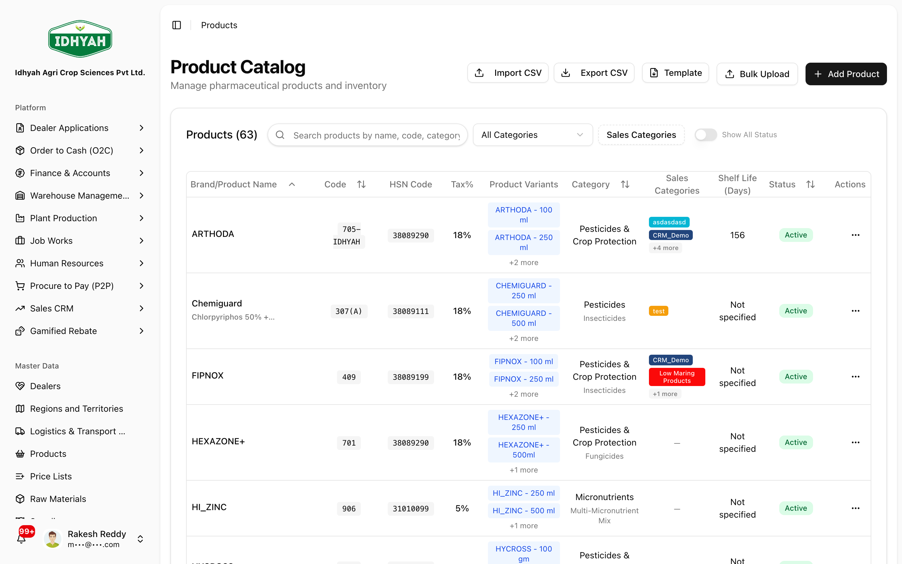
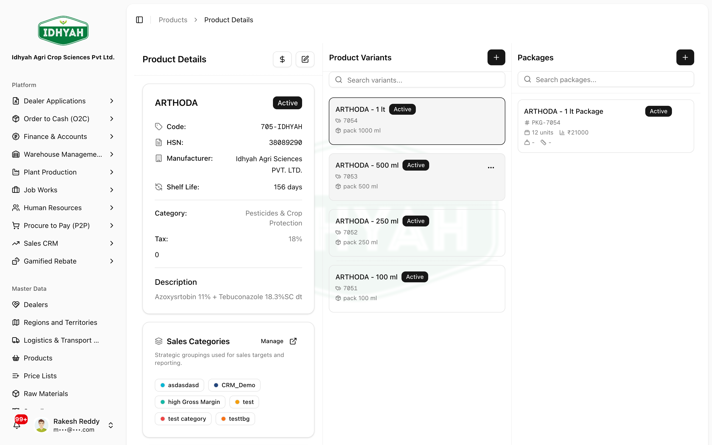

# Products

> The product master: define what you sell — products, their **variants** (pack sizes/SKUs) and
> **packages** (cartons) — with HSN, tax, MRP/cost, and batch/expiry rules that drive pricing,
> inventory, and invoicing across DAEE.

> **Audience:** Customer + Internal · **Module:** `/products` · **Status:** 🟢 Authored
> **Verified:** against `web_app/src/app/products` on 2026-06-18.

## What you can do
- **Define products** — code, name, HSN, tax & cess, category, manufacturer/brand, MRP and cost.
- **Add variants** — the sellable pack sizes / SKUs under a product (bottle, bag, container…), each with its own MRP, cost, barcode, and unit of measure.
- **Add packages** — how variants ship (units per package, packages per carton), for warehouse and logistics.
- **Set product-level rules** — batch tracking, expiry/shelf-life, serialization, schedule classification.
- **Bulk-manage** — import/export products via a template; review **change history** for any product, variant, or package.

## Before you begin
- Decide your **product → variant → package** structure (a product can have many variants; each variant can have packages).
- Have the **HSN code** and **GST rate** (and cess, if any) ready — these flow into pricing and invoices.
- Know the **unit of measure** and whether the item is **batch-tracked** / has an **expiry**.

### Roles and what each can do

| Role | Typical responsibilities |
|---|---|
| **Product / Catalogue Admin** | Create & maintain products, variants, packages |
| **Pricing** | Reads product MRP/cost; builds [Price Lists](../price-lists/README.md) |
| **Sales / Operations** | Read-only — uses products in orders, inventory, invoices |

<!-- INTERNAL:START -->
Permission-gated on the `products` module (`create`/`read`/`update`/`delete`); the embedded pricing panel also reads `price_lists`. Tenant-isolated via RLS. Tables: `products`, `product_variants`, `product_variant_packages`, `related_products`; change history via `audit_logs_unified`. *(Schema, hierarchy, controls → [Products Developer Guide](../../developer-guides/products.md).)*
<!-- INTERNAL:END -->

### How the catalogue is structured
```
Product            ── master record: HSN, tax, category, MRP/cost, batch & expiry rules
  └─ Variant       ── sellable pack/SKU: unit size, barcode, variant MRP/cost
       └─ Package  ── how it ships: units per package, packages per carton (logistics)
Related products   ── cross-/up-sell links between products
```

---

## Key workflows

### Create a product
**Role:** Catalogue Admin · **Result:** a product ready for variants and pricing
1. **Products → Add Product** — enter code, name, **HSN**, **tax %** (and cess if any), category, manufacturer/brand, and default **MRP/cost**.
   
   <!-- capture: { "project": "iacs-md", "route": "/products" } -->
2. Set the **handling rules**: unit of measure, **batch tracking**, **shelf life / expiry**, serialization, and (where relevant) schedule classification.
3. Save — the product appears in the catalogue with status **active**.
> **Tip** Get HSN and tax right at the product level — they flow into every price list and invoice. Correcting them later means re-checking dependent price lists.

### Add variants and packages
**Role:** Catalogue Admin · **Result:** sellable SKUs and shipping units

On the **product detail** page, variants and packages are managed together — the **Variants** section
lists each SKU, and the **Packages** section shows the shipping units for the selected variant.

<!-- capture: { "project": "iacs-md", "route": "/products", "action": "open-first-product" } -->

1. Open the product and add a **variant** for each pack size / SKU (unit size, barcode, variant MRP/cost, UOM).
2. Under a variant, add **packages** — units per package and packages per carton — so warehouse and logistics know how it moves.
> **Caution** Mark one variant as **default** if orders should fall back to it. A product with no sellable variant can't be ordered.

### Bulk import / export & history
**Role:** Catalogue Admin · **Result:** mass maintenance with an audit trail
1. Use **Bulk Upload** with the provided template to load many products at once; fix any rows the validator flags.
2. **Export** the catalogue for review or external systems.
3. Open **Change History** on any product/variant/package to see who changed what, and when.

---

## Pages & areas

| Area | Where | What you do there |
|---|---|---|
| **Catalogue list** | Products | Search, filter, open, add products |
| **Product detail** | Products → (a product) | Edit product, manage variants, packages, related products, pricing, images |
| **Bulk tools** | Products → Bulk Upload / Export | Mass import/export via template |
| **Change history** | Product / variant / package detail | Audit of every change |

---

## Common use cases
- **Launch a new SKU** — create the product → add the variant → add packages → build/refresh its price list.
- **Phase out an item** — set the product **inactive/discontinued** so it stops appearing in new orders (history is preserved).
- **Correct tax/HSN** — fix at the product level, then re-verify dependent price lists.

## Reference
- **Hierarchy:** Product → Variant → Package.
- **Statuses:** active · inactive · discontinued · pending approval.
- **Tax fields:** HSN, tax %, cess % — set on the product and inherited by pricing.
<!-- INTERNAL:START -->Tables: `products`, `product_variants`, `product_variant_packages`, `related_products`; audit `audit_logs_unified`. Schema → [Developer Guide](../../developer-guides/products.md).<!-- INTERNAL:END -->

## Troubleshooting
| What you see | Why it happens | How to fix it |
|---|---|---|
| A product can't be ordered | No active/sellable variant | Add a variant and mark a default |
| Wrong tax on an invoice | HSN/tax set wrong on the product | Correct the product, then re-check its price lists |
| Bulk upload rejects rows | Missing required fields or bad values | Fix the flagged rows against the template and re-upload |
| Stock isn't tracked by batch | Batch tracking not enabled on the product | Enable batch tracking on the product master |

## Support and escalation
- **Catalogue structure / new SKUs** → Product/Catalogue Admin.
- **Pricing** → see [Price Lists](../price-lists/README.md).
- **Tax/HSN correctness** → Finance.

## Related workflows
[Price Lists](../price-lists/README.md) · [Raw Materials](../raw-materials/README.md) · [Order to Cash (O2C)](../o2c/order-to-cash.md) · [Warehouse — Managing Inventory](../warehouse-management/inventory.md)
