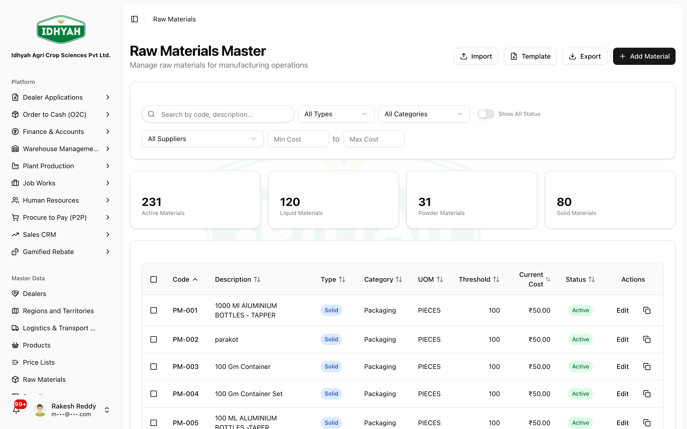

# Raw Materials

> The raw-material master: define the **chemicals, packaging, and consumables** you buy and consume in
> manufacturing — with units, costs, supplier, quality grade, and GST details that feed purchasing,
> production, and AP invoicing.

> **Audience:** Customer + Internal · **Module:** `/raw-materials` · **Status:** 🟢 Authored
> **Verified:** against `web_app/src/app/raw-materials` on 2026-06-18.

## What you can do
- **Define materials** — code, description, **category** (chemicals / packaging / consumables / others), **type** (liquid / powder / solid / gas), and unit of measure.
- **Set planning data** — threshold (reorder) quantity, average lead time, standard & current cost.
- **Link a supplier** — primary supplier and supplier part number.
- **Record quality & specs** — quality grade and free-text specifications.
- **Capture GST details** — HSN, GST rate, cess, exempt/nil-rated — so AP invoices can auto-fill tax.
- **Bulk-manage** — import/export via template, duplicate an existing material, bulk-update.

## Before you begin
- Agree your **coding scheme** for material codes (they must be unique).
- Have the **UOM**, **category**, and **type** for each material.
- Have **HSN / GST** details if the material will appear on supplier (AP) invoices.
- Set up **suppliers** first if you want to link a primary supplier.

### Roles and what each can do

| Role | Typical responsibilities |
|---|---|
| **Stores / Materials Admin** | Create & maintain raw materials |
| **Procurement** | Uses materials, supplier links, and lead times in purchasing |
| **Production / Quality** | References specs, grade, and batch rules |
| **Finance (AP)** | Relies on HSN/GST for invoice auto-fill |

<!-- INTERNAL:START -->
Permission-gated on `raw_materials` (`create`/`read`/`update`/`delete`/`import`/`export`). Tenant-isolated via RLS. Master table `raw_materials`; joins `suppliers` (primary supplier), and derives stock from `warehouse_stock` / `grn_items`. GST fields (`hsn_code`, `gst_rate`, `cess_rate`, `is_exempt`, `is_nil_rated`) added for AP invoice auto-fill. *(Schema, ERP-extended fields, controls → [Raw Materials Developer Guide](../../developer-guides/raw-materials.md).)*
<!-- INTERNAL:END -->

### What a material record holds
```
Identity   ── code · description · category · type · UOM
Planning   ── threshold/reorder qty · average lead time
Costing    ── standard cost · current cost
Sourcing   ── primary supplier · supplier part number
Quality    ── grade · specifications
Tax (GST)  ── HSN · GST rate · cess · exempt / nil-rated
```

---

## Key workflows

### Create a raw material
**Role:** Stores / Materials Admin · **Result:** a material ready for purchasing & production
1. **Raw Materials → Add** — enter **code** and **description**, choose **category** and **type**, and set the **unit of measure**.
   
   <!-- capture: { "project": "iacs-md", "route": "/raw-materials" } -->
2. Add **planning** (threshold quantity, lead time) and **costing** (standard/current cost).
3. Link the **primary supplier** and part number; record **quality grade** and **specifications**.
4. Add **HSN / GST** details so AP invoices can auto-fill tax. Save — the material is **active**.
> **Tip** A consistent **UOM** matters — it must match how you purchase and consume the material, or stock and costing won't reconcile.

### Duplicate, import & export
**Role:** Stores / Materials Admin · **Result:** fast mass maintenance
1. **Duplicate** a similar material to create a new one quickly, then adjust the code and specifics.
2. **Import** many materials from the template (fix any rows the validator flags) or **export** for review.
3. Use **bulk-update** to change a field across many materials at once.

---

## Pages & areas

| Area | Where | What you do there |
|---|---|---|
| **Materials list** | Raw Materials | Search, filter (type/category/status), add materials |
| **Material form** | Raw Materials → Add / Edit | Maintain identity, planning, costing, supplier, quality, GST |
| **Bulk tools** | Import / Export / Duplicate | Mass maintenance |

---

## Common use cases
- **Onboard a new chemical** — create the material → set UOM, cost, supplier, HSN/GST → use it on purchase orders.
- **Switch supplier** — update the primary supplier and part number on the material.
- **Annual cost refresh** — export, update current cost in the file, re-import.

## Reference
- **Categories:** chemicals · packaging · consumables · others.
- **Types:** liquid · powder · solid · gas.
- **GST fields** (HSN, GST rate, cess, exempt/nil-rated) drive AP-invoice auto-fill.
<!-- INTERNAL:START -->Master table `raw_materials`; stock derived from `warehouse_stock`/`grn_items`; supplier from `suppliers`. ERP-extended fields (ABC class, valuation class, storage condition, batch management, reorder/EOQ) are defined in the type model but may be optional in the schema — see [Developer Guide](../../developer-guides/raw-materials.md).<!-- INTERNAL:END -->

## Troubleshooting
| What you see | Why it happens | How to fix it |
|---|---|---|
| Tax doesn't auto-fill on a supplier invoice | HSN/GST missing on the material | Add HSN, GST rate (and cess) to the material |
| Material can't be selected on a PO | It's inactive, or no supplier linked | Activate it and link a primary supplier |
| Import rejects rows | Bad type/category/UOM or missing code/description | Fix flagged rows against the template and re-import |
| Stock looks wrong | Stock is derived from receipts/movements, not edited here | Reconcile via warehouse, not the material master |

## Support and escalation
- **Material setup / coding** → Stores / Materials Admin.
- **Supplier links / lead times** → Procurement.
- **HSN/GST correctness** → Finance (AP).

## Related workflows
[Suppliers](../suppliers/suppliers.md) · [Procure to Pay (P2P)](../p2p/procure-to-pay.md) · [Plant Production](../plant-production/README.md) · [Warehouse — Managing Inventory](../warehouse-management/inventory.md)
